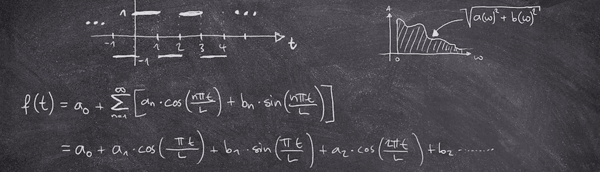
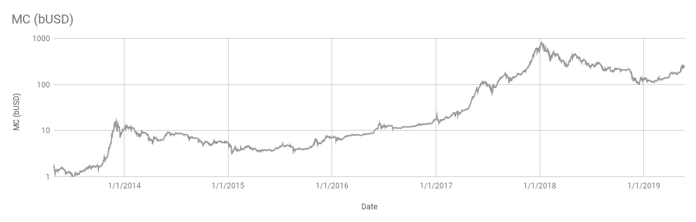
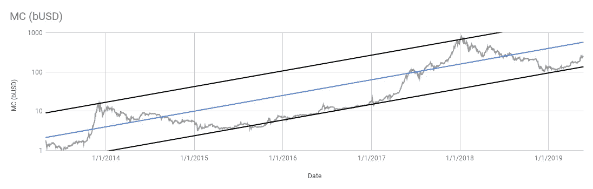
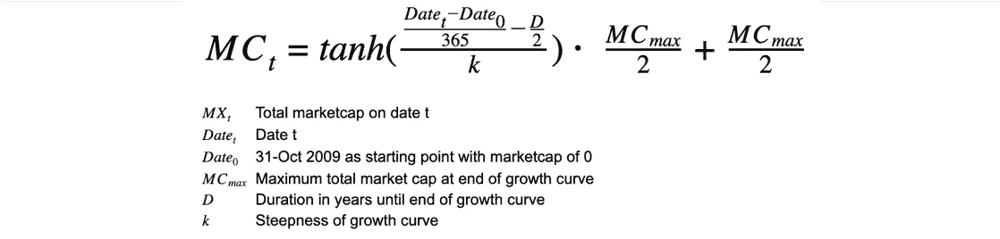
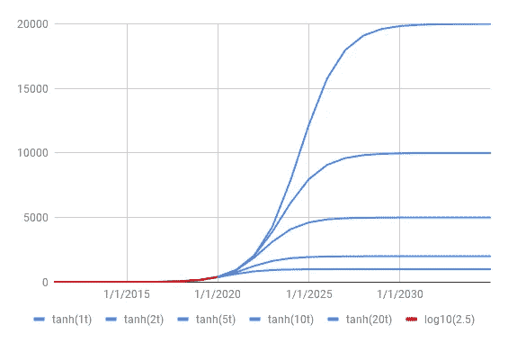
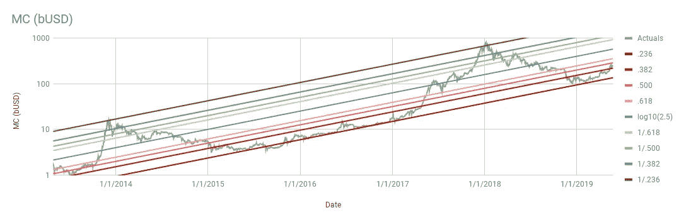
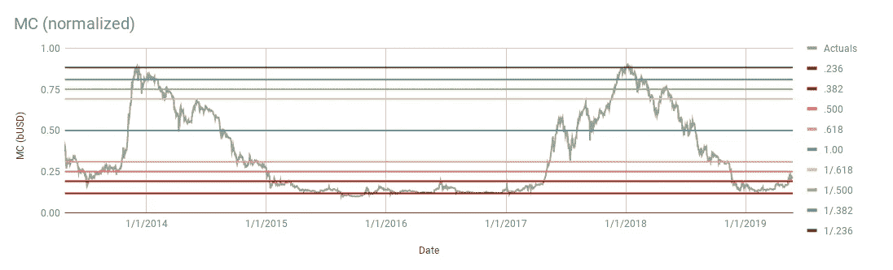
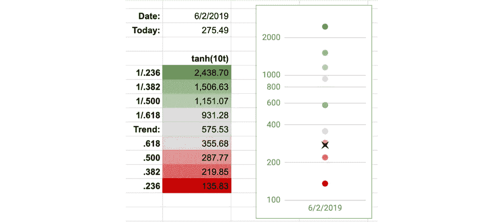

# 加密货币市场的宏观经济增长模型

> 原文：<https://medium.com/coinmonks/when-will-bitcoin-hit-100-000-48338f5fefb7?source=collection_archive---------0----------------------->

## 比特币什么时候能打到 10 万？

当你在谷歌上搜索“比特币价格每隔一年翻一番”时，你会发现 3 至 8 个月(甚至 18 天，但仅在委内瑞拉恶性通货膨胀的情况下)不等的语句。这些计算的棘手之处在于，它们往往忽略了牛市和熊市周期的影响，只是简单地线性推断市场数据。虽然这不会真正产生有意义的结果，但一个稍微复杂一点的模型可能会有帮助。

## 回顾过去:分析过去的市场趋势

首先，让我们根据过去几年所有加密货币的总市值来看看市场表现。以对数尺度显示数据，可以清晰地描绘出它的运动，包括 2013 年末和 2018 年初的峰值。

**Figure 1**: Aggregate market cap (MC) of all cryptocurrencies in billions USD over time

当查看图表时，突出的是似乎有一个宏观价格通道，即总市值总是在上下两条平行的直线趋势线之间移动(图 2 中的黑线)。

**Figure 2**: Aggregate market cap (MC) incl. trend lines for top, bottom, and average

这些趋势线之间的中间代表不受牛市/熊市周期影响的平均增长(图 2 中的蓝线)。由于标度是对数的，因此可以很容易地表示为指数函数(图 3)。简而言之，每 2.5 年增长 10 倍。

**Figure 3**: Exponential growth function to determine aggregate market cap over time

## 展望未来:从指数增长到对数增长

因为没有无限的增长，我们需要建模来反映现实，就像一个 s 曲线。在经济学中，它们通常被用来描述创新在其生命周期中的[进程](https://en.wikipedia.org/wiki/Logistic_function#In_economics_and_sociology:_diffusion_of_innovations)；应该很合适。在这样的模型中，增长的初始阶段是指数增长，然后开始饱和，增长放缓至线性，然后在成熟时变成对数增长。

s 曲线可以用逻辑函数来描述，如 *TANH* 。为了定义其属性，需要三个参数:最大值、曲线的陡度和持续时间。

**Figure 4**: Logistic (s-curve) growth function to determine aggregate market cap over time

由于很难判断某一天加密货币的总市值有多大，我创建了几个不同的场景，最大值在 1 到 20 万亿美元之间。考虑到[当前金融市场规模](http://money.visualcapitalist.com/worlds-money-markets-one-visualization-2017/)的数量级(即使只考虑一小部分市场份额),可以合理地假设它将达到数万亿。至于陡度和持续时间，我简单地选择了参数，使曲线的指数部分与历史增长曲线相匹配(如图 3 所示)。

**Figure 5**: Five scenarios of aggregate market cap of all cryptocurrencies in billions USD over time

## 理解牛熊周期

描述总市值移动的价格通道的最大和最小趋势线(图 2 中的黑线)与平均趋势线的 0.236 和 1/0.236 斐波纳契回撤(图 2 中的蓝线)相匹配，这可能不是巧合。在底部使用斐波纳契回撤带，在顶部使用反向回撤带(即 1/x ),可以更详细地观察市场运动。

**Figure 6**: Fibonacci retracement bands on bottom and inverse bands on top of the trend line

当标准化市值数据以显示水平趋势线之间的移动时，这变得更加容易(图 7)。

**Figure 7**: Fibonacci retracement bands on normalized market cap

一些直接观察结果包括:

*   在 2013 年底和 2018 年初的峰值，市场触及 1/0.236 斐波纳契回撤趋势线，这似乎是一个主要阻力
*   在 2015 年和 2016 年以及 2018 年底和 2019 年初的熊市期间，市场类似地触及了 0.236 斐波纳契回撤趋势线，这似乎是一个主要支撑
*   其他波段似乎也提供了强大的阻力和支持，尤其是在多个场合看到的 0.618 线
*   最大的波动似乎发生在 1/0.618 和 0.618 斐波纳契回撤线之间的中间区域
*   穿越 0.5 斐波纳契回撤线似乎增加了结束熊市的可能性

## 这种模式的潜在应用

所描述的模型可以用于确定任何特定日期的趋势以及斐波纳契回撤值，只需要最大增长方案作为静态输入参数。

**Figure 8**: Example calculation for a 10 tUSD maximum growth scenario for 2-Jun 2019

假设模型成立，这些计算可以帮助:

1.  确定在一个市场周期中是否达到了顶点或底部
2.  确定特定日期的宏观阻力和支撑
3.  通过将不同市场周期的资产成本标准化为趋势线来比较它们
4.  当然，也决定了市场主导资产的未来价格

*那么比特币什么时候会达到 100.000？使用最高 10 万亿美元的场景，并假设持续 50%左右的市场主导地位，比特币将在 2021 年年中达到 100.000 美元。然而，这是基于平均增长，因此未来的牛市/熊市条件仍将改变日期。*

> [在您的收件箱中直接获得最佳软件交易](https://coincodecap.com/?utm_source=coinmonks)

