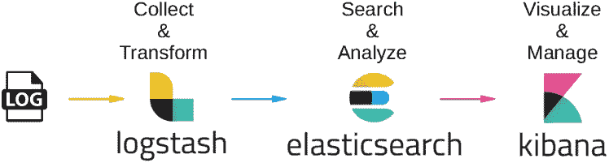
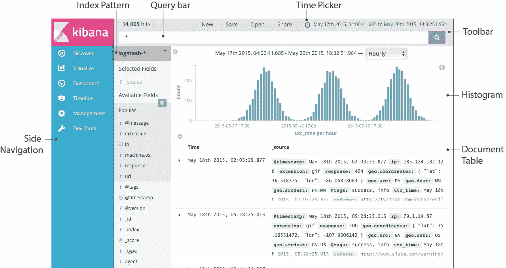
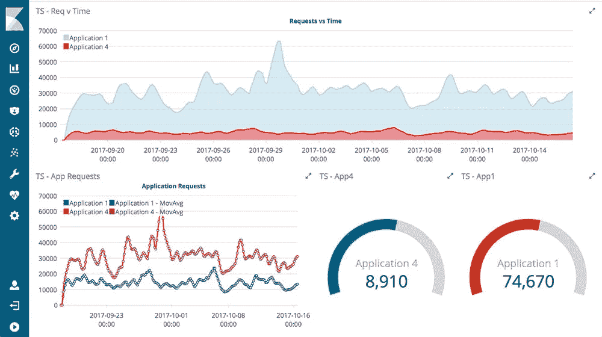

# DevOps 工具包:ELK 堆栈—组织日志数据

> 原文：<https://medium.com/coinmonks/when-you-throw-a-web-crawler-to-a-devops-elk-9a2a7cccf95a?source=collection_archive---------3----------------------->

## [第一部分—主管](/coinmonks/when-you-throw-a-web-crawler-to-a-devops-supervisord-562765606f7b)


[source](http://www.idfor-solutions.com/elasticsearch-logstash-kibana-expertise/)

**ELK stack——一种可扩展的日志数据组织方式。**

在增加了监控器以增强网络爬虫的稳定性之后，我们将要解决另一个主要问题——**可观测性**。

主管确实输出了我们代码的日志。但是，我们如何读取这些日志呢？使用 grep？还是打开记事本按 ctrl-f 找 bug？日志太原始了，还不可读。它必须以一种有组织的方式进行。

在这里，我们介绍了麋鹿栈，这是一个有点矫枉过正的任务，但它是确定的，因为它只是一个教程。

# 什么是麋鹿

ELK 由三部分组成:

*   电子弹性搜索
*   L — Logstash
*   基巴纳



[source](https://hackernoon.com/elastic-stack-a-brief-introduction-794bc7ff7d4f)

这三个模块负责不同的任务，简单地说

*   log stash——将日志数据路由到 Elasticsearach
*   elastic search——一个强大的搜索引擎，在这里它被用来索引日志
*   kibana——与 Elasticsearch 绑定的可视化工具

每个工具都有独特而强大的功能。这三个工具一起使用是很自然的。您可以在这个堆栈中添加更多的模块，例如

*   [打败了](https://www.elastic.co/products/beats)，一个数据运送器运送不同种类的数据
*   [Elastic SQL](https://www.elastic.co/products/stack/elasticsearch-sql) ，使用 SQL 访问 Elasticsearch 的特性

如果你不喜欢 kibana 界面: [**这个**](/gradiant-talks/customizing-kibana-web-application-f74c1b48ec73) 就是你可以自定义布局的方式(本教程可能在 6.1.3 版本之后对 kibana 不再有效)

或者您可以选择其他可视化工具，如 [**Grafana**](https://grafana.com/) **，**或[**Graphite**](http://graphiteapp.org/)
三个工具的比较:[https://stack share . io/stack ups/Grafana-vs-Graphite-vs-ki Bana](https://stackshare.io/stackups/grafana-vs-graphite-vs-kibana)

# 利用麋鹿

使用 ELK 的一个常见做法是下载 docker 映像并使用`docker-compose up`运行这三个实例。

[https://github.com/deviantony/docker-elk](https://github.com/deviantony/docker-elk)

堆栈暴露以下端口:

*   9200: Elasticsearch HTTP
*   9300:弹性搜索 TCP 传输
*   5601:基巴纳

你只需要去 [localhost:5601](http://localhost:5601/) 就可以访问基巴纳。

# 把主管和麋鹿结合起来

使用:[https://github.com/dohop/supervisor-logstash-notifier](https://github.com/dohop/supervisor-logstash-notifier)将日志从 supervisor 路由到 logstash，并将这段代码添加到`supervisord.conf`

```
[eventlistener:logging] environment=LOGSTASH_SERVER="localhost",LOGSTASH_PORT="5000",LOGSTASH_PROTO="tcp" 
command=logstash_notifier --capture-output 
events = PROCESS_STATE,PROCESS_LOG
```

然后你可以在 kibana 中找到来自主管的日志。



[source](https://www.elastic.co/guide/en/kibana/current/discover.html)

您甚至可以创建图表来总结日志



[source](https://www.elastic.co/products/kibana)

## [第 1 部分—主管](/coinmonks/when-you-throw-a-web-crawler-to-a-devops-supervisord-562765606f7b)

> [直接在您的收件箱中获得最佳软件交易](https://coincodecap.com/?utm_source=coinmonks)

[](https://coincodecap.com/?utm_source=coinmonks)