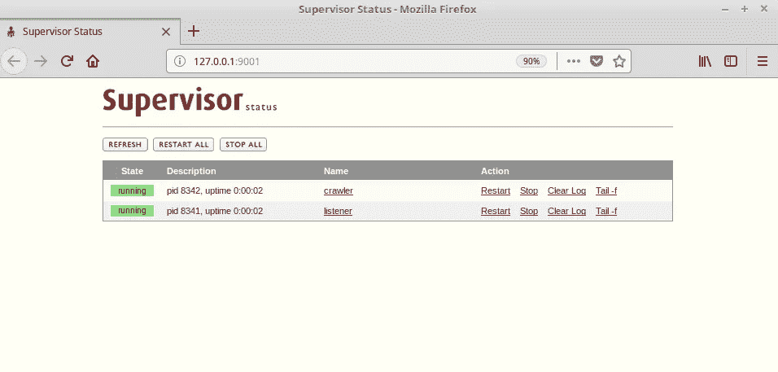
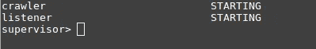

# DevOps 工具包:主管—管理多个流程

> 原文：<https://medium.com/coinmonks/when-you-throw-a-web-crawler-to-a-devops-supervisord-562765606f7b?source=collection_archive---------6----------------------->

## [第 2 部分— ELK 堆栈](/@thebestchef/when-you-throw-a-web-crawler-to-a-devops-elk-9a2a7cccf95a)

一个网络爬虫被扔给一个 DevOps。然后，他问了以下问题:

*   万一崩溃了呢？
*   如何让它变得可靠？
*   如何扩大规模？
*   如何有效监控过程？

开发可行的代码很容易，但使其健壮却很难。开发人员或成熟的程序员的工作之一就是让他们的代码可靠。

# 监督者


首先，我们将介绍一个简单而强大的工具— [supervisor](https://github.com/Supervisor/supervisor) 。这是一个过程控制系统，具有以下特点:

*   简单的

只需编辑配置文件即可完成大部分工作

*   高效的

Supervisor 不依赖 PID 文件和定期轮询来重启失败的进程。相反，它通过 fork/exec 启动子流程，并且子流程不会后台化。当一个进程终止时，操作系统向管理程序发出信号。

*   可扩张的

有了事件通知协议，人们可以实现事件驱动的电子邮件通知程序等功能，或者轻松地与 ELK 等其他工具集成。

*   方便用户的

有一个 CLI 和 web 仪表板来监视和控制流程。提供了多个版本的开源仪表板。您可以轻松管理您的流程，甚至可以将仪表盘整合到您自己的工作站中。

# 使用

安装主管:

`pip install supervisor`

Supervisord 在 python 2 中是最稳定的。然而，这并不意味着您的应用程序必须由 python 2 来实现，或者甚至由 python 来实现。它可以是其他任何东西。

假设我们有一个 python 爬虫，叫做`crawler.py`。我们可以做以下事情来使它容易与其他服务集成

# 保持活力

`supervisord.conf`文件将实现以下功能:

*   当 supervisor 启动时，启动流程
*   如果退出代码既不是 0 也不是 2，则重新启动该进程
*   特定路径中的输出日志
*   启用旋转日志

```
[supervisord] 
nodaemon=true 
loglevel=info [program:crawler] 
command=python crawler.py 
autorestart=unexpected 
exitcodes=0,2 
stopsignal=TERM
```

就是这样！这就是我们启动一个最小但有效的监管机构所需要的一切。
要启动它，打开终端，转到放置配置文件的目录，键入:

```
supervisord
```

然后您可以看到日志消息。

# 放置日志文件

然后，我们将指定日志文件的位置。

```
[supervisord] 
nodaemon=true 
loglevel=info 
logfile=../log/supervisord.log 
logfile_maxbytes=50MB [program:crawler] 
command=python crawler.py 
stdout_logfile=../log/crawler_out.log 
stderr_logfile=../log/crawler_err.log 
logfile_maxbytes=50MB 
autorestart=unexpected 
exitcodes=0,2 
stopsignal=TERM
```

注意，我们可以在 conf 文件中使用相对路径

# 启用仪表板

通过在同一配置文件中添加以下行来启用 supervisorctl:

```
[supervisorctl] 
;serverurl=unix:///tmp/supervisor.sock ; use a unix:// URL for a unix socket 
serverurl=http://127.0.0.1:9001 ; [inet_http_server] 
port = 127.0.0.1:9001 [rpcinterface:supervisor] 
supervisor.rpcinterface_factory = supervisor.rpcinterface:make_main_rpcinterface
```

然后，当我们访问`127.0.0.1:9001`时，将显示一个主管网络仪表板。



或者只需在终端中输入`supervisorctl`，我们就会进入 CLI 界面。



# 实现事件驱动的电子邮件通知程序

必须启用 Stdout 和 stderr 事件，事件侦听器才能获取数据。
我们将在 python 中编写一个监听器，在爬虫意外崩溃时发送电子邮件。

配置文件:

```
[program:spider] 
command=python crawler.py 
stdout_events_enabled=true 
stderr_events_enabled=true 
stdout_logfile=../log/crawler_out.log 
stderr_logfile=../log/crawler_err.log 
logfile_maxbytes=50MB 
autorestart=unexpected 
exitcodes=0,2 
stopsignal=TERM [eventlistener:listener] 
command=python listener.py 
events=PROCESS_STATE 
autorestart=true 
stdout_logfile=../log/listener_out.log 
stderr_logfile=../log/listener_err.log
```

listener.py:

```
import sys 
from send_email import send 
from supervisor.childutils import listener def write_stdout(s): 
    sys.stdout.write(s) 
    sys.stdout.flush() def write_stderr(s): 
    sys.stderr.write(s) 
    sys.stderr.flush() def main(): 
    while True: 
        # transition from ACKNOWLEDGED to READY
        write_stdout('READY\n')
        headers, body = listener.wait(sys.stdin, sys.stdout) 
        body = dict([pair.split(":") for pair in body.split(" ")]) 

        if body['processname'] == 'spider' and headers["eventname"] == "PROCESS_STATE_STOPPED": 
            send('spider stopped', 'spider stopped', <your_email>) 
        if body['processname'] == 'spider' and headers["eventname"] == "PROCESS_STATE_EXITED": 
            send('spider exited', 'spider exited', <your_email>)             
        write_stderr("Headers: %r\n" % repr(headers)) 
        write_stderr("Body: %r\n" % repr(body))  
        write_stdout("RESULT 2\nOK") if __name__ =='__main__': 
    main()
```

助手功能— send_email.py:

```
from email.mime.multipart import MIMEMultipart 
from email.mime.text import MIMEText 
import smtplib msg = MIMEMultipart() 
password = <password> 
msg['From'] = <email_sender> def send(sub, body, rep): 
    msg['Subject'] = sub 
    msg['To'] = rep 
    body = body     # add in the message body 
    msg.attach(MIMEText(body, 'plain'))     #create server server = smtplib.SMTP('smtp.gmail.com: 587') 
    server.starttls()     # Login Credentials for sending the mail 
    server.login(msg['From'], password) 

    # send the message via the server.
    server.sendmail(msg['From'], msg['To'], msg.as_string()) 
    server.quit() 
    return
```

`supervisord.conf`的最终版本:

```
[program:crawler] 
command=python crawler.py 
stdout_events_enabled=true 
stderr_events_enabled=true 
stdout_logfile=../log/crawler_out.log 
stderr_logfile=../log/crawler_err.log 
logfile_maxbytes=50MB 
autorestart=unexpected 
exitcodes=0,2 
stopsignal=TERM[supervisorctl] 
;serverurl=unix:///tmp/supervisor.sock ; use a unix:// URL for a unix socket 
serverurl=http://127.0.0.1:9001 ;[inet_http_server] 
port = 127.0.0.1:9001[rpcinterface:supervisor] 
supervisor.rpcinterface_factory = supervisor.rpcinterface:make_main_rpcinterface[eventlistener:listener] 
command=python listener.py 
events=PROCESS_STATE 
autorestart=true 
stdout_logfile=../log/listener_out.log 
stderr_logfile=../log/listener_err.log 
```

## [第二部分——麋鹿栈](/@thebestchef/when-you-throw-a-web-crawler-to-a-devops-elk-9a2a7cccf95a)

> [在您的收件箱中直接获得最佳软件交易](https://coincodecap.com/?utm_source=coinmonks)

[](https://coincodecap.com/?utm_source=coinmonks)