# 我在哪里？一个机器人自言自语— —简单卡尔曼滤波器

> 原文：<https://medium.com/coinmonks/where-am-i-a-robot-said-to-himself-simple-kalman-filter-b18ca5198ecf?source=collection_archive---------16----------------------->

有一个机器人在路上行走。它怎么会知道他在哪里？卡尔曼滤波器是帮助他做出这个决定的一种方法。

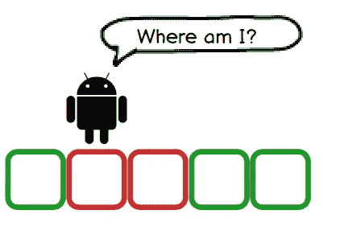

If we have a robot and it has detected a road map (green for road and red for buildings) from its current location, how should the robot know where he is?

卡尔曼滤波器涉及两步递归迭代:状态观测(测量)，最优状态估计器(运动)。简而言之，机器人将感知其当前状态，然后决定是否移动。如果它移动了，机器人会感知并再次做出决定。

## 尺寸

测量是让我们的小机器人环顾周围的环境。就像我们放在上面的图片。如果机器人感觉到红色，他会对自己的位置有信心吗？

如果机器人还没有开始感知，它可能在任何位置出现的概率是均等分布的。

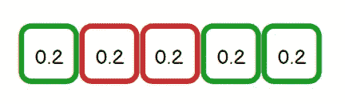

Before anything, the robot could assume he can be in any cell equally.

然后机器人可以开始感知环境。如果他发现自己在一个红细胞附近。他可能知道他只能呆在两个牢房里。

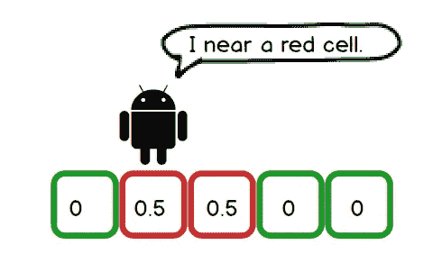

If the robot senses red cell, he might assume he must be in either the second cell or the third cell.

此外，机器人认为它的传感器可能有问题。他可能会把绿色的细胞误解为红色的。毕竟，人们也可能是色盲。所以如果机器人认为他的眼睛有问题。

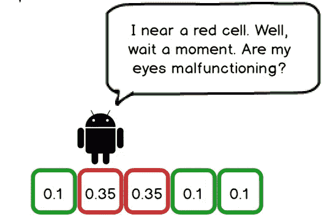

If the robot thinks his eyes are not that good to use, he might not be that confident about what he has seen. Hence, there are still possibilities he is in a green cell.

在他明白自己的处境后，是时候继续前进了。

## 移动

嗯，机器人可能会向右或向左走，并进行另一次感应。就像我们一样，如果我们在一个我们并不真正熟悉的地方，我们会四处游荡以弄清楚它。假设机器人终于走对了。

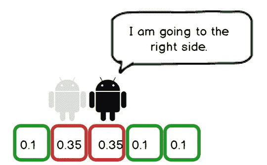

The robot moves.

移动之后，机器人处于下一个状态，而它还没有真正意识到新的环境。现在，它携带两个数据，一个是之前的测量，另一个是对它移动距离的估计。

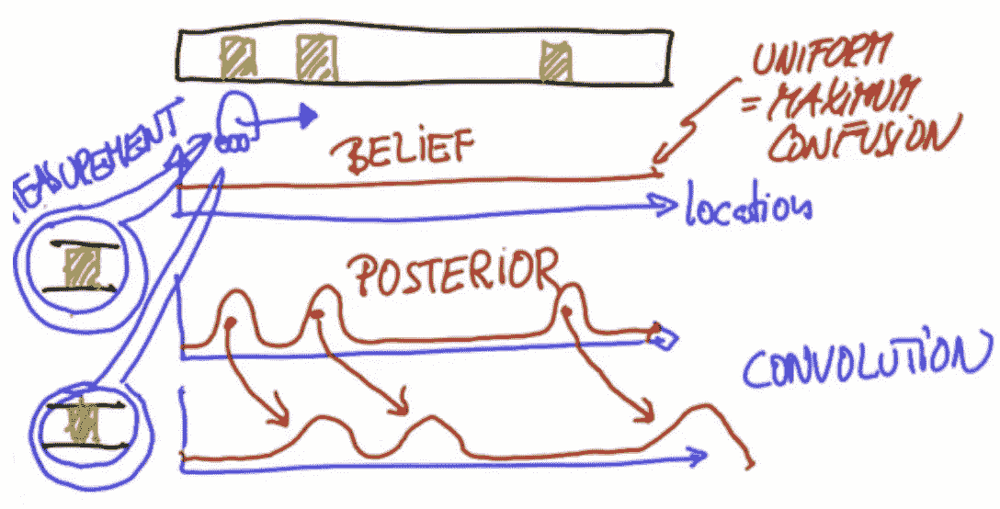

Description from Udacity robotics course (green square means doors). The third graph describes when the robot moves forward, how does its belief change change. Note that it not only moves forward, it also gets a bit flattened since the robot will not know the distance it has moved in an accurate manner.

然后，机器人将再次进行测量，以更新其知识。随着迭代次数的增加，它会更好地了解这个地方。

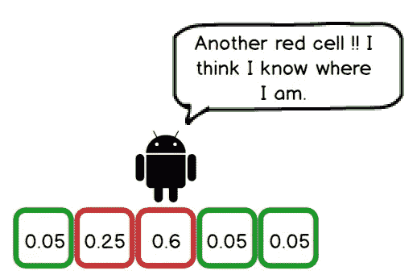

If the robot senses another red cell by moving right side, he will be more confident about his location.

## 数学

从维基百科上，我们可以看到下面这张图，描述了卡尔曼滤波器的大致思想。

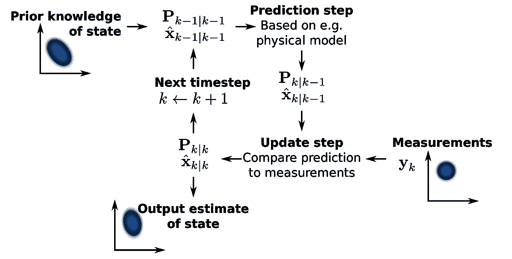

## 感知环境

如果我们从头开始，从均匀分布开始。在我们的例子中，红色意味着地图的出口。我们希望我们的小机器人能多照顾它。当机器人开始感知世界时，它可以对不同的物体进行称重，例如，红色物体的重量为 0.6，绿色物体的重量为 0.2。正常化后，他获得了对世界的第一次感知。

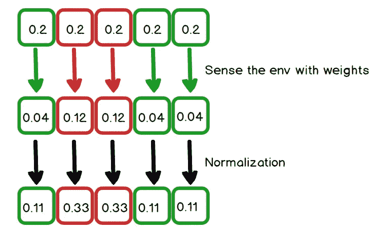

The red boxes are weighted 0.6 and the green boxes are weighted 0.2.

## 动身

如果我们的机器人向前迈出坚实的一步，它基本上不会改变概率那么多。

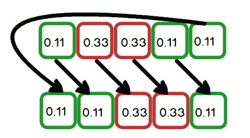

Move one step towards the right if the map is cyclic.

但是在大多数情况下，机器人不会总是精确地走一步。它可能欠调或过调，甚至不动。如果我们把那些条件考虑进去，事情就会变得相当复杂。举个简单的例子，我们的机器人可能有 50%的机会向前移动一步，也有 25%的机会前进两步或不动。这里举一个例子。

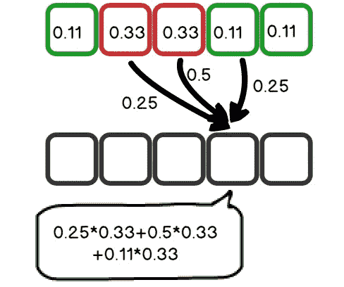

How probabilities update when inexact motion get involved.

多次迭代之后，机器人会对自己的位置越来越有信心。