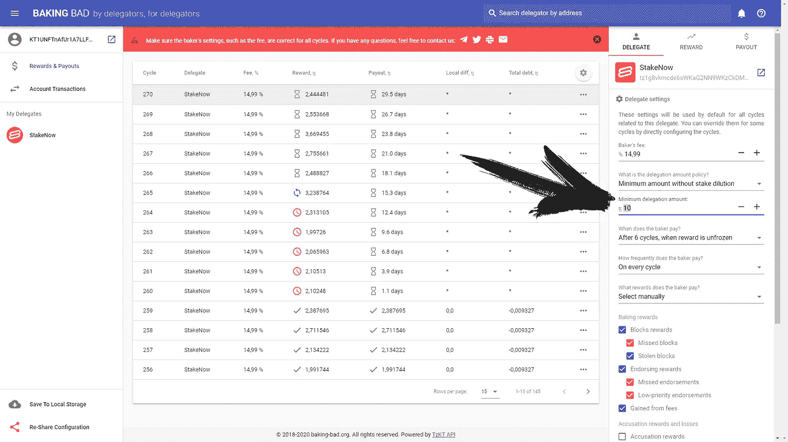

# 我的赌注奖励呢，李波斯基

> 原文：<https://medium.com/coinmonks/where-are-my-staking-rewards-lebowski-6bd74b3adedf?source=collection_archive---------7----------------------->

[观看主题视频:](https://www.youtube.com/watch?v=nq10ae86_2s)

在 Tezos 的聊天和社区中，一个问题经常出现:为什么我没有得到我的赌注奖励？

最常见的情况是，这个问题的出现是因为经验不足，所以在这篇文章中，我们将分析所有常见的案例，并希望在阅读这篇文章后，你不会犯同样的错误，并将毫无问题地获得 Tezos 赌注奖励。

# 公共和监管 Tezos 面包师

错过奖励最常见的原因是选择托管面包师。要获得 Tezos 硬币的奖励，您必须将它们委托给一个非托管面包师。

> ***警告***
> 
> *交易所不是公面包师！*

只有当你在兑换账户上存储资金时，兑换商才会支付赌注。因此，不要直接从自己的钱包里掏钱去币安、北海巨妖或其它交易所。

我们的网站[上有完整的 Tezos 面包师名单。别搞砸了。](https://baking-bad.org)

# 最低授权要求

这个问题的第二个原因可能是委托的最小允许金额。许多面包师有一个**最低委托金额**的要求，低于这个数额他们就不支付报酬。检查起来很简单——打开 Baking Bad，在列表中找到您的面包师，点击付款审核链接，然后查看“最低委托金额”字段

此外，面包师可以设置**最小支付阈值**。也就是说，直到你的奖励数量达到一定数额，你的付款将不会发生。这是差不多的事情，但它更方便用户。只要选择一个合适的面包师，我们的网站将帮助你。

# 死亡或关闭的面包师

接下来——也许你不再获得奖励，因为面包师已经**死亡**或者**关闭**委托服务。监控你委托的面包师的状况对你最有利。诚实的面包师通常会提前通知服务关闭，以及所有的变化。就我们而言，我们也会通报这样的情况——所以，订阅我们的[推特](https://twitter.com/TezosBakingBad)并加入我们的[电报聊天](https://t.me/baking_bad_chat)！

# 过度授权

那么，有可能当你委托面包师的时候，他被过度委托了。通常，面包师不会付钱给那些在赌注加满后来的委托人，因为他已经没有自由空间了。选择代表时，检查我们的面包师列表中的**自由空间**栏。

# 你什么时候开始接受赌注奖励

当然，这个问题经常被那些做了所有正确事情的用户问及——他们只是不能等待付款开始。在您的资金开始参与赌注之前，应经过 14 个周期，然后奖励将累计并解冻，因此您将至少在 23 天后开始收到付款。要了解更多关于赌注的细节，请查看 [Tezos staking for 初学者](https://baking-bad.org/docs/tezos-staking-for-beginners)文章——在那里我们解释了应该花多少时间以及它是如何到来的。

# 摘要

好吧，总而言之

1.  挑选一个合适的面包师
2.  检查支付限额
3.  委派并等待
4.  关注你的奖励和面包师

*就是这样！只要几个简单的规则，你就不会有任何问题与 Tezos 赌注奖励。* *只选择合适的面包师，因为这就是烘焙坏被创造出来的原因！*

*原载于 2020 年 8 月 17 日 https://baking-bad.org**[*。*](https://baking-bad.org/blog/2020/08/17/where-are-my-staking-rewards-lebowski/)*

## *另外，阅读*

*   *最好的[密码交易机器人](/coinmonks/crypto-trading-bot-c2ffce8acb2a)*
*   *[密码本交易平台](/coinmonks/top-10-crypto-copy-trading-platforms-for-beginners-d0c37c7d698c)*
*   *最好的[加密税务软件](/coinmonks/best-crypto-tax-tool-for-my-money-72d4b430816b)*
*   *[最佳加密交易平台](/coinmonks/the-best-crypto-trading-platforms-in-2020-the-definitive-guide-updated-c72f8b874555)*
*   *最佳[加密贷款平台](/coinmonks/top-5-crypto-lending-platforms-in-2020-that-you-need-to-know-a1b675cec3fa)*
*   *[最佳区块链分析工具](https://bitquery.io/blog/best-blockchain-analysis-tools-and-software)*
*   *[加密套利](/coinmonks/crypto-arbitrage-guide-how-to-make-money-as-a-beginner-62bfe5c868f6)指南:新手如何赚钱*
*   *最佳[加密制图工具](/coinmonks/what-are-the-best-charting-platforms-for-cryptocurrency-trading-85aade584d80)*
*   *[莱杰 vs 特雷佐](/coinmonks/ledger-vs-trezor-best-hardware-wallet-to-secure-cryptocurrency-22c7a3fd391e)*
*   *了解比特币最好的[书籍有哪些？](/coinmonks/what-are-the-best-books-to-learn-bitcoin-409aeb9aff4b)*
*   *[3 商业评论](/coinmonks/3commas-review-an-excellent-crypto-trading-bot-2020-1313a58bec92)*
*   *[AAX 交易所评论](/coinmonks/aax-exchange-review-2021-67c5ea09330c) |推荐代码、交易费用、利弊*
*   *[德里比特评论](/coinmonks/deribit-review-options-fees-apis-and-testnet-2ca16c4bbdb2) |选项、费用、API 和 Testnet*
*   *[FTX 密码交易所评论](/coinmonks/ftx-crypto-exchange-review-53664ac1198f)*
*   *[n 零审核](/coinmonks/ngrave-zero-review-c465cf8307fc)*
*   *[Bybit 交换审查](/coinmonks/bybit-exchange-review-dbd570019b71)*
*   *[3Commas vs Cryptohopper](/coinmonks/cryptohopper-vs-3commas-vs-shrimpy-a2c16095b8fe)*
*   *最好的比特币[硬件钱包](/coinmonks/the-best-cryptocurrency-hardware-wallets-of-2020-e28b1c124069?source=friends_link&sk=324dd9ff8556ab578d71e7ad7658ad7c)*
*   *最佳 [monero 钱包](https://blog.coincodecap.com/best-monero-wallets)*
*   *[莱杰 nano s vs x](https://blog.coincodecap.com/ledger-nano-s-vs-x)*
*   *[bits gap vs 3 commas vs quad ency](https://blog.coincodecap.com/bitsgap-3commas-quadency)*
*   *[莱杰纳米 S vs 特雷佐 one vs 特雷佐 T vs 莱杰纳米 X](https://blog.coincodecap.com/ledger-nano-s-vs-trezor-one-ledger-nano-x-trezor-t)*
*   *[block fi vs Celsius](/coinmonks/blockfi-vs-celsius-vs-hodlnaut-8a1cc8c26630)vs Hodlnaut*
*   *Bitsgap 评论——一个轻松赚钱的加密交易机器人*
*   *为专业人士设计的加密交易机器人*
*   *[PrimeXBT 审查](/coinmonks/primexbt-review-88e0815be858) |杠杆交易、费用和交易*
*   *[埃利帕尔泰坦评论](/coinmonks/ellipal-titan-review-85e9071dd029)*
*   *[SecuX Stone 评论](https://blog.coincodecap.com/secux-stone-hardware-wallet-review)*
*   *[BlockFi 评论](/coinmonks/blockfi-review-53096053c097) |从您的密码中赚取高达 8.6%的利息*