# 区块链投资的资金流向了哪里？

> 原文：<https://medium.com/coinmonks/where-did-the-money-go-for-blockchain-investments-dba74c028b15?source=collection_archive---------1----------------------->

# TL；博士；医生

# 摘要

对我来说，这个问题已经有一段时间了:风投们在区块链投资了哪些领域？在对 2288 家与区块链相关的公司和 3036 笔与这些公司相关的交易进行定量研究后，很明显，大多数风险投资者仍然只是在投资与密码货币相关的初创企业，因为这是相对最容易/最安全的赚钱方式。然而，VCs 也开始研究新的加密技术和协议设计，因为它还处于区块链的早期阶段，需要更好的协议。

**请点击图片下方链接查看互动版示意图(** [**或点击此处**](https://public.tableau.com/profile/fan.wen5373) **)。所有数据均来自 PitchBook。**

# **市场**

**大部分资金流向了美国和中国的公司。**

从地域上看，大部分融资(88.69 亿美元)是在美国(44.87 亿美元)、中国(15.12 亿美元，不包括比特币首次公开募股)和加拿大(6.28 亿美元)筹集的。继这三个市场之后，英国、瑞士、以色列、新加坡、韩国、日本和香港也吸引了大量资本。

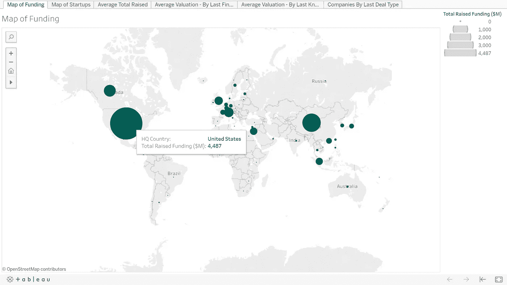

[Funding raised in different countries](https://public.tableau.com/profile/fan.wen5373#!/vizhome/Blockchain_Companies/MapofFunding) (By Fan)

截至 2018 年 10 月，美国市场有 933 家区块链初创公司融资 44.87 亿美元，而中国只有 61 家公司融资 15.12 亿美元。然而，总部位于中国的公司平均估值(1.152 亿美元)高于美国公司(1260 万美元)。

就融资总额而言，中国公司也比其他国家的公司获得更多资金。中国区块链初创企业平均筹资 2479 万美元，而美国公司的筹资数字为 481 万美元。

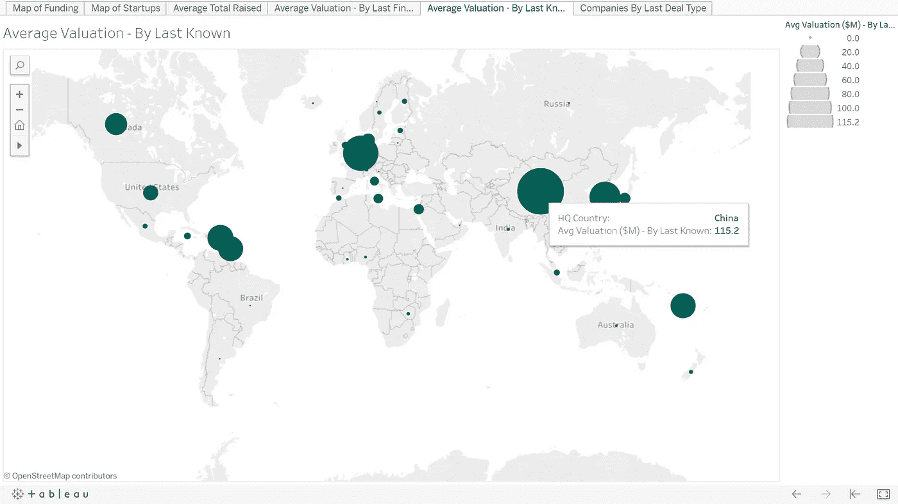

[Average valuation of blockchain start-ups](https://public.tableau.com/profile/fan.wen5373#!/vizhome/Blockchain_Companies/AverageValuation-ByLastKnown) (By Fan)

因此，中国显然存在较大的泡沫，资本集中度也较高。在某种程度上，这对我来说是有意义的:大多数中国区块链初创企业都是隐货币(发行、交易、采矿等)。)积极瞄准中国居民的公司。对他们来说，向数百万中国居民出售垃圾币并不困难，因为(1)人民币已经贬值了一段时间，预计还会继续贬值；(2)由于管理不当和缺乏透明度，中国股市长期处于混乱状态；(3)中国居民缺乏替代投资渠道。

**尽管密码货币市场表现怪异，但该领域的投资正在翻倍。**

尽管密码货币的总市值在 2018 年大幅下降，但区块链交易的数量比 2017 年几乎翻了一番。截至 2018 年 10 月 27 日，今年已完成 918 笔交易，而 2017 年仅完成 547 笔交易。

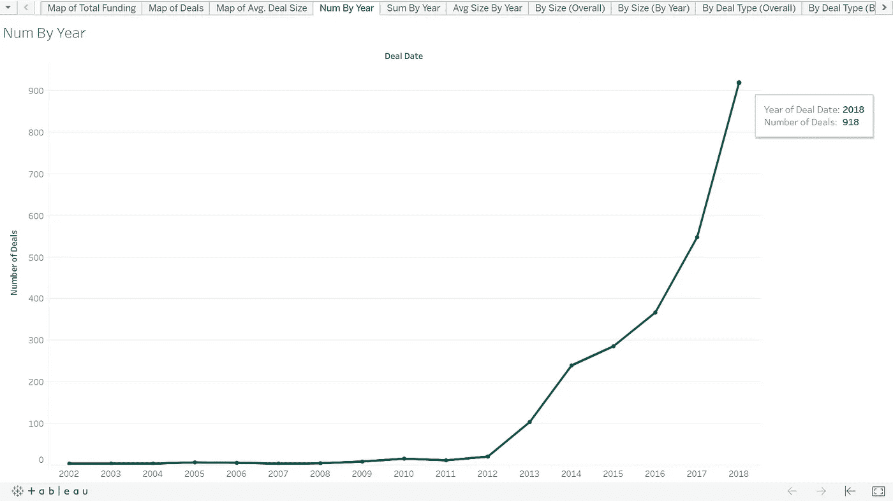

[Number of deals by year](https://public.tableau.com/profile/fan.wen5373#!/vizhome/Blockchain_Deals/NumByYear) (By Fan)

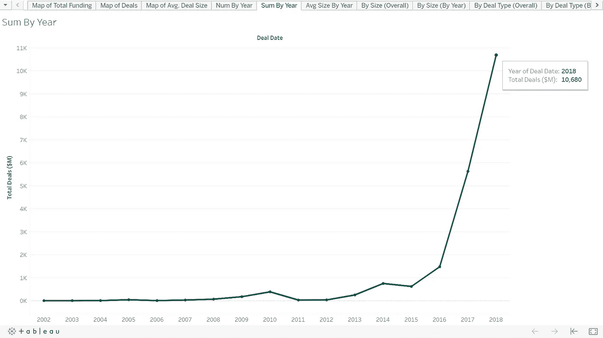

[Total investments by year](https://public.tableau.com/profile/fan.wen5373#!/vizhome/Blockchain_Deals/SumByYear) (By Fan)

2018 年的资助总额也比 2017 年翻了一番。截至 2018 年 10 月 27 日，已筹集 106.8 亿美元(包括正在进行的 IPO)，而 2017 年仅筹集了 56.23 亿美元。

此外，交易在 2018 年变得更大。5000 万美元以上和 1000 万至 5000 万美元的类别增长最快。2017 年发生了 9 起 5000 万美元以上投资的交易，而 2018 年迄今已达成 30 起此类交易。规模在 1000 万美元至 5000 万美元之间的交易数量增加了两倍，从 2017 年的 26 起增至 2018 年的 89 起(截至 10 月 27 日)。

对区块链初创企业投资的快速稳定增长表明，市场并没有因为加密货币市场的巨大变化而失去对这项技术的信心。

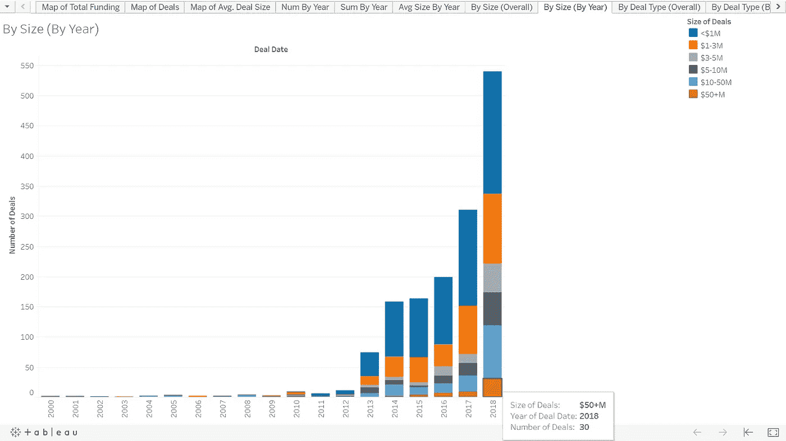

[Deals by size and by year](https://public.tableau.com/profile/fan.wen5373#!/vizhome/Blockchain_Deals/BySizeByYear) (By Fan)

# 投资者

在区块链有两种类型的投资者。一种是传统的风险投资，如 IDG 资本和 T2 资本，它们不专门投资区块链，而是把钱花在所有新兴技术上。另一类是专门投资于区块链项目的区块链风投，如*数字货币集团*和*分不实资本*。根据交易数据，大多数活跃投资者(就交易数量而言)都是专注于区块链的风投。

不难理解为什么很多交易是由新的和专门的风投公司达成的，因为(1)在理解区块链技术及其应用方面存在很高的知识壁垒；(2)开发和实施技术需要一个生态系统/网络。

以下是根据 2002 年至 2018 年的交易数量列出的最活跃的区块链投资者:

> 数字货币集团(75)、区块链资本(50)、潘迪拉资本(41)、数字货币集团(Barry Silbert) (33)、Boost VC (30)、Fenbushi Capital (30)、即插即用技术中心(29)、Hashed(加速器)(27)、个人投资者(25)、NEO Global Capital (24)、500 Startups (23)、丹华资本(21)、Y Combinator (19)、SV Angel (17)、Naval ravi Kant(17)、Future \ Perfect Ventures(Jalak Jobanputra Draper Dragon (12)、Techstars (12)、Kindred Ventures (12)、比特大陆(12)、弗雷德·厄尔萨姆(Fred Ehrsam) (12)、自由城创投(11)、ZMT 资本(10)、数字金融集团(10)、FBG 资本(10)、真格基金(10)、保罗·维拉迪特塔基特(Paul Veradittakit) (9)、IDG 资本(9)、联合广场创投(9)、GV (9)、抽象创投(9)、RRE 创投(詹姆斯·罗宾逊)(9)、RRE 创投(9)、INBlockchain (9)、FinForge (8 LINKVC (8)、光速创投合伙人(Jeremy Liew) (8)、巴克莱加速器(8)、策源创投(8)、本·达文波特(Ben Davenport) (8)、肖恩·珀西瓦尔(Sean Percival) (8)、节点资本(8)、埃拉德·吉尔(Elad Gil) (8)、Startupbootcamp (8)、Block VC (8)、Slow Ventures (8)、AME 云创投(8)。

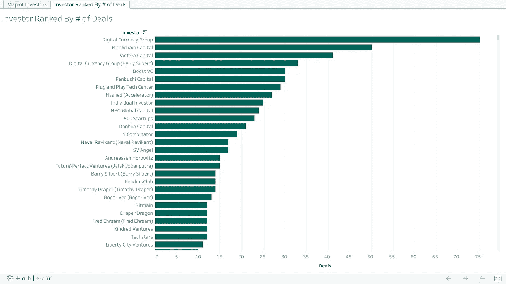

[Most active blockchain investors](https://public.tableau.com/profile/fan.wen5373#!/vizhome/Blockchain_Investors/InvestorRankedByofDeals) (By Fan)

# 交易

截至 2018 年 10 月，大多数交易发生在美国(1330 笔交易)，平均规模为 504 万美元，其次是英国(269 笔交易/平均 237 万美元)和加拿大(224 笔交易/平均 2009 万美元)。出人意料的是，中国仅记录了 94 笔交易，而平均交易规模最高(7031 万美元)，这进一步证明了这种集中度。

近 3/4 的交易是对区块链领域的早期投资。在记录的 3，035 笔交易中，有 2，271 笔(74.83%)交易是早期投资(天使/早期风投/种子轮/赠款/加速器/孵化器)。2018 年，早期风投交易的数量从 92 笔(2017 年)翻了一番，达到 205 笔(2018 年)。种子轮投资和天使投资的数量也分别从 77 (2017 年)增加到 131(2018 年)和 47 (2017 年)增加到 112 (2018 年)。但后期 VC 投资笔数从 11 笔(2017 年)微降至 9 笔(2018 年)。

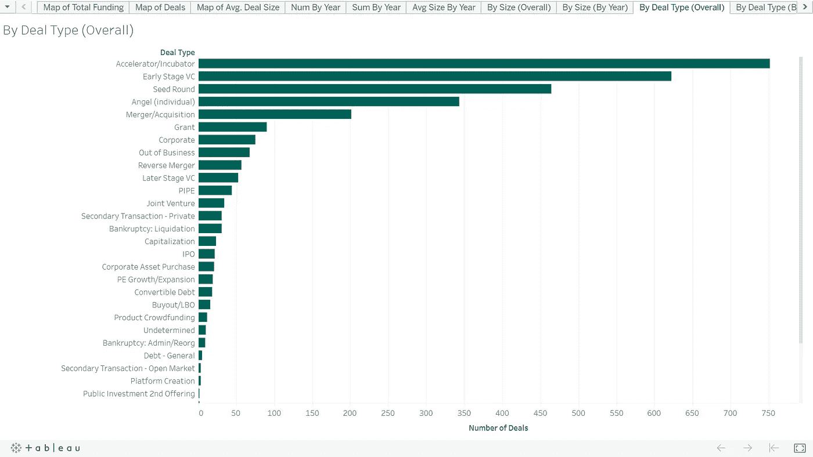

[Deals by type](https://public.tableau.com/profile/fan.wen5373#!/vizhome/Blockchain_Deals/ByDealTypeOverall) (By Fan)

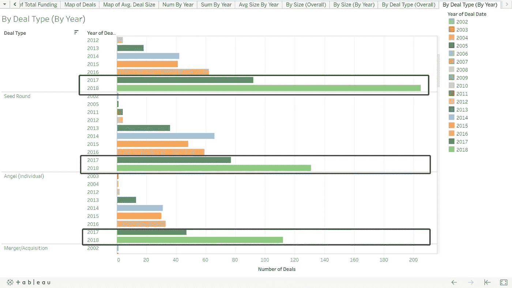

[Early stage investment growth](https://public.tableau.com/profile/fan.wen5373#!/vizhome/Blockchain_Deals/ByDealTypeByYear) (By Fan)

**2018 年，并购交易数量翻了一番。**随着更多的并购交易，如 *Bitbuy* 收购的 *CBIX* 和 *Protect Pharmaceutical* 收购的 *Tobit Clicks* ，并购交易数量从 2017 年的 40 起增加到 2018 年的 91 起。在 2018 年的 9100 万笔并购交易中，40 笔发生在美国，28 笔发生在加拿大，3 笔在英国，3 笔在日本，其余来自印度、香港和中国等国家。

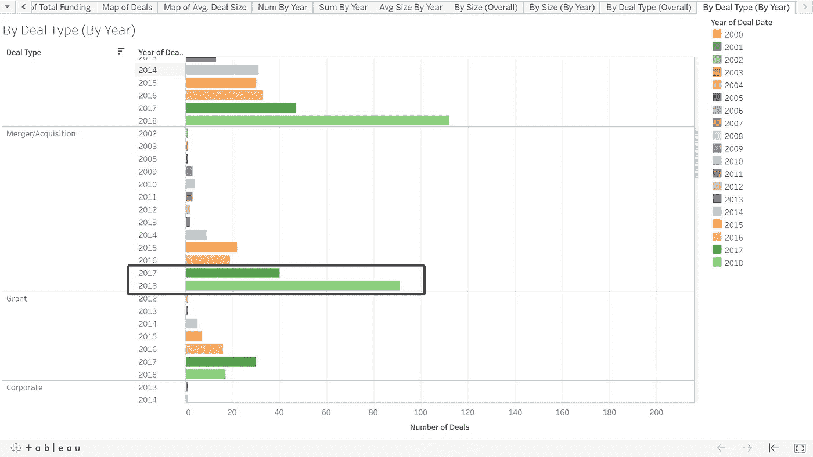

[M&A deals growth](https://public.tableau.com/profile/fan.wen5373#!/vizhome/Blockchain_Deals/ByDealTypeByYear) (By Fan)

到目前为止，传统金融机构/公司还没有大量参与并购&。上市公司完成了 35 起(38.46%)并购交易。而唯一上榜的传统金融机构是于 2018 年 7 月收购了*的 *EY* 。其他收购者是区块链/加密货币公司本身或科技公司，如 *GoDaddy* 和 *Rakuten* 。*

*2018 年 91 起区块链并购&交易完整清单见附录。*

# 流行词

毫无疑问，自区块链技术发明以来，大部分资金都流向了加密货币相关的初创企业(如发行、交易/交换、采矿、投资、加密支付等)。).

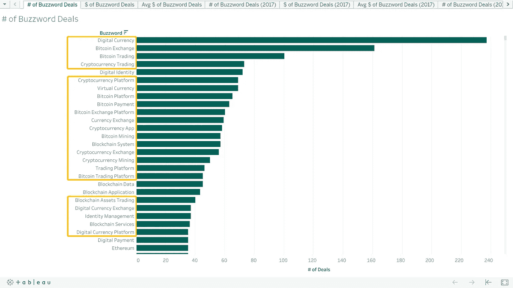

[Number of deals for buzzword-related start-ups](https://public.tableau.com/profile/fan.wen5373#!/vizhome/Blockchain_Buzzwords/ofBuzzwordDeals) (By Fan)

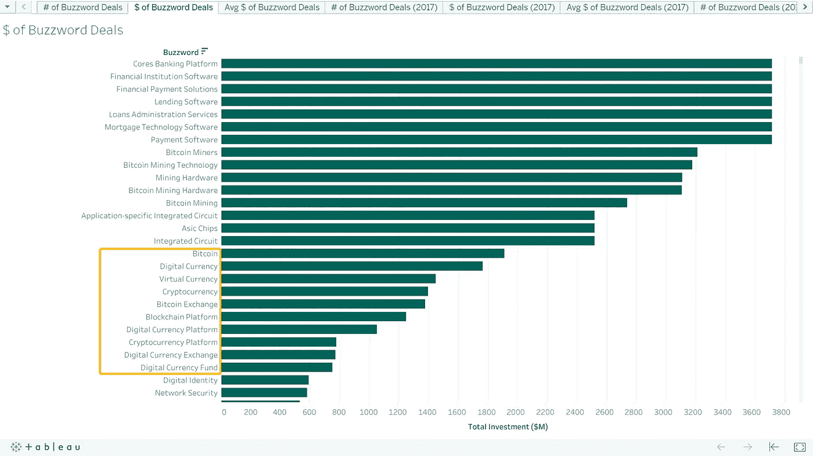

[Total investments into buzzword-related start-ups](https://public.tableau.com/profile/fan.wen5373#!/vizhome/Blockchain_Buzzwords/ofBuzzwordDeals_1) (By Fan)

*两笔大交易(*[*D+H*](https://www.finastra.com/news-events/press-releases/dh-enters-definitive-agreement-be-acquired-vista-equity-partners)*收购和* [*比特大陆*](https://www.coindesk.com/bitcoin-mining-giant-bitmain-files-ipo-prospectus-in-hong-kong/) *IPO)促成了上图中一些垂直行业的异常高的投资额。*

在排除了加密货币相关(包括挖矿)的流行语和区块链科技等通用词后，我们可以看到**2017 年投资最多的“流行语”是:区块链资产交易、数字身份、储能系统、影响力投资垂直、网络安全。**继这些流行语之后，企业区块链平台、资金管理平台、发票融资等其他一些垂直领域也在 2017 年吸引了 4 到 5 笔交易。然而，在 2017 年完成的 547 笔交易中，加密货币相关投资仍是主流。

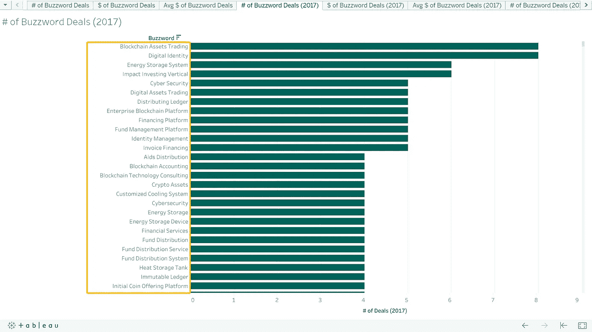

[Most popular investment buzzwords in 2017](https://public.tableau.com/profile/fan.wen5373#!/vizhome/Blockchain_Buzzwords/ofBuzzwordDeals2017) (By Fan)

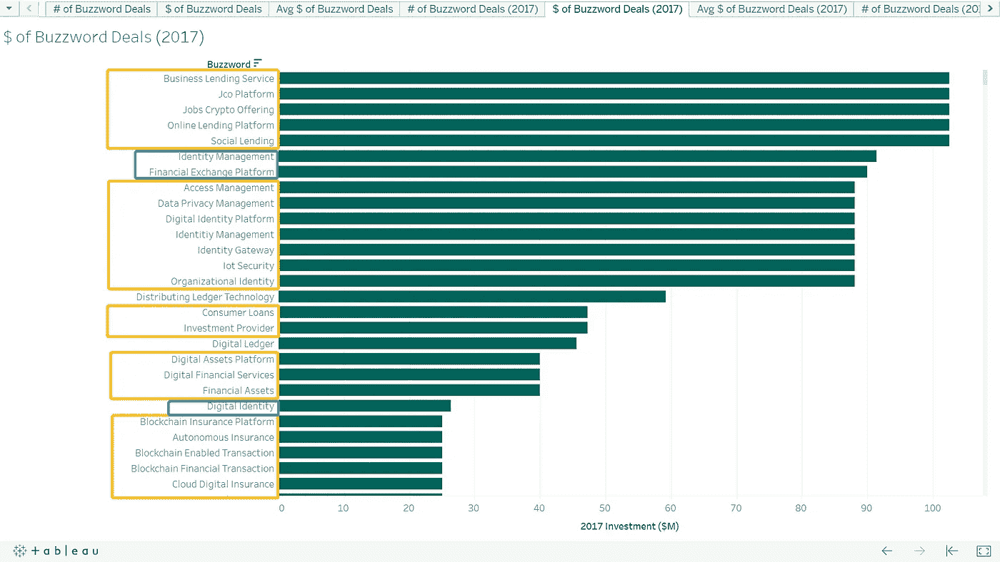

[Most heavily invested buzzwords in 2017](https://public.tableau.com/profile/fan.wen5373#!/vizhome/Blockchain_Buzzwords/ofBuzzwordDeals2017_1) (By Fan)

2018 年，在剔除加密货币相关(包括挖矿)的流行语和区块链科技等通用词后，我们可以看到**2018 年投资最多的“流行语”包括:区块链安全、加密资产&交易所、金融软件/服务、Stablecoin、区块链游戏/游戏平台。除了这些流行语之外，我们还可以看到，风投正将很大一部分资金投向区块链的医疗保健平台、区块链新闻门户、共识算法开发商、保险平台和物流平台。**然而，大多数交易仍然集中在加密货币相关的初创企业。****

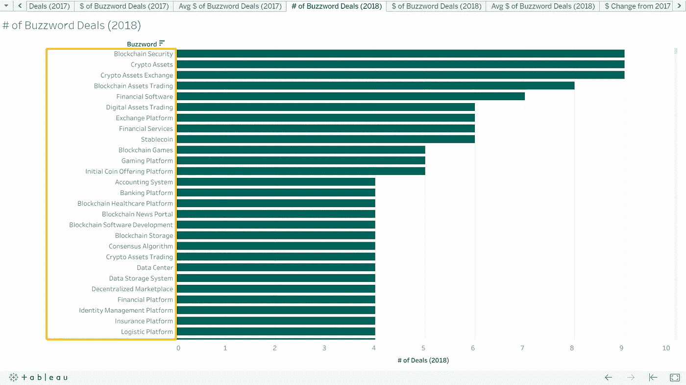

[Most popular investment buzzwords in 2018](https://public.tableau.com/profile/fan.wen5373#!/vizhome/Blockchain_Buzzwords/ofBuzzwordDeals2018) (By Fan)

此外，通过检查 2018 年对不同流行语的投资量，我们可以进一步发现**共识算法/协议开发、Stablecoins 和网络安全**吸引了最多的资金。这是可以理解的，因为(1)还没有出现完美的一致协议，这一事实将影响该技术的广泛实施；(2)即使对于作为交换媒介的最基本的应用，由于高波动性，还没有加密货币被广泛接受。

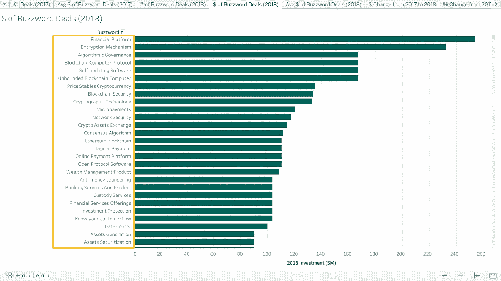

[Most heavily invested buzzwords in 2018](https://public.tableau.com/profile/fan.wen5373#!/vizhome/Blockchain_Buzzwords/ofBuzzwordDeals2018_1) (By Fan)

从 2017 年到 2018 年，正如预期的那样，大部分投资增长都流向了加密货币相关的初创企业。从下面的第二张图中，我们可以看到**在 2018 年的新投资领域**，这与我们在上面的分析中发现的非常相似，**主要与密码技术(安全和协议设计的基础)、稳定账户和资产证券化/管理相关。**

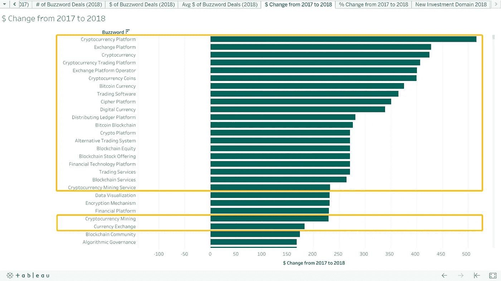

[Investment growth from 2017 to 2018](https://public.tableau.com/profile/fan.wen5373#!/vizhome/Blockchain_Buzzwords/Changefrom2017to2018) (By Fan)

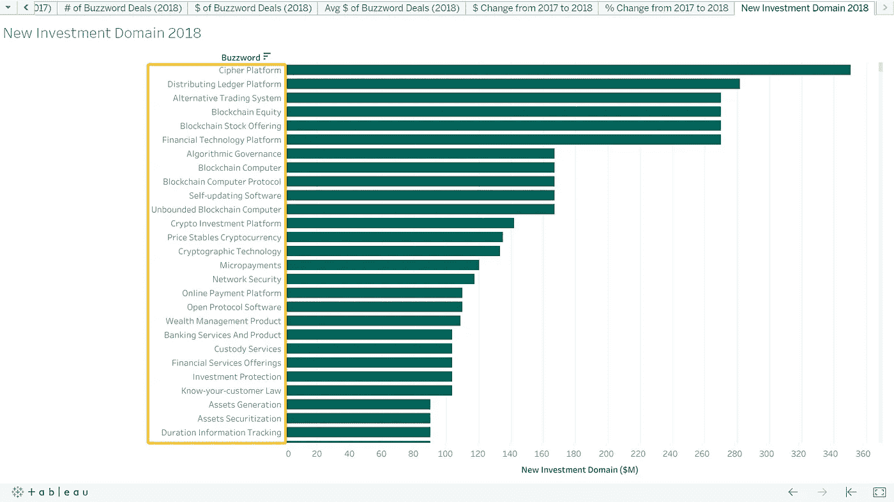

[New investment domains in 2018](https://public.tableau.com/profile/fan.wen5373#!/vizhome/Blockchain_Buzzwords/NewInvestmentDomain2018) (By Fan)

# 结论

1.  全球区块链投资的 74.72%投向了三个市场:美国(50.59%)、中国(17.05%)和加拿大(7.08%)。美国市场拥有最多的初创企业(933 家)和交易(1330 笔)，而中国公司的平均估值(1.152 亿美元)和交易规模(7031 万美元)最高，这表明投资集中度很高。
2.  **从 2017 年到 2018 年，区块链投资翻了一番，更多资金进入了加密货币相关的初创企业，**尽管加密货币市场表现不佳。截至 2018 年 10 月 27 日，已筹集 106.8 亿美元(包括正在进行的 IPO)，而 2017 年仅筹集了 56.23 亿美元。新投资的很大一部分进入了加密货币平台。
3.  **最活跃的投资者是那些专门从事区块链投资的人，因为在理解技术方面存在很高的知识壁垒。**
4.  **~75%的交易是对区块链领域的早期投资。**在记录的 3，035 笔交易中，有 2，271 笔(74.83%)交易是早期投资(天使/早期风投/种子轮/赠款/加速器/孵化器)。
5.  **技术整合正在空间中发生。并购交易的数量从 2017 年的 40 笔增加到 2018 年的 91 笔。然而，很少有交易是由非区块链/传统公司完成的，这表明并购交易更多的是关于行业内的技术整合。**
6.  **正如预期的那样，2017/18 年，大部分投资都投向了加密货币相关的创业公司。**这些创业公司围绕加密货币发行、兑换/交易、挖掘(硬件和软件)、钱包、支付等展开工作。尽管加密货币市场表现不佳，但投资仍在快速增长。
7.  2018 年投资最多的“流行语”包括:**区块链安全、加密资产&交易所、金融软件/服务、Stablecoin、区块链游戏/游戏平台。**
8.  新的投资主要投向:**密码技术(安全和协议设计的基础)、稳定密码和资产证券化/管理。**特别是，**共识算法/协议开发**吸引了大量资金。原因是现有的所有协议在设计上都存在一些缺陷，因此仍然需要一个“完美的”协议。

这个研究项目是由耶鲁大学管理学院的范文和我们中心的乔希·利格特合作完成的。

*免责声明:本文不是也不应被视为“投资建议”或关于行动方案的“建议”，包括但不限于任何适用法律或法规中使用的术语。*

附录:2018 年 M&A 交易清单

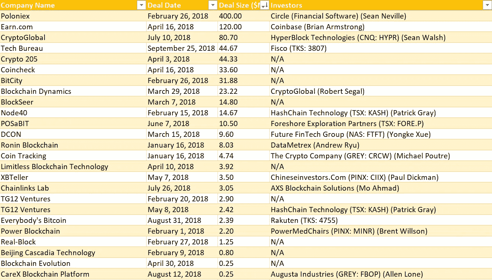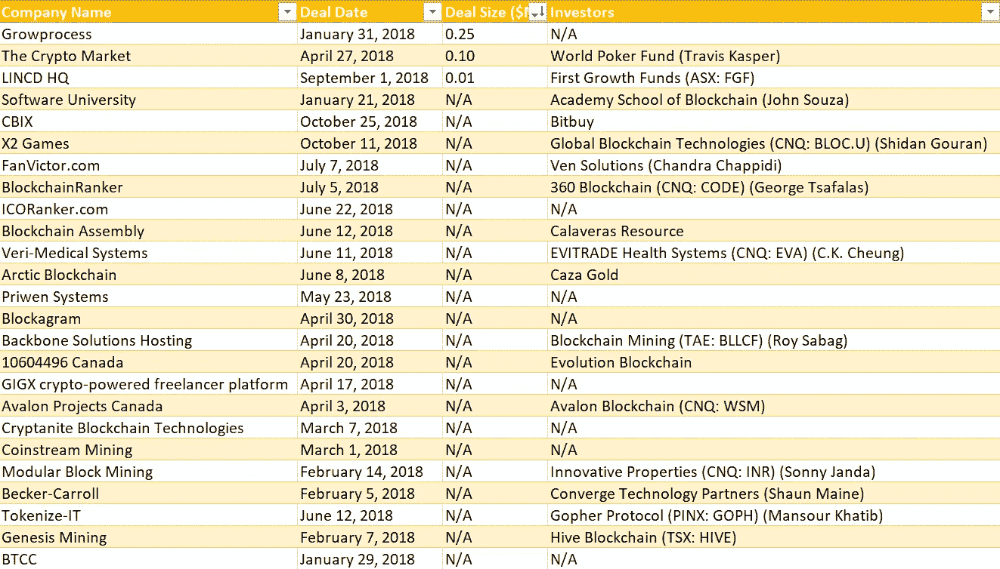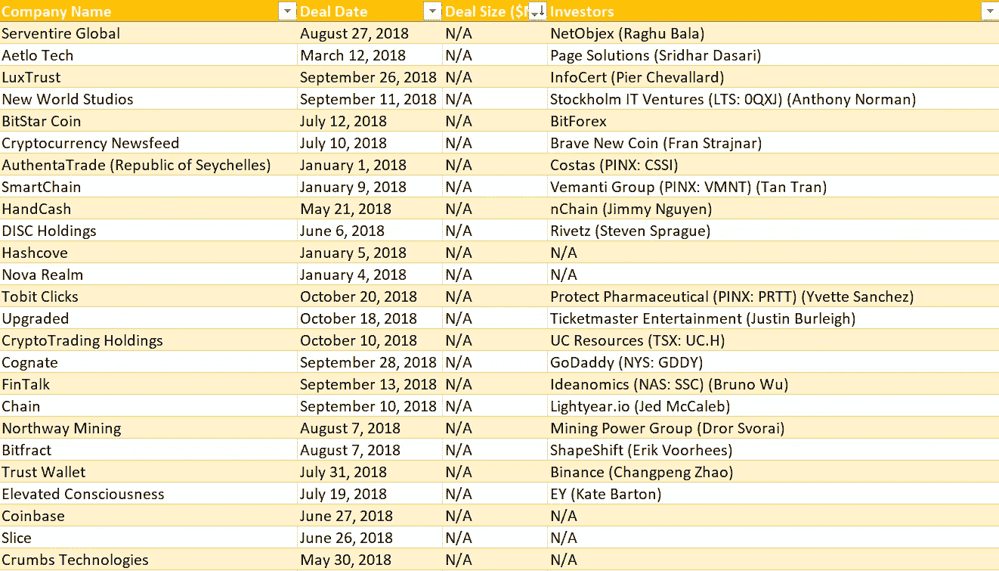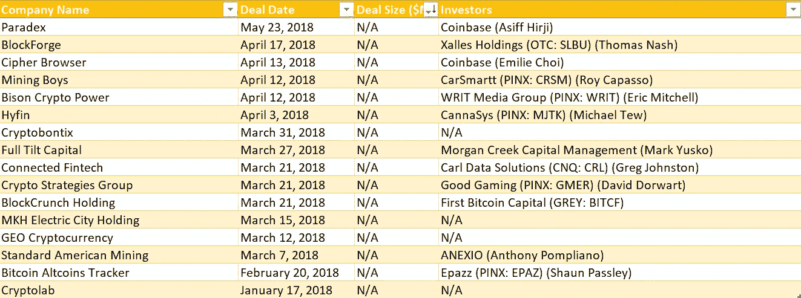

> [直接在您的收件箱中获得最佳软件交易](https://coincodecap.com/?utm_source=coinmonks)

