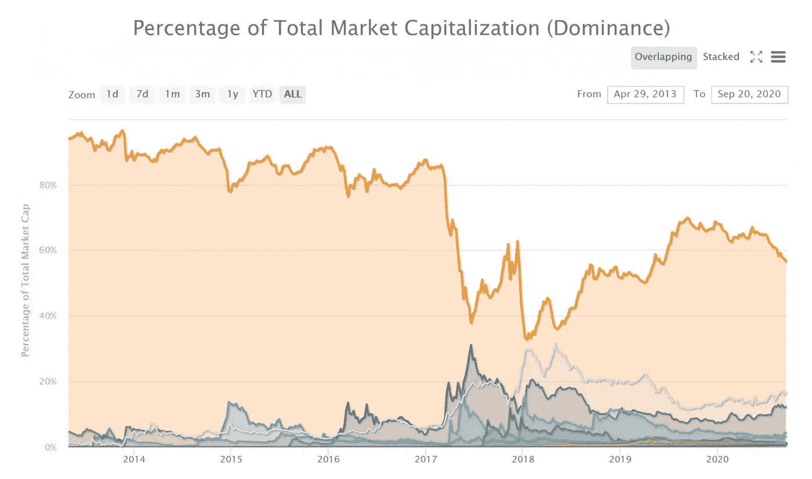
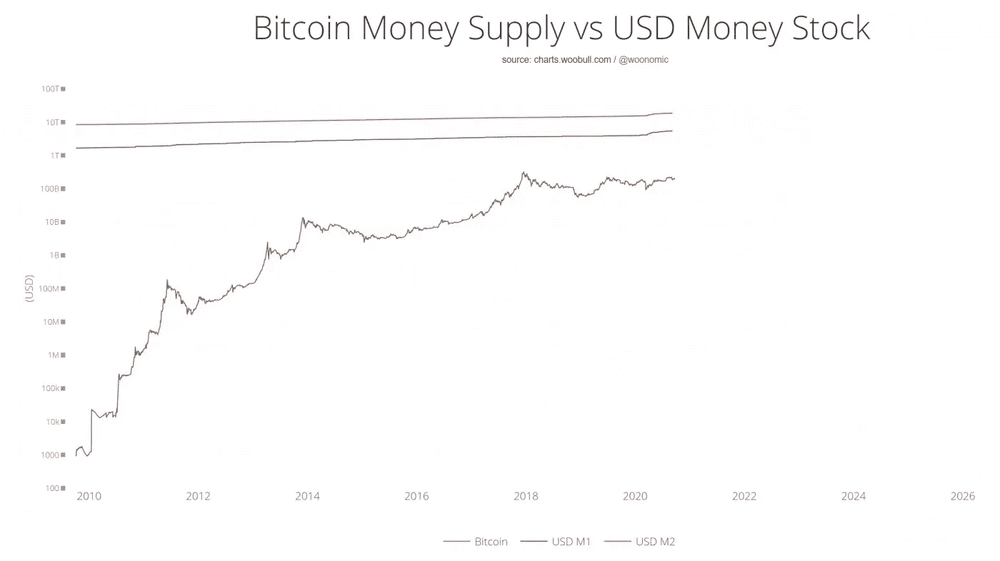

# Crypto 将何去何从？

> 原文：<https://medium.com/coinmonks/where-does-crypto-go-from-here-c0b5216384ee?source=collection_archive---------2----------------------->

## 克利斯·凯驰博士

**通过 Quantum Poodles 为区块链带来数十亿美元**

**加密货币和股票将何去何从？**

这是一个亟待解决的问题。随着选举的临近，这是民主党和共和党之间的意志较量。至于股票，有一些安全网在等待着。包括美联储主席鲍威尔在内的多位央行行长都表示，经济复苏需要更多刺激。如果没有必要的刺激措施，资本将继续流出股市，流入美元。美元在过去几周出现飙升，但自 3 月以来一直处于长期下跌趋势。

如果股票继续走低，以及最近相关性更高的[比特币](https://blog.coincodecap.com/a-candid-explanation-of-bitcoin/)、alt 币和黄金，鲍威尔很可能会加快量化宽松的步伐，因为他自 2008 年金融危机以来一直是这样做的。但即使他不这样做，特朗普最终也可以在没有国会批准的情况下释放 3000 亿美元未使用的刺激措施，如果需要的话，就像他在 8 月初所做的那样。在 9 月 4 日的新闻发布会上，特朗普表示，如果国会不投票重新定向这些资金，可能会提供另外 3000 亿美元未使用的刺激援助。

这似乎是显而易见的。这种刺激措施将推高股票，由于选民用他们的钱包投票，这将增加他连任的几率。因此，我认为出台某种刺激措施的时间不会太久。鲍威尔本周一直在巡回演讲，他和姆努钦都支持额外的刺激措施，以帮助陷入困境的美国人达成更大的预算协议。不足为奇的是，大约一个世纪前，在西班牙流感疫情期间出现了类似的情况，双方都在争夺政治筹码。

如果历史是任何指南，观察股票市场，黄金和比特币/alt 硬币找到他们的地板越早越好。在诸如 GBTC(灰度比特币 ETN)[www.selfishinvesting.com[的成员](http://www.selfishinvesting.com)上周四被发送了这样一个可操作的事件]、黄金和白银 ETF 以及领先股票(AMZN、AAPL、FB 等)的工具中寻找低价和上涨的情况。

## **比特币 1 万亿美元吨大猩猩**

与菲亚特贬值相关的一个问题是，目前全球约有 35，000 家大型上市公司的现金储备因 QE 而贬值。如果他们跟随 Microstrategy 的领导，即使只有 1%的资本进入比特币，这也将推动比特币的价格达到数万亿美元。重要的是，Microstrategy 购买了价值 4.25 亿美元的比特币，不是为了投机，而是为了对冲法币下跌。杰克·多西的公司 Twitter 和 Square 都持有 100 亿美元的现金储备。多尔西在他的 Twitter 个人资料中有一个标签:#比特币。

正如 Peter Diamandis 指出的，去物质化是模拟(物理)数字化的 6 D 之一。苹果将电话线转变为移动网络，谷歌通过广告和搜索将大量信息数字化，YouTube 将视频数字化，Twitter 将语音数字化，亚马逊将零售购物数字化，比特币将价值存储(SoV)数字化。这个 SoV 是如此巨大，Microstrategy 的研究显示，比特币的最终真正主导地位是 92%，下一个网络(以太坊)是 2%，下一个网络是 1.5%。换句话说，SoV 是杀手级应用中的杀手级应用。但这 92%可能需要十年或更长时间才能实现。

当然，如果关于法定货币的大范式转变发生得越早越好，那么从集中法定货币到分散比特币的转变可能会更快。目前，两者将继续共存，尽管比特币和 M1 货币供应量之间的差距继续缩小。

## **区块链:海量公用事业的勇士**

与此同时，估计的另外 8%(目前约为 43%)是由更快的交易时间和更低的成本创造的真实效用，这种不可信的模式消除了许多行业中的大量中间人。请注意，如果当前的 43%下降到 8%，这并不意味着空间会缩小，而是会继续呈指数增长。只是比特币本身的估值将增长得更快，因此迈克尔·塞勒的研究团队认为比特币最终将在整个区块链市场的 92%找到平衡。

人们担心人工智能会抢走我们的工作，但区块链也会，因为它会让中间的人变得多余。许多再培训将会到来，因为新的就业机会将会出现，一如既往。但在下一次进化中，平均工作周将进一步下降，就像上世纪初下降的那样。总的来说，在上个世纪，脑力劳动超过了体力劳动。在下一代，由于人工智能，当然还有人工智能和区块链的强大结合，脑力任务可能会更多地应用于创造性方面，而不是机械性方面。

现有范式的瓦解是显而易见的。星巴克等公司正在其主要供应链中部署区块链科技。银行开始将区块链集成到他们的系统中。通过点对点(p2p)贷款(包括抵押贷款、无抵押贷款和 p2p 分散交易所(dex))进行的分散融资将与集中系统共存。

## **DeFi**

最大的分散化金融公司 Aave(股票代码:LEND)的首席执行官写信给埃隆·马斯克，将 TSLA 股票令牌化，允许人们用他们的汽车作为抵押，借 USDC 美元进行其他购买。特殊目的公司(SPV)将以这种方式存在，LEND 旨在走在前列。将来，你不必去银行申请抵押贷款。你将能够通过令牌化抵押贷款为你的房子融资。你可以去一个分散化的金融平台，比如 Metamask，获得一笔抵押/房地产贷款，该贷款被令牌化，然后锁定为抵押品。因此，零售投资者将能够以小额资金购买抵押贷款，因此零售市场将能够进入全球抵押贷款市场。LEND 最近与 RealT 合作。毫无疑问，自从我在 2020 年 5 月 9 日将其添加到[加密列表](https://www.virtueofselfishinvesting.com/reports/filtered/crypto-picks?p=1&categories=cr)以来，LEND 已经上涨了 1000%以上。

## **抗脆**

比特币、区块链及其在其他领域中的分散金融子集是抗脆弱的。几年前，比特币黑客攻击曾经很正常。但是一个东西存活的时间越长，它存活的时间就越长。当风险降低时，上涨空间就会减少，因为价格已经上涨了很多。目前，区块链仍有很大的上升空间，因为它仍相对较新，因此带来了很多怀疑，因此感知风险水平较高。

那些被比特币的成功蒙蔽了双眼，被称为比特币最大主义者的人经常说以太坊和 alt 币是骗局。除了富达(Fidelity)和摩根大通(JP Morgan)等机构开始接受比特币之外，另一个有趣的事件是，比特币最大化主义者现在正在利用以太坊生态系统进行 ICO。他们没有使用比特币的闪电平台，因为他们意识到以太坊要好得多，并且已经为黄金时间做好了准备。看来，命运并非没有讽刺意味。

由[汉斯数字接入](https://hansedigitalaccess.com/)的克利斯·凯驰博士、KJA 数字资产投资[和《资本上自私投资的美德](http://www.selfishinvesting.com/)

## 另外，阅读

*   最好的[加密交易机器人](/coinmonks/crypto-trading-bot-c2ffce8acb2a)
*   [密码本交易平台](/coinmonks/top-10-crypto-copy-trading-platforms-for-beginners-d0c37c7d698c)
*   最好的[加密税务软件](/coinmonks/best-crypto-tax-tool-for-my-money-72d4b430816b)
*   [最佳加密交易平台](/coinmonks/the-best-crypto-trading-platforms-in-2020-the-definitive-guide-updated-c72f8b874555)
*   最佳[密码借贷平台](/coinmonks/top-5-crypto-lending-platforms-in-2020-that-you-need-to-know-a1b675cec3fa)
*   [最佳区块链分析工具](https://bitquery.io/blog/best-blockchain-analysis-tools-and-software)
*   [加密套利](/coinmonks/crypto-arbitrage-guide-how-to-make-money-as-a-beginner-62bfe5c868f6)指南:新手如何赚钱
*   最佳[加密制图工具](/coinmonks/what-are-the-best-charting-platforms-for-cryptocurrency-trading-85aade584d80)
*   [莱杰 vs 特雷佐](/coinmonks/ledger-vs-trezor-best-hardware-wallet-to-secure-cryptocurrency-22c7a3fd391e)
*   了解比特币的[最佳书籍有哪些？](/coinmonks/what-are-the-best-books-to-learn-bitcoin-409aeb9aff4b)
*   [3 商业评论](/coinmonks/3commas-review-an-excellent-crypto-trading-bot-2020-1313a58bec92)
*   [AAX 交易所评论](/coinmonks/aax-exchange-review-2021-67c5ea09330c) |推荐代码、交易费用、利弊
*   [Deribit 审查](/coinmonks/deribit-review-options-fees-apis-and-testnet-2ca16c4bbdb2) |选项、费用、API 和 Testnet
*   [FTX 密码交易所评论](/coinmonks/ftx-crypto-exchange-review-53664ac1198f)
*   [n 零审核](/coinmonks/ngrave-zero-review-c465cf8307fc)
*   [Bybit 交换审查](/coinmonks/bybit-exchange-review-dbd570019b71)
*   [3Commas vs Cryptohopper](/coinmonks/cryptohopper-vs-3commas-vs-shrimpy-a2c16095b8fe)
*   最好的比特币[硬件钱包](/coinmonks/the-best-cryptocurrency-hardware-wallets-of-2020-e28b1c124069?source=friends_link&sk=324dd9ff8556ab578d71e7ad7658ad7c)
*   最佳 [monero 钱包](https://blog.coincodecap.com/best-monero-wallets)
*   [莱杰 nano s vs x](https://blog.coincodecap.com/ledger-nano-s-vs-x)
*   [bits gap vs 3 commas vs quad ency](https://blog.coincodecap.com/bitsgap-3commas-quadency)
*   [莱杰纳米 S vs 特雷佐 one vs 特雷佐 T vs 莱杰纳米 X](https://blog.coincodecap.com/ledger-nano-s-vs-trezor-one-ledger-nano-x-trezor-t)
*   [block fi vs Celsius](/coinmonks/blockfi-vs-celsius-vs-hodlnaut-8a1cc8c26630)vs Hodlnaut
*   [Bitsgap 评论](/coinmonks/bitsgap-review-a-crypto-trading-bot-that-makes-easy-money-a5d88a336df2)——一个轻松赚钱的加密交易机器人
*   为专业人士设计的加密交易机器人
*   [PrimeXBT 审查](/coinmonks/primexbt-review-88e0815be858) |杠杆交易、费用和交易
*   [埃利帕尔泰坦评论](/coinmonks/ellipal-titan-review-85e9071dd029)
*   [SecuX Stone 评论](https://blog.coincodecap.com/secux-stone-hardware-wallet-review)
*   [BlockFi 评论](/coinmonks/blockfi-review-53096053c097) |从您的密码中赚取高达 8.6%的利息