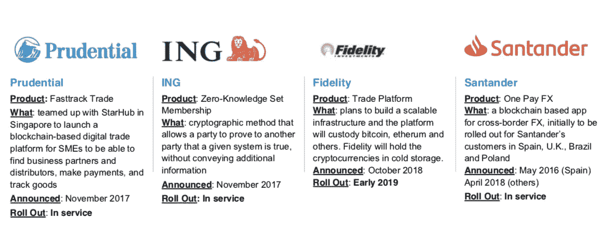

# 机构对区块链和密码资产感兴趣的证据在哪里？

> 原文：<https://medium.com/coinmonks/where-is-the-evidence-of-institutional-interest-in-blockchain-and-crypto-assets-e4d1be7323cd?source=collection_archive---------1----------------------->

在最近一项关于 2017 年以来 ico 进展的研究中，发现超过 30%的 ico 几乎失去了所有价值，而其中绝大多数目前的交易价格低于其上市价格。在 E & Y 跟踪的公司中，只有 25%有可用的产品，只有 10 家加密公司贡献了 90%的收益。这导致交易量下降，新 ico 在过去几个月越来越难以筹集资金。

令人惊讶的是，建设加密基础设施和推出新基金的机构的兴趣如此之大。

纳斯达克一直在追随比特币熊市——它会继续吗？

资料来源:彭博

纳斯达克在 1994 年和 2003 年的表现与比特币在 2018 年 10 月至 2018 年 8 月的表现密切相关。一些评论家在问，比特币价格现在会像纳斯达克那样开始上涨吗？鉴于许多 ico 是由发行代币换取比特币或以太网的公司资助的，如果比特币或以太网现在开始上涨，将产生乘数效应，有助于增加加密资产的整体市值。随着时间的推移，这种系统性风险和对比特币和以太网的依赖将会减少，因为我们会看到不同类型的加密资产被推出，如 Stablecoins、添加到交易所的数字忠诚度令牌和安全令牌。

不同版本的比特币给比特币的价格带来了压力。限量供应的承诺——2100 万比特币——被一些比特币的“硬叉子”(hardforks)版本破坏了。

2017 年 8 月 1 日——比特币现金
2017 年 10 月 24 日——比特币黄金
2017 年 11 月 24 日——比特币钻石
2017 年 12 月 12 日——联合比特币
2017 年 12 月 12 日——比特币 X
2017 年 12 月 12 日——超级比特币【2018 年 2 月 28 日——比特币私人
围绕比特币区块链的运行方式及其消耗的电能总量也存在可以理解的担忧！

有证据表明，以太坊的价格一直处于压力之下，因为使用以太坊融资的公司一直在出售以太坊，以支付其业务的开发和一般运营成本。

资料来源:健康信息

以太坊已经成为其自身成功的受害者，因为大多数 ico 都是使用以太坊区块链上的 ERC20 合同推出的。随着这些 ico 的发展并开始投入使用，用户在许多情况下将需要付费使用以太坊区块链，因此这种需求应该有助于支撑以太的价格。或者，以太坊区块链可以扩展到支持数百家不同的公司同时使用这个区块链吗？鉴于区块链以太坊面临的挑战，以及去年因 CryptoKittys 而导致的交易成本的大幅增加，区块链以太坊是否能够应对仍未可知。

随着机构采用加密技术，零售参与减少。

虽然加密资产的总资本从 8000 多亿美元下降到 2300 亿美元，但不断有跨国公司宣布围绕区块链技术申请专利，包括万事达卡、脸书、谷歌和亚马逊。纽约、伦敦、马耳他、直布罗陀、波士顿、瑞士和新加坡的证券交易所加强了这种机构兴趣，它们都表示正在考虑推出受监管的证券交易所，从而使证券能够上市和交易。这对于共同基金和养老金经理能够以任何重要的方式投资加密资产是很重要的，因为他们需要交易在公认的交易所上市的资产。

虽然众所周知，英国是领先的金融科技国家之一，但有趣的是看到了打算在英国推出的交易所的数量。我们很有可能会看到交易所数量的整合，因为全球银行都在考虑收购加密交易所，以争夺生态系统的一部分。

资料来源:CountMarket Cap

托管服务是基础设施的另一个关键部分，机构经理需要它来交易加密资产。这也许可以解释为什么比特币基地、富达和高盛最近确认他们将提供托管服务。

比特币基地，我听到你说——那是什么？比特币基地运营着一家交易所，该交易所在 2017 年创造了 10 亿美元的收入，尽管加密价格下跌，但预计 2018 年的交易额将达到 13 亿美元。它在 2017 年 8 月的估值为 16 亿美元，最近又向传奇的技术娴熟的投资者出售了 3 亿美元的股权，如 [Wellington Management、Andreessen Horowitz、poly chain](https://www.coindesk.com/coinbase-hits-8-billion-valuation-after-300-million-funding-round/)——现在对比特币基地的估值为 80 亿美元。

另类基金经理也没有错过这一点，他们正在建立对冲基金和风险投资基金，以获得加密资产。

来源:加密基金研究

**机构参与其中的证据在哪里？**

以下显示了机构对区块链的兴趣和投资。

资料来源:摩根斯坦利

来源:Techwire asia，ibtimes，forbes，coindesk

在区块链的投资不仅限于金融服务。

来源:Businesswire、medium、沃尔玛、coindesk

**展望**

对加密资产的最初兴趣集中在筹集资本上，主要是科技初创公司，他们中的许多人希望为风险投资提供资金，以开发区块链技术和新的去中心化世界提供的承诺。不幸的是，随着近 200 亿美元的融资在最低监管的背景下回落，许多骗子被“快速赚钱”的承诺所吸引，因此我们迄今为止看到的 4500 家 ico 中有许多注定要失败。然而，加密资产激发了人们对这一新资产类别和整个区块链技术的兴趣，越来越多的切实证据表明，真正的资金正被投入到区块链的项目中。随着营销人员努力吸引和保持我们的注意力，它们也被用来取代忠诚度计划。

与此同时，加密资产现在正演变为用于提供实物资产债券、私人和上市资产、房地产甚至商品的部分所有权，例如摩根大通正在标记的[金条](https://blokt.com/news/quorum-blockchain-by-jp-morgan-is-tokenizing-gold-bars-for-global-traders)。

因此，有大量证据表明机构对区块链和加密资产感兴趣，希望我们将继续看到监管机构持开放态度。一个很好的例子是英国的 FCA 沙盒倡议，这是其他司法管辖区羡慕的，现在正在被某些国家复制。但是区块链技术并不是一个新的范例，加密资产也不是解决我们所有问题的答案，尽管它们确实提供了一些非常有趣的新工具，可以在我们快速数字化的世界中降低做生意的成本，提高透明度和安全性。

感谢摩根士丹利更新:比特币、加密货币和区块链 2018 年 10 月

乔尼·弗莱

团队区块链有限公司首席执行官

2018 年 11 月

> [在您的收件箱中直接获得最佳软件交易](https://coincodecap.com/?utm_source=coinmonks)

