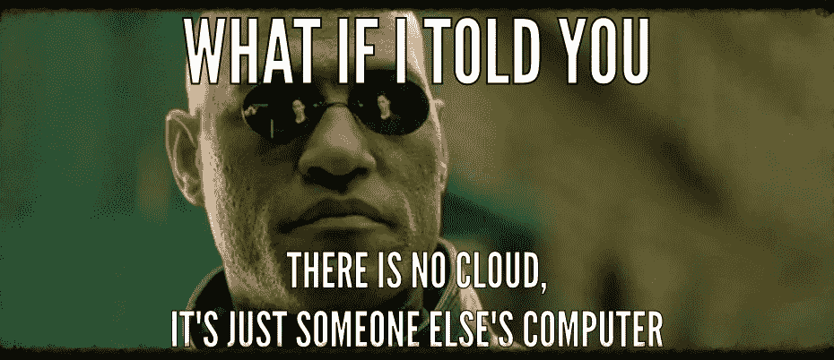

# 接下来去哪里？

> 原文：<https://medium.com/coinmonks/where-next-9cf7c21a1b3?source=collection_archive---------4----------------------->

## 比特币——总结:

软件自由作为一个概念可以追溯到 70 年代。它对互联网的诞生具有开创性意义，反过来又导致了前所未有的创新增长。最新、最具突破性的创新之一是比特币，它本身就建立在软件自由的基础上。比特币是去中心化的，就像互联网是用来传输信息的一样。

软件自由和前比特币时代的互联网给了我们平台和监控经济。只有比特币、软件自由和互联网的结合才有可能实现去中心化、用户控制、隐私和安全的最初愿景。在 BILA 堆栈中，我们已经拥有了构建解决方案所需的所有组件，可以为世界上的任何人提供这些价值。

> 比特币是软件自由的产物，也是软件自由所能开启的创新水平的见证。它开始是一项实验，但已经发展成为许多挑战的解药，包括平台和监控经济。

任何引入去中心化、隐私、安全和用户控制的项目，如果还没有研究 [BILA](/coinmonks/new-opportunities-3ac72def68ff) 堆栈如何帮助他们的任务，那么他们面前将会有巨大的发现，并且有大量的工作要做。

因为传统的金融生态系统并不是为自由软件公司想要建立的数字世界而建立的。相反，它的许多现任者正在推动[中央银行数字货币(CBDC)](/coinmonks/money-banks-and-other-financial-intermediaries-898c55bd4580) ，监视经济的金融影子。这种转变正在到来，由于新冠肺炎期间非接触式支付的兴起，这种转变的速度比两年前看起来要快得多。而且这种转变是不可逆转的。大多数人不会回去。

就像向云计算的转变不会消失一样。其效率的提高将继续有利于最大的玩家。同时

迷因和贴纸很可爱，它们并没有真的把猫吓回袋子里。

即使是大型全球性银行——它们以合规性为导向，处理一些最敏感的数据——现在也开始热衷于将所有 IT 运营转移到云中。大多数政府对云的担忧正在慢慢消失，因为他们的微软支持合同因推迟不可避免的事情而逐渐变得更加昂贵。

只有真正打破现状，才能带来有意义的、持久的变化。比特币就是这种颠覆。忽视它，或者甚至对抗它，最终会损害软件自由所提倡的所有价值观。

阿尔伯特·爱因斯坦经常引用这句话“疯狂的定义是一遍又一遍地做同样的事情，却期待不同的结果。”这就是为什么几年前我决定继续以同样的方式做同样的事情不会给我的孩子们带来我想要看到的世界。

> 因此，就我个人而言，我与 [Vereign](https://vereign.com) 一起开启了新的篇章，并加入了激光眼比特币人的疯狂崇拜，他们利用火山的力量来确保公平、公正、开放、透明、不受任何一方或个人控制的全球信任层。

这一决定背后的基本原理符合我的个人使命，即出于上述所有原因，让技术为人类服务。我对这个系列的希望是，软件自由社区的其他人也会同样质疑他们认为比特币代表什么的想法，并看到比特币及其后续创新带来的机会。

如果这一切似乎离你现在的位置还很远，那么根据你目前的心态或职业，这里有三个可能的起点，供你开始自己的发现之旅:

*   [去中心化身份基金会](https://identity.foundation/) —为个人、组织、应用和设备建立一个开放的、基于标准的去中心化身份生态系统；
*   W3C 编辑于 2021 年 6 月 16 日起草的关于[分布式标识符的用例及要求](https://w3c.github.io/did-use-cases/)；
*   [Gaia-X](https://www.gaia-x.eu/) —一项旨在构建下一代数据基础设施的欧洲计划:一个开放、透明和安全的数字生态系统。

奇怪的是，所有这些都通向同一个兔子洞。欧盟委员会关于[更新其电子签名法以纳入自我主权身份](https://joinup.ec.europa.eu/collection/ssi-eidas-bridge/about)的工作也是如此。

这个领域发展很快，我相信拥有能力、经验和价值观的软件自由社区应该是形成这种颠覆的积极部分。

所以请过来加入我们。

*本文总结了我个人对比特币的看法，包括其相关性、技术属性、环境影响、社会相关性以及对软件自由的意义。*

*以下是整个系列的列表:*

*   [*关于比特币，第一部分:没有比特币，软件自由能成功吗？*](https://ggreve.medium.com/can-software-freedom-succeed-without-bitcoin-5aceb4db8d1f)
*   [*关于比特币，第二部分:集中信任推动集中化*](https://ggreve.medium.com/centralised-trust-drives-centralisation-34067146afdc)
*   [*关于比特币，第三部分:货币、银行和其他金融中介*](https://ggreve.medium.com/money-banks-and-other-financial-intermediaries-898c55bd4580)
*   [*关于比特币，第四部分:新机遇*](https://ggreve.medium.com/new-opportunities-3ac72def68ff)
*   [*关于比特币，第五部分:沸腾的海洋*](https://ggreve.medium.com/the-boiling-oceans-11c95ac612b8)
*   [*关于比特币，第六部分:*](https://ggreve.medium.com/the-mood-swings-7f1542046f07)
*   关于比特币，总结:下一步是什么？(这篇文章)