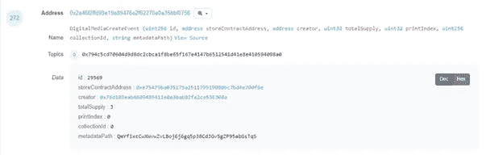

# 我的数字艺术到底在哪里？也就是读取区块链以证明所有权

> 原文：<https://medium.com/coinmonks/where-the-heck-is-my-digital-art-a-k-a-reading-the-blockchain-for-proof-of-ownership-74c2061580a3?source=collection_archive---------0----------------------->

[Markus Spiske @Unsplash](https://unsplash.com/photos/iar-afB0QQw)

## **所有权的简单问题**

我的一个好朋友一直在问这个问题:“当我购买一个不可替代的代币时，我能得到什么？我怎么知道是我买的？我怎么证明我是主人？”

他是一个怀疑论者。

他提出这些问题是非常正确的，因为除非这些问题有明确且容易理解的答案，否则为什么有人要把辛苦赚来的钱花在数字艺术或收藏品上。

好消息是这个问题有一个非常简洁的答案。坏消息是，这是基本但技术性的，涉及探索以太坊区块链交易。本文将通过几个例子来证明这一点。

因此，如果你对区块链的数字艺术及其所有权感兴趣，请继续阅读。为了让它变得有趣一点，我会给你一些不公开的交易，在这些交易中，艺术品不仅被创作出来，还被出售。

## **ERC 20 和 ERC 721 的小细节**

大多数人都知道区块链以太坊的 ERC 20 标准，它在网络上生产各种代币。出于我们的目的，知道这些令牌是可替换的是很重要的。就像钱一样，1 ETH 等于 1 ETH，1 USD 等于 1 USD。

然而，如果你想标记你的艺术视频，这不是理想的解决方案，即使有变通办法。首先，标记你的艺术视频并不意味着你把它放在以太坊区块链。区块链既没有那么大，成本也不合理。

相反，以太坊区块链存储创建令牌的合同。是联系人规定了令牌来的规则。这些规则可以包括所有权、转让、编辑、艺术描述和版税等。

实际的艺术品通常存储在其他地方，一般在星际文件系统(IPSF 网络)上。事务本身是一个标识符，包含特征(属性、上述规则创建的证明)。

在 ERC 721 下，每个令牌都有不同的 id。这构成了通用 ERC 721 规范的不可替代性。因此，链接到代币的每个视频、艺术品、收藏品或其他物品可以独立地用不同的 id 来铸造。这种不同的 id 供应实际上使 ERC 721 成为艺术和收藏品市场更相关的标准。

(如果你想知道最近如何处理多个版本，我指的是 Rarible(app.rarible.com ),因为他们使用 ERC 1155，这是可替换的 ERC 20 和不可替换的 ERC 721 之间的桥梁，通过提供版本，即同一项目的多个副本以及其他改进。)

让我们来看一些现实生活中的例子！

## **ERC 20 /例 1:从分数到财富**

让我们把时钟拨回到 2018 年的春天。加密泡沫已经破裂，每个人都很困惑，超级稀有(www.superrare.co)已经开始运作。

如下图所示的第一个列表是人工智能生成的裸体肖像#1，作者是 [Robbie Barrat](https://superrare.co/videodrome) 。

日期正好是 2018 年 4 月 5 日。

并且交易可以在这里找到:[https://ethers can . io/tx/0x 14958 E3 c 5607 ef 5 e 97604 f 79664 b 2 f 7 c 49 edbc 3753692 f 52 BC 926702 CDE 6 C4 e](https://etherscan.io/tx/0x14958e3c5607ef5e97604f79664b2f7c49edbc3753692f52bc926702ccde6c4e)

[AI Generated Nude Portrait #1 by Robbie Barrat](https://superrare.co/artwork/ai-generated-nude-portrait-1-1)

请注意，令牌转移部分提到了将项目转移到艺术家钱包的第一个创建地址。在那一行中提到了“超级稀有”。由于这是一个 ERC 20 令牌，这是创建令牌 ID 的巧妙变通方法。同样地，对于用超级稀有合同(以及其他合同)创建的每个下一个项目，令牌传送将指示事实上是令牌 ID 的数字(其将与 ERC 721 一起出现)。

注意交互(To)字段——这是进行铸造的基础契约。根据其规格，上述艺术品的所有权被铸造为超级稀有上的标记 1。

[Transaction Details for Example-1](https://etherscan.io/tx/0x14958e3c5607ef5e97604f79664b2f7c49edbc3753692f52bc926702ccde6c4e)

交易详细信息下的其他项目是交易中涉及的 ETH、费用、块标识符等。

现在，如果我们切换到 Etherscan 上的事件日志部分，我们会看到 12-主题 2 地址中的所有者。合同是第一个提到的地址。当时唯一的自定义元数据是 tokenID，在本例中是 1。

[Log Details for Example-1](https://etherscan.io/tx/0x14958e3c5607ef5e97604f79664b2f7c49edbc3753692f52bc926702ccde6c4e#eventlog)

这就是我们切换到故事模式的地方..

仅仅 30 分钟后，@artnome 介入并以 0.46 ETH(当时 176 美元)的价格买下了这幅数字艺术品。下面是交易:[https://ethers can . io/tx/0x 33617 dab 26 e 80 ab 035 E3 fa 18 f 941 ebf DD 9 b 489 a 464888 F3 fa 62 fa 406633 AC 7 e 0 # event log](https://etherscan.io/tx/0x33617dab26e80ab035e3fa18f941ebfdd9b489a464888f3fa62fa406633ac7e0#eventlog)

如果您检查事件日志，那么您会看到所有权已经改变，最初的地址转移到买方。

现在更多的时间过去了..

大约过了 20 个月，收藏家拒绝了很多报价。

然后在 2020 年 1 月 18 日这历史性的一天，@curiousnfts 以 75 ETH(13265 USD)的价格购买该物品！！！。下面是交易:[https://ethers can . io/tx/0x 45 f 62 Fe 5031446 e 97 f 13 e 3884011 ca 2361 c 016303 ed 4451 f 50180 d4e 721406 F8](https://etherscan.io/tx/0x45f62fe5031446e97f13e3884011ca2361c016303ed4451f50180d4e721406f8)

[Contract Split Details for Example-1](https://etherscan.io/tx/0x45f62fe5031446e97f13e3884011ca2361c016303ed4451f50180d4e721406f8)

请点击此处了解智能合约的具体优势。注意 75 ETH 的分裂。10%归创作者，3%归 SuperRare，87%归卖家。由于合同的特殊性，这是完全自动化的。因此，通过潜在代码的力量确保各方执行协议。简单地说，交易只会在这些参数下发生。(除非所有者赠送的物品本质上是无金钱回报的转让。)

所以请注意，你已经见证了这一交易的历史。收藏它，保存它，谈论它..请..

下一个例子..

## ERC 20 /例 2: MakersPlace 有更好的设计..

makers place(makersplace.com)是我最喜欢的策划数字艺术网站之一。它的艺术家基础广泛，拥有大约 30，000 多件作品(包括版本)。无论是艺术类型、风格和价格都是如此之多，它可以满足不同的需求。

至于我们的例子，MakersPlace 可悲的是仍然在处理 ERC 20 代币。然而，他们改进了早期超稀有结构的基本设计。

下面是[比特罗](https://makersplace.com/biterrror/?view_all=1)的一个很棒的作品——曼哈顿上空的水最近在 MakersPlace 上被抢购一空。

[Water over Manhattan by BitError](https://makersplace.com/jeang/water-over-manhattan-1-of-3-34699/)

这是[https://ethers can . io/tx/0x 4789 e 8 EC 5c 5 b 417 ab 64 F2 e 6715 FCE 808d 8302 e 7 f 6 c 4420d 45 BC 6 AC 41 eed 3 b 01](https://etherscan.io/tx/0x4789e8ec5c5b417ab64f2e6715fce808d8302e7f6c4420d45bc6ac41eedb3b01)交易，标志着该项目的铸造。你可以随时点击链接。出于本文的目的，请注意 MakersPlace 及其 MakersToken 在 Tokens Transferred 部分中标记了 31172。回想一下，这是事实上的 id，就像示例 1 一样。

这种改进来自日志和该契约提供的额外散列信息:[https://ethers can . io/tx/0x 4789 E8 C5 b 417 ab 64 F2 e 6715 FCE 808d 8302 e 7 f 6 c 4420d 45 BC 6 AC 41 eeb 3 b 01 # event log](https://etherscan.io/tx/0x4789e8ec5c5b417ab64f2e6715fce808d8302e7f6c4420d45bc6ac41eedb3b01#eventlog)

[Log Details for Example-2](https://etherscan.io/tx/0x4789e8ec5c5b417ab64f2e6715fce808d8302e7f6c4420d45bc6ac41eedb3b01#eventlog)

在部分 272 中，由所有者(创建者)指定创建者合同。还提到了总版本数。新的东西是指向 IPFS 散列的元数据路径。这意味着该项目存储在 IPSF 网络上，这是访问存储和查看文件的地址。在以下部分中，还指定了令牌 ID 和 IPSF 媒体 ID。

这个改进的 ERC 20 合同接近它应该达到的水平，但是现在让我们来看一个 ERC 721 的例子进行比较。

## **ERC 721 /例-3:早上的咖啡，晚上的艺术。**

让我们转到出售稀有艺术品的 KnownOrigin (knownorigin.io)网站，看看一个 ERC 721 的例子。

下面这幅画是 Voke 的《早晨的咖啡》,已经卖完了。

[Coffee in the Morning by Voke](https://knownorigin.io/gallery/173750)

这是创建交易:[https://ethers can . io/tx/0x 59228 a1 ba 781809 e5e 192400 FD 616 fc 23 ab 755 e 0507765 D5 c 1657 f 5909623443](https://etherscan.io/tx/0x59228a1ba781809e5e192400fd616fc23ab755e0507765d5c1657f5909623443)。

这是与 ERC 20 例子相同的布局。

这是日志文件:[https://ethers can . io/tx/0x 59228 a1 ba 781809 e5e 192400 FD 616 fc 23 ab 755 e 0507765 d5c 1657 f 5909623443 # event log](https://etherscan.io/tx/0x59228a1ba781809e5e192400fd616fc23ab755e0507765d5c1657f5909623443#eventlog)。

其结构是为已知来源的合同定制的，但本质上也与其他合同相似。

这是艺术家卖画的交易:[https://ethers can . io/tx/0x 59228 a1 ba 781809 e5e 192400 FD 616 fc 23 ab 755 e 0507765 d5c 1657 f 5909623443 # event log](https://etherscan.io/tx/0x59228a1ba781809e5e192400fd616fc23ab755e0507765d5c1657f5909623443#eventlog)。

[Transaction Details for Example-3](https://etherscan.io/tx/0x3dee73102b33673a494f40a1e1c44a2e48a98a162f0055cf543a603d8938b52b)

除了一个重要的细节外，这里的一切都与 ERC 20 合同相同。请注意，令牌转移部分提到“对于 ERC-721 令牌 ID 173751”。这意味着第 0.1 次交易是发送者接收 ID 为 173751 的令牌的交易，该令牌是早上的艺术咖啡。

回想一下，ERC 20 合约使用转移的代币数量作为代理来模拟 ID，因此在本例中，它们将转移 173751 个代币(没有价值)。尽管这两种结构都有明确引用令牌 ID 的日志数据。

## **ERC 721 /例-4:英飞特处于最佳状态！**

对于一个显著的 ERC 721 例子，让我们看看我自己也使用的英飞特(infinft.com/#mint)艺术家合同。

[Infinitum Novum by Ekaitza](https://opensea.io/assets/0xd0c402bcbcb5e70157635c41b2810b42fe592bb0/1)

这是 Infinitum Novum [Ekaitza](https://www.infinft.com/alpha.html) 。它于 5 月 5 日以 5 ETH 的价格售出。

该令牌是通过一个自定义的 ERC 721 合同使用以下日志文件生成的:[https://ethers can . io/tx/0x aedeaf 527 c9cc 425 b 9 D5 fc 55 c 583 af 08398 aae 13d 25205 e 75 a 86 bfd 5122 E3 a 94 #事件日志](https://etherscan.io/tx/0xaedeaf527c9cc425b9d5fc55c583af08398aae13d25205e75a86bfd5122e3a94#eventlog)

[Log Details for Example-4](https://etherscan.io/tx/0xaedeaf527c9cc425b9d5fc55c583af08398aae13d25205e75a86bfd5122e3a94#eventlog)

请注意，与我们审查过的其他合同相比，infiNFT 的合同有重大改进。它允许在上面的部分 91 中有关于项目描述、艺术标题和艺术家姓名的附加元数据。

此外，在第 92 节中，数字艺术既写给 IPSF，也写给阿尔韦·区块链。哈希和令牌 ID 都可以在这里找到。

最后，在部分 93 中，令牌 ID 被重复，版税数字被指定，随后是艺术家地址。多年来，随着艺术品所有权的变化，最初的艺术家和作品的具体数据被遗忘了。英飞特的合同设计提供原创艺术家信息、描述和版税等信息，这些信息将成为创作生命周期内核心区块链记录的一部分。

InfiNFT 的合同有一些改进的需求，比如多个图像和自定义元数据，该团队将很快解决这些问题。然而，这是迄今为止市场上最复杂的 ERC 721 合同之一。坏处呢？由于所提供的数据比其他合同要多，所以铸造成本要高一些。作为比较，Rarible 有一个体面的 ERC 721 设计，允许自定义元数据，包括添加文件引用(但不像 Cargo 的版本那样锁定文件)。但是，当您检查事件日志时，您会发现 Rarible 并没有将所有描述数据写入区块链(可能会将其保存在其服务器上)。因此，他们的合同部署成本较低，但长期耐用性可能部分取决于 Rarible 的寿命。

## 你在那里找到你的作品了吗？

事实上我们做到了。

我们不仅展示了散列中包含的出处和稀缺性，还追踪了所有权和销售价格。我们见证了合同规定的费用分割和 IPSF &阿韦弗备份的艺术品。

对于永远的怀疑者来说，这不是一个防止非法复制的系统。没有制度阻止它。这是一个证明谁是合法所有者以及该人拥有什么的系统。此外，信息是写在一个不可改变的区块链。还有什么？

[Dance: Act One Commences by Hulki Okan Tabak](https://opensea.io/assets/0xa1a363ecc4000548db7b5abcf790b722caf082ad/11)

【BTCHaber.com】(本文是将在网站上以土耳其语发布的文章的英文版本。)

## 另外，阅读

*   最好的[密码交易机器人](/coinmonks/crypto-trading-bot-c2ffce8acb2a)
*   [密码本交易平台](/coinmonks/top-10-crypto-copy-trading-platforms-for-beginners-d0c37c7d698c)
*   最好的[加密税务软件](/coinmonks/best-crypto-tax-tool-for-my-money-72d4b430816b)
*   [最佳加密交易平台](/coinmonks/the-best-crypto-trading-platforms-in-2020-the-definitive-guide-updated-c72f8b874555)
*   最佳[加密贷款平台](/coinmonks/top-5-crypto-lending-platforms-in-2020-that-you-need-to-know-a1b675cec3fa)
*   [最佳区块链分析工具](https://bitquery.io/blog/best-blockchain-analysis-tools-and-software)
*   [加密套利](/coinmonks/crypto-arbitrage-guide-how-to-make-money-as-a-beginner-62bfe5c868f6)指南:新手如何赚钱
*   最佳[加密制图工具](/coinmonks/what-are-the-best-charting-platforms-for-cryptocurrency-trading-85aade584d80)
*   [莱杰 vs 特雷佐](/coinmonks/ledger-vs-trezor-best-hardware-wallet-to-secure-cryptocurrency-22c7a3fd391e)
*   了解比特币的[最佳书籍有哪些？](/coinmonks/what-are-the-best-books-to-learn-bitcoin-409aeb9aff4b)
*   [3 商业评论](/coinmonks/3commas-review-an-excellent-crypto-trading-bot-2020-1313a58bec92)
*   [AAX 交易所评论](/coinmonks/aax-exchange-review-2021-67c5ea09330c) |推荐代码、交易费用、利弊
*   [Deribit 审查](/coinmonks/deribit-review-options-fees-apis-and-testnet-2ca16c4bbdb2) |选项、费用、API 和 Testnet
*   [FTX 密码交易所评论](/coinmonks/ftx-crypto-exchange-review-53664ac1198f)
*   [n 零审核](/coinmonks/ngrave-zero-review-c465cf8307fc)
*   [Bybit 交换审查](/coinmonks/bybit-exchange-review-dbd570019b71)
*   [3Commas vs Cryptohopper](/coinmonks/cryptohopper-vs-3commas-vs-shrimpy-a2c16095b8fe)
*   最好的比特币[硬件钱包](/coinmonks/the-best-cryptocurrency-hardware-wallets-of-2020-e28b1c124069?source=friends_link&sk=324dd9ff8556ab578d71e7ad7658ad7c)
*   最佳 [monero 钱包](https://blog.coincodecap.com/best-monero-wallets)
*   [莱杰纳米 s vs x](https://blog.coincodecap.com/ledger-nano-s-vs-x)
*   [bits gap vs 3 commas vs quad ency](https://blog.coincodecap.com/bitsgap-3commas-quadency)
*   [莱杰纳米 S vs 特雷佐 one vs 特雷佐 T vs 莱杰纳米 X](https://blog.coincodecap.com/ledger-nano-s-vs-trezor-one-ledger-nano-x-trezor-t)
*   [block fi vs Celsius](/coinmonks/blockfi-vs-celsius-vs-hodlnaut-8a1cc8c26630)vs Hodlnaut
*   Bitsgap 评论——一个轻松赚钱的加密交易机器人
*   为专业人士设计的加密交易机器人
*   [PrimeXBT 审查](/coinmonks/primexbt-review-88e0815be858) |杠杆交易、费用和交易
*   [埃利帕尔泰坦评论](/coinmonks/ellipal-titan-review-85e9071dd029)
*   [赛克斯·斯通评论](https://blog.coincodecap.com/secux-stone-hardware-wallet-review)
*   [区块链评论](/coinmonks/blockfi-review-53096053c097) |从您的密码中赚取高达 8.6%的利息