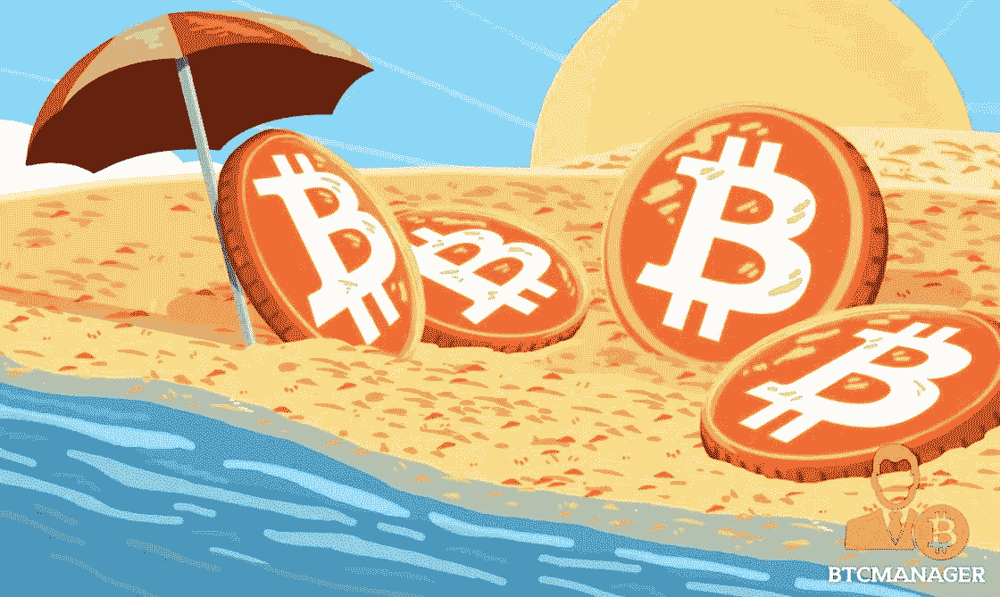
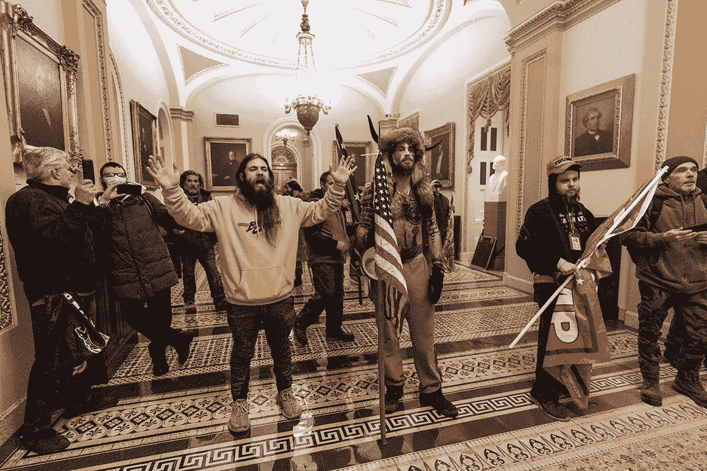

# 哪个国家将首先进入数万亿比特币的采用竞赛？

> 原文：<https://medium.com/coinmonks/which-country-will-first-enter-the-multi-trillion-bitcoin-adoption-race-cc0530893f23?source=collection_archive---------2----------------------->

## 虽然机构投资者和大公司越来越多地采用比特币，但新兴经济体仍然可以在建立以比特币为中心的经济方面获得先发优势。

世界各地的政府主要通过三种方式来应对比特币和加密货币的采用:(I)瑞士和列支敦士登等国家是先行者，已经完全公开地采用了加密货币，从而在其繁荣的[加密谷创造了数以千计的新业务和就业机会](https://andreabianconi.medium.com/switzerland-and-liechtenstein-improve-their-crypto-friendly-regulations-to-favour-stos-828eab8af691) , (ii)美国和欧洲等国家倾向于监管该行业，尽管仍保持宽松， 尽管出现了过度监管的趋势，偶尔也有一些可能的禁令，但很少有国家[以这样或那样的方式禁止密码，就像中国过去做的那样，印度和尼日利亚最近做的那样](https://www.coindesk.com/podcasts/coindesk-podcast-network/nigeria-india-crypto-bans)。

New terror groups armed with horns and long beards:

尽管政府通过永远顺从、不问是非和腐败的主流媒体传播通常的叙事——例如需要“保护我们”免受“坏人”、洗钱者、罪犯或[新贴上标签的恐怖组织，如(迄今无害的)“骄傲的男孩”](https://www.coindesk.com/crypto-use-in-terrorism-a-growing-problem-yellen-says)——任何了解一点货币历史和经济学的人都非常清楚，政府控制的法定货币是使政治和金融精英成为极权主义者的必要工具，尽管是间接的， 通过货币通胀控制经济和征用资源，以及一系列额外的“有利于 GDP”的企业，如打击人为抬高的疫情，并向他们的制药亲信提供数十亿假币，或通过 QEs infinity 膨胀资产泡沫，向他们的金融亲信提供数十亿，或资助无休止的战争，打击目前最方便的恐怖组织(当心比特币制造者，因为你也可能被称为恐怖组织)，从而向他们的武器和石油行业亲信提供数十亿。 这就陷入了假币、任人唯亲和腐败的恶性循环，成为了当前西方金融资本主义和“民主国家”的基础。因此，控制货币供应的问题仅仅是政治性的，它仅仅是关于权力、既得利益、控制和压迫。不多不少。

幸运的是,[比特币是一个划时代的范式转变](https://andreabianconi.medium.com/oops-ray-dalio-missed-the-biggest-of-all-paradigm-shifts-crypto-79ce826c1445),它为世界各国政府带来了一个新的独特的博弈论挑战，尤其是那些新兴经济体，它们(I)与上述主导西方金融资本主义的“恶性循环”更加分离，并且(ii)受到当地货币长期疲软的不利影响，并且经常受到货币替代(即美元化)的影响，这带来了不利的地缘政治和经济影响。

一方面，这些国家可以选择跟随中国、印度和尼日利亚——或其他过度监管的管辖区——进入“禁止主义/严格监管”的兔子洞，从而失去数万亿美元的商业机会，并使自己暴露于用外国稳定货币或加密货币替代货币的地缘政治风险中(我在本文[这里](https://andreabianconi.medium.com/bitcoin-and-the-lost-art-of-commercial-banking-6057442da435)解释了用外国稳定货币替代货币的不可避免的道路和资本管制的无用性)。

另一方面，他们可以走更进步国家的道路，因此将自己置于数万亿美元技术运动的前沿，这将为他们的国家带来巨大的经济利益，同时将使他们的法定货币更强大，并可与外国稳定货币和加密货币互换。

当地政治家必须做出的选择，不可避免地为国家之间新一轮的竞争创造了条件，以吸引比特币计价的资本和相关人才。显然，随着比特币市值的增长，以及一些新的知名华尔街人士或特斯拉(Tesla)等领先科技公司加入比特币创造者行列的每日新闻，跟随尼日利亚和印度的第一种选择看起来越来越像自杀。印度企业家 [Balaji S. Srinivasan](https://balajis.com/about/) 在这篇文章中无可争议地描述了印度可能会失去的东西——不仅是禁止比特币，还有——不完全接受比特币:

> *“总而言之，印度正处于* [*禁止*](https://www.prsindia.org/billtrack/draft-banning-cryptocurrency-regulation-official-digital-currency-bill-2019) *一个万亿美元产业的边缘，而不是用它来加强其国家安全、经济、货币、技术和外交政策。”*

虽然瑞士和列支敦士登仍然是很好的例子，说明了采用加密货币可以取得的成就，但新兴经济体必须采取更彻底、更积极的方式，为其经济和社会带来更多收益。他们应该让比特币成为他们数字货币系统的基础数字价值储存手段。至少——除了是可靠的货币之外——比特币不属于任何人，也不属于任何人，它没有地缘政治偏见，也没有风险。

**要做到这一点，他们需要建立一个有竞争力的框架来启动这个行业，推动良性循环:**

(a)采用易于加密的法规，主要处理数字标记化资产(如稳定债券和标记化证券)的识别和法律地位。列支敦士登、瑞士和美国怀俄明州实施的监管框架就是很好的例子 **(*)** 。

(b)重塑本地银行体系，使其以比特币为中心，而不是以美元或欧元为中心，正如我在“[比特币和商业银行失传的艺术](https://andreabianconi.medium.com/bitcoin-and-the-lost-art-of-commercial-banking-6057442da435)”中所描述的那样。实施敏捷加密银行章程，主要管理加密资产的发行和保管，就像怀俄明州为 SPDIs(特殊目的 Dep)实施的章程一样。机构)。AvantiBank 最近被授予怀俄明州加密银行的执照，以托管加密资产和发行加密法定美元。值得注意的是，美国 OCC 最近发布了一份意见函，允许美国银行使用区块链基础设施和现有的稳定资本或发行自己的稳定资本。如果得到一致的政府政策的证实，这可能是一个激进的范式变化，可能会引发全球向加密银行的转变。

这是新兴经济体的监管者和政治家应该仔细考虑的重要一点:美国监管者提出了所有解决方案中最简单、最快的一个，只需即插即用进入比特币区块链，建立一个新的银行基础设施。非常聪明。

(c)通过灵活的许可程序，激励建立密码交易所。

(d)鼓励使用比特币支付行政费用和税收，并确保加密货币和当地法定货币之间的自由和完全可兑换性。商业采用也很重要，特别是对于昂贵的项目，如支付房地产投资和昂贵的汽车。所有这些都将为政府现代化的数字金库带来充足的资金储备。

(e)给予奖励以吸引秘密资本/投资者和人才资本。税收优惠非常重要。钱流向待遇更好的地方。而且人力资本也会转移到商业机会和生活水平更好的地方，或者至少是前景更好的地方。像投资居住权和公民权这样的项目非常重要。

加密行业有许多非常有才华的个人和投资者，他们准备离开欧洲或美国，去那些他们的资金待遇更好、基本自由得到真正落实、加密投资环境更友好的地方定居。这是一场快速增长的全球性运动，年轻而有才华的投资者和企业家的财富在过去几年里迅速增长了 x 倍。**这些财富将流向那些愿意向比特币创造者提供他们最看重的东西的国家。**

比特币创造者通常是自由主义者。他们非常重视自由，他们对自己的生活负责，独立，拒绝大政府干预和官僚主义。新冠肺炎危机让任何头脑清醒的人都清楚地看到，欧洲和美国正在迅速变成寡头统治、腐败透顶的“警察国家”，高税收将被引入，以剥夺曾经富有生产力的中产阶级的剩余财富。**这为南美和亚洲的新兴经济体提供了一个独特的机会，可以提供一个安全的天堂，吸引秘密资本和人才。**像乌拉圭(也被称为南美的瑞士)、哥斯达黎加、多米尼加共和国、伯利兹、巴拉圭、格鲁吉亚、马来西亚或新加坡这样的政治稳定的小国，已经有了非常好的投资项目居住权和公民权。**他们现在需要的是实施更多以加密为重点的激励措施，就像我上面提到的那样，以便向比特币创造者提供尽可能好的价值主张，这样他们就可以带着他们的资本涌向那个国家，促进比特币驱动的社会和经济发展，这将为整个社会带来广泛的利益和繁荣。**

今天率先行动的将是未来 10 年的领先经济体。

*************************************************************

# 进一步阅读:

*   [为什么印度应该购买比特币](https://balajis.com/why-india-should-buy-bitcoin/)
*   [比特币和失落的商业银行艺术](https://andreabianconi.medium.com/bitcoin-and-the-lost-art-of-commercial-banking-6057442da435)
*   [比特币标准:中央银行的分散化替代方案](https://saifedean.com/thebitcoinstandard/)
*   各国央行将很快排队分一杯羹
*   [美元大王将被加冕为密码菲亚特之王](https://hackernoon.com/king-dollar-will-be-crowned-the-king-of-crypto-fiat-v41234e0)
*   [比特币海滩:阳光之州吸引加密货币创新和投资的改革](https://www.jamesmadison.org/bitcoin-beach-reforms-to-attract-cryptocurrency-innovation-and-investment-in-the-sunshine-state/)

**(*)** 我们与[Thinkblocktank.org 的同事和研究员一起](http://thinkblocktank.org/welcome-to-thinkblocktank/about-us/members-2/about-us-2/andreabianconi/)帮助政府在欧盟层面以及瑞士、列支敦士登、马耳他和卢森堡制定创新的加密友好政策和立法。

[www.bianconiandrea.com](http://www.bianconiandrea.com)—2021

**捐款给 www.bianconiandrea.com/****支持我独立自由的写作**

********************************************************************

**如果你喜欢这篇文章，请在左下角“鼓掌”x 次，这样它会被更多的人分享。非常感谢**

**********************************************************************

****法律免责声明**:本网站及其中包含的信息仅供一般指导，并不构成法律意见。因此，它不应被用来替代就具体问题与律师的磋商。本文中的所有信息均按“原样”提供，不保证完整性、准确性、及时性或任何形式的明示或暗示的担保。**

****投资免责声明**:本网站及其中包含的信息无意成为与所提交材料相关的建议或信用分析的来源，本网站中包含的信息和/或文件不构成投资建议。**

**[www.bianconiandrea.com](http://www.bianconiandrea.com)—2021 年**

**#加密#区块链#比特币#中央银行#自由主义者#自由主义者#加密货币**

***原载于 2021 年 2 月 12 日*[*【https://andreabianconi.medium.com】*](https://andreabianconi.medium.com/which-country-will-first-enter-the-multi-trillion-bitcoin-adoption-race-a1d071d95edb)*。***

> **加入 coin monks[Telegram group](https://t.me/joinchat/EPmjKpNYwRMsBI4p)学习加密交易和投资**

## **另外，阅读**

*   **什么是[闪贷](https://blog.coincodecap.com/what-are-flash-loans-on-ethereum)？**
*   **最好的[密码交易机器人](/coinmonks/crypto-trading-bot-c2ffce8acb2a) | [网格交易](https://blog.coincodecap.com/grid-trading)**
*   **[3 商业评论](/coinmonks/3commas-review-an-excellent-crypto-trading-bot-2020-1313a58bec92) | [Pionex 评论](/coinmonks/pionex-review-exchange-with-crypto-trading-bot-1e459d0191ea) | [Coinrule 评论](https://blog.coincodecap.com/coinrule-review-a-perfect-trading-bot)**
*   **[AAX 交易所评论](/coinmonks/aax-exchange-review-2021-67c5ea09330c) | [德里比特评论](/coinmonks/deribit-review-options-fees-apis-and-testnet-2ca16c4bbdb2) | [FTX 交易所评论](/coinmonks/ftx-crypto-exchange-review-53664ac1198f)**
*   **[n 零审核](/coinmonks/ngrave-zero-review-c465cf8307fc) | [Phemex 审核](/coinmonks/phemex-review-4cfba0b49e28) | [PrimeXBT 审核](/coinmonks/primexbt-review-88e0815be858)**
*   **[Bybit Exchange 审查](/coinmonks/bybit-exchange-review-dbd570019b71) | [Bityard 审查](https://blog.coincodecap.com/bityard-reivew) | [CoinSpot 审查](https://blog.coincodecap.com/coinspot-review)**
*   **[3Commas vs Cryptohopper](/coinmonks/3commas-vs-pionex-vs-cryptohopper-best-crypto-bot-6a98d2baa203)**
*   **最好的比特币[硬件钱包](/coinmonks/the-best-cryptocurrency-hardware-wallets-of-2020-e28b1c124069?source=friends_link&sk=324dd9ff8556ab578d71e7ad7658ad7c) | [BitBox02 回顾](/coinmonks/bitbox02-review-your-swiss-bitcoin-hardware-wallet-c36c88fff29)**
*   **[莱杰 vs n rave](https://blog.coincodecap.com/ngrave-vs-ledger)|[莱杰 nano s vs x](https://blog.coincodecap.com/ledger-nano-s-vs-x)**
*   **[加密拷贝交易平台](/coinmonks/top-10-crypto-copy-trading-platforms-for-beginners-d0c37c7d698c) | [比特码拷贝交易](https://blog.coincodecap.com/bityard-copy-trading)**
*   **[Vauld Review](https://blog.coincodecap.com/vauld-review)|[you hodler Review](/coinmonks/youhodler-4-easy-ways-to-make-money-98969b9689f2)|[BlockFi Review](/coinmonks/blockfi-review-53096053c097)**
*   **最好的[加密税务软件](/coinmonks/best-crypto-tax-tool-for-my-money-72d4b430816b) | [硬币追踪评论](/coinmonks/cointracking-review-a-reliable-cryptocurrency-tax-software-5114e3eb5737)**
*   **最佳[加密借贷平台](/coinmonks/top-5-crypto-lending-platforms-in-2020-that-you-need-to-know-a1b675cec3fa) | [杠杆代币](/coinmonks/leveraged-token-3f5257808b22)**
*   **[莱杰纳米 S vs 特雷佐 one vs 特雷佐 T vs 莱杰纳米 X](https://blog.coincodecap.com/ledger-nano-s-vs-trezor-one-ledger-nano-x-trezor-t)**
*   **[block fi vs Celsius](/coinmonks/blockfi-vs-celsius-vs-hodlnaut-8a1cc8c26630)|[Hodlnaut Review](https://blog.coincodecap.com/hodlnaut-review)**
*   **[Bitsgap 审查](/coinmonks/bitsgap-review-a-crypto-trading-bot-that-makes-easy-money-a5d88a336df2) | [Quadency 审查](/coinmonks/quadency-review-a-crypto-trading-automation-platform-3068eaa374e1)**
*   **[埃利帕尔泰坦评论](/coinmonks/ellipal-titan-review-85e9071dd029) | [赛克斯斯通评论](https://blog.coincodecap.com/secux-stone-hardware-wallet-review)**
*   **[DEX Explorer](https://explorer.bitquery.io/ethereum/dex) | [区块链 API](https://explorer.bitquery.io/graphql)|[local bitcoins 审核](https://blog.coincodecap.com/localbitcoins-review)**
*   **最佳[区块链分析](https://bitquery.io/blog/best-blockchain-analysis-tools-and-software)工具| [赚比特币](https://blog.coincodecap.com/earn-bitcoin)**
*   **[加密套利](/coinmonks/crypto-arbitrage-guide-how-to-make-money-as-a-beginner-62bfe5c868f6)指南:新手如何赚钱**
*   **最佳[加密制图工具](/coinmonks/what-are-the-best-charting-platforms-for-cryptocurrency-trading-85aade584d80) | [最佳加密交易所](/coinmonks/crypto-exchange-dd2f9d6f3769)**
*   **了解比特币的[最佳书籍有哪些？](/coinmonks/what-are-the-best-books-to-learn-bitcoin-409aeb9aff4b)**

> **[直接在您的收件箱中获得最佳软件交易](/coinmonks/newsletters/coinmonks)**

****