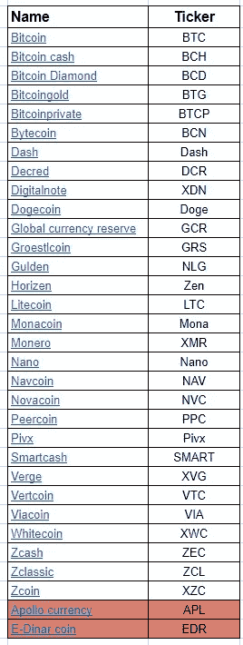
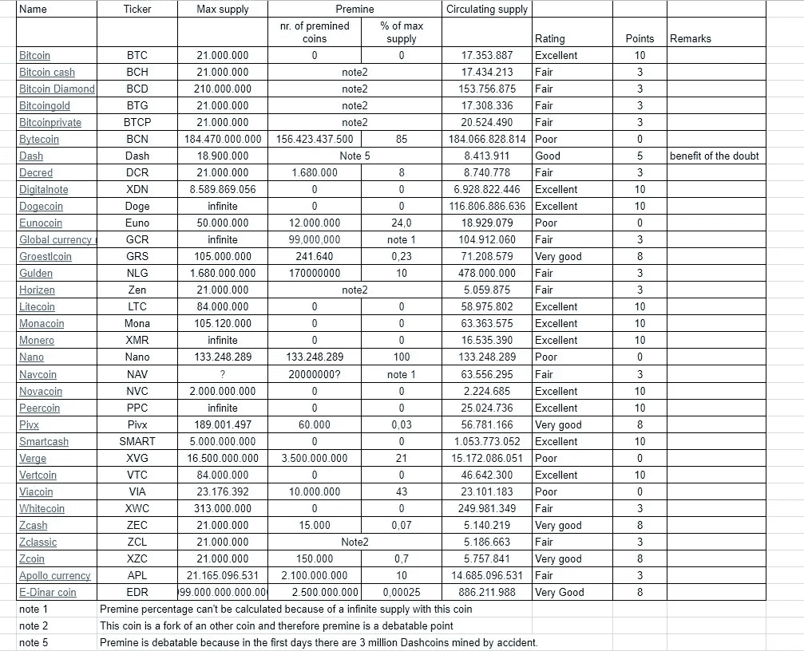

# 哪种加密货币将成为未来的支付系统

> 原文：<https://medium.com/coinmonks/which-crypto-becomes-the-new-payment-system-69f95b2d2ec3?source=collection_archive---------0----------------------->

([荷兰语版此处](/@aat.de.kwaasteniet/welke-crypto-wordt-het-nieuwe-betaalmiddel-5d617e9257a2) )
相当数量的加密硬币想要成为一种普遍可用的支付手段。有些人希望与欧元比邻而居，有些人希望取代欧元。哪种加密硬币拥有最好的纸张并做出了正确的设计选择？
在这项研究中，将从安全性、可用性、用户友好性、技术用户方面、维护等方面对有此意愿的 32 种加密货币进行检查和调查。它不看加密货币的市值或价值，而只看它们是否有能力作为一种支付手段来完成任务。

> [发现并回顾最佳加密支付软件](https://coincodecap.com/category/payment)

哪些加密货币参与其中？为此，对 Coinmarketcap 上首次提到的 350 种货币进行了检查，如果有问题的硬币的网站明确提到它们希望成为一种支付手段，硬币将被纳入此次调查。未包括 351–2079 位的货币，以在某种程度上限制工作量。也许这中间还有珠宝可惜:)
Coinmarketcap 只用于选择方法和数据来源。没有关注 Coinmarketcap 使用的排名方法。对这种方法的批评见这篇文章

结果是 32 枚硬币符合标准。大多数代币/硬币本身是一个促进其他功能的平台，因此不属于本研究的范围。这 32 个项目是:

除了最后两个，名单是按字母顺序排列的。这些硬币，阿波罗货币(APL)和电子第纳尔硬币(EDR)确实符合标准，但仔细看，这两种硬币似乎有太多的模糊性，他们被排除在参与。引人注目的是，还有 6 枚硬币参与其中，它们是另一枚硬币的叉。即 BCH、BCD、BTG、BTCP、禅宗、ZCL。BTCP 是 BTC 和 ZEC 的结合体。

一旦列表完成，所有硬币的具体特征被搜索并放入电子表格中。然后我们评估了硬币在下面将要讨论的七个主题上的得分。不同的硬币通过等级来评估:优秀:10 彭滕
非常好:8 彭滕
好:5 彭滕
一般:3 彭滕
差 0 彭滕
此外，给受试者一个价值系数，分数乘以该系数。这样做是因为某些主题被认为比其他主题更重要。当所有的分数加在一起，我们得到一个排名，看看哪个硬币最符合要求，以形成支付系统的手段。

# 安全

当然，对于一枚潜在的硬币来说，最重要的是它的区块链的安全性。最后，用户必须能够相信硬币不会被轻易破解，或者你会被轻易抢劫。因此，安全主题的价值系数也具有 3 的高值。
区块链可能遇到的安全问题例如是所谓的“双花费”、“51%攻击”、“自私挖掘”、“侧链挖掘”等。在这里讨论这类安全问题花费的时间太长了，但是在互联网上可以找到很多。

区块链的安全性取决于许多因素，例如哪个挖掘系统使用哪个协议，网络上有多少挖掘能力，执行 51%攻击的成本，在赌注期间钱包是否可以加密，以及是否有额外的措施，例如 masternodes 等。已经有人了。在一张标有标的证券评级的表格下面。备注栏包含所选评级的理由。请注意，PoS 的额定值略高于 power。

Table 1 Safety

# 有效性

这意味着加密货币是否容易购买。因为它必须成为一种普遍使用的支付手段，所以很重要的一点是，很容易有一条发行法定货币的短线，这样买卖过程就不必通过 BTC。与 BTC/加密硬币对有 100 次交换相比，存在法定/加密硬币对的交换数量更重要。
零平面/加密对自动导致“差”的 0 分分数。
超过 10 个可用的平面/加密对的得分为“优秀”,对应的分值为 10 分。
本科目的价值系数为 2。

Table 2 Availibility

# 使用与钱包相关的方面

如果一枚硬币想要吸引大众，钱包当然是吸引眼球的物品之一。如果加密硬币不关注自己开发的钱包，而是依赖第三方钱包，这是一个很大的缺陷。第三方钱包有一个很大的缺点，那就是你依赖于该方的连续性，以及当需要进行更新或类似操作时，它是否能做出充分的响应。这就是为什么自己的本地钱包比第三方钱包评级高的原因。因为你总是带着钱包，所以提供移动钱包也很重要。对于大多数硬币来说，桌面端还好，但移动钱包是瓶颈。尤其是 iOS 版本经常缺失。
另外，交易费用很重要。过高的费用将使小额支付成为不可能。幸运的是，所有硬币的交易费都很低，除了 BTC，BTC 要花几个点。
价值系数为 2。

# 使用的技术方面

在本主题中，我们将讨论事务时间。交易时间越短，得分越高。只有几枚硬币对此做了说明，如果没有提及，则使用 6 次确认的标准。
有两种假装直接交易的硬币。这些硬币可能会得分最高，这适用于 Nano，但对于另一枚硬币“智能现金”，限制因素是阻塞时间太快，这在原则上导致区块链出现故障。这在事务数量较少的情况下并不明显，但是如果块因为包含更多事务而变得更大，则会遇到区块链网络中的传播延迟问题。见下面的 [PDF](https://www.tik.ee.ethz.ch/file/49318d3f56c1d525aabf7fda78b23fc0/P2P2013_041.pdf) 。

> 简短的解释:
> 当一个新的区块被开采时，会用一个非常短的消息来宣布。如果一个节点注意到这是他的一个新块，他将请求下载它。然后他得到了可以很大的整个块(如果块不是 2kb 而是 2MB，数据传输速度会变慢(并不是这个星球上的每个人都有光纤)，然后他真的必须依靠数据。只有当这样做时，该节点才会将该块提供给对此时区块链中的最新块感兴趣的其他节点。如果您有一个包含 1000 个节点的大型网络，70%的节点将在 10 秒内更新，但 5%的节点将在一分钟后才知道最新的块。
> 如果 20 秒后，另一名矿工发现了一个具有相同“高度”的砖块，并射进了网络，那么你很有可能会在网络的一部分上拥有一个临时的软分叉。根据提到的 PDF，阻塞时间为 10 分钟的比特币每块有 1.7%的机会。更不用说如果阻塞时间短得多的话。
> 因此，决定将短于 1 分钟的时间封锁为一般或较差(封锁时间为 15 秒等。)来评估。

评估还应该包括网络可以处理的事务数/秒。但是，由于许多硬币无法获得这一数据，而其他人声称他们可以处理 1000 笔交易，但无法证明这一点，因为迄今为止最繁忙的网络每秒只能处理 3-4 笔交易，因此决定不将这一项目纳入评估。参见[这篇文章](/@aat.de.kwaasteniet/de-hype-van-tps-transacties-per-seconde-2192c2a9ae45)。
(仅限荷兰语)值系数为 2

Table 4 Usability tech-wise

# 可维护性

同样重要的是，你如何确信加密硬币将继续存在和发展。这就是为什么我们关注硬币存在了多长时间，以及在过去和去年对核心软件做了多少更改。那么开发者在核心软件的维护和新开发上花费了多少设计能力呢？一枚 2017 年以来才存在的硬币不可能取得最高分，因为历史太短，无法对其进行评估。
价值系数为 2。

Table 5 Maintainability

# 通货膨胀

对于一个运转良好的经济体系来说，总是需要少量的通货膨胀。

有了密码，这可以通过挖掘新硬币来实现。这是很重要的，这是做了一点剂量和整齐。然而，有通货膨胀率非常高的硬币，市场必须能够吸收所有这些涌入的新硬币。因为如果所有这些新开采的硬币被直接倾销到市场上，对市场来说是非常不利的。通货膨胀是根据“循环供给”的整体奖励计算的，而不是根据最大供给计算的。所选择的方法确保通货膨胀将随着时间的推移而降低，因此是参考日期为 2018 年 11 月的快照。但这种方法似乎比将通胀纳入最大供给更公平。
在这项研究中，假设健康的通货膨胀率至少为每年 0.5%，不超过每年 5%。因此，或多或少的价值较低。有通货膨胀率超过 50%的硬币。当然，这些最好不要评估。
通货膨胀的价值系数设定为 1。

# Premine

密码世界中的一个大项目是一枚硬币的首币。几年前，密码纯粹主义者甚至不认为以 premine 开头的硬币是完全成熟的。如今，随着一个又一个 ICO 的推出，关于溢价的想法变得更加微妙了。为了开发一个好的产品，一些资本当然是不可或缺的，而溢价可以为此形成一个良好的基础。当然，首要任务必须保持在一定的限度内，它本身当然不能成为目的。
溢价表示为硬币最大供应量的百分比，在本研究中评估如下:
0% =优秀
< 1% =非常好
< 5% =良好
< 15% =一般
> 15% =差
该主题溢价的价值系数设置为 1。

# 消极点

硬币上总会留下一些对硬币有负面影响的东西。因此，我们制作了一个决赛表，在这里可以计算“罚分”。
例如，许多硬币都非常关注用户的隐私和匿名性以及他们在区块链上的行为。但如果加密真的想成为一种支付手段，加密世界就无法逃脱监管。因此，不可避免的是，用户的隐私和匿名将受到攻击。如果将隐私/匿名作为其最重要的独特卖点的硬币，将永远无法充分发展，并将具有边缘化的存在。因此，具有-5 分的隐私焦点硬币被评估。

为了建立一个更安全的区块链，一些硬币通过引入中央主/超级节点牺牲了区块链的分散性。这种做法也被“罚”了-5 分。最后，加密世界希望成为中央控制的菲亚特世界的替代品。分散的解决方案有可能实现一个更安全的区块链，也许难度稍大，但分散了。那么，为什么选择简单的中心解决方案呢？

货币的透明度也很重要。如果硬币不能通过公共来源(例如网站)在它的行动中被发现，这也导致 5 个扣分。两枚硬币本身对信息不够敏感，因此不允许他们参与这项研究。

值系数设置为 1。

# 结论

当然，这项研究并不是一个完全客观的方法，因为它取决于所选对象的价值系数和每个对象的评级等。研究者是在感觉、知识和经验的基础上做出这一评估的。任何人都可以做出不同的评估，因为这项研究是公开的，任何人都可以通过 Googledoc 访问包含基本数据的电子表格，复制一份并做出自己的评估。
在这项研究中，某个特定硬币的粉丝不会在该硬币的某些估价中认出自己。此外，还可以说:“我硬币的这个或那个方面没有考虑进去”。不，这是真的，因为研究人员已经搜索了加密硬币的最低公分母，不能考虑非常硬币特定的方面。但是请记住，所有的硬币都是用相同的标准来评估的，不仅仅是你最喜欢的硬币与研究人员过于消极或过于积极的评估有关。

然而，这项研究很好地展示了不同硬币在这些领域的得分情况，这些领域对于成为普遍接受的支付方式很重要。

现在是最后的比分……鼓形辊:

我们看到 Dash 得分最高，像居尔登这样的小硬币排名第二。比特币排在第三位，之所以排在第三位，是因为它在交易费用和确认速度上的得分更低。
比特币的所有分支，如 Bitcoincash、Bitcoingold、bitcoincodimal 评分平庸到糟糕。显然，这些都是加密的，只是为了在分叉时给你一个利润。

# 有责任

本研究中使用的所有数据均来自公共来源。
已使用 2018 年 10 月下旬—11 月上旬的数据。
在这里你会找到一个链接，链接到[包含所有数据的电子表格](https://docs.google.com/spreadsheets/d/138AIWZZAko3gT5L6l5ELQnGQfSOFeHmPkouIkRWJQ7w/edit?usp=sharing)

重要的数据来源有:
[Coinmarketcap](https://coinmarketcap.com/)
[Bitcointalk](https://bitcointalk.org/)
[coin warz](https://www.coinwarz.com/cryptocurrency)
各种 cryptomenten
[网站的研究由克里斯蒂安·德克尔、罗杰·瓦腾霍夫](https://www.tik.ee.ethz.ch/file/49318d3f56c1d525aabf7fda78b23fc0/P2P2013_041.pdf)
[Bitinfocharts](https://bitinfocharts.com/)
[白皮书 PoW2](https://github.com/Gulden/gulden-official/raw/master/technical_documentation/Gulden_PoW2.pdf)
[Github](https://github.com)

其他可能与作者相关的文章有:
[好的、坏的、丑的，对加密硬币进行分类。](/@aat.de.kwaasteniet/the-good-the-bad-and-the-ugly-classifying-the-crypto-coins-9d192154579a)
[market cap 的废话](/@aat.de.kwaasteniet/the-nonsense-of-marketcap-8a2bacb70757)

> 加入 Coinmonks [电报频道](https://t.me/coincodecap)和 [Youtube 频道](https://www.youtube.com/c/coinmonks/videos)获取每日[加密新闻](http://coincodecap.com/)

## 另外，阅读

*   [复制交易](/coinmonks/top-10-crypto-copy-trading-platforms-for-beginners-d0c37c7d698c) | [加密税务软件](/coinmonks/crypto-tax-software-ed4b4810e338)
*   [网格交易](https://coincodecap.com/grid-trading) | [加密硬件钱包](/coinmonks/the-best-cryptocurrency-hardware-wallets-of-2020-e28b1c124069)
*   [密码电报信号](http://Top 4 Telegram Channels for Crypto Traders) | [密码交易机器人](/coinmonks/crypto-trading-bot-c2ffce8acb2a)
*   [Pionex 双重投资](https://coincodecap.com/pionex-dual-investment) | [AdvCash 审查](https://coincodecap.com/advcash-review) | [支持审查](https://coincodecap.com/uphold-review)
*   [面向开发者的 8 个最佳加密货币 APIs】](https://coincodecap.com/best-cryptocurrency-apis)
*   [拥护卡审核](https://coincodecap.com/uphold-card-review) | [信任钱包 vs MetaMask](https://coincodecap.com/trust-wallet-vs-metamask)
*   [赢取注册奖金——10 大最佳加密平台](https://coincodecap.com/earn-sign-up-bonus)
*   [最佳加密交易所](/coinmonks/crypto-exchange-dd2f9d6f3769) | [印度最佳加密交易所](/coinmonks/bitcoin-exchange-in-india-7f1fe79715c9)
*   [面向开发人员的最佳加密 API](/coinmonks/best-crypto-apis-for-developers-5efe3a597a9f)
*   最佳[密码借贷平台](/coinmonks/top-5-crypto-lending-platforms-in-2020-that-you-need-to-know-a1b675cec3fa)
*   杠杆代币的终极指南