# 哪些 cryptos 表现更好？

> 原文：<https://medium.com/coinmonks/which-cryptos-outperform-fdf25f4db12c?source=collection_archive---------5----------------------->

# 背景

我搜索了一会儿，只找到了[一篇关于不同类别 cryptos](https://hackernoon.com/cryptoasset-classification-and-in-depth-analysis-of-crypto-sectors-historical-growth-675b0af8660b) 性能的研究。不同类别的密码在市场上的表现如何？这对区块链项目投资者意味着什么？这些问题在过去的一个夏天一直激励着我。

利用来自[硬币市值](https://coinmarketcap.com)的历史交易数据和来自[密码板](https://cryptoslate.com/coins/)的分类数据，我建立了[这个在线跟踪和分析系统](https://bpeople.io/market)，它帮助我跟踪每个密码类别的表现。我将在下面展示我的一些发现，同时非常欢迎你使用这个平台做更多的分析。

# 方法学

该数据库包括从 2013 年 4 月起[硬币市场基金](https://coinmarketcap.com/historical/)提供的所有历史交易数据。类别和密码的完整列表可以在[这里](https://bpeople.io/crypto)找到。

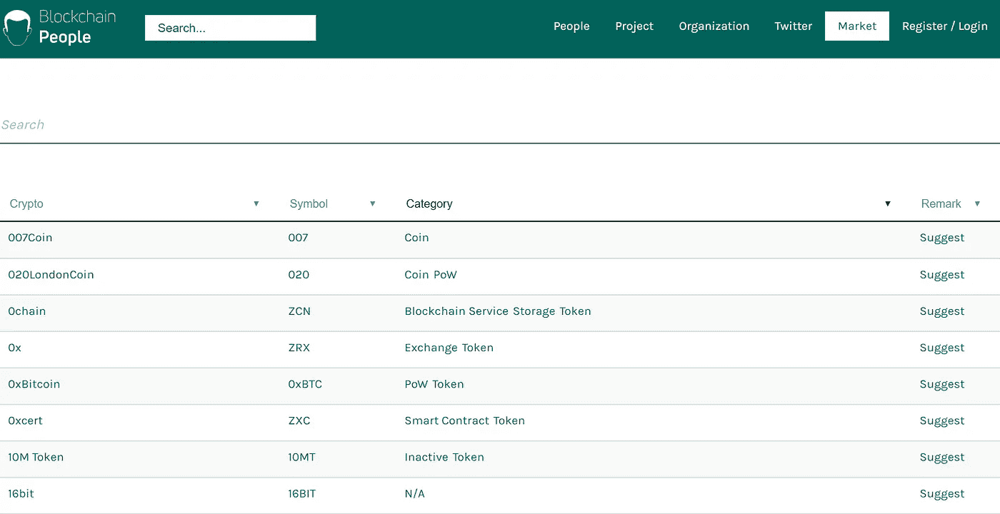

要了解市场对特定类别密码的反应/预期，可以考虑几个指标:

**(1)总品类市值** **—所有密码**:这是很多人会去考察的第一个指标。总市值反映了有多少资金流入市场，并表明人们对这一垂直市场的积极态度。例如，即使所有密码的总市值在 2018 年 1 月后都在下降，但 stablecoins 的总市值却在不断增长，这表明市场仍然对密码作为交易手段的未来持积极态度。

**(2)总类别市值—仅主导密码**:并非每个密码都相等。对于某些类别，可能会有一个很长的尾巴，它只占该类别市值的不到 5%。为了过滤掉垃圾密码，我根据以下定义选择了优势密码:**如果一个密码在任何日期对总市值的前 95%有贡献，则该密码是优势密码。**例如，您可以按市值从大到小订购任何日期的所有密码。然后你将市值累积到当天总市值的 95%。在任何一天，所有贡献这 95%市值的密码都被称为主导密码。

**(3)平均密码市值**:这是通过将总市值除以该类别中密码的数量来计算的。这一指标反映了该类别中即将推出的新密码的潜在市场价值。

**(4)平均交易量**:平均每个符合条件的密码的交易量。此指标反映了特定类别/加密的流动性。

**(5)密码数量**:这将反映宣传在哪里，以及人们正在开发什么区块链应用程序。

这些指标都不能告诉我们一个稳定的未来。然而，它们将帮助我们至少了解人们最关心的问题。例如，stablecoins 市值的显著增长表明，由于其高波动性，cryptos 作为交易媒介的用途以前没有完全实现。另一个例子，隐私密码的出色表现表明，人们认为隐私是一个迫切/重要的问题，应该为密码妥善解决。

# 调查的结果

**1。交易、金融服务和隐私是前三大主导密码类别**

根据历史数据，截至 2018 年 9 月 27 日，共有 **165 个主导密码**，根据定义，这些密码一度贡献了前 95%的市值。但是，自从比特币存在以来，有**3317 个密码**。也就是说，粗略地说，5%的 crypto(165 家)控制着 95%的市值。这种长尾表明大多数密码没有什么价值，在整体市场水平上进行分析不会有多大帮助。

在 165 个主流密码中， **10 个是为交换而发明的**(例如 BitShares)**9 个用于金融服务**(例如 OmiseGO)**9 个专注于解决隐私问题**(例如 Monero)**8 个是为市场开发的**(例如 popular)**7 个来自游戏**(例如 game credits)**其他类别包括:**AI**(4)**身份**(4)**软件**(4)**社交**(4)**娱乐**(3)**存储**(3)**广告**(2)**物联网**(2)**预测**(2)**区块链服务** (1)

一个品类中占主导地位的密码数量越多，说明这个垂直领域很重要，未来很有前景。相反，较低的数字意味着一些密码偶然进入列表，或者垂直高度集中(例如 Stablecoin)。**

**2。隐私是一个大问题** 
与所有其他类别的密码相比，隐私几乎总是保持最高的市场价值，无论主导/非主导密码如何。

截至 2018 年 9 月 23 日，隐私密码的市值约为 35.24 亿美元，占 28 个密码总市值的 1.53%(9 个占主导地位的隐私密码为 34.50 亿美元)。

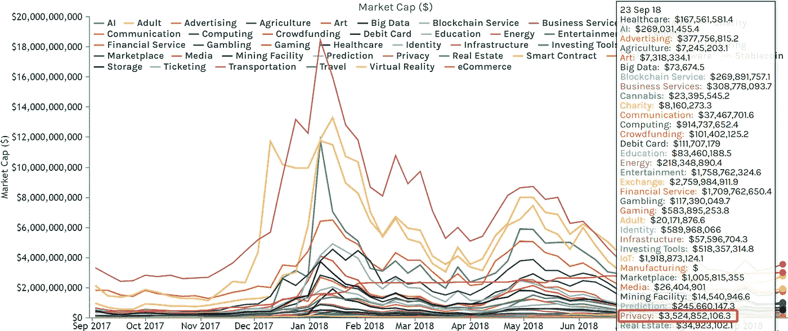

Market Cap of Different Categories — All Cryptos (By Fan Wen)

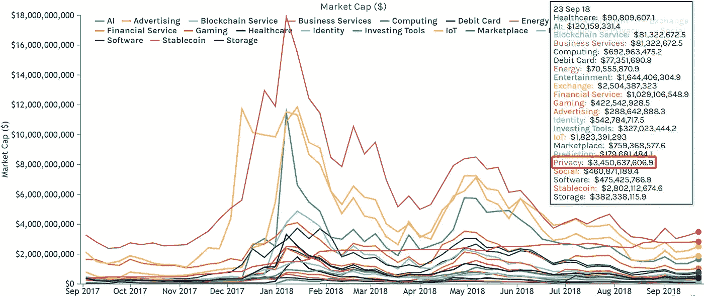

Market Cap of Different Categories — Dominant Cryptos Only (By Fan Wen)

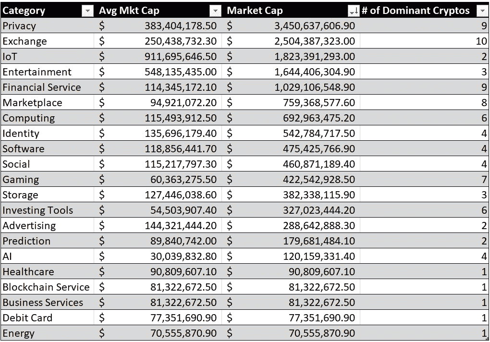

Market Cap of Different Categories — Dominant Cryptos Only (By Fan Wen)

在密码层面，9 个占主导地位的**隐私**密码也优于大多数占主导地位的密码类别，平均市值为**3.83404 亿美元**，仅低于**物联网(9.11695 亿美元)**、**娱乐(5.48135 亿美元)**和**stable coin(28.02 亿美元)**。然而，物联网(2 个优势密码)、娱乐(3 个优势密码)、稳定币(1 个优势密码)可能比隐私更集中。这几类的突出表现可以和具体的项目有关。

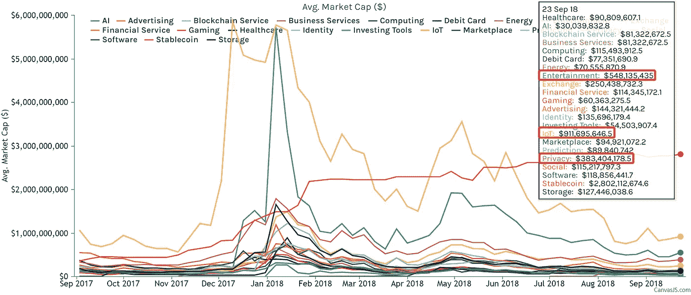

Average Market Cap of Different Categories — Dominant Cryptos Only (By Fan Wen)

19.18 亿美元和 17.58 亿美元的市值(包括所有 crytos)，低于隐私类别，物联网和娱乐类别分别拥有 2 个和 3 个主导 crytos。**我们可以进一步确认物联网和娱乐品类的集中度**，因为:(1)物联网和娱乐的总市值低于隐私；(2)这两个类别的显性密码数量低于隐私密码数量；(3)物联网和娱乐领域的主导密码的平均市值高于隐私领域。

在主导领域，物联网和娱乐密码的平均市值更高。而在整体市场上，我们可以发现隐私密码的平均市值高于物联网和娱乐密码。这一事实表明，隐私类别中潜在的**垃圾密码更少，并且**隐私密码可能比物联网和娱乐密码更有机会获得更高的市场价值**。**

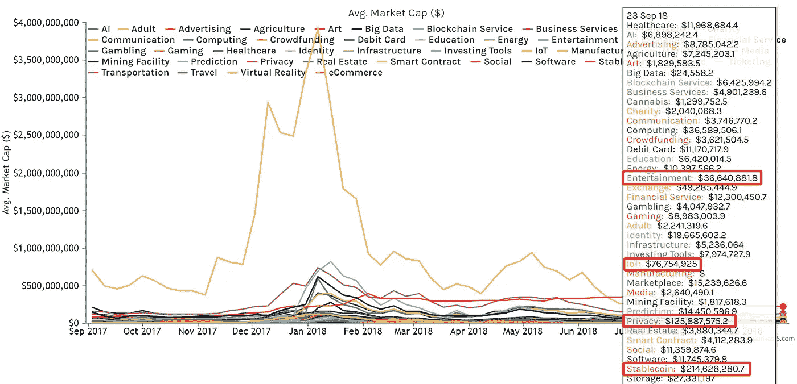

Average Market Cap of Different Categories — All Cryptos (By Fan Wen)

从交易角度来看，我们还可以看到隐私密码的表现优于包括物联网在内的大多数其他类别。娱乐密码(主导或非主导)的平均交易量略高于隐私密码。然而，**隐私类别有 28 个密码，其中有 9 个主导密码**，而**娱乐类别有 48 个密码，其中只有 3 个主导密码**。

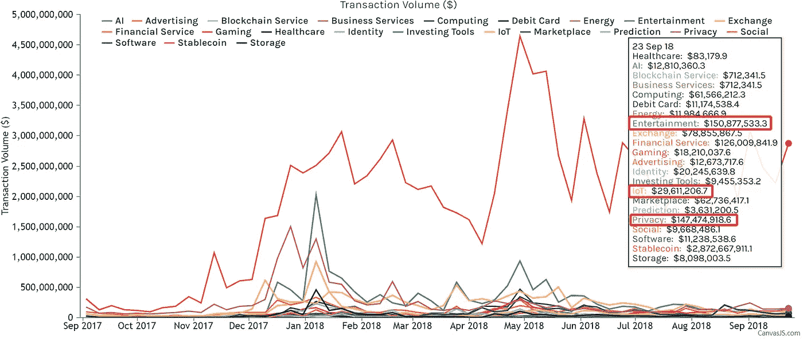

Average Transaction Volume of Different Categories — Dominant Cryptos Only (By Fan Wen)

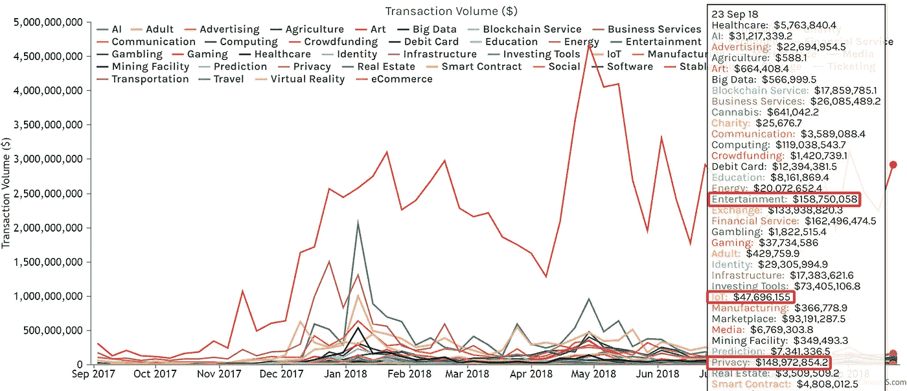

Average Transaction Volume of Different Categories — All Cryptos (By Fan Wen)

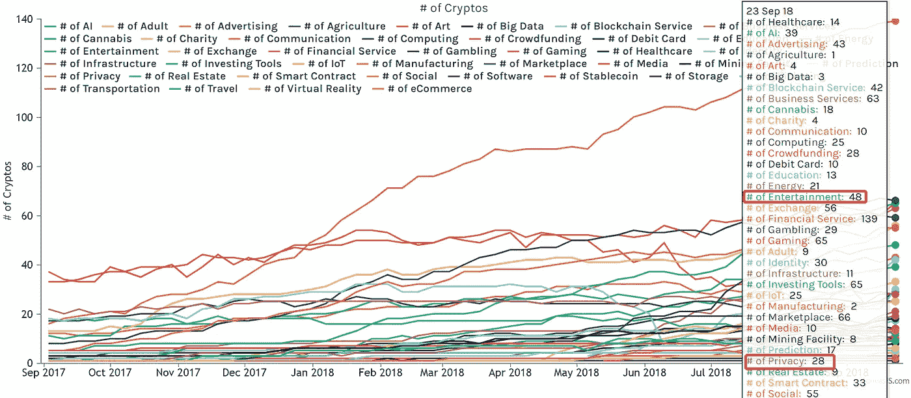

Number of Cryptos from Different Categories — All Cryptos (By Fan Wen)

综上所述，根据历史，**我们可以相对安全地得出结论，隐私密码有更高的机会成功**，因为:

(1)隐私密码具有最高的市场价值(主导和非主导)；

(2)隐私密码的平均市值较高，但集中度不高；

(3)隐私密码交易量高，但集中度不高；

(4)隐私密码更有可能成为显性密码。

**3。波动性正在存在并需要得到解决**

根据图表，我们总能在萎缩的市场中发现奇怪的增长。**stable coins 的市值从 2017 年 9 月增长了 718.94%，达到今天的 30.04 亿美元。**总体而言，其他类别的市值和交易量不断下降，而稳定的收入几乎总是在增长。

这种惊人的增长清楚地表明，市场需要解决不同密码的波动性问题，这些密码将被用作日常交易工具。不解决波动性，没有人愿意在日常生活中使用委内瑞拉玻利瓦尔和土耳其里拉这样的货币。

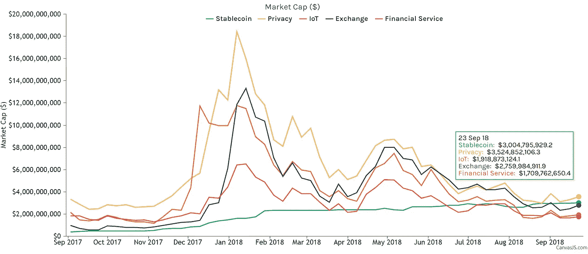

Market Cap of the Top Categories — All Cryptos (By Fan Wen)

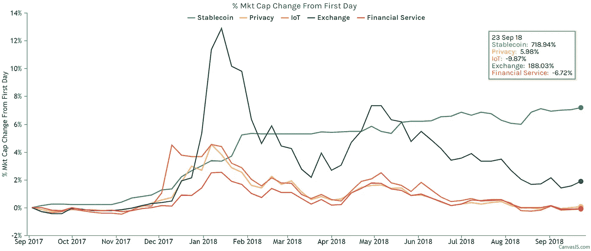

Market Cap Growth of the Top Categories from September 03, 2017 — All Cryptos (By Fan Wen)

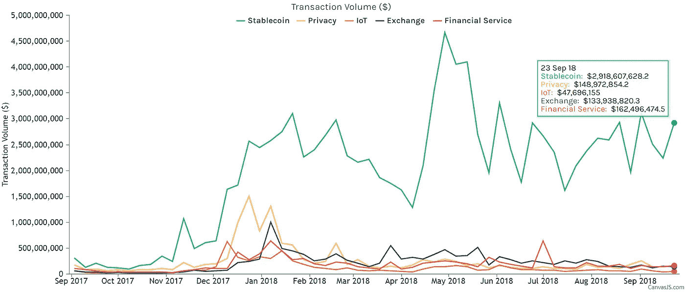

Transaction Volume of the Top Categories from September 03, 2017 — All Cryptos (By Fan Wen)

然而，围绕 stablecoins 还有一些未解决的问题。根据 Consensys 的说法，与美元挂钩(或与法定货币挂钩)的稳定货币(如唯一占主导地位的稳定货币系链)有以下局限性:

> 集中式:单点故障，这是增加的风险源；
> 
> 不透明:难以信任，甚至不可能信任。此外，实际成本和流程不透明，而且由于需求高峰管理不善，可能会导致更高的费用和延误；
> 
> 不保证持有资金或赎回代币；
> 
> 间接成本:存储、运输、审计、法律等。

此外，[许多人甚至怀疑](https://www.nytimes.com/2017/11/21/technology/bitcoin-bitfinex-tether.html) Tether 实际上是部分储备，并不像他们声称的那样持有菲亚特的全部股份。

除了法定挂钩的稳定货币，加密挂钩的稳定货币和铸币税份额稳定货币有更多的限制(见[这里](https://media.consensys.net/the-state-of-stablecoins-2018-79ccb9988e63)和[这里](https://hackernoon.com/stablecoins-designing-a-price-stable-cryptocurrency-6bf24e2689e5))。

Tether 的未来尚不明朗，然而，对可靠的分散稳定的加密货币的迫切需求已经存在。

**4。炒作/增长不一定意味着机遇**

总的来说，成长意味着机遇。然而，我们只想要健康的生长。**密码类别的健康发展定义如下**:

(1)整体增长不是由一两个隐花的增长导致的；

(2)增长并不主要是由于隐花数量的增加。

如果我们从 2017 年 9 月 3 日开始研究市值的百分比变化，一些类别可能看起来真的增长很快，很有吸引力。就市值而言，人工智能、商业服务、娱乐、采矿设施、房地产和软件类别在去年实现了 10 倍以上的增长。即使当你研究该类别中 cryptos 的平均市值变化时，你也会得出相同的结论。

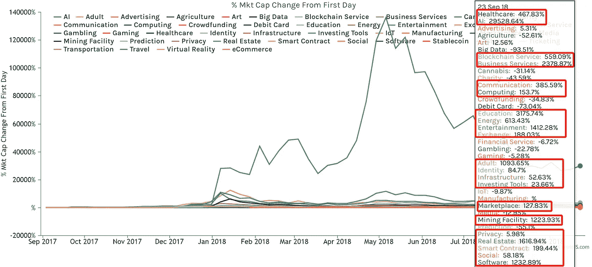

% Market Cap Change from September 03, 2017 — All Cryptos

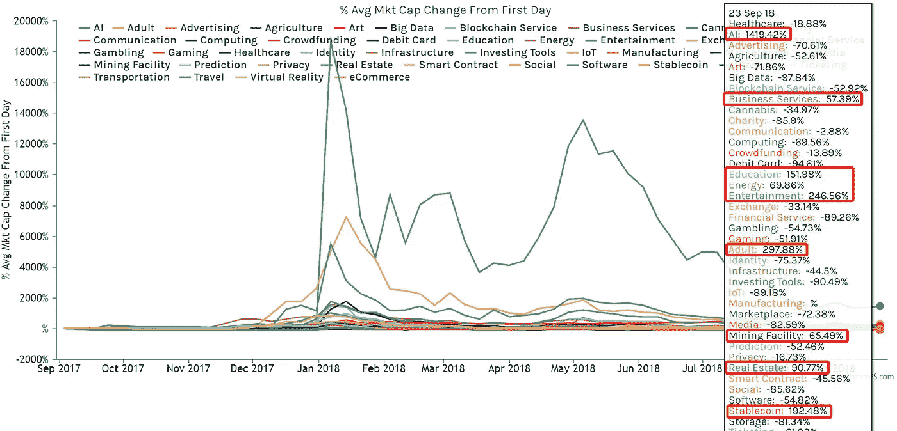

% Average Market Cap Change from September 03, 2017 — All Cryptos

然而，这些生长大多数根本不健康。当我们回到占主导地位的密码列表时，我们会意识到这些类别中很少有密码(娱乐除外)在市场上占主导地位。事实表明:**这些类别的增长主要来自不断增加的新低市值项目**，这些项目波动很大，人们称之为“垃圾币”。例如，2017 年 9 月有 1 个 AI 相关的 crypto，2018 年 9 月有 39 个 crypto。在这 39 个人工智能相关的密码中，只有一个密码曾经贡献了前 95%的市值。

相反，如果我们研究 2017 年 9 月 3 日以来占主导地位的 cryptos 的平均市值变化百分比，我们会发现

**(1) 9 个主导的隐私密码实现了 17.46%的增长，而在过去一年中仅引入了 6 个新的隐私密码(从 22 个增加到 28 个)；**

**(2) 3 家主导的娱乐密码实现了 544.25%的增长，在过去一年中引入了 37 家新的娱乐密码(从 11 家增加到 48 家)；**

**(3)过去一年，10 家占主导地位的交易所上市公司实现了 29.35%的增长，43 家新交易所上市公司上市(从 13 家增加到 56 家)；**

**(4)占主导地位的物联网密码和金融服务的市值实际上在去年有所下降；**

**(5)占主导地位的医疗保健密码的急剧增长来自一个密码(Dentacoin)。**

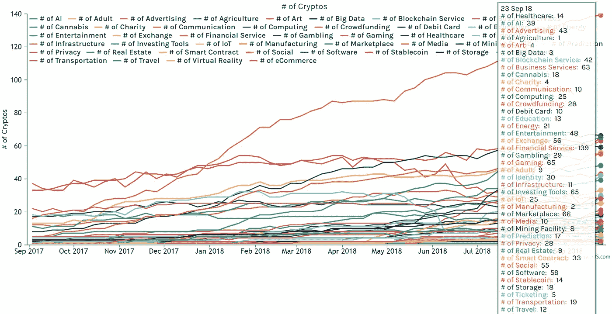

# of Cryptos from Different Categories — All Cryptos

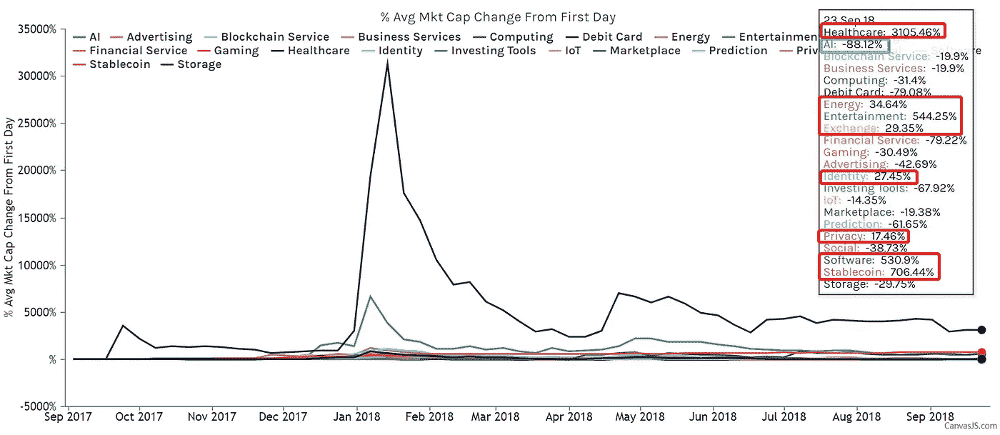

% Average Market Cap Change from September 03, 2017 — Dominant Cryptos

从这种增长分析中，我们不仅可以看到不同类别的增长质量，还可以进一步证实隐私密码比其他类别更健康，因为:(1)增长是由 9 个主导密码而不是一个或两个主导密码导致的；(2)这种增长并不是由新密码数量的增加造成的。

# 结论

1.  **不是每个密码都相等。**3，317 个密码中的 5% (165 个)控制着总市值的 95%。在 165 个占主导地位的密码中，大多数来自交易所、金融服务、隐私、市场、游戏、计算和投资工具。
2.  **隐私问题。**隐私密码在总市值、平均市值和主要密码数量方面都优于大多数其他类别。此外，隐私类别的增长比其他类别更健康。
3.  需要更好的稳定硬币。稳定点正在急剧增长，而单点故障等某些问题尚未完全解决。
4.  **只追逐健康成长。**去年类别中的大部分增长来自于一两个主要加密公司的增长或越来越多的新低市值加密公司。这些生长物没有什么价值，而我们应该只喜欢健康的生长物。

这个研究项目是由耶鲁大学管理学院的范文和我们中心的 T2 合作完成的。

*免责声明:本文不是也不应被视为“投资建议”或关于行动方案的“建议”，包括但不限于任何适用法律或法规中使用的术语。*

# 附录

截至 2018 年 9 月 27 日，主要密码的完整列表

> **Token (85)** :奥格、MaidSafeCoin、假人、SingularDTV、Gnosis、基本注意力 Token、DigixDAO、Ardor、Iconomi、Tether、Veritaseum、Status、MCAP、OmiseGO、TenX、Populous、Civic、Metal、0x、币安币、Nebulas、Gas、Kyber Network、SALT、Waltonchain、ChainLink、Power Ledger、ICON、VeChain、WAX、FunFair、KuCoin Shares、Dragonchain、Kin、Dentacoin、Dent、Loopring、Ethos、qa CyberMiles、BnkToTheFuture、All Sports、Matrix AI Network、Nexo、Nuls、赫萝、iExec RLC、DeepBrain Chain、MOAC、Theta Token、Bibox Token、Dropil、分散地、Pundi X、Aurora、PayCoin、Tether
> 
> **Coin (70)** :比特币、莱特币、Ripple、Peercoin、极光币、BitShares、Dogecoin、Dash、以太坊、NEM、Steem、以太坊经典、Monero、Zcash、PIVX、Stratis、BitConnect、Decred、Factom、Stellar、Waves、Bytecoin、GameCredits、DigiByte、IOTA、Komodo、NEO、Nxt、EOS、Qtum、比特币现金、Hshare、Ark、Nexus、Cardano、TRON、MonaCoin、Vertcoin
> 
> **PoW (43)** :比特币、莱特币、Peercoin、Auroracoin、Dogecoin、Dash、以太坊、以太坊经典、Monero、Zcash、BitConnect、Decred、Bytecoin、Siacoin、GameCredits、DigiByte、Lisk、Komodo、比特币现金、Hshare、MonaCoin、Vertcoin、Bitcore、比特币黄金、Verge、ZCoin、Syscoin、经验值、BitcoinDark、ZClassic、Enigma、Emercoin、Cryptonex、比特币钻石
> 
> **PoS (33)** : Peercoin、BitShares、Dash、Steem、PIVX、Stratis、BitConnect、Decred、Factom、Waves、Lisk、Komodo、NEO、Nxt、EOS、Qtum、Hshare、Ark、Nexus、Cardano、TRON、Nano、ReddCoin、Experience Points、BitcoinDark、SmartCash、Emercoin、Neblio、Particl、Wanchain、WaykiChain、Achain、Tezos
> 
> **交易所(10)** : BitShares、0x、币安币、凯博网络、ICON、KuCoin 股份、Loopring、Cobinhood、Wanchain、火币 Token
> 
> **金融服务(9)** : OmiseGO、TenX、金属、盐、请求网、Wanchain、Nexo、Bibox Token、Pundi X
> 
> **Privacy (9)** : Monero，Zcash，PIVX，Bytecoin，Verge，ZCoin，ZClassic，Particl，ZenCash
> 
> **market place(8)**:popular，WAX，Syscoin，Particl，SingularityNET，Ontology，Centrality，CyberMiles
> 
> **游戏(7)** :游戏积分、蜡像、游乐场、经验点、秘银、织机网络、分散地
> 
> **计算(6)** :假人、底层、aelf、本体、iExec RLC、DeepBrain Chain
> 
> **投资工具(6)** : Iconomi、Cindicator、Polymath、Bancor、BnkToTheFuture、Dropil
> 
> **AI (4)** :奇点网，皮层，矩阵 AI 网络，深脑链
> 
> **身份(4)** :思域，ICON，Syscoin，元宇宙 ETP
> 
> **软件(4)** :链环、中心性、赫萝、Pundi X
> 
> **社交(4)** : Steem，ReddCoin，Mixin，Loom 网络
> 
> **娱乐(三)** : SingularDTV，TRON，Theta Token
> 
> **存储(三)** : Siacoin，GXChain，Dropil
> 
> **广告(2)** :基本注意力令牌，秘银
> 
> **IoT (2)** : IOTA，Waltonchain
> 
> **预言(2)** :预兆、灵知
> 
> **区块链服务(一)**:极光
> 
> **商业服务(1)** :极光
> 
> **众筹(1)** : PayCoin
> 
> **借记卡(1)** : TenX
> 
> **能源(1)** :电力台账
> 
> **医疗保健(1)** :登达康宁
> 
> **稳定环(1)** :系绳
> 
> **未分类(3)** :道、圆、字节球字节