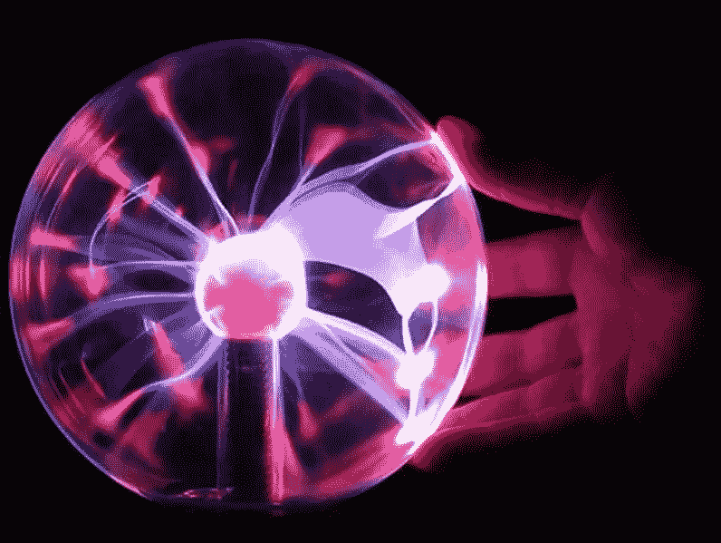

# 哪种加密哈希方法是一种气体……它会像你想要的那样慢，并且会破坏 GPU？

> 原文：<https://medium.com/coinmonks/which-hashing-method-is-a-gas-and-is-as-slow-as-you-want-29f3aed19fcd?source=collection_archive---------6----------------------->

## 旨在击败 GPU 的哈希方法

## 介绍

您是否知道，在 GPU 设备上，每八个字符的密码(小写)都会在不到 10 秒的时间内被暴力破解？如果您使用九个字符的密码，不到 10 分钟就可以…