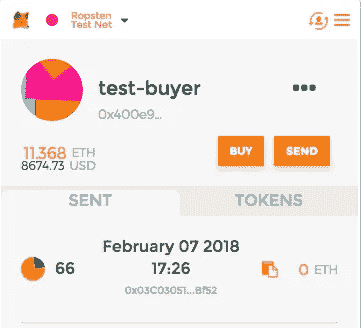

# 白皮书和演示:UX 使用 MetaMask 和 EthSigUtil 进行认证和验证的 ERC20 支付

> 原文：<https://medium.com/coinmonks/whitepaper-and-demo-ux-for-authenticated-verified-erc20-payments-using-metamask-and-ethsigutil-7a146afcd65e?source=collection_archive---------2----------------------->

下面是 TLDR 版本的演示和截图。
开源例子: [Erc20 数字签名验证](https://github.com/emmonspired/erc20-digital-signature-verify)

**除非我们执行** [**#BUIDL**](https://steemit.com/trending/buidl) **的方法来增加采用率，否则这些加密的东西都不重要。**

*在 Angular* 等现代 Web 框架中，使用数字签名、带 MetaMask 的椭圆曲线加密、EthJS 和 EthSigUtil 验证&接受 Ether & ERC20 支付的愉快用户体验

**摘要**:接受以太网和 ERC20 令牌形式的支付仍然是一个挑战，因为浏览器在设计时没有内置身份和支付机制。一般来说，那些销售产品的人希望进入更广阔的全球市场，但仅限于信用卡和贝宝支付，这需要许可的系统和可能的付费 API 来工作。此外，当决定处理客户付款时，有一些困难的问题需要解决，包括核实谁实际进行了付款。这就是 MetaMask+EthJS+EthSigUtil 的用武之地。这个建议的解决方案包括 3 个步骤的技术工作流程，并且它是一个令人惊讶的令人愉快的用户体验:1)通过用 personal_sign 数字地签署一个挑战短语，向站点注册一个公共地址。对散列消息的签名是在链外执行的，以防止选择的密码和重放攻击 2)服务器端 personal_ecRecover 用于验证数字签名是由地址创建的 3)通过让用户容易地访问您站点上的钱包中的令牌和/或乙醚来允许接受支付。即使您不想用这种方法管理客户会话，它也能有效地解决接受加密付款的问题，并能够验证一个人说他们确实向您付款了。本文档底部包含并链接了一个完整的演示来演示这一过程。它使用 meta mask+EthJS+EthSigUtil+truffle box+Angular components。在这一切的基础上，我们使用椭圆曲线加密。

**简介**:您希望接受 Ether 和 ERC20 代币作为服务付款，但您无法与用户进行 KYC，因为这种类型的付款从根本上来说是分散的，它绕过了整个银行基础设施。这是有意的，避免了中央集权。此外，您可能没有财力与银行建立业务关系，也没有法律权利与支付处理商建立 API 访问。这提出了一种使用签名验证数字身份支付的解决方案。然后，您可以使用该公共地址将付款与您网站上的客户相关联。

**挑战**:加密货币和数字“公用令牌”的交易记录在全球开放的区块链上，你可能会让人扫描发送到你的智能合约或指定钱包地址的交易。一个公开、开放、分散的账本有很多好处，但系统中也可能有不良行为者，他们希望做出虚假声明，声称是他们支付了你，而不是实际支付你的人。这是多个层面的问题。通过调查和追踪 IP 以及事后发现证据来抵御虚假索赔需要时间，以便确定加密货币/代币支付的实际发送者是谁。这一考古努力充满了错误，特别是如果真正的付款人采取预防措施，通过错综复杂的虚拟专用网匿名他或她的位置。即使在浪费了宝贵的时间调查情况后，您也可能会将购买归功于错误的用户。这将导致你失去一个客户，并可能最终退款给错误的个人。

**可能的方法(拒绝-传统/集中)**:当用户在您的服务中建立帐户时，您为该用户生成一个新地址，以接受令牌并将其发送到销售点。不幸的是，这意味着您必须跟踪新的私钥，以及用户到帐户密钥的映射。这既混乱，随着时间的推移，每笔付款都呈几何级数增长，而且很难跟踪。更糟糕的是，您的集中式服务器成为 DDoS 和安全攻击的目标。出于这些原因，我拒绝这种方法，并建议采用一种新的范式来接受支付和处理加密货币/ ERC20 令牌支付。

**提议的解决方案(新模式/分散式)**:逆转安全模式。尽可能少地存储关于客户的信息。只存储他们的公共地址。这将如何工作？当用户输入他们的地址时，发出一个强密码挑战。向用户发送一条必须经过数字签名的唯一随机消息。该消息对用户来说将是清晰可见的，这使得用户确信他们不是带着不正当的意图签署交易。然后，该消息被发送到一个单向散列中，由未锁定用户的帐户在他们自己的设备上使用随机数和私钥进行数字签名，输出是发送到发出质询的服务器的数字签名。服务器使用椭圆曲线加密来恢复用于签署消息的地址，并将恢复的地址与预期的结果进行比较。

**是什么让这成为可能**:我们已经拥有了实现这一目标的所有工具。ECDSA 技术自 20 世纪 90 年代初就已经存在，然而，许多现代浏览器仍然没有内置于平台中的支付身份。一种名为 MetaMask 的产品为用户提供了一种极其简单的方法来安全地存储加密密钥对。有了 Chrome 上的这个浏览器扩展，一个选定的帐户就充当了“可用”地址，被注入到一个支持 Web3 的网站中。如今，我们将支持 Web3 的网站称为 Dapps 的前端 UI，Dapps 是一种与以太坊这样的去中心化区块链一起工作的应用。自比特币协议和开源软件通过最受欢迎的开源平台 Github 问世以来，还有大量其他开源工具可供使用。我们将依赖几个可用的框架，尤其是 Web3JS、EthJS 和 eth-sig-util。出于演示的目的，我们将使用 OpenZeppelin、TruffleFramework、Angular 和 Node 以及它们的依赖项。

**为什么它如此强大**:通过以一种非常用户友好的方式向用户提供密钥对，它使得加密货币、代币支付以及数字签名变得非常容易使用。您不再需要成为一名技术专家，拥有基于控制台的应用程序和一组复杂指令的专业知识，就可以执行作为公钥/私钥加密核心的基本安全操作。

***数字签名*** 提供了一种不可否认的方式来验证只有私钥的所有者才有可能签署特定的消息。1)您可以要求用户现在或在将来的任何时候在销售点实时识别自己的身份。2)您可以存储由用户签名的消息签名，并拥有 100%不可否认的证据证明该用户创作了它或在某个时间点拥有它。这对于分配所有权记录或维护合同和最终用户许可协议特别有用。3)因为签名的消息首先被发送到单向加密哈希中，所以您可以验证数据没有被以任何方式操纵。哈希函数具有展现以下特性的特性:A)不可逆；从摘要中确定消息在计算上是不可行的，B)抗冲突；找到一个以上的消息来提供给定的摘要是不切实际的，以及 C)高雪崩效应；任何微小的变化都有重大的消化变化。

在所提出的解决方案中，签名不需要以太。签名可以在不使用公共区块链的情况下执行，这意味着对已签名消息的重放攻击是不可能的，从而防止用户看起来像某个特定的用户，并且您可以通过让数字签名验证服务器向用户发布 cookie 来保持登录来扩展这一思想。

**顾虑**:依赖公开密钥加密意味着用户必须像保护自己的钱一样保护自己的身份。他的私钥成为他的身份。如果用户丢失了自己的私钥或受到威胁，就无法阻止其他用户代表他们从该地址进行支付。用户仍然必须使用与网站交互的传统方法来重新建立新的支付地址。由于我们在这个解决方案中处理的是支付方式，而不是完全成熟的身份和登录，所以我们不会像处理网站身份灾难性丢失那样遭受重大后果。

***这并不完全是新的；这有什么特别的？*** 真实。自 1994 年以来，我们已经有了这种密码可证明的 EC 方法，其中 y^2 = x^3 + ax + b。我们已经有了像 BitID 这样的工具，依赖于电子商务的公钥加密。现在的不同之处在于，我们终于拥有了让端到端用户体验更加干净、无缝和愉快的工具。必须是尽可能无痛的用户体验。这将使我们能够更广泛地采用加密货币和 ERC20 令牌进行支付。使用二维码并不理想，更不用说长时间盯着看了。它们很难看，几乎不可能用视觉来验证准确性。

**简单前提**:安装 Metamask.io Chrome 插件。MetaMask”是一座桥梁，让你今天就能在浏览器中访问未来的分布式 web。它允许在不运行完整节点的情况下访问 dApps。用户安全地管理身份和交易。首次安装和启动 MetaMask 时，用户会得到一个 12 个单词的种子短语来恢复在 MetaMask 中创建的帐户。用户可以切换帐户或添加新帐户。私钥存储在本地并被加密；它们不会离开应用程序，也不会被发送到服务器。当用户在浏览器中执行一个要求对事务进行签名的操作时，它会要求 Web3 发送一个事务，并提示 MetaMask 进行确认；用户接受。用户不需要与以太网同步，因为节点是由 Infura 远程维护的。

*   元掩码不是硬性要求；任何支持 personal_sign 和 personal_ecRecover 方法以及直观的 UX 的可注入 Web3 提供程序都可以。我们使用这些方法而不是 eth_sign 和 eth_ecRecover 来防止选择密码攻击。

**工作流程** : 1)用户在安装了 MetaMask 并选择了账户的情况下，为 Ether 或 ERC20 代币添加支付方式。2)网站用可读文本以及可见文本中的随机消息“挑战”用户。用户同意继续签名。3)后端服务器使用椭圆曲线函数发送数字签名并恢复签名者使用的公共地址。4)恢复的签名和期望的签名的匹配是验证用户是他们所说的那个人所需要的全部。5)可选地存储该数字签名作为接受 EULA 协议的证明。6)允许在 dApp 的 UI 上显示钱包信息以发送令牌。

**反响**:如今，任何提供电子商务的网站都可以提供 Ether & ERC20 兼容代币作为支付方式。无论你是一家大型跨国企业集团，还是一个坐在家里幻想出一个分散平台来颠覆在线市场的孩子，这项技术都将发挥作用。这项技术有着非同寻常的含义。你可以很容易地接受来自世界各地的付款，而不需要像 Paypal 这样的服务。你不需要和银行建立关系。您不需要存储客户的个人信息。这是一种颠覆电子商务的新范式，尤其是在购买数字资产或知识产权方面。

演示:这是它在实践中的样子。这个项目的目的是展示现有的大多数 web 应用程序现在是如何开始这样做的。尚未设置用户界面的样式；没有必要在这上面浪费时间，因为每个应用程序都已经有了自己的风格和品牌。任何需要提示用户取消或接受完全透明的数字签名质询的交互都将依赖于 MetaMask 浏览器扩展的使用。

开源例子:[https://github . com/emmonspired/ERC 20-数字签名-验证](https://github.com/emmonspired/erc20-digital-signature-verify)

# 认证/验证示例

*用户签署显示给用户的随机消息。该消息经过哈希处理，然后由 Web3 提供商(如 MetaMask)进行数字签名。在未来，这可能是一些其他的提供者，他们实现了像 Ledger / Nano 这样的 personal_sign，或者甚至使用像 MyEtherWallet.com
*示例代码这样的第三方站点进行签名，该代码在椭圆曲线 personal_ecRecover 函数中获取数字签名并从中提取信息，以不可否认地验证特定的地址签名者。

# 浏览器中的钱包注入

*   连接到 Web3
*   显示钱包/帐户信息
*   发送 ERC20 令牌的能力(改进的潜力:应用程序可以向用户显示一个随 ETH/USD 或 ETH/Token 的市场价值波动的金额，或者一个固定的价格，而不是由用户指定要发送多少令牌。

不包括:演示开放源代码中的改进空间

*   节点/Java 后端；我们在这里通过点击一个按钮来模拟验证步骤，但是它得到了整个要点，并演示了验证所需的输入/输出。
*   如何处理后端付款，区块链交易确认后。

依赖项:技术栈包括但不限于:
Truffle Framework，Truffle box:LimelabsTech/limelabs-Angular-box
Angular，SCSS，Typescript，Async/Await，Bootstrap3，Axios
Web3js，EthJS，EthSigUtil

这些依赖关系提供了一个用户驱动的工作示例，用于理解和开发支持 Web3 的应用程序的基础，以便与 truffle 框架和 Angular 一起工作。它还提供了一个使用 ERC20 兼容令牌的基本示例。截图如下。

同样，为了给予应有的信任，投入了几个工时的研究来得出这种解决方案和标准，以便在能够验证支付的同时接受支付。我自己并不需要发明下面的任何东西:ECDSA、MetaMask、EthJS、EthSigUtil、Angular、OpenZeppelin 以及其他许多开源项目，这些都是我走到这一步所依赖的。我只是将所有这些放在一个用户友好和开发者友好的包中的演示中，希望引发一场去中心化的支付之火，并让它在许多开发者的手中。

[丹·埃蒙斯](https://twitter.com/Emmonspired)2018 年 2 月 7 日
CBP|[@埃蒙斯皮雷](https://twitter.com/Emmonspired) | [领英简介](https://linkedin.com/in/dan-emmons)

*特别感谢 Dan Finlay*[*@ danfinlay*](https://twitter.com/danfinlay)*与社区分享他的工作，特别是他的一些* [*例子*](/metamask/the-new-secure-way-to-sign-data-in-your-browser-6af9dd2a1527) *，我将它们合并到这个基于 Angular 的解决方案中。*

*特别感谢 MetaMask*

*特别感谢*[*Maxim Integrated*](https://www.maximintegrated.com/en/app-notes/index.mvp/id/5767)*提供的关于 ECDSA 认证系统基础的大量解释和研究。*

# #1 数字签名挑战步骤

# #2 验证步骤

# #3 验证签名允许发送令牌

# #4 用户接受并签署交易，向网络广播

# #5 以太网扫描: :广播交易待定

# #6 以太网扫描::显示块中包含的交易

# #7 UI 报告交易成功

# #8 元掩码显示支付成功

# #2B 备选演示:数字签名 1 个字符未通过验证

# #2C 替代演示:高雪崩效应-散列消息 1 个字符关闭

> [直接在您的收件箱中获得最佳软件交易](https://coincodecap.com/?utm_source=coinmonks)

