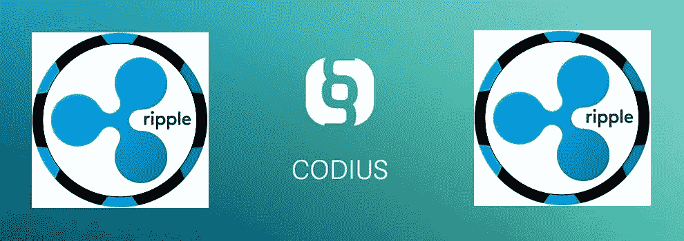

# 谁将赢得智能合约竞赛？

> 原文：<https://medium.com/coinmonks/who-will-win-the-smart-contracts-race-496fa72f700?source=collection_archive---------12----------------------->

Vitalik Buterin 的以太坊被广泛认为是智能合约的“区块链技术”。但是，本周，Ripple 的前首席技术官斯蒂芬·托马斯(Stefan Thomas)已经发出挑战，要用一个新的智能合约平台来挑战这个领导者。

托马斯于 5 月离开 Ripple，现在他正在启动 Codius，这是一个由 Ripple 设计的开源项目，并于 2014 年发布了测试版。因此，它并不完全是新的，但托马斯将其定位为他的新公司 Coil 的核心产品。

Coil 的目标是改变网站内容的盈利方式。

将网络内容货币化很笨拙

托马斯称，目前网络内容的商业化方式是一种笨拙的变通方法，使用广告、付费墙和数据收集。他的概念使用了一个夹层。这是一个开源协议，允许跨不同的分类账发送付款。基本上，它允许用户的浏览器对他们访问的网站进行小额支付。

**Codius 如何工作**

这将如何运作，它将如何影响消费者？例如，Codius 允许使用“收入支付合同”，当消费者观看电影时，该合同将收取收入。收集到的收入将支付给将电影放到网上的所有相关方，但它不会以“批量支付”的方式进行，而是以一系列较小的金额支付。此外，那些通过付费墙阅读报纸的人将通过管理支付授权和订阅的智能合同进行支付。

Codius 已经发布了上传 Codius 的说明手册，以努力让开发者立即开始使用该平台，似乎已经听到了这一号召。

**谁在使用 Codius？**

比利时电信集团 Proximus 的 IT 解决方案子公司 Telindus 表示，它将使用 Codius“推进新的直接电子商务模式。”

游戏平台，Unity，Zynga 和 Kabam 也计划将其用于新的游戏平台。乔希·威廉姆斯投资了 Unity et al，现在正在创建自己的游戏平台，他说:“游戏和其他领域的团队正在以太坊基础上建设，并遇到了我们都熟悉的成本和可扩展性问题。Codius 在解决这些问题方面有很大的潜力，我们渴望与它合作。”

**Codius 提供了更好的可扩展性**

以太坊的团队最害怕的词是:可伸缩性。我们都知道以太坊仍在努力解决其规模问题。看起来 Codius 提供了一个解决方案，巧妙地绕过了这个问题。托马斯说:“联系我们的人说，‘嘿，我们正在以太坊做实验。我们遇到了可扩展性问题。太贵了，太慢了。不够灵活。我们不喜欢用这种笨拙的语言写作。"

它不是唯一一个挑战以太坊的挑战者，但看起来它可能是赢得将智能合同纳入主流使用的竞赛的最强有力的竞争者之一。