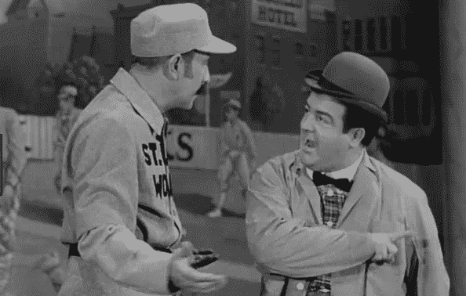

# 谁的数据在区块链上？

> 原文：<https://medium.com/coinmonks/whose-datas-on-the-blockchain-2a0f152e6fde?source=collection_archive---------5----------------------->

# 达成共识

老艾伯特和科斯特洛:“谁在一垒？”喜剧套路之所以奏效，是因为我们都能认同困惑。我们都有过这样的经历，尤其是如果你不能把别人的名字叫对，或者有人叫错了你的名字。在这种情况下，阿博特和科斯特洛变得如此困惑，他们无法就他们队中的棒球运动员的名字达成一致。

如果你正在和某人做生意，却出现了困惑怎么办？可能会搞不清该做什么工作，搞不清该跟谁谈这个，该跟谁谈那个，搞不清最后期限，搞不清该开多少账单，或者搞不清该付给谁。各种事情都可能出错。

在区块链，通过所谓的共识避免混乱至关重要。没有共识，就没有数据被提交给区块链，商业交易和智能合同就会嘎然而止。

今天，我将继续回顾 Linux 基金会在 edX 上的第一个 Hyperledger 区块链课程“[商业区块链——Hyperledger 技术简介](https://www.edx.org/course/blockchain-business-introduction-linuxfoundationx-lfs171x)今天的帖子将关注区块链交易的参与者如何就去往区块链的数据达成一致。这个过程叫做共识。

通常情况下，当两个人达成一致意见时，意味着经过一番讨论，各方已经达成一致意见。就区块链而言，共识意味着“网络参与者就系统上数据的正确状态达成一致”这“导致所有节点共享完全相同的数据。”

如果没有共识，那么区块链的参与者不仅不能就将什么数据提交给区块链达成一致，而且他们也不能将他们的信息从集中位置分发出去。快速、完美、廉价、持续地达成共识对区块链的未来至关重要。

话虽如此，达成共识还是有不同的方式。具体来说，有不同的共识算法。“共识算法…做两件事:它确保网络中所有节点的分类帐数据都是相同的，反过来，它又防止恶意参与者操纵数据。”

换句话说，共识有助于不信任对方的两方或多方达成共识。共识算法是如何做到这一点的？它们以不同的方式来实现，但是一般来说，它们试图通过在各方之间如何处理数据并将其提交给区块链来建立信任，从而在各方之间建立信任。如果数据及其记录方式不能被任何一方或任何恶意的第三方篡改，那么交易各方可以信任该过程、彼此以及结果。

值得信赖的共识毕竟是区块链存在的主要原因之一。你多长时间邮寄一张支票以防被偷？还是为了交易中的一方改变规则？这些都是区块链和共识试图解决的问题。在下面的帖子中，我将深入探讨不同的共识算法，以及它们的优缺点。

## 关注更多

更多关于商业区块链 Hyperledger edX 课程介绍、《Hyperledger 区块链》和《区块链》的帖子，请关注我以获取最新消息。