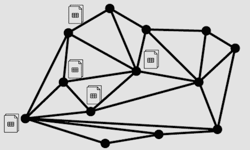

# 为什么贸易行业采用分布式系统而不是集中式系统

> 原文：<https://medium.com/coinmonks/why-a-distributed-system-for-the-trading-industry-instead-of-a-centralised-one-8c21236ae899?source=collection_archive---------2----------------------->

在我们之前的[帖子](/@as10505/d86d96aa5d36)中，我们讨论了基于纸质收据的商品交易行业固有的低效率，以及我们在[基于区块链的交易系统](/@cx473/blockchain-comes-to-rescue-4501d453d423)的项目如何通过在区块链以太坊使用智能合约来解决这一问题。

在本文中，我们将探讨为什么在商品交易行业中，基于集中式系统的其他现有数字解决方案与用于接收和信任管理的分布式系统相比不是非常有效。

## 管理

谁应该管理数字系统？它需要成为所有相关组织(贸易商、仓库、航运公司、银行、政府等)信任的第三方。必须信任该实体不会滥用其权力或欺骗其他相关方(例如，对消费者访问收取高额费用)。如图论和市场力量模型所示，这个中心节点本质上将具有最大的权力。这使得市场效率低下，减少了竞争，这对这项技术的消费者是不利的。

很难找到各方都信任的这种中央实体，少数有资格的往往是拥有强大市场力量的垄断者。政府可能会立即发现，但由于涉及冗长的官僚程序，它们本身是有效率的。

Central Node System

## 多版本并发控制

集中式系统只有单一版本控制，缺乏分散的多版本并发控制机制，该机制保持关于共享事实(如设备、贷款、付款收据和合同)的存在和状态的共识。在中央系统中，所有的验证都必须由中央节点完成，如果中央控制实体决定欺骗其他实体，则没有其他版本来交叉检查这些声明，尤其是在贸易行业中。

分布式系统允许安全和加密的交易和收据验证系统，无论它是用作银行中的抵押品还是满足交易中的支付。

Checking by encryption in a distributed network

## **不受信任的市场**

当在存在欺诈问题的环境中运行时，如果各方互不信任，中央数据库就不合适。交易市场通常很有可能出现收据欺诈。而且，这些交易的参与者，卖方和买方本质上并不信任对方。特别是在仓储和运输收据篡改、银行贷款抵押证明欺诈的情况下。

## 单点故障

对于集中式数据库系统，中央管理机构有很大的压力和责任。像任何集中式系统一样，它也有中心故障点的弱点，这也是黑客容易攻击的目标。

> 如果一个中央系统出现故障，整个网络就会崩溃。

例如:亚马逊网络服务于 2011 年 4 月崩溃，导致 Reddit、Quora 和 NYT 等 70 家网站瘫痪。亚马逊北弗吉尼亚数据中心的这次崩溃导致美国北部整个基于 AWS 的网络瘫痪。根据亚马逊的净销售额，这些中断理论上给亚马逊造成了每分钟 66，240 美元的损失，或近 200 万美元。

## 本地控制

就像一个国家的政府一样，中央系统缺乏地方控制。分布式本地系统减轻了中央节点的压力和责任。但是分布式系统允许将大部分数据和控制权交给本地站点(服务器)和数据的本地所有者。这对于发展中国家的商品市场非常重要，因为这些国家的政府或中央政府在维持全面广泛的控制和有效治理方面效率低下。

## 模块化增长

中央数据库系统不提供弹性模块化增长。必须中断中心点来添加新站点或删除站点。而对于分布式系统，添加和移除仅涉及本地相邻站点，允许增加增长水平以适应新兴和扩展的交易市场，特别是像交易市场。

## 昂贵的本地通信

本地通信成本在资源和时间上更昂贵(想想政府在通过法律和改革方面的官僚拖延)。所有信息都必须通过一个中央机构。

Higher communication and response times in Central systems compared to distributed database systems

## 低延迟

在像我们项目中实现的分布式系统中，电子收据验证的延迟和响应时间要低得多。

Low latency and faster response compared to centralised systems

## 参考资料:

尼科莱塔·马格达莱纳·亚科布。米雷拉.利利亚纳.莫伊泽。[**案例分析论文:集中式与分布式数据库**](https://pdfs.semanticscholar.org/d763/23f956b4a33364d6d5f3c7ebcbd2d7f83fed.pdf) **。Dimitrie Cantemir 基督教大学金融、银行和会计学院。**

伊斯利，大卫。乔恩·克莱恩伯格。网络。 [**人群和市场:关于高度关联世界的推理**](https://www.cs.cornell.edu/home/kleinber/networks-book/networks-book.pdf) **，**康奈尔大学经济系。