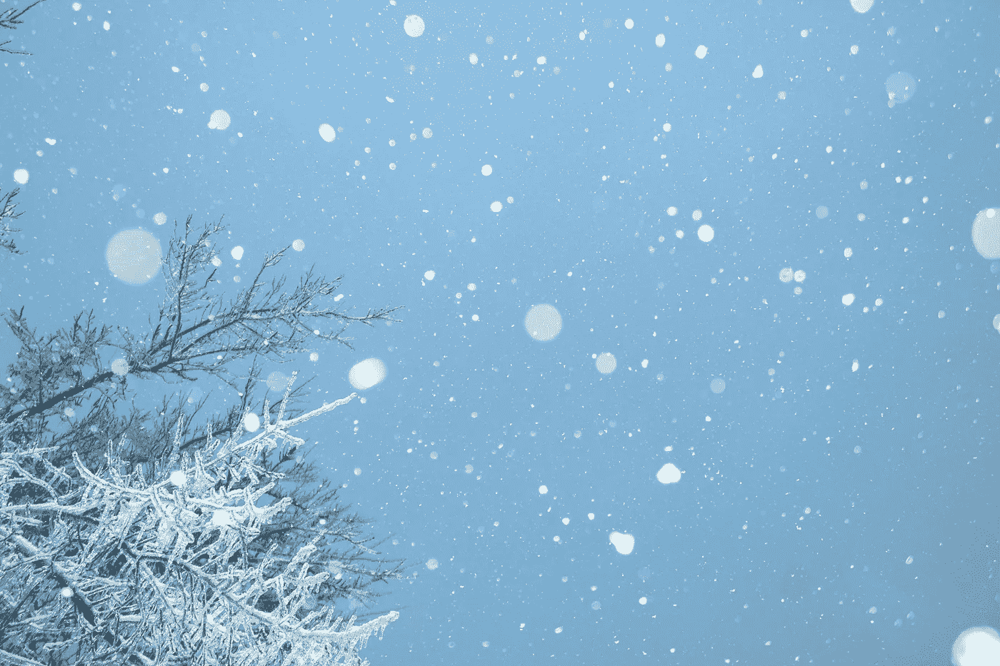

# 为什么以及如何为漫长的秘密冬天做准备

> 原文：<https://medium.com/coinmonks/why-and-how-im-preparing-for-a-long-crypto-winter-6e8fdc20641e?source=collection_archive---------1----------------------->

## 做个小小的祈祷，希望它能短一点

Photo by [Chandler](https://unsplash.com/@chanphoto), Unsplash.

有人告诉我，很容易称之为市场反转。当市场上涨时，你看涨熊，直到你看准为止。同样，你只需要在牛市下跌时继续看涨，对吗？