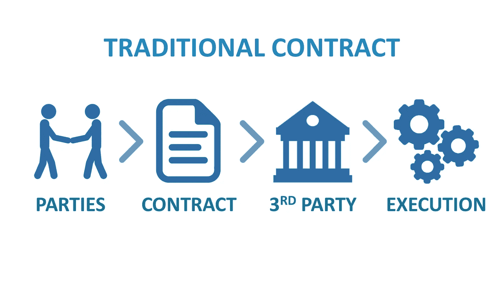
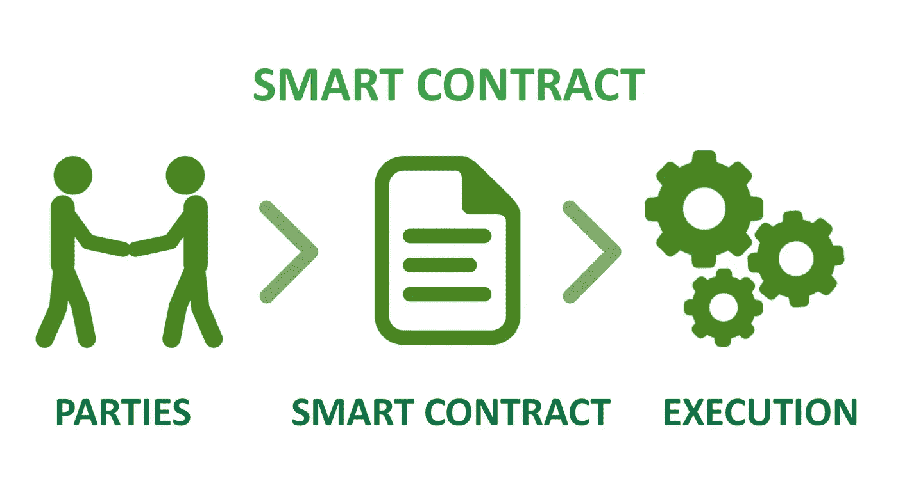

# 为什么智能合约正在吞噬大部分预先存在的金融服务行业？

> 原文：<https://medium.com/coinmonks/why-are-smart-contracts-engulfing-most-of-the-pre-existing-financial-services-industries-7c3151344d2c?source=collection_archive---------5----------------------->

## 智能合约将很快改变传统的金融服务行业。

cleveroad.com

不可否认的事实是，自从[区块链](https://blog.coincodecap.com/what-is-blockchain-a-simple-guide-for-dummies/)诞生以来，它的用例、潜力以及可靠性就一直存在争议。此外，一系列臭名昭著的比特币骗局，如假冒比特币交易所的 ***BitKRX 骗局、MiningMax 的庞氏骗局以及*** [***ICO 骗局***](https://blog.coincodecap.com/analyzing-cryptocurrencies-github-activity/) 也让这项技术达到其辉煌的顶点变得异常麻烦。

虽然这些骗局与区块链本身无关，但大多数人错误地理解了它。事实上，这是我们大多数人最初认为区块链技术无法挑战根深蒂固的传统金融体系的最重要原因之一。

然而，随着以太坊和智能合约的出现，世界很快意识到区块链远比他们想象的更强大。记住智能合同解决一些字面上复杂问题的能力，区块链成为主流的想法似乎是不可避免的。虽然这对许多人来说可能是一件好事，但对于目前一些最突出的行业来说，这无疑是一个诅咒。

# 智能合约是游戏规则的改变者

为了理解和承认智能合约确实是金融科技世界的游戏规则改变者这一事实，理解智能合约实际上消除的复杂问题对我们来说至关重要。

首先，用通俗的话来说，智能合同可以简单地定义为一个自动化的业务逻辑，一旦部署，就不允许任何外部干扰，并且还确保透明度和可靠性。

> 准确地说，我们之所以能信任智能合约，是因为它从区块链技术中继承了两个最关键的属性，即 ***不变性和分布式。***

现在，随着我们理解智能合约解决的问题，我们将逐渐理解它如何挑战金融科技世界中已经存在的系统。

# 那么，智能合同消除了哪些问题？

## 1.完全消除第三方干扰:

这无疑是智能合约解决的最有力的问题之一。自从金融业和商业的发展以来，任何种类的交易、交换或商业总是存在于第三方的观察范围内。 ***这是最初坚信的，消灭第三方永远不是一个选项。***

然而，智能合同完全解决了这个主要问题。它通过三个必不可少的步骤来实现。

**第一步。存储业务规则:**自从数字世界诞生以来，就不可能将你的整个业务规则和条例转换成代码行。然而，智能合约有一个可靠的程序来编纂你的规则，并保证这些规则在任何给定的时间都会被遵循。

**步骤 2。验证规则:**智能合约不仅存储规则，还验证规则。进行的任何交易首先根据各种因素进行验证，如发送的金额、谁是金额的发送者、谁将收到金额等。因此，验证将此类合同的可靠性提高了几倍，而且不需要任何第三方。

第三步。自我执行:如果智能合约不能自我执行，需要其他人来触发，那么所有这些存储和验证的过程都将严重失败。

幸运的是，智能契约也解决了这个障碍，因为它是自动化的，并且在满足业务逻辑或条件时执行规则。因此，它可以在没有任何第三方干涉的情况下执行。

# 2.保护金融世界

对于任何需要有效解决方案的行业来说，安全性一直是最关心的问题之一。

智能合同用一个非常有效的解决方案解决了这个问题。在这种合同中发生的交易不仅仅存储在数据库中。

*取而代之的是，每一笔这样的交易都是先加密，然后存储在分布式账本上，这样就不可能被更改或修改。*

# 3.降低高成本

人们永远不能否认，任何商业协议或金融交易在整个过程中都涉及巨大的成本。此外，由于先前存在的金融行业从未消除第三方，任何谈判以及协议的成本总是很高。

然而，标准化的智能合同代码和一套适当的规则已被证明比传统方法更具成本效益。

# 4.难以置信的高速

虽然成本一直很高，但传统金融行业在执行过程中确实很慢。

> 让我们考虑一个人向银行申请贷款的例子。这整个过程，从开始到结束，涉及一个冗长的行动清单，如资金批准，必要的文书工作，获得中间人的签名等。即使在这种极其耗时和昂贵的程序之后，你也永远不会得到你应得的安全保障。
> 
> 另一方面，智能合同将这个复杂的过程简化为一个简单的过程，只需在区块链上用你的数字身份识别你，在几分钟内批准你的贷款和所有权转让。

此外，一旦整个过程完成，整个事务就被添加到不可变的、透明的以及安全的区块链中。从而以相对较少的时间和成本确保高度的安全性和信任。

# 智能合约正在吞噬传统的金融服务业

毫不夸张地说，智能合约有可能彻底改变和改变现有的金融服务业。

为了承认这一事实，让我们举一个真实世界的例子，看看与现有的金融行业相比，智能合约有多有效。

## 先说传统借贷平台

[https://dzone.com](https://dzone.com/articles/what-is-smart-contracts-blockchain-and-its-use-cas-1)

不可否认，长期以来，借贷一直是金融服务业最重要的业务之一。此外，随着数字化的到来，这些金融行业发起了 P2P 贷款，简而言之，通过在线平台连接借款人和贷款人。

虽然这些传统金融行业可能会称赞这些 P2P 平台非常有效，但说实话，它们不是。

事实上，这些所谓的借贷平台甚至不是 P2P，因为它们涉及大量的中介机构，包括信托账户或 T2 发行银行，以确保系统有序运行。因此，在这一过程中有这样的中介参与，在透明度上有巨大的妥协，这最终违背了 P2P 的真正本质。

这些贷款平台也有更多的局限性，因为它们是集中的，并且在地理上受到很大的限制。

## 进入去中心化借贷平台

[https://dzone.com](https://dzone.com/articles/what-is-smart-contracts-blockchain-and-its-use-cas-1)

到目前为止，去中心化借贷平台的最好例子就是 **Lendoit。**

例如，Lendoit 是一个分散的 P2P 借贷市场，它在许多方面克服了传统借贷平台的局限性。

该平台能够自动化整个借贷过程，同时消除第三方的任何干扰，提高速度，并通过完全去中心化确保巨大的信任。

然而，使 Lendoit 独一无二的最重要的部分是它的智能合约。

Source: Lendoit

Lendoit 的智能合同发挥着至关重要的作用，因为:

> 它存储借款人的详细信息，包括他们的分数和所有贷款条件。
> 
> *这种契约甚至可以维护一个不可变的记录，其中包含贷款所有权的所有历史，从而确保信任。*
> 
> *智能合同本身充当了一个值得信赖的中间人，有权为借款人持有和释放资金，从而消除了对第三方的任何需求。*

对未来的一瞥

由于这种去中心化的平台提供了更好的金融服务，同时不仅确保了透明度或信任，还降低了总体成本并提高了速度，因此大多数人没有理由不选择智能合约和区块链，而不是传统的金融服务行业。

此外，智能合约刚刚开始进入主流金融服务，但考虑到其有效性，它在金融科技行业的主导地位是不可避免的。

> 因此，最让现有金融服务感到困扰的是，这仅仅是个开始，未来还会有更多。事实上，这可能是大多数金融科技迅速向区块链和智能合约倾斜并将继续这样做的原因。

# 关于我自己

## 我是谁？🙋🏻‍♂️

𝙃𝙞, 𝙄 𝙖𝙢 𝙕𝙖𝙧𝙮𝙖𝙗 👋🏻
我是一名精通区块链和智能合同的工程师，我的愿景是用 Web3 去中心化和保护传统 Web。主要从事智能合约工作，在开发和智能合约安全方面都有丰富的经验。

## 我做什么🧑🏼‍💻

*   我撰写安全和优化的智能合同
*   我对智能合同进行安全审计，并提高 EVM 连锁店智能合同的整体安全性
*   我撰写和谈论 Web3 和智能合约&为扩展 Web3 的边界贡献我的一份力量。

## 打声招呼，保持联系🤝

[领英](https://www.linkedin.com/in/zaryab-afser-97085b157/)。| [推特](https://twitter.com/zaryab_eth)。| [Github](https://github.com/zaryab2000) 。| [邀请我参加 Web3 活动](https://zaryab2000.notion.site/Invite-me-to-your-Next-Web3-Event-78bcd204b866426687e1afbcdc61c5c7)

> [直接在您的收件箱中获得最佳软件交易](https://coincodecap.com/?utm_source=coinmonks)

