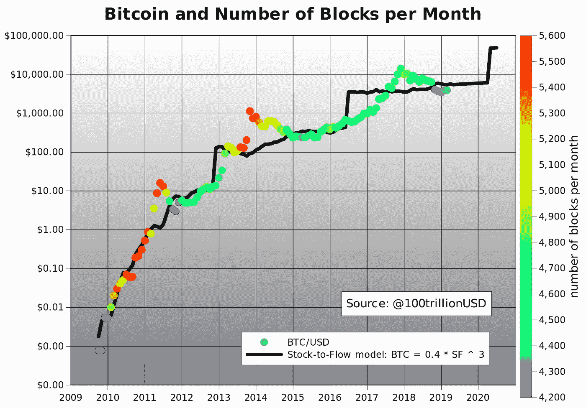
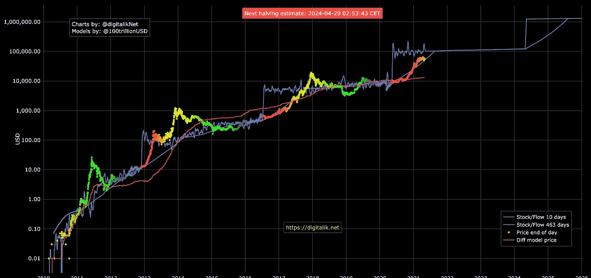
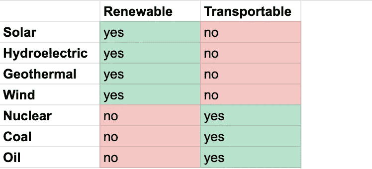
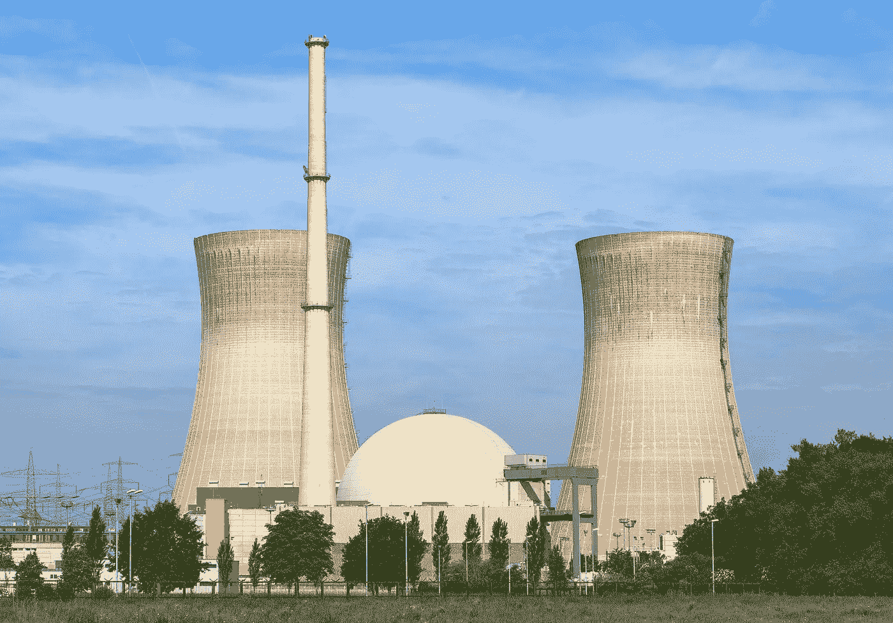
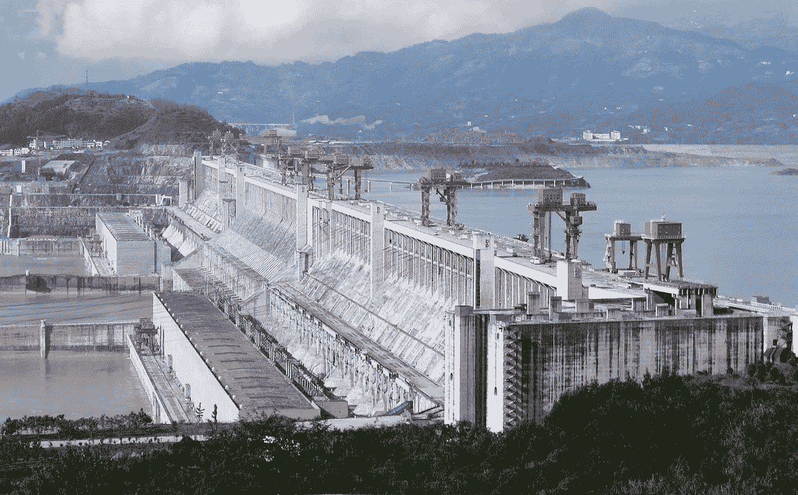
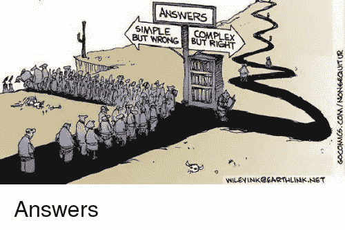

# 为什么比特币的能量消耗会保持增长，这不会是一个问题

> 原文：<https://medium.com/coinmonks/why-bitcoin-energetic-consumption-will-keep-growing-and-its-not-going-to-be-a-problem-41e05d9c6d54?source=collection_archive---------4----------------------->

## *文章开始于 2021 年 5 月 1 日*

比特币价格正在爆炸。每四年一次。现在是 57500 美元。一年前是 8824 美元。两年前 5 英尺 323 美元。挖掘比特币的能量成本也在爆炸。比特币网络的运行需要矿工的努力。矿工解决复杂的数学问题需要消耗大量的能量。这些问题需要得到解决，才能决定哪个矿工将成为区块链的下一个矿工。而谁写下一个区块，谁就赚到了新产生的比特币和交易费用。如果不是这样，在区块链中编写一个块是一件微不足道的任务。所有额外的计算都是为了那些没用的问题。由于比特币协议要求每 10 分钟写入一个块，因此每 2 周(实际上是每 2016 个块)重新计算一次问题的难度，因此如果在过去 2 周内矿工在不到 10 分钟内解决了问题，问题会变得更糟。如果超过 10 分钟，问题会变得更好。总的趋势是越来越糟。因为随着时间的推移，越来越快的计算机可用，随着时间的推移，比特币的价值上升。这些都是众所周知的。我现在想向你们展示三样东西:

1.  有一种非常简单、粗略的方法可以计算出矿工消耗的能量
2.  现在使用的能源是巨大的，而且会变得更糟；
3.  我们不应该担心。

我知道给定 1 和 2，我如何得出 3 将是一个很难的销售。但我有信心能说服你。是的，我确实拥有比特币，而且我认为自己是有环保意识的。所以我们走吧。

# 计算矿工使用的能源

**我们如何计算矿工使用的能源？**每时每刻都有数千台计算机试图解决这些数学问题，它们总共消耗了多少能量？第一个答案是，我们当然不知道。但是我们知道一些事情:

1.  比特币的价格；
2.  每笔交易产生的比特币数量；
3.  费用的平均价值；
4.  矿工获得的费用的总价值；
5.  矿工从每一个区块获得的美元价值。

5 的值只是(1)乘以(2)加上(1)乘以(4)的乘积。如果我们忽略现在的费用，矿工们从每个区块得到 6.25*57500 美元=359'375 美元。每块 359375 美元。对此我们需要加上费用。每小时 2156250 美元外加费用。每天花在矿工身上的费用超过 5175 万美元。让我们称这个值为 **E** 。

E= 51750000+费用。

矿工们现在愿意为获得这些比特币支付多少电费？我们不知道那里有多少矿工。但我们知道，要想盈利，所有矿商的总支出必须少于 1 美元。当他们的花费超过 T2 和 T3 时会发生什么？他们无法盈利，他们必须卖掉设备，关闭商店，做些别的事情。如果他们花的比 **E** 少很多会怎么样？新的矿工会出现，或者现有的矿工会购买更多的设备和使用更多的能源。换句话说，矿工们加在一起，总会倾向于支出比收入少一点点。我们可以把它近似为 E 并且说**矿工将倾向于为他们的采矿作业**花费 E。

**E** 给你买了多少能量？这取决于你在世界的哪个角落。但是总的来说，矿工们倾向于集中在能源更便宜的地方。虽然发现矿工愿意为电力支付多少是相当简单的，但计算这给你带来多少能量就不那么容易了。目前这无关紧要。我们稍后将回到这一点。我们知道矿工愿意为他们的工作支付报酬。 **E** 如何随时间变化？

# 预测比特币未来的能源使用

The model, Stock to Flow, when it was first presented on the 22nd of March 2019\. The black line is the behaviour [predicted](/@100trillionUSD/modeling-bitcoins-value-with-scarcity-91fa0fc03e25). The dots represent the actual historical price.

目前最有希望的比特币价格模型被称为股票流动模型。这是由一位荷兰匿名养老基金投资者提出的，他的名字叫 [PlanB](https://twitter.com/100trillionUSD) 。你可以在他的页面找到关于他的所有信息。该模型显示比特币的价值在逐步增长。每 4 年(实际上是每 210，000 块)矿工将开始生产前 4 年周期中一半的比特币。在最初的 4 年里(从 2009 年到 2012 年)，他们每块生产 50 个比特币。在下一个周期(从 2013 年到 2016 年)，他们每块生产 25 个比特币。然后是 12.5(2017–2020 年之间)，现在是 6.25(2021–2024 年之间)。从 2025 年到 2028 年，他们将每 10 分钟生产 3.125 个比特币，以此类推。但 stock to flow 预测，比特币的价格将是迄今已开采的比特币与新创造的比特币之比的函数。所以每次比特币产量减半，价格都会经历一次震荡。上涨，进入牛市，达到泡沫，下跌，找到平衡。我们看到这种情况在 2013 年发生，在 2017 年再次发生，在 2021 年再次发生。高于前一时期的余额。

这是观察到的行为:

The behaviour of the bitcoin price followed very precisely the values predicted by the stock to flow model. The light blue line represents an averaged value (over 463 days) which was found to better predict the behaviour.

第二张图表来自另一位分析师“digitalik”，他重新创建了 B 计划的模型，并每天在他或她的页面上更新。

该模型并不完全相同，因为它在这两年中进行了优化。但主要是我们可以看到行为是如何非常好地跟踪模型的。

**因此，在本文的其余部分，让我们假设在可预见的未来，比特币将遵循股票流向模型**。如果这是真的，那么我们不仅可以计算出现在的矿工在采矿作业中会花费多少，而且可以计算出未来的花费。这可能会吓到我们。因为存量到流量模型预测比特币价格每 4 年上涨~10 倍。但也是每 4 年它会挖掘一半的比特币。因此，**采矿作业每 4 年应该多花费 5 倍，** **并且平均多使用 5 倍的能源**。事实上，由于费用的原因，这是一个乐观的评估，因为收取的费用不会每 4 年下降一半，而是[会随着时间的推移而增长](https://bitinfocharts.com/comparison/bitcoin-transactionfees.html#log)。

因此，比特币消耗大量能源，随着时间的推移，这种情况只会变得更糟。我完全支持一个国家可能希望阻止使用电网中的电力来开采。但是并不是所有的能量都来自电网。

# 能源类型

到目前为止，我们只是简单地提到电和能量，好像它们都是一样的。但事实并非如此。**运输能源成本高昂**。能量在传输过程中被分散。如果发出 1 千瓦的电，收到的电不到 1 千瓦，有时少得多。举例来说，这就是为什么我们没有看到撒哈拉沙漠中的大型太阳能发电厂向欧洲出售能源。这就是为什么石油被输送到世界各地，而不是在开采的地方燃烧，同时输送产生的能量。储存能量。发送储存的能量一直是能源行业的瓶颈。

这一点非常重要，以至于有些国家，比如冰岛，有多余的能源，并利用这些多余的能源生产能源密集型产品。然后卖掉。

An aluminum smelter in Iceland. [Source](https://www.flickr.com/photos/compleo/7086807947)

冰岛是世界第 11 大铝出口国。是的，你没看错。那个小国可与大国匹敌。因为冰岛有如此多的能源，却不能出口，只能出口铝。为什么它不能输出能量？冰岛[的能源产出中有 99.9%是可再生能源，几乎全部来自地热(火山)和水电(大坝)。不是可以出口的东西。而由于上述的色散，以电的形式输出能量是不可行的。**在一个能源过剩的地方，能源成本会发生什么变化？它掉落**。](https://en.wikipedia.org/wiki/Economy_of_Iceland#Geography_and_resources)

因此，我们已经了解到，有一些能源是不能运输的，它们存在于一个特定的地方。这些地方最终拥有过剩的廉价能源。

此外，还有一些地方非常耗电。那些地方需要能量。这种能量的来源要么被传送到他们那里，要么离他们足够近。然后，能量被生产出来，并被输送到需要它的最后(一千)英里。他们也将使用任何当地能源。他们通常使用哪种能源？大部分是不可再生能源。煤是可以运输的，而且是不可再生的。石油可以运输，而且是不可再生的。结果是，这些地方的能源价格往往会更高。

应该注意的是，在世界上的一些地方，电力合同允许你为“你所能得到的”能量支付固定的费用。在用户可能用电开采比特币的背景下，这种合同是极其危险的，应该是非法的。

难道所有使用电网电力(与日常用电竞争)的采矿都不应该被定为非法吗？不一定。采矿的副作用是热量。许多国家使用电能来加热房间或在厨房做饭。在一些国家，出于安全原因，使用煤气炉甚至是非法的。在这些地方，如果供暖系统实际上是一个可以随意开关的采矿系统，那将是非常有益的。如果电力成本足够高，这只会降低供暖成本，而不会让人们仅仅为了采矿而开启供暖。

**renewable sources cannot be transported, non renewable can be transported**

我们发现冰岛不能出售其能源。这是大趋势:**可再生能源不能运输，不可再生能源可以运输**。

因此，我们预计能源过剩的地方都富含可再生能源。

为什么所有这些都很重要？因为比特币矿工有一个全球定义的固定预算来资助他们的采矿业务。因此将倾向于更便宜的能源形式。事实上，是最便宜的。因此，我们预计他们会倾向于能源丰富的地方。无法为他们在其他地方的运作提供资金。

一个显著的例外是委内瑞拉。委内瑞拉的能源非常便宜。但是这是因为美国对 T2 的制裁使得委内瑞拉公司不可能出售他们的石油。换句话说**委内瑞拉的能源过剩是由政治原因引起的**。委内瑞拉政府对此的反应是将能源转化为比特币，并在市场上出售这些比特币。

另一个有趣的案例是**核电**。

Image of a Nuclear Power Plant from [Wikipedia](https://en.wikipedia.org/wiki/Nuclear_power_plant)

核电站不能轻易开启或关闭。停止一个核电站需要很多天。在不需要的时候，并不总是很容易将植物产生的多余能量储存起来。历史上，储存这种过剩能量的方法之一是通过水力发电厂。水力发电厂可以正常工作，从水流中提取能量。但也可以反向工作，将水抽回。然后这个湖变成了一个巨大的电池。因此，核电站和水电站将协同工作。白天，它们都会产生能量。到了晚上，核电站会继续产生能量，这些能量会通过水电站储存起来。

这又是一个能源过剩的地方，采矿是有利可图的。当然，廉价能源可能永远不会进入电网。将它用于采矿的唯一方式是运营核电站的公司将它用于采矿。那么核能曾经被用于采矿吗？表面上是这样，但由于这不是合法的，电脑被当局没收了。

最后一个例子，中国的**大坝**。几十年来，中国一直在建造鬼城。根据一些人的说法，这些是腐败的中央集权政府最无用的产品，他们试图让人民忙碌起来，不让 GDP 下降。其他人则认为，一旦全球变暖全面爆发，这些城市将处于最佳的关键区域。他们代表了一个主要由工程师组成的政府的最有远见的产品。意见不一。无论哪种情况，这些城市都计划使用大型水力发电厂的电力。已经可用但未得到充分利用的发电厂。与此同时，在一些案例中，比特币挖矿也代表了这种能源的使用。

我们应该注意到，尽管市场倾向于为这些过剩的能源找到解决方案，无论是以出售能源密集型产品的形式，还是将其储存在湖泊中，这都需要巨大的成本。将铝运往世界各地成本高昂。把水送上山会有相当大的能量分散。采矿是一个很好的替代解决方案。

# 结论

所以总的趋势是:比特币挖矿用的能源多；比特币挖矿所需的能源在未来将会增长；比特币将倾向于使用地球上最便宜的能源；地球上有些地方能量过剩；这种能量不能被传输；这种能量通常由可再生能源产生，因为不可再生能源可以运输(除非被制裁阻止)；因此，比特币开采将使用全球多余的能源，这些能源来自不可再生能源。

image stolen from somewhere on the the internet

很容易认为能量是珍贵的东西，我们应该保存它。这是简单的推理，数学家称之为“第一次近似”。在一级近似下，这是真的。但更深入的分析表明，能量是不能被输送的，在一些地方，能量是宝贵的，而在另一些地方，能量是过剩的。**比特币采矿将永远使用更便宜的能源，而这些能源不可避免地来自能源过剩的地方。**

# **决策者的建议**

诚然，比特币使用了大量的能源。但比特币使用的能源通常是最便宜、最不需要的能源，这也是事实。这有一些后果:

1.  以固定价格允许“你能得到的”能量的合同应该是非法的。
2.  管理能源过剩地区的决策者应该考虑允许将多余的能源用于采矿作业。在双赢的情况下，它实际上可能代表一个良好的税收流。
3.  阻止国家出售石油的制裁现在毫无用处，如果不是适得其反的话，也应该避免。

文章于 2021 年 5 月 2 日结束。比特币现在的价格是 56500 美元。

**后期编辑:** *更正委内瑞拉— >委内瑞拉政府在一份评论中提出了具体要求。*