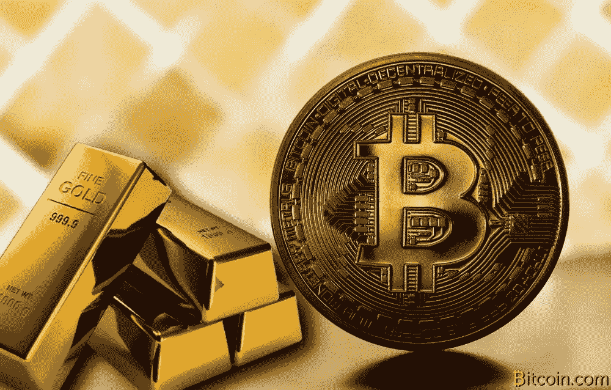
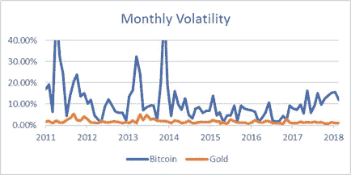

# 为什么比特币和黄金一样好

> 原文：<https://medium.com/coinmonks/why-bitcoin-is-as-good-as-gold-3a4d525dadc2?source=collection_archive---------1----------------------->

## 事实上这样更好

*注意:我不是财务顾问，这不被视为财务建议，它仅仅是我的观点，在没有与合格的专业人士交谈之前，不应进行任何投资。*

# **究竟是什么赋予了资产价值？**

对于像股票这样的传统资产来说，它是公司的部分所有权，以及通过股息对其现金流的可能要求权。对于债券来说，它是承诺的支付流。你可以很容易地对这些资产进行估值，方法是将未来的现金流折现到现在。

对于像石油这样的商品来说，其价值在于在广泛的行业中的有用性。价格变成了获取、运输、存储资产的成本加上各种实体在此过程中收取的加价。这些例子非常直观，你不会发现关于潜在估值和指标的太多争论。

然而，像黄金这样作为价值储存手段的资产是不同的。没有现金流，而且价格大大高于像其他商品一样购买、运输和储存资产的边际成本。现在让我们来看看*到底是什么赋予了黄金价值:*

**历史价值归属**

这听起来可能像是循环逻辑，但这种溢价的存在只是因为我们赋予了黄金价值。几千年来，黄金一直保持着巨大的价值，因为人们普遍认为黄金具有价值。没有人质疑它，也没有理由怀疑它。这产生了复合效应，因为越多的人认为黄金是一种价值储存手段，它就变得越有价值，从而进一步巩固了它作为价值储存手段的地位。

**稀缺/稳定供应**

黄金能够保持这种感知价值的主要原因是因为它的稀缺性。简单来说，如果每个人都有它，它就不会那么值钱了。从地下开采黄金也是一个耗时、昂贵的过程，这创造了黄金供应相对稳定的增长，防止了供应冲击导致的任何快速贬值。

**实际使用情况**

黄金唯一的潜在用途是在珠宝业(以及最近的电子行业)。)尽管这是一个有形的价值驱动因素，但这绝不是黄金成为有效价值储存手段的原因。一个世纪前，美国和其他世界大国没有黄金作为本国货币的后盾，因为黄金很有光泽。由于这个原因，我们可以在分析黄金的价值时抛弃黄金的实际使用案例。

> [直接在您的收件箱中获得最佳软件交易](https://coincodecap.com/?utm_source=coinmonks)

# 比特币如何比较

比特币问世甚至还不到十年，因此它没有多少历史共识所赋予的价值。显然，黄金已经存在了相当长的一段时间，它的保值能力是它现在成为近 8 万亿美元市场的重要原因。也就是说，这绝不是预测黄金未来价值的方法。如果人们认为某种稀缺资产具有价值，并且会继续持有，那么就有可能取代黄金，成为价值资产的主要储存手段。人们认为，因为黄金长期以来一直扮演着这一角色，它永远不会失去这一角色。我不同意。

让我们举一个简单的例子……在 19 世纪，人们喜欢骑马四处旅行。这是一种有效的运输方式，使用了几个世纪。它允许你以比步行更快的速度走更远的距离，而且你可以随时附加一辆马车来运载更多的人。

接下来是这个新的金属轮子，汽车。这很危险，又贵又吵，为什么会有人换呢？在当时，这是一个合理的想法，目前的交通工具运行良好。

长话短说，我们都知道结果如何，所以这让我想到了我的观点:**仅仅因为一些事情在过去成功了，并不意味着它不能被更好的事情颠覆。**

我认为比特币在几乎所有方面都比黄金更好([这篇文章](/@vijayb_24615/the-bullish-case-for-bitcoin-part-2-of-4-c918977c40f6)是在我开始写作后发表的，并且以比我更清晰的方式提出了这一观点)。总结一下:

*   比特币的供应是确定无疑的，因此永远不会有波动。另一方面，黄金每年的开采量仍有变化。
*   比特币很容易储存，你可以在一个 USB 驱动器中存放价值数百万美元的比特币，只要你保证私人密钥的安全，就没人能动它。黄金，尤其是大量的黄金，价格昂贵且难以储存。
*   比特币可以被分割成一便士的几分之一，并且可以被快速发送到世界上的任何地方。试着把你的金条切成两半，寄给你在另一个国家的亲戚。
*   黄金容易受到政府监管，有很多政府控制黄金的使用、获取、运输和持有的例子。比特币不受审查，这意味着没有任何实体可以控制你的资金，你可以真正自由地随心所欲地花钱。唯一的政府风险是全球努力关闭所有交易所，让比特币的收购变得非常困难(这是极不可能的)。

**比特币开始明显蚕食黄金作为全球价值储存手段的份额，这似乎只是时间问题。**

# 波动性

When there is an elephant in the room… Introduce him

让很多人对比特币敬而远之的是其波动性。这是一个非常合理的担忧，因为人们很难将自己的钱投入一种像比特币那样波动的资产。比特币的市值目前约为 2000 亿美元，这听起来可能很多，但在金融界却是沧海一粟。这使得价格容易受到大型参与者和吸引眼球的头条新闻的影响，如“中国第 1000 次禁止比特币”,导致戏剧性的变化。

但你必须记住，比特币仍处于早期阶段，随着更多资金的流入，波动性将会降低。这在过去几年里已经很明显了。下图显示了月标准偏差占当月平均价格的百分比。

很明显，从早期开始，波动性就一直在下降。正如您所看到的，它在过去一年中有所增加，但这是价格大幅上涨的结果，这对价值存储使用情形无害。当然，从 19000 美元左右的高点来看，这是一个很大的缺点，但这是由于比特币和加密资产类别最终获得主流关注而导致的市场非理性繁荣的结果。(美国消费者新闻与商业频道“快钱”每隔一天就谈论加密热潮/大屠杀)。

尽管如此，随着更多的资金继续进入太空，波动性将会消退，从而产生雪球效应，因为更多人将会看到比特币作为一种有效的价值储存手段的价值。

## **结论:**

赋予像黄金这样的资产价值的主要是心理因素，是随着时间的推移大众意见达到顶点的结果。几千年来，黄金一直为这一目的服务，但在过去十年里，一种前所未见的资产被曝光，并威胁到黄金作为全球价值储存手段的地位。这不会在一夜之间发生，但我和许多人 [以及其他人](https://futurism.com/apples-co-founder-says-bitcoin-is-better-than-gold/)一样，相信世界各地的人们将开始期待这种新的*数字黄金*来储存他们的财富。

*如果你喜欢你所读的，* ***请*** *随意“鼓掌”，它帮助我获得曝光率！我也喜欢听到反馈，所以评论总是很受欢迎。*

要了解更多信息，我强烈推荐阅读这一系列文章，其中详细介绍了许多观点。

[https://medium . com/@ vijayb _ 24615/the-bully-case-for-bit coin-part-1-of-4-94087 a 70 d9 e 8](/@vijayb_24615/the-bullish-case-for-bitcoin-part-1-of-4-94087a70d9e8)