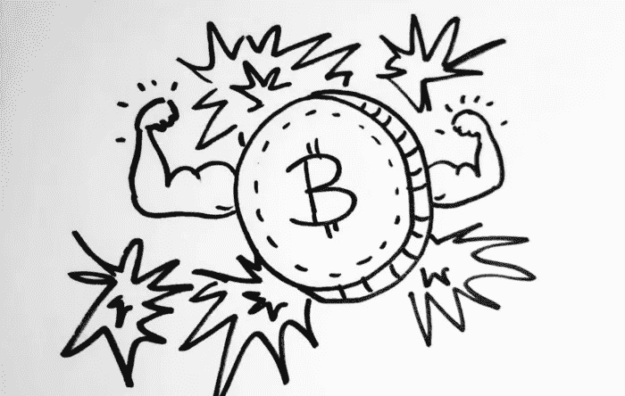

# 为什么比特币比黄金好💪

> 原文：<https://medium.com/coinmonks/why-bitcoin-is-better-than-gold-69dcc7c49d66?source=collection_archive---------1----------------------->

[**CoinCodeCap**](https://coincodecap.com/)

新列表👏

*   [积分](https://twitter.com/coincodecap/status/1151249922160644096)(排名— 28)，
*   凯伯网络(排名— 29)
*   [地平线](https://twitter.com/coincodecap/status/1149631144884703232)(排名—73)
*   曾佐(排名 161)

**欺诈检测** —每周我们都会分析随机加密项目的开发活动。我们发现一些项目在他们的 Github 上没有任何开发活动。😐

1.  [ODEM](https://twitter.com/ODEM_IO) —我们发现自去年以来没有发展活动。没有代币使用，一个 [@coursera](https://twitter.com/coursera) 类型的模型正在运行，收费$ 5000—$ 10K(以$$)一个学习程序，阅读更多[这里](https://twitter.com/coincodecap/status/1150810499132473347)。
2.  Qubitica——由一个人经营，购买了一堆域名，并在这些域名上托管 WordPress 或单页网站，以显示他们正在建设项目。在这里阅读更多。
3.  thore coin——我们找不到他们的 Github 和 Twitter 句柄。超过 1.5 亿美元的市值，这枚硬币是一个纯粹的骗局。在这里阅读更多。

**本周报价-**

> “任何傻瓜都能知道。重点是要理解。”阿尔伯特·爱因斯坦

本周故事👇👇

## 为什么比特币比黄金好

世界各地的银行都承诺将我们的黄金安全地存放在它们的金库里——远离强盗们窥探的目光和发痒的手指。但是我们仍然需要一种方法来用我们的金子交换一袋红洋葱或者一个晚上的住宿。我们需要更“流动”的东西。所以银行发行了纸币。

所有的纸币，从美元到日元，英镑和欧元都是黄金的借据。这意味着你可以走进一家银行，把你的纸币换成同等价值的黄金。

直到 1971 年 8 月 15 日的那一天，美国总统理查德·尼克松说:“不”。从那天起，美元(世界储备货币)不再与银行里的黄金数量挂钩。

所以在一天之内，所有的美元都从被银行里的黄金数量支持，变成被…嗯，什么都没有！

[.. ***此处阅读全文***](/coinmonks/why-bitcoin-is-better-than-gold-3933e79658ce)

到 [Tahi Gichigi](https://medium.com/u/6f2516bc6a31?source=post_page-----69dcc7c49d66--------------------------------) (在 [Twitter](http://TahiGichigi) 上关注他)👈

## **额外字节😘**

*   美国应该计划在 2035 年前减少对世界金融体系的控制
*   [以太坊治理调查结果](/coinmonks/ethereum-governance-survey-results-c67c11695f2a)——[伊娃·贝林](https://medium.com/u/bc08409ff52f?source=post_page-----69dcc7c49d66--------------------------------)
*   [2019 年比特币的一切都错了](/coinmonks/everything-wrong-with-bitcoin-in-2019-b9b7653befc8)——[埃里克·拉米森-怀特](https://medium.com/u/8695b60e27b?source=post_page-----69dcc7c49d66--------------------------------)

> [直接在您的收件箱中获得最佳软件交易](https://coincodecap.com/?utm_source=coinmonks)

想在 CoinCodeCap 上市吗？ [***填写此表。*T34**](https://airtable.com/shrc4sXB70HPpuSM8)

发微博给我，或者发邮件给我，地址是 gaurav@coincodecap.com

> *“我们是一个非宣传性和非营利性的教育出版物，如果你喜欢阅读*[【你也可以捐助我们](https://medium.com/coinmonks)。

***暂时就这样，送我❤️，下次再说。***