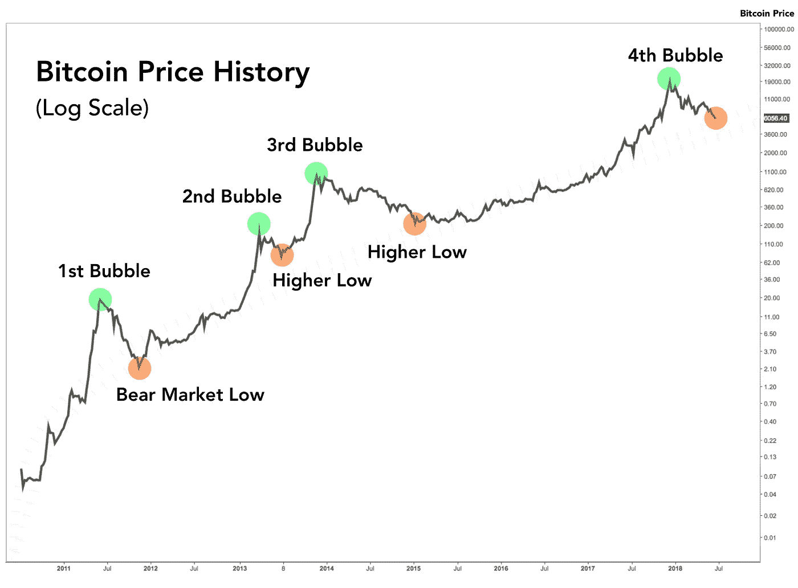
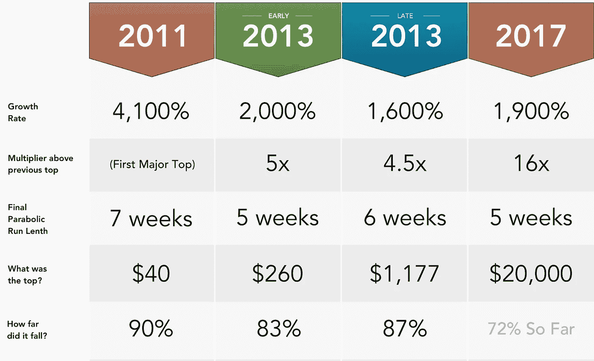
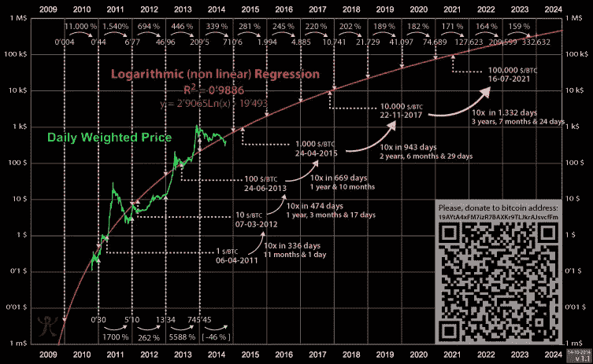

# 为什么比特币仍然是一生的投资机会

> 原文：<https://medium.com/coinmonks/why-bitcoin-is-still-the-investment-opportunity-of-a-lifetime-49cf56bc0ff6?source=collection_archive---------1----------------------->

*(这个帖子本来是我给一个群发的消息。觉得我也不妨贴在这里)*

在这一点上，大家应该考虑对加密货币(比特币)有一些接触。

我知道没有人会听，但我会张贴最简单的解释，以防有人听:

比特币有价值的原因是因为

这是**分散的反通胀货币** :
-分散的:不受任何政府、单一行为者或团体控制(据我们所知)
-反通胀的:永远只有 2100 万比特币(固定供应量)而不是无尽的美元、欧元，甚至黄金(我们不知道地球上所有黄金的供应量是多少)

如今，世界上几乎每个政府都在大量印钞

…其效果是随着时间的推移，你的钱越来越不值钱。

例如 50、40、30、20、10 等。几年前，1 美元能买到比现在多得多的东西。

这就是为什么有些人不把钱存在银行里(零利率或负利率)，而试图通过投资股票市场、房地产等来战胜通货膨胀。

历史重演真是有趣:
[https://money . visual capitalist . com/currency-and-the-collapse-of-the-Roman-empire/](https://money.visualcapitalist.com/currency-and-the-collapse-of-the-roman-empire/)

^用美国和美元(或欧盟/欧元，日本/日元等)代替所有提到的罗马和第纳尔。)并且你开始看到一些模式。

无论如何，比特币基本上是对冲(通过做其他事情来减少一些风险)所有这些。

是的，比特币从 2017 年底的 2 万美元高点下跌，但如果你在这个游戏中待的时间足够长，你就会知道以下几点:

> 长期趋势是上升的

Credit: Yahoo Finance

我指出了最近两次牛市(比特币上涨很多)的峰值——2017 年 12 月和 2013 年 12 月。

你会注意到，比特币价格从两个峰值都大幅下跌，每次大约下跌 80-90%…

…但从未像以前那样低。

更多视觉效果:

Credit: Cole Garner, “The Market Cycle Wears No Clothes” ([https://hackernoon.com/marketcycle-4e5407d0c68](https://hackernoon.com/marketcycle-4e5407d0c68))

Credit: Cole Garner, “The Market Cycle Wears No Clothes” ([https://hackernoon.com/marketcycle-4e5407d0c68](https://hackernoon.com/marketcycle-4e5407d0c68))

^从去年开始拍照。大多数人认为底部(“跌了多远？”)对于比特币来说(3.2k 美元)已经过去了——比特币现在是 8k 美元。

============

反正很多人认为新的市场周期已经开始了。

我们可能会在 2 年后看到下一个牛市高峰。

如果你感兴趣，不要像 2017 年大多数人那样，在 2 万美元或顶部买入。

**那么会涨多少呢？**

我知道这是每个人都想知道的。

我猜测下一个峰值会是 6 位数(每比特币约 10-20 万美元)。

在你退出之前，这个数字可能看起来很疯狂，但是 ROI(投资回报)实际上是更低的%。

如果你在比特币刚诞生的时候买了它，你从 0.007 -> $10 (1，428，571%)中获得的收益会比从$1，000 -> $20，000 (2，000%)中获得的收益更疯狂

(1000 美元到 20000 美元=我们在 2017 年经历的那场让比特币进入主流意识的挤兑)

所以，现在的数字更大了，但实际上增加的百分比更少了。

10-20 万美元“仅仅”是上次 2 万美元峰值的 5-10 倍。

这就是所谓的对数回归(英文:% gains slow down over time):

^ Don’t look at the numbers. The point of the pic is that % gains are slowing down. | Credit: Trolololo, “Logarithmic (non-linear) regression — Bitcoin estimated value” ([https://bitcointalk.org/index.php?topic=831547.0](https://bitcointalk.org/index.php?topic=831547.0))

你还会注意到，如果我的绘画技巧更好的话，这张图片看起来和我贴的“长期趋势是上升的”图片很相似。

**该买多少比特币？**

这里没有什么是财务建议，但我不建议把房子押在这上面。

像任何事情一样，“分散你的资产”

但即使是你净资产的 10%:

如果比特币在两年内翻了 20 倍，这意味着你的净资产会翻一番。

此外，虽然大多数人认为这是一个投机游戏，但想想长期的影响(不要卖掉你所有的 BTC，这取决于你的目标)

==============

如果你在 2014-2015 年(最近一次熊市之前的最后一次熊市)买了底，你相当勇敢，因为比特币和加密作为一个整体更具投机性(“它只被毒贩和恐怖分子使用”的说法更适用)。

现在，很明显我们要带着这些去某个地方。

虽然普通人在购买顶级产品后完全忘记了比特币和加密，但大牌公司在 2018 年和 2019 年一直在采取行动。

一些例子:

摩根大通创造加密货币:【https://www.jpmorgan.com/global/news/digital-coin-payments】T3

脸书宣布他们的加密货币:
[https://www . CNBC . com/2019/06/05/Facebook-cryptocurrency-coming-in-June-report . html](https://www.cnbc.com/2019/06/05/facebook-cryptocurrency-coming-in-june-report.html)

富达提供加密交易服务:
[https://www . Bloomberg . com/news/articles/2019–05–06/fidelity-said-to-offer-cryptocurrency-trading-within-a-weeks](https://www.bloomberg.com/news/articles/2019–05–06/fidelity-said-to-offer-cryptocurrency-trading-within-a-few-weeks)

…以及更多

在我看来，这仍然是一个千载难逢的投资机会，所以随你便吧。

正如比特币牛(看好比特币的人)[安东尼·庞普利亚诺](https://medium.com/u/1d0168ffead9?source=post_page-----49cf56bc0ff6--------------------------------)所说……

**“下车零点”😉**

丹尼

**P.S.** 不用担心以太坊之类的 altcoins(非比特币)等。如果 crypto 上涨，比特币上涨是不可避免的(BTC 就像 crypto 的道指或标普 500 指数)。替代硬币有更高的潜在投资回报率，但你不会抓住这些，除非你非常投入，知道自己在做什么

> [在您的收件箱中直接获得最佳软件交易](https://coincodecap.com/?utm_source=coinmonks)

