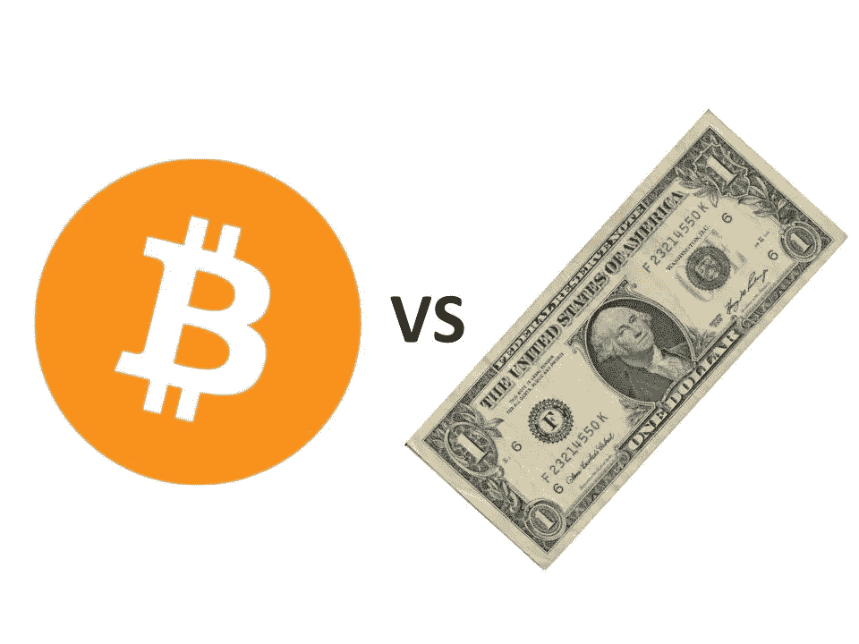
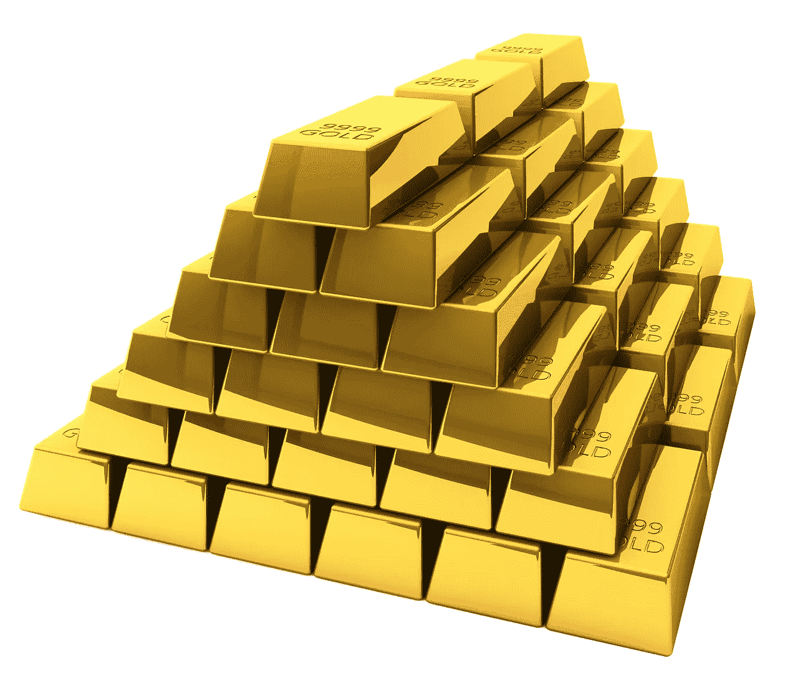
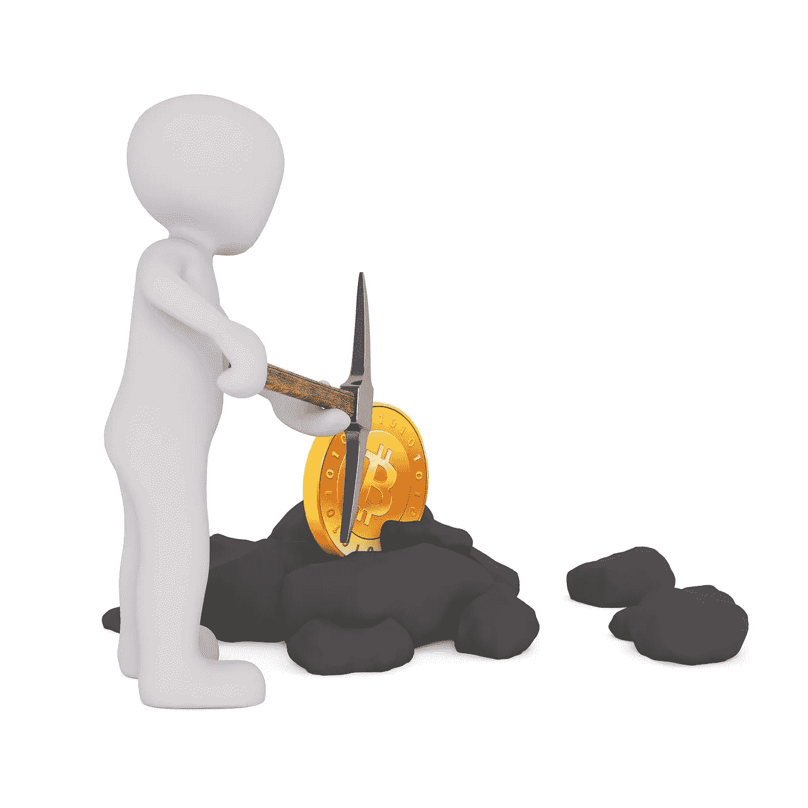

# 为什么是比特币？为什么不仅仅是美元？

> 原文：<https://medium.com/coinmonks/why-bitcoin-why-not-just-dollars-630c4e9d3bd7?source=collection_archive---------7----------------------->

source: pixabay.com

人们对比特币最常见的疑问是，“为什么是比特币？为什么不用美元呢？”

在这篇文章中，我将讨论为什么有些人不仅相信比特币将成为比美元更好的货币，还会讨论比特币如何为更富裕的社会做出贡献。

我在这篇文章中写的概念大多来自一个单一的来源；一本名为《比特币标准》的书，作者是 T2·赛弗迪安·阿摩斯。

## **为什么黄金会成为货币**

这本书的开头讨论了我们所知道的货币的历史，以及为什么黄金会成为最成功的货币形式。使黄金成为伟大的交易媒介的一些关键特征包括，与其他金属相比，黄金几乎坚不可摧，易于分割和组合。

作者指出了黄金**另一个被严重低估的重要特征**。

黄金供应的增长非常稳定且有限。即使面对黄金价格的大幅上涨，来自开采的黄金供应量的增加也是非常有限的。

## **为什么供货如此重要？**

黄金供应量的增长非常重要，因为如果有人能够将现有的黄金供应量增加一倍，就会从你所拥有的黄金中榨取储藏价值。这是因为每次货币供应量增加，都会对你所拥有的货币价值产生下行压力。想象一下，仅仅因为有人能够廉价地生产出更多的钱，你的储蓄价值就在不断贬值！

Ammous 认为黄金是可靠的货币，主要是因为其有限的供应增长保护了这种交换媒介的价值。

## **稳健/硬通货和成功的社会**

作者指出，纵观历史，每当政府兑现其货币供应时，他们往往会成为一个繁荣的社会。另一方面，每当一个政府欺骗了货币供应，这个社会就会受到损害。

## 不尊重货币供应的政府会是什么样子？

有时，政府欺骗货币供应，给自己“免费的钱”。在纸币出现之前，政府通过熔化金币并降低其价值来实现这一点。降低一枚硬币的价值意味着熔化金币并在其中加入一种更便宜的金属。

当一个政府降低一种金属的价值时，他们可能从 100 个硬币开始，但在加入一些其他金属后，他们可能会以 130 个硬币结束。

source: [pixabay.com](https://pixabay.com/en/gold-bullion-bars-feingold-bank-1013618/)

## **金本位期间**

在某个时候，社会将他们的经济体系转向金本位。生活在这个经济体系中的人们使用现金，但它有黄金做后盾。当政府实行金本位制时，现金可以随时兑换成银行持有的固定数量的黄金。

但是在这种情况下，政府也找到了印刷货币(价值)的方法。一些政府通过印刷更多的钞票而没有同等数量的黄金来支持，从而欺骗了金本位制。这意味着，如果每个人都试图同时将他们的现金换成黄金，一些人将无法提取他们的黄金。这是一个问题，因为人们使用现金进行交易的唯一原因是因为它有黄金支持。

## **健全货币对不健全货币的影响**

当政府印钞票时，它不是“免费的钱”。当你增加货币供应量时，没有免费的午餐。当货币被印刷或贬值时，它会从你的财产中榨取价值。突然间，你的钱能买到的东西变少了。这是一种无声的税收！

根据 Ammous 的观点，当政府兑现其货币供应时，它对一个社会的成功有着巨大的影响。这是因为稳健的货币是时间偏好的最大影响者。时间偏好是人们对现在和未来的重视程度。当你把未来看得比现在更重要时，你就被认为对时间的偏好较低。作者声称，健全的货币对时间偏好有重大影响的原因是，当价值在时间上受到保护时，人们会受到激励去思考他们的未来。

稳健货币(又名低时间偏好)社会倾向于:

*   经济繁荣，
*   体验更强的社会和家庭关系，
*   参与重大文化项目，以及
*   更关注长期任务。

相比之下，一个高度时间偏好(即时满足倾向)的社会**据称**更有可能卷入冲突，自我毁灭的行为和经历更多的道德失败。

source: [shutterstock.com](https://www.shutterstock.com/image-photo/euro-bills-stamp-mashine-330605327?irgwc=1&utm_medium=Affiliate&utm_campaign=Hans%20Braxmeier%20und%20Simon%20Steinberger%20GbR&utm_source=44814&utm_term=)

## **不健全的货币如何影响我们当前的经济**

在当今时代，各国放弃了金本位制。纸币不再能兑换成黄金。

根据 Ammous 的说法，大多数国家目前都有不健全的货币政策，因为他们一贯印刷现金，人为地保持低利率，以激励企业投资于能够促进经济发展的项目。Ammous 声称这是一个可怕的货币政策。通过人为地保持低利率，经济很难将资源分配到最需要的地方。这导致企业无法完成他们的项目，由于意外的价格上涨，导致失业和经济衰退。

根据 Ammous 的说法，如果各国采用稳健的货币，它们将不再经历商业周期的极端波动。

注意:Ammous 反对当前经济体系的论点在这篇短文中很难解释。如果你有兴趣深入了解他对我们当前经济形势的解读，请阅读第六章:资本主义的信息系统。

source: [pixabay.com](https://pixabay.com/en/bitcoin-bitcoin-mining-mining-mine-2714191/)

# **为什么是比特币？为什么不仅仅是美元？**

最后，我们到了有趣的部分。比特币怎么会是社会有史以来最健全/最坚硬的货币。

此前，黄金是社会有史以来最硬的货币，但金本位难以维持。它依赖于政府兑现其储备的黄金数量。如前所述，政府总是试图通过印刷比黄金更多的现金来降低美元的价值。

比特币是一种可能不会贬值的货币。目前，比特币的供应量为 [17，237，100](https://www.blockchain.com/charts/total-bitcoins) (截至 2018 年 8 月 27 日)，将存在的比特币总数为[2100 万](https://en.bitcoin.it/wiki/Controlled_supply)。比特币供应量的增加是预先确定的，也是可以预测的。

比特币的供应被编码到软件中，但这也取决于社会共识。修改比特币节点软件以接受不同供应设置的比特币在技术上是可能的，但目前，这在我看来不太可能。比特币社区坚决支持当前的供应上限。这是因为**他们感兴趣的区块链用例是健全的货币。**

## **比特币能否省钱，带来新的“黄金时代”？**

比特币标准中隐含的另一个概念是，每当社会中出现一种更健康的货币形式时，采用这种交换媒介的社会受益最大，而持有不太健康货币的人则损失了这种货币的价值。

比特币会不会成为下一个世界储备货币，把我们带入下一个“黄金”(比特币？)年龄？”这个论点肯定是令人信服的，但我很少在没有进一步调查的情况下相信第一次阅读的任何东西。我相信健康的怀疑态度对接近真相非常重要。

不管怎样，如果你对加密感兴趣，[Saifedean Ammous](https://www.amazon.com/Bitcoin-Standard-Decentralized-Alternative-Central/dp/1119473861/ref=sr_1_1?ie=UTF8&qid=1535391095&sr=8-1&keywords=the+bitcoin+standard)[的比特币标准](https://twitter.com/saifedean)是**必读的**。保持怀疑，但要不断学习。

## 喜欢你读的吗？在推特上关注我@ [jmartinez_43](https://twitter.com/jmartinez_43) 和 [Medium](/@julianrmartinez43) 。

> [在您的收件箱中直接获得最佳软件交易](https://coincodecap.com/?utm_source=coinmonks)

