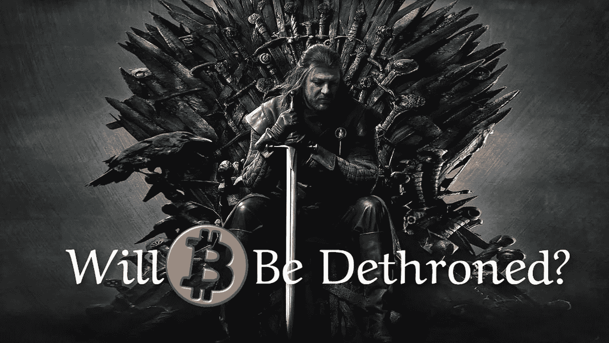

# 为什么比特币最终会被废黜

> 原文：<https://medium.com/coinmonks/why-bitcoin-will-eventually-be-dethroned-9b27bdf10d97?source=collection_archive---------1----------------------->

Image from: [Flickr](https://www.flickr.com/photos/bagogames/16632632814) ([Creative Commons Licence](https://creativecommons.org/licenses/by/2.0/)) (modified)

比特币正在主导加密行业，其他加密货币只是跟随其价格走势。比特币的价格对整个市场来说是决定性的，然而，在最近几年，BTC 的主导地位明显下降。

BTC 有最好的营销网络，不少有影响力的人都在游说支持它，然而，它也阻碍了发展和它的…