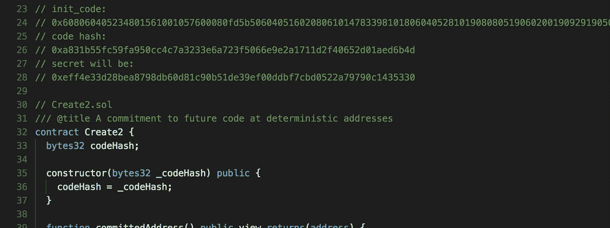

# 为什么要创建 2？

> 原文：<https://medium.com/coinmonks/why-create2-e99b6afcc28c?source=collection_archive---------0----------------------->

## 用创造做“不可能的事”

前几天，我深入以太坊 reddit 世界，注意到一些关于新操作码的潜在漏洞的讨论。被称为`create2`的操作码提供了一种创建契约的新机制；但是，`create2`不是在从创建者的地址和事务随机数派生的地址创建契约，而是在从契约的`init_code`、`address`和一些`salt`(任意值)派生的位置创建契约。更正式的说法是这样的:

> `keccak256(0xff ++ address ++ salt ++ keccak256(init_code))[12:]`

注意:从[规范](https://github.com/ethereum/EIPs/blob/master/EIPS/eip-1014.md)中不清楚`address`是发送演员的地址，还是某个任意的地址。我假设是前者(否则用`salt`就多余了)，但我不能确定。

这背后所陈述的思想是能够在部署之前预先确定契约的地址，这样，如果契约最终是必要的，那么它可能永远不会被部署(我相信这被称为“反事实实例化”)。

现在，这一切都很酷，但使用`create`已经很有可能了。我在几个地方指出了这一点，并且[很快发现自己与该方法的最初提议者之一进行了讨论](https://www.reddit.com/r/ethereum/comments/aosaly/create2_eip_vulnerability_questions/egf4f3b/?context=3)。为了清楚起见，`u/technocrypto`是一个来自 [L4 Ventures](https://l4.ventures/) 的[杰夫·科尔曼](https://twitter.com/technocrypto)，但是直到后来的谈话中，我才发现他显然有点别有用心。

他接着声称，在部署之前，在特定的地址提交特定的代码是不可能的。由于对这是否真的可能产生了兴趣，我开始摆弄一个原型。事实证明，这不仅是可能的，而且做起来也很简单。

在我们继续之前，我想稍微分解一下这个原型，从基本原理开始重新构建。他们的主要目标是证明在一个特定的地址提交特定的代码是可能的，而不需要实际部署那些代码。

The most minimal example

这是模式的核心。这基本上是我们都知道并且喜欢的工厂模式，但是它在到期前只能创建一个`Machine`。

然而，由于[合同地址是如何用](https://ethereum.stackexchange.com/questions/760/how-is-the-address-of-an-ethereum-contract-computed) `[create](https://ethereum.stackexchange.com/questions/760/how-is-the-address-of-an-ethereum-contract-computed)`生成的，我们可以在调用`commit`之前确定当`Machine`被部署时它将具有什么地址。当我们的`MachineCommitment`被创建时，我们现在确信`Machine`只能存在于从`MachineCommitment`的地址和`1`的随机数计算出的地址中。

如果我们愿意，我们甚至可以在 Solidity 中这样做:

> `address(keccak256(0xd6, 0x94, address(commitment), 0x01));`

然而，仅仅这种模式是不够的。这比天真地创建一个新的`Machine`要花费更多的精力来部署，因为`MachineCommitment`需要知道`Machine`代码才能部署它。

我们可以通过借用工厂模式来解决这个问题，本质上是将这个问题分解成几个组成部分:提交部署*一些代码*，提交部署*一些地址*。

我们最终得到的非常接近上面提出的原型:

The prototype with some annotations

旁白:我留下了一些调试(即事件)，因为这种特殊的模式在 ethfiddle 中不能正常运行，但在 Remix 中可以正常运行。真不敢相信

通过部署工厂，我们现在创建了创建一些特定代码的承诺。通过部署承诺，并且只提供工厂的地址，我们已经创建了一个特定地址的承诺。总的来说，这仍然以可重用和可移植的形式在*特定地址*提供对*特定代码*的承诺。

这种模式要解决的确切问题如下:

> 如今，如果没有依靠无密钥签名的疯狂炮制的多交易黑客，就无法保证非受信任方在异步情况下将特定代码部署到特定地址，无密钥签名被迫预先承诺特定的天然气价格，根据您的使用情况，甚至可能提前几个月或几年，如果您猜错了，所有状态都可能被永久破坏。

上面的模式正是这样做的:它承诺在需要代码本身之前将特定的代码部署到特定的地址。它不需要“多交易黑客”、“无钥匙签名”或“对特定天然气价格的预先承诺”。可以对模式进行简单的修改，以支持不可信或任意方作为部署者。除了最初的承诺之外，没有对涉及地址的交互的同步性做出任何假设。

当这种特殊的模式被作为一种解决方案提出时，人们的反应并不是注意到它确实是可能的，而是批评它的各个方面。

第一个批评是任何人都可以调用`commit`方法并自己消费承诺。这是真的，`commit`是一个任何人都可以调用的公共函数。然而，这可以用任何身份验证方案来解决，但实际上可能是将来需要的属性。当我们用这种模式实际构建一些东西时，我们稍后会回到这一点。

第二个批评是构造函数可能需要参数。然而，因为我们将我们的承诺与正在部署的代码紧密耦合，所以通过一些[细微的修改](https://gist.github.com/DeviateFish/eb992842c6d1a09f35ec93cf4fbb474d)这是可能的。

第三个批评是，对于将来要部署的每个契约，都需要一个特定的工厂。这是有效的，但同样，这仅仅是一个原型。我们可以通过多种方式实现这一点，但最简单的方式是借用[众所周知的代理模式](https://blog.zeppelinos.org/proxy-patterns/)来创建一个通用承诺:

A more generic commitment

正如您所看到的，这个承诺现在已经与正在部署的代码完全分离了。`factory`是一个通用地址，回退函数将所有调用数据转发给工厂，允许工厂上的任意方法被调用。在这个特定的例子中，可以使用来自已部署的`Factory`上的`getSig`的返回值作为对`Commitment`上的回退函数的调用的 calldata。

但是如果我们想更进一步呢？如果我们只是想要一些任意代码的承诺呢？事实证明我们也能做到。事实上，在我研究的这一点上，我意识到我不是第一个想出这个模式的人。

为了实现我们对任意代码的承诺的目标，让我们把所有的部分放在一起:

Ain’t that a sweet lil’ thang

所以，现在我们的`MachineCommitment`只是一个简单的承诺，在一个通用的`Deployer`契约的帮助下部署一些特定的代码，这个契约可以为我们部署代码。我们还得到保证，被部署的代码(可以说是`init_code`)是最初承诺的。我们仍然有两个必需的部分:对特定地址的承诺和对特定代码的承诺。

但是我们可以做得更好。我们根本不需要部署者，真的。使用上面的 delegatecall 方法减少了一些麻烦，但这并不是必需的特性，而且增加了复杂性。

相反，我们可以制定一个本身就是`create2`的契约。这真的很简单:

如果你想在稍微干净一点的环境中尝试一下(无意冒犯 ethfiddle，它只是缺少一些特性)，试着去 [Remix IDE](https://remix.ethereum.org/#optimize=false&version=soljson-v0.4.22+commit.4cb486ee.js) 把这段代码放在那里。您可以部署自己的`Machine`来捕获 init 代码值，并尝试部署不同的`Create2`承诺。这可能会稍微精简一些(例如，通过移除`committedAddress`助手)。此外，如果你想使用不同于上面提供的`init_code`，你需要自己计算`codeHash`。

我还把这个最终的表单[放到了一个要点](https://gist.github.com/DeviateFish/6241c6ab0c8cfc9221d3a40f3e0cd9ba)中，以防它需要更新或修复。

到目前为止，我们已经缩小了`create`能做的和`create2`能提供的之间的差距。事实上，两者之间唯一的区别是需要在链上发布`Create2`承诺。

既然我们已经提炼出一个模式，使我们能够在一个确定的地址提交任意代码…让我们使用它。在我的下一篇文章中，我会用这种模式创造一些东西。我不确定是什么。它可能是一个简单的国家频道，它可能是另一个彩票(lol)，或者可能是更奇特的东西，如混合器！本质上，混音器并不需要这种模式，但这可能还是很有趣的。

同样值得注意的是，这种模式的“最终形式”本身对这些应用程序并不十分有用。事实上，我认为我们会发现，在我们的实际实现中，我们最终会使用该模式的一些早期版本，因为我们实际上*希望*提交特定的、可验证的代码，因此不需要更通用的变体。

我很想听到*连贯的*反馈，关于这个模式不能做什么，而`create2`能做什么。如果您能够以编程的方式，或者至少以某种具体的方式来表述这些差异，那将是首选。我不感兴趣的是听到“我们为`x`需要`create2`”，而没有具体说明`create2`的潜在功能需求实际上是什么。

明显的区别是`create2`允许在特定地址提交特定代码，而不需要链上事务——这很酷，但看起来更像是一种优化。如果有人能描述为什么这不仅仅是一个简单的优化，我也很乐意听到。

> [直接在您的收件箱中获得最佳软件交易](https://coincodecap.com/?utm_source=coinmonks)

