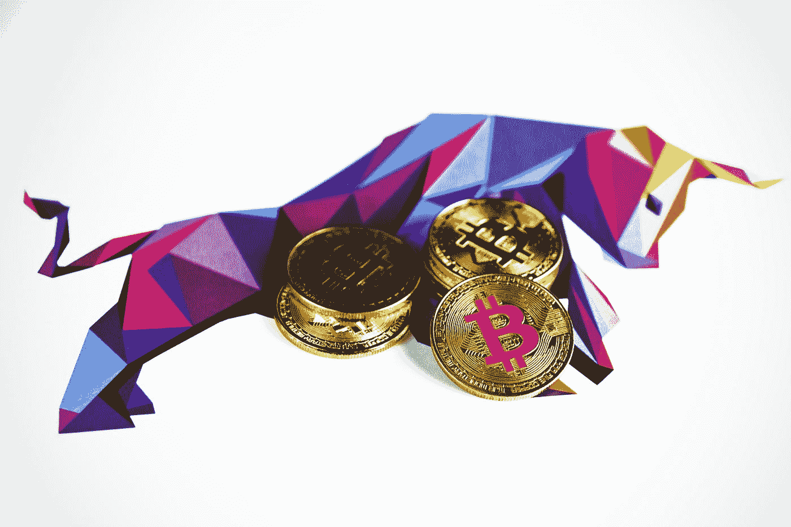

# 为什么加密比我们想象的更难在日常生活中实现

> 原文：<https://medium.com/coinmonks/why-crypto-is-much-harder-to-implement-into-everyday-life-despite-what-wed-like-to-believe-35f1ee6d2a54?source=collection_archive---------9----------------------->

由于技术和立法尚未协调一致

Photo by [Executium](https://unsplash.com/@executium?utm_source=medium&utm_medium=referral) on [Unsplash](https://unsplash.com?utm_source=medium&utm_medium=referral)

随着金融成功故事以前所未有的数量开始在互联网上流传，Crypto 已经成为现代投资领域的主要参与者。虽然毫无疑问，许多人已经从比特币、以太币、Doge 和更多的东西中获得了可观的财富，但是**未来是多么的可预见**