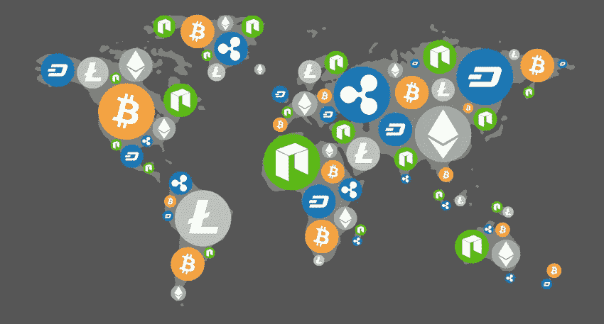

# 为什么尽管市场低迷，加密货币仍是未来

> 原文：<https://medium.com/coinmonks/why-cryptocurrencies-are-still-the-future-despite-the-market-downturn-8e5a772ce97b?source=collection_archive---------7----------------------->

[source](https://cryptosis.io/best-long-term-cryptocurrencies/)

在过去几年中，加密货币的受欢迎程度急剧上升，因此， [2017 年见证了 BTC 的泡沫](https://www.etoro.com/markets/btc)，以及许多其他加密货币、替代硬币和代币的泡沫。然而，2018 年初对市场来说尤其具有挑战性，随着泡沫开始破裂，价值大幅下降。尽管如此，该技术的许多支持者仍然认为加密货币仍将是货币的未来。在这里，我们仔细看看为什么可能是这种情况。

**对余币的影响**

加密货币仍将是货币的未来的一个关键原因是构成网络的区块链技术。区块链技术提供了安全加密、隐私、匿名和许多其他好处，世界各地的企业都开始利用这些好处。技术背后有如此多的潜力，以及加密货币本身可以提供的机会，尽管市场目前正处于低迷时期，但仍有更多的机会有待发现。金融业本身正在密切关注区块链技术对其安全措施的潜在影响，因此，他们更有可能采用加密货币作为其中的一部分。

**智能合约**

一些建立在 [ERC-20 框架](https://www.investopedia.com/news/what-erc20-and-what-does-it-mean-ethereum/)上的加密货币能够产生所谓的智能合同，这种合同高度加密，为交易提供了新的方式，也为企业提供了存储他们希望的任何形式的合同的方式。未来几年，智能合约可能会被大量企业采用，这表明一些加密货币背后的技术可能会继续存在，这有助于确保代币本身继续受到欢迎。更高的安全性以及合同一旦在网络上生效就不能被修改或篡改，有助于确保所有金融机构保持一定程度的透明度，这是许多个人认为他们目前所缺少的。

**代币&替代币**

当人们想到加密货币时，他们通常会想到比特币，在某些情况下还会想到以太坊。然而，有大量的代币和代用币正在进入市场，并继续由公司甚至国家开发！事实上，韩国准备开发自己的加密货币，被称为 S 币，以进一步推动市场。随着 TRON 等公司提前(3 月 31 日)推出其测试网，以帮助改善当前市场，加密货币、替代硬币和代币似乎正在共同努力，以帮助改善市场稳定性，并看到他们的加密货币再次开始增长。

**市场波动**

虽然市场目前似乎在挣扎，但加密货币的波动性是有据可查的。因此，许多投资者将继续转向加密货币，帮助巩固他们在全球范围内的未来。虽然动荡的市场导致许多加密货币的现有持有者转向“HODL ”,但这并不意味着人们在价格保持低位时不会继续寻求投资。市场获得的投资越多，就越有可能扭转局面，继续增长。提高这一投资水平的关键是加强监管，这可能有助于进一步稳定市场。

**规定**

在世界范围内，各国都在寻求以多种方式监管加密货币——有些是出于对加密货币将如何影响日常生活各个方面的担忧，有些是为了帮助改善市场。虽然加密货币确实带有某种形式的历史污点，但世界各地的一些监管形式实际上可能有助于提高市场稳定性，因此使市场处于比目前更好的位置。日本等国家也在考虑让交易所变得自我监管，由独立机构充当合规部门，以确保加密货币保持其去中心化的性质。

加密货币在过去 18 个月中受欢迎程度激增，尽管自 2017 年 12 月以来市场波动特别大，但有迹象表明，它可能很快就会开始好转。随着监管机构寻求稳定市场，以及各行各业的许多企业寻求采用区块链技术，加密货币仍然有很大的潜力成为货币的未来。