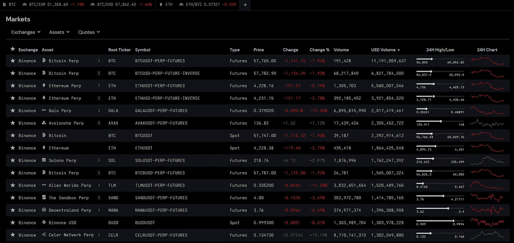

# 为什么是“加密货币”市场？

> 原文：<https://medium.com/coinmonks/why-cryptocurrency-market-55b503a3185b?source=collection_archive---------17----------------------->

对许多人来说，加密只是一项风险投资，年轻一代容易上当。它以疯狂的回报和频繁、严重的崩盘而闻名。对我来说，作为一个交易者，这是你能想象到的最好的市场。在这个故事中，我想解释为什么我在这个蓬勃发展的市场交易和投资。

# 波动性

波动性，也被称为“风险”，是所有交易者的氧气。很简单，如果你没有波动性，你就没有机会进行有利可图的交易。如果机会很低，交易者有几种方法增加他们的机会(就像在大多数传统市场)。一种方法是使用杠杆，这可以使即使很低的波动产生很高的利润或损失。另一个方法是扩展你的时间范围；它越高，市场产生的波动就越大。同样，像细价股这样的交易市场可以给交易者带来自然的高波动性和机会。

所有这些在市场上创造机会的传统方式都有相当大的缺点。杠杆是危险的，因为追加保证金通知不能让你充分利用你的保证金来下跌——如果你错了，你的可用下跌空间低于“理论”平仓价格。杠杆通常也意味着支付额外的融资费用(例如期货市场)。另一方面，增加你的时间范围通常也不是一个方便的解决方案。宏观经济或趋势变化很快，让你的交易发展超过几个月会有改变你最初分析的风险。除非你是一个高时限的投资者，否则增加你通常想花在交易上的时间几乎没有好处。时间是终极货币，算机会成本。当谈到细价股或其他利基市场，如异国情调的外汇对自然高波动性，他们有一个很大的缺点；缺乏流动性。作为散户交易者，你经常有高得惊人的差价，并且不能快速平仓。即使你最初的分析是正确的，在这些市场上赚钱也更难了。

加密货币市场因其高投机价值导致的高波动性而闻名。一天它是新的范例，而另一天它看起来毫无用处。这是一个发现和抓住机会的完美场所，不需要等待数年来完成交易，也不需要使用高杠杆来实现交易。

# 流动性和经纪人

对于加密市场所能提供的波动性水平来说，它对于零售流动性来说是非常好的和可获得的。在像 BTC/美元(或其衍生品)这样的交易对中，我们可以获得很高的波动性，几乎没有价差。使用收费合理的大型交易所可以让你在几秒钟内以低至 0.1%的费用+整个头寸规模的差价进出头寸。

此外，快速更换你的“经纪人”也很容易。将你的资金从一个交易所转移到另一个交易所只需要一次加密交易，不到 15 分钟。这里没有废话，你不满意，你离开。而且你做得很快，没有任何手续。这在交易所及其服务之间形成了竞争，与大多数 tradfi 零售交易经纪平台相比，交易所及其服务的标准较高。0%的制造商费用正在慢慢成为这里的标准。

与 UX 的 Robinhood 或其他零售交易经纪人相比，这是一个有利于加密的实质性差异。

# 派生物

对于交易不同类型的衍生品，如期货，永久掉期或期权的粉丝来说，加密市场已经涵盖了你。有各种集中和分散的交易所提供不同类型的衍生产品，这些衍生产品的可交易性不亚于其 tradfi 交易对手；高流动性和公平交易执行。

# 产量

这是人们最容易忘记的事情之一。加密为 tradfi 市场提供了更高的收益。对所有寻求收益的交易者来说，下注令牌和稳定硬币是一个很好的工具。DeFi 流动性池和交易所，如 Aave 或 Bancor，都是借入和存放资产的好地方，利率公平透明。DeFi 是另一篇文章的主题，因为它对一个加密新手来说是一件复杂的事情，但总的来说，它对交易者和投资者来说都是一个很好的工具。

Aave liquidity protocol allowing for taking out under-collateralized loans and placing yield earning deposits.

# 心态:市场的本质

加密是一个高度投机的市场。它围绕着分布式金融或数据系统的技术。大多数可交易的货币对都是这种系统的本地令牌，需要使用它们。BTC 是比特币网络的原生令牌；ETH 是以太坊网络的原生令牌…等等。这些网络具有不同的效用和特征，使得它们在不同的方面有用。智能合约、NFT、分散式数据交付和可加密验证的计算……所有这些都为加密货币经济奠定了基础，这可以与互联网的早期发展相媲美，当时它还很新，没有被日常使用，与之相关的项目是一种投机性资产类别。

Example of a smart contract, source: [https://www.bitpanda.com/academy/en/lessons/what-are-smart-contracts-and-how-do-they-work/](https://www.bitpanda.com/academy/en/lessons/what-are-smart-contracts-and-how-do-they-work/)

正如互联网公司在 90 年代末和本世纪初的市场一样，今天的加密货币市场是一个投机泡沫。与稳定的大宗商品市场和市值较大的股票市场相比，这类市场经历兴奋和投降阶段的速度要快得多。换句话说，随之而来的波动和机会要大得多。

这个市场在很大程度上受到情绪和快速变化的叙事的驱动。人们可以说这是一个有毒的环境，一个项目的投资者试图向全世界证明，他们的令牌是下一个比特币或以太坊，将使每个人都变得富有。在这个领域有很多骗局和欺诈，试图利用误导和天真的投资者。这是金融市场真正的狂野西部。成千上万的机会和大量的风险。

这不应该被认为是一个不利因素。对于一个有意识的交易者来说，这是一个天堂。贸易思想在数量和质量上几乎是无限的。你可以获得高波动性，而出色的流动性只需支付很少甚至没有费用。加密 DeFi 市场的收益率优于传统市场的收益率。当然，这伴随着更高的“风险”，但就我个人而言，我更愿意信任开源和加密保护的协议，而不是传统银行的*“兄弟，请相信我们”*叙事。

# 关键要点

如果你没有情感投资，不相信*“快速致富”*的虚假叙述，而是将市场视为交易和产生资本收益的工具——我认为与传统金融相比，加密很少或没有缺点。

当然，要持续赚钱，你需要有财务意识，了解你交易/投资的市场的基本原理。当然没有“轻松赚钱”的事情，我也不是说 crypto 适合所有人。但是，如果你是一个交易者或投资者，我当然会建议尝试一下 crypto，并使用它提供的工具。

我的推特:【https://twitter.com/basedcrypto77 

> 加入 Coinmonks [电报频道](https://t.me/coincodecap)和 [Youtube 频道](https://www.youtube.com/c/coinmonks/videos)了解加密交易和投资

## 也阅读

 [## 杠杆代币[多头代币]终极指南

### 杠杆化令牌是具有杠杆化风险敞口的 ERC20 令牌，不考虑保证金、要求、管理…

medium.com](/coinmonks/leveraged-token-3f5257808b22)  [## 最佳加密交易所| 2021 年十大加密货币交易所

### 编辑描述

blog.coincodecap.com](https://blog.coincodecap.com/crypto-exchange)  [## 2021 年最佳加密借贷平台| 6 大比特币借贷平台

### 获得比特币和其他加密货币的最佳贷款利率

medium.com](/coinmonks/top-5-crypto-lending-platforms-in-2020-that-you-need-to-know-a1b675cec3fa)  [## 2021 年最佳免费加密交易机器人

### 2021 年币安、比特币基地、库币和其他密码交易所的最佳密码交易机器人。四进制，位间隙…

medium.com](/coinmonks/crypto-trading-bot-c2ffce8acb2a)  [## 最佳 4 个加密交易信号电报通道

### 这是乏味的找到正确的加密交易信号提供商。因此，在本文中，我们将讨论最好的…

medium.com](/coinmonks/best-crypto-signals-telegram-5785cdbc4b2b)  [## 5 个最佳社交交易平台[2021] | CoinCodeCap

### 编辑描述

blog.coincodecap.com](https://blog.coincodecap.com/best-social-trading-platforms)  [## BlockFi 评论 2021:利弊和利率| CoinCodeCap

### 编辑描述

blog.coincodecap.com](https://blog.coincodecap.com/blockfi-review)  [## 如何在印度购买比特币？2021 年购买比特币的 7 款最佳应用[手机版]

### 如何使用移动应用程序购买比特币印度

medium.com](/coinmonks/buy-bitcoin-in-india-feb50ddfef94)  [## 加密税务软件——五大最佳比特币税务计算器[2021]

### 不管你是刚接触加密还是已经在这个领域呆了一段时间，你都需要交税。

medium.com](/coinmonks/best-crypto-tax-tool-for-my-money-72d4b430816b)  [## 存储比特币的最佳加密硬件钱包[2021] | CoinCodeCap

### 编辑描述

blog.coincodecap.com](https://blog.coincodecap.com/best-hardware-wallet-bitcoin)  [## Pionex 评论 2021 |免费加密交易机器人和交换

### Pionex 是为交易自动化提供工具的后起之秀。Pionex 上提供了 9 个加密交易机器人…

medium.com](/coinmonks/pionex-review-exchange-with-crypto-trading-bot-1e459d0191ea)