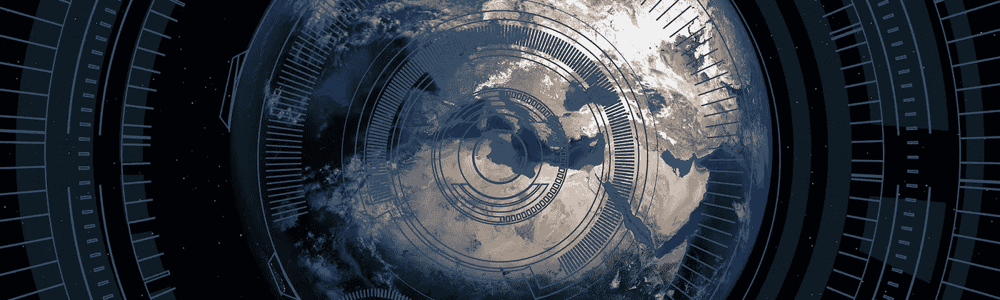
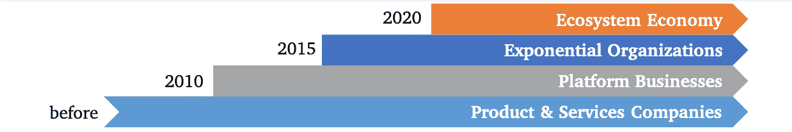
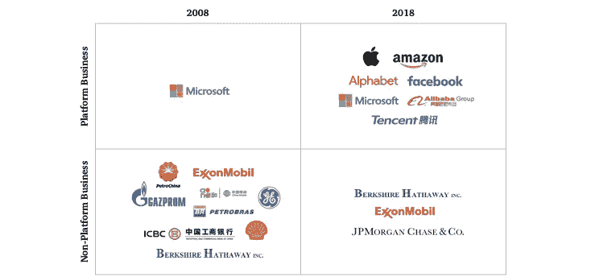
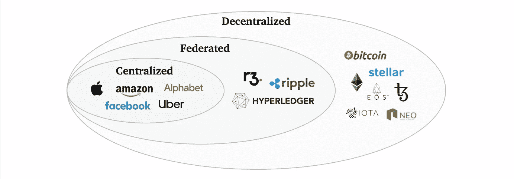
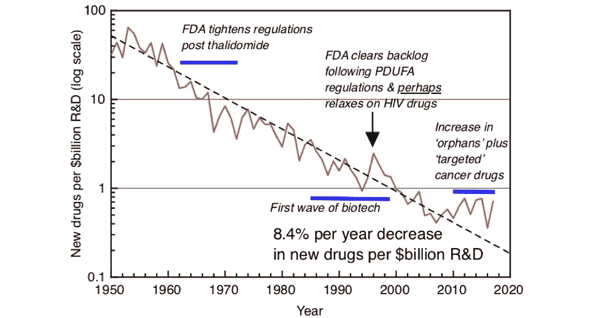

# 为什么加密网络正在吞噬世界

> 原文：<https://medium.com/coinmonks/why-cryptonetworks-are-eating-the-world-7a147919c7ac?source=collection_archive---------0----------------------->

## 生态系统经济中的权力下放

*2011 年，马克·安德森撰文讲述了为什么* [*软件正在蚕食世界*](https://a16z.com/2011/08/20/why-software-is-eating-the-world/) *。各行各业的商业模式都受到了软件的挑战，然而机构投资者却不看好科技公司，人们会问“这难道不是一个危险的新泡沫吗？”—听起来很熟悉？*

## 生态系统经济

尽管存在疑虑，但技术从那时起就一直在扼杀公司:在过去的 60 年里，标准普尔 500 指数公司的平均寿命从 61 年下降到仅仅 18 年。如今，全球公司年收入的 50%来自过去 3 年内推出的产品。

占主导地位的企业曾经是资源、产品和服务公司。不过，让公司长期保持相关性的新商业模式已经出现。随着 iTunes 和 App Store 的出现，[平台业务](https://en.m.wikipedia.org/wiki/Platform_economy)开始接管，价值通过[促进相互依赖的群体(通常是消费者和生产者)之间的交流来创造](https://www.applicoinc.com/blog/what-is-a-platform-business-model/)。自从优步& AirBnB 以来，[指数组织](https://exponentialorgs.com/)模式正在传播，新的组织技术&被用于从自有资产中创造比同行大 10 倍的产出。

Evolution of business models: From creating products to coordinating ecosystems.

[生态系统经济](https://www.mckinsey.com/business-functions/digital-mckinsey/our-insights/adopting-an-ecosystem-view-of-business-technology)是这一演变的下一步:公司开始将核心业务功能与第三方网络&平台整合。这使他们能够更快地按需扩展，从超越其自身组织界限的规模经济中受益，并有可能获得以其他方式无法获得的资源。

## 改变商业模式

这种商业模式演变的影响显而易见。如果你比较一下从 10 年前到今天市值最大的 10 家公司，你会发现拥有平台商业模式和/或 T2 指数组织的公司数量已经从 1 家增加到 7 家。看看私营公司，如今排名前五的[独角兽创业公司](https://www.cbinsights.com/research-unicorn-companies)中有四家也是如此(字节跳动、优步、AirBnB、&滴滴出行)。

Platform businesses among top10 companies 2008 vs. 2018

尽管生态系统经济是这些模式中最年轻的，大多数生态系统甚至还没有完全开放，但一些[公司已经从生态系统参与中获得了 5%或更多的收入增长](https://www.accenture.com/us-en/insights/strategy/cornerstone-future-growth-ecosystems)。该研究的作者预计，5 年后，标准普尔 500 指数中的 80%将涉足多个行业生态系统，7 年后，今天的行业领导者将转变为跨越多个市场的纯生态系统公司。

## 从集中到分散

正如克里斯·伯恩斯克最近所说的那样，加密网络不是公司。它们是推动生态系统经济的三种生态系统类型之一:

1.  **集中式**:由一家公司创建并运营；这些是技术平台和零工经济公司的平台业务。
2.  **联盟**:由行业联盟开发；基于(许可的)区块链解决方案的可信网络。
3.  **分散式**:密码网络；使用协议代替治理的新兴经济体，各自专注于单一服务

这三者并不相互排斥。大型科技公司已经创建并建立了集中式生态系统，行业参与者团体正在创建联合式生态系统(尽管速度缓慢)，分散式生态系统正处于成为主流的临界点。

Three types of ecosystems powering the Ecosystem Economy

有一种从集中到联合并最终分散的支持加密网络的自然趋势:没有人希望竞争对手来运行生态系统，联盟需要大量时间，在几次数据隐私丑闻之后，至少有一点点人会信任第三方的个人数据。简而言之，生态系统需要信任，而建立信任的能力限制了生态系统的覆盖范围，并使采纳变得缓慢而令人厌倦。另一方面，分散的生态系统在不信任的前提下工作(即没有信任的情况下工作),并且能够从第一天开始扩展。

## 增长岌岌可危

从第一天起就需要大规模可及的新生态系统，这比它最初看起来更相关。利害攸关的不仅仅是一些边际价值的提高，而是我们维持科学进步和经济增长的能力。今天，我们越来越多的思考是并行发生的，这是由受过高等教育和专业化的全球社会推动的，例如 [90%的博士现在还活着](https://www.lesswrong.com/posts/SwBEJapZNzWFifLN6/the-funnel-of-human-experience)。然而与此同时，[研发生产率呈指数下降](http://www.softmachines.org/wordpress/?p=2294)(这种现象被称为“埃鲁姆”定律，是“摩尔”定律的反向解读)，这对[药物研究尤其具有毁灭性](http://www.softmachines.org/wordpress/?p=2243)。

Eroom’s law in action: Declining drug research productivity over time

随着效率与我们的努力失去同步，生产力不断下降，可用于投资的资源越来越少，我们很快就有达到上限的风险。我们需要提高合作效率，为此，我们需要建立并利用这些新的生态系统。

> [直接在您的收件箱中获得最佳软件交易](https://coincodecap.com/?utm_source=coinmonks)

