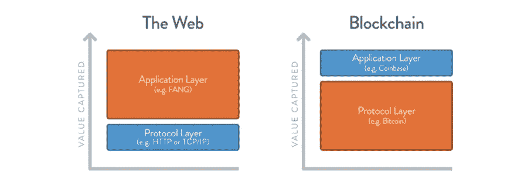
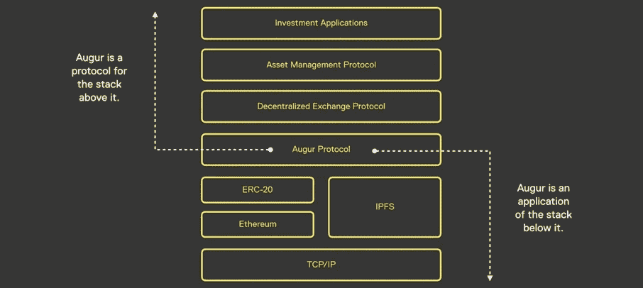

# 为什么 DApps 很重要——试图进行类比

> 原文：<https://medium.com/coinmonks/why-dapps-matter-an-attempt-to-draw-parallels-35a20882923a?source=collection_archive---------2----------------------->

**以开发者为中心的生态系统**

大多数技术驱动的和以开发者为中心的生态系统都以相似的模式和可比的框架发展壮大。

首先是基础设施及其早期信徒，他们开始构建基础设施的关键支柱和构建模块。一旦基础设施足够成熟，可以转变为平台，这些平台就会吸引开发人员。在每一个以开发者为中心的生态系统中，这都是一个重要的转折点——开发者开始构建产品，产品吸引用户，用户产生使用量和(理想情况下)收入流，这些收入流可以再投资到产品中，等等。

在我之前的公司[appr upt](https://www.adcolony.com/)——一个移动广告平台，在应用商店推出后不久的 2009/2010 年，在生态系统的早期，它开始专注于应用开发者——我们已经在这样一个生态系统的中心呆了多年。

移动生态系统从主要由基于 palm 手持设备的零碎的 [WAP](https://en.wikipedia.org/wiki/Wireless_Application_Protocol) 浏览体验驱动的东西发展成为由更复杂和更强大的移动设备(首先是 iPhone)、一定密度的移动数据计划、移动软件开发工具包(SDK)及其各自的应用商店形成的生态系统，这些构成了构建模块，为我们所知的开发者驱动的应用创新的巨大浪潮奠定了基础。

虽然我很清楚，在今天的分散式生态系统中，与移动技术的早期相比，显然存在着根本性的技术(和意识形态)差异，但我将尝试提出一个理由，说明为什么我相信我们会看到一个类似的模式，即创新和经济价值将如何在生态系统的技术堆栈中向上发展，从基础设施/第 1 层协议到应用程序层，其中大部分将在长期内被捕获。

**胖协议和瘦应用？**

2016 年[乔尔·莫内格罗](https://twitter.com/jmonegro)发表了臭名昭著的[肥胖协议论文](http://www.usv.com/blog/fat-protocols)。他表示，底层协议的市值增长总是快于构建在其上的应用的总价值，并表示应用的成功推动了协议层的进一步投机。在过去的 20 多年里，web 1.0 和 2.0 互联网协议提供了巨大的价值，而在此之上的应用层获得了大部分价值——GAFA 的强大足迹可能是今天最明显的证据。

分散的 web 生态系统似乎已经颠覆了这种模式，它的大部分价值都是在基础/第 1 层协议(如以太坊)中获取的。

Source: [http://www.usv.com/blog/fat-protocols](http://www.usv.com/blog/fat-protocols)

虽然直到最近我还清楚地分享了这一观点，但纵观今天所有主要平台的 DApp 开发者社区，我在过去 6 个月中的许多对话和观察让我回想起移动应用生态系统的早期以及我们开始 apprupt 的时候。

回顾过去，我不一定会说 fat 协议的论点是完全错误的，但至少我们应该尝试采取一种更加不同的观点，来区分我们定义的协议和我们定义的应用之间的界限。

从抽象的角度来看，协议是一组规则、模式和标准，它们规定了网络中两个或多个参与者之间的通信和行为。正如[杰克·布鲁卡姆](https://twitter.com/jbrukh) [指出的](https://blog.coinfund.io/fat-protocols-are-not-an-investment-thesis-17c8837c2734)，在技术栈中，这意味着每一层功能最终都是上一层的协议和下一层的应用。使用 Augur 作为例子，它因此将是用于它上面的栈的协议和它下面的栈的应用，例如以太坊区块链。

Source: [https://blog.coinfund.io/fat-protocols-are-not-an-investment-thesis-17c8837c2734](https://blog.coinfund.io/fat-protocols-are-not-an-investment-thesis-17c8837c2734)

由于 auger 应用程序中的每个交易都是以太坊上的一个交易，因此 auger 通过交易和网络费用将其利用率作为底层协议投射到以太坊上。Augur 的任何附加值在 [REP](https://coinmarketcap.com/currencies/augur/) 中捕获，作为应用程序交易平台的未来贴现现金流的反映。

因此，如果一个人打算获取占卜的价值，他或她应该购买并持有 REP，而作为基础协议的以太坊的价值将由 ETH 作为本机令牌获取，这反过来反映了协议的未来贴现现金流，即汽油付款。

**管理气体**

当我们看到与 Augur 不同的应用程序时，这种不同的观点变得更加清晰，这些应用程序不带有专有的应用程序协议或令牌，而是在以太坊之上本地构建，以非常纯粹和简单的方式利用平台。

有越来越多的[这种 dapp——目前主要是游戏和赌场应用。在一个非常简单的形状和形式中，这些游戏只不过是一个聪明的契约，有着杂乱的设计，生活在区块链上，接受以太，让你开始互动和游戏。](https://www.trustnodes.com/2018/04/15/ethereum-now-1200-dapps-highlights)

通过这些应用程序，终端消费者与基础协议本身的接近度相对较高，同时几乎直接与基础协议进行交互——天然气和交易费用的管理将是客户体验中的一个关键要素，更重要的是避免超额支付天然气，更重要的是避免支付天然气不足。

开发人员很可能会发现，他们最终将为与他们的产品进行交互的最终用户管理 gas ( [让其管理](/loom-network/announcing-zombiechain-an-eos-like-dpos-sidechain-for-ethereum-dapps-e0eba6c244da)或[标上“it](https://steemit.com/eos/@cryptofreedom/a-smart-contract-platform-without-transaction-costs-or-the-need-for-gas-will-finally-make-dapp-development-practical-an) ”)，以最大限度地减少用户对 gas 概念的接触，从而增强客户体验，特别是消除支付 gas 不足和无法进行交易的风险，这是该概念的一个元素，如果对(普通)最终消费者来说不是令人沮丧的话，也是相当令人困惑的。

对于开发者(以及他们各自的用户)来说，管理天然气只有在实际天然气价格不超过交易价值的一小部分的情况下才有(经济)意义，让他们有机会通过利用该平台并在其上推出产品来产生可观的利润——否则没有人会使用 DApps，更不用说构建它们了。

这种关于应用程序的交易成本与其交易价值的单位经济学的不同观点也应该适用于生态系统的整体经济学的更全面的观点。如果单个应用程序的交易价值必须超过底层平台的交易成本，才能产生经济效益，才能发展壮大，那么所有交易的总价值也应该超过生态系统中所有应用程序各自的交易成本总额。

当你考虑这一点时，似乎更明显的是，这个生态系统的长期经济价值的很大一部分将在应用层上被捕获——要么附在专有协议令牌上，要么作为现金流和利润的集合坐在 DApp 开发者的钱包里。这正是我们可以在一些早期的小游戏中看到的——以 [Etherroll](https://dappradar.com/app/10/etheroll) 为例，这是一款早期且更“频繁”的基于以太坊的游戏，目前拥有 5300+ETH 的余额，这对一款设计相当糟糕的游戏来说是一个很大的数字，平均为< 50 DAU，很可能违反了赌博法规。

**坚持到底——基础协议的商品化**

在 apprupt 的早期，我们会为早期的应用程序开发者提供专有的广告 SDK，一旦集成到应用程序中，我们就可以聚合所有的广告位置，为应用程序的用户群提供广告，优化广告投放，并为开发者增加广告收益。作为一家由[风险投资支持的](https://techcrunch.com/2010/05/06/apprupt-affiliate-network-for-mobile-apps-closes-financing/)初创公司，不自己开发技术平台似乎是不可想象的，我们会在开发者社区面前为自己能够为他们提供广告基础设施的专有元素而自豪。

尽管广告服务平台远不能与区块链协议相提并论，但我仍然相信，从开发者的角度来看，这一切都有着相似的动力。

一旦生态系统成熟，应用开发者社区增长，作为开发者应用中数字广告的底层处理层的广告服务系统就被商品化了。一个平台相对于另一个平台没有情感优势，我们在他们发布第一个应用程序的早期接触的那些开发者也没有给我们任何无限的先发优势。

你曾经与一个开发者的应用集成在一起，但最终对他们来说最重要的是价格(就产生的广告收入而言)、性能和稳定性。一旦有另一家厂商能够在同等性能和稳定性的情况下产生更多的广告收入，开发者就会把你踢出去，然后毫无悔意地更换。

最终，根据我的观察，对 DApp 开发者来说，同样重要的将是价格、安全性和可扩展性——同样安全和可扩展的平台将在价格上竞争，我们甚至可以预计开发者将在未来某个时候构建平台无关的 dapp，这将进一步增加交易成本的压力。

分叉的可能性和简易性以及协议和链之间潜在的互操作性和可互换性可能会进一步增加商品化，而第 1 层协议之间的更多竞争只会进一步降低成本。所有这些都将导致基础协议层作为普通处理层的商品化——在更大的规模上，但以类似于广告服务系统的方式作为应用广告空间的处理层。

虽然 forks 通常会在分散的生态系统中创造更多的创新和公开竞争，但这也意味着单个协议可能会在未来针对更多的利基和垂直用例，这样做将通过成为仅促进非常特定类型的交易的处理层来单独获取更少的价值。

最终，所有第 1 层协议都将在可伸缩性和安全性的最终(意识形态的)[权衡下竞争和运行。一些 DApp 开发人员将牺牲可伸缩性而不是安全性，而另一些人将偏好可伸缩性而不是安全性，但是大多数人将发现他们自己处于两者之间，这取决于他们实现产品的个人用例和市场需求。开发一个去中心化的骰子游戏的开发者可能比开发一个去中心化的市场来进行证券交易的人有更多的需求，并且可能不需要一个在没有政府能够摧毁系统的核战争中生存下来的平台。](/blockchain-capital/the-long-game-in-crypto-why-decentralization-matters-fd681ff5ed0)

派生一个协议有一定的风险，并且[增加了碎片化](https://bitcoinmagazine.com/articles/monero-just-hard-forked-and-it-resulted-four-new-projects/)，但是也可能发展成一个标准程序，以满足特定的用例，这些用例具有相当特殊的需求，当这些特殊市场中的个别机会变得足够大时，可以处理这种权衡。

另一方面，这可能只会导致单个协议捕获的价值更少，从而将价值从(利基)协议处理层转移到应用层，这是我们在未来几年将看到开发人员驱动的创新高度集中的地方——基于“DApp/DApp”的交易成本与交易价值的比率以及整个生态系统在其堆栈中所有层的聚合具有相同的经济影响。