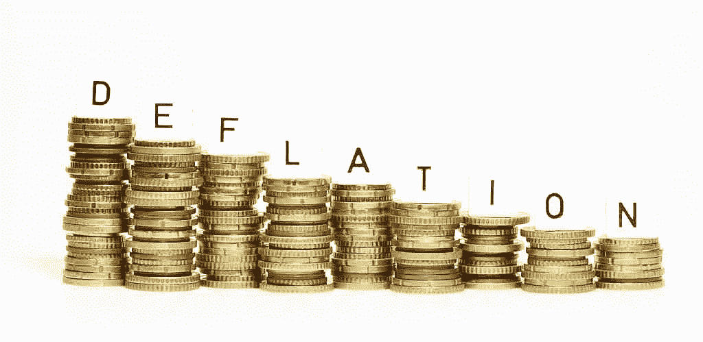
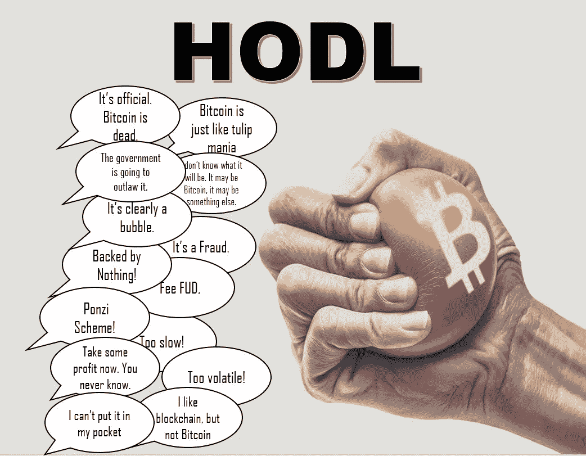
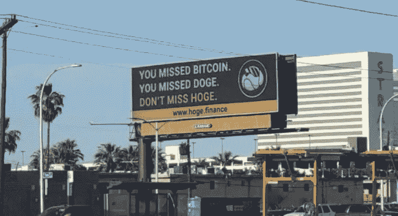
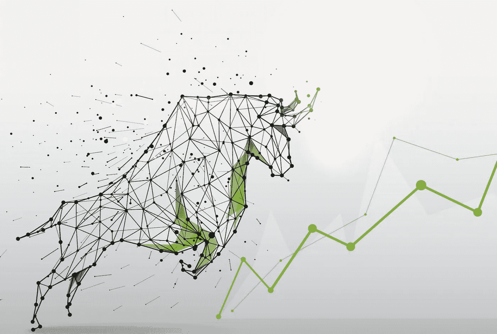

# 为什么通货紧缩的加密货币是未来

> 原文：<https://medium.com/coinmonks/why-deflationary-cryptocurrency-is-the-future-6762ffbcd53e?source=collection_archive---------2----------------------->

The opposite of Fiat inflation, and the key to crypto’s success

# 比特币、总督和 FUD

在过去的 10 年里，像比特币和 Doge 这样的项目一直处于加密世界集体意识的最前沿。无论如何，这都不是一件坏事。后者有着令人难以置信的历史和机构成长，而前者则是关于社区、迷因和埃隆泵。

它们本身是值得尊敬的项目，然而，它们一点也不经得起未来的考验。由于恐惧、贪婪或两者兼而有之，这两者都非常容易受到市场操纵的影响，因为大鲸鱼会立刻出售(或情绪化的亿万富翁会在推特上发微博)它们持有的股票。虽然比特币最终进入流通的数量有上限，但 Dogecoin 没有，并将永远每天增加 1.4 万个。

Don’t let FUD get to you. HODL through the dips!

这造成了许多情况，在正常情况下，像比特币这样的硬币会泵出，但鲸鱼随后倾倒了一个巨大的袋子，导致比特币跳水。当 Doge coin 最大的几家公司(持有 Doge 发行量的很大一部分)决定获利时，Doge coin 也可能会出现同样的情况。

就 Dogecoin 而言，当散户投资者很难买到超过每日产量的东西时，看到 Dogecoin 的价格持平，我不会感到震惊。

这如何规避？

# 输入通货紧缩的迷因令牌

答案是通缩、反鲸、反倾销的象征经济学。当然，无论如何都会有下降，因为不可能有一个不下降的令牌，但是这些参数有助于创造稳定性——甚至在早期。

HOGE’s new billboard in Las Vegas!

这些概念在包括慈善捐赠、NFT 支持或名人支持等形式的效用后变得更好。构成使用这些令牌组学的所有令牌的基础的魔法是无摩擦产量农业。

这种特殊的耕作方式无需你做任何事情，除了像 Metamask 一样把包放在钱包上。这种自动堆叠的工作原理是这样的:每一笔这样做的项目买卖都由项目的创建者按预定的百分比征税。

这一比例通常在 1%到 5%之间，大部分或全部税收被重新分配给目前持有该项目的每个人。

# 这完全是象征性的

我也看到了这种通货紧缩方法的一些替代方案，其中一些硬币将征收高达 12%的交易税，以重新分配给持有者，燃烧一些供应，甚至有一个钱包用于营销或捐赠给慈善机构。

你在这样一个项目上投入的资金越多，通过税收的重新分配，你将获得越多的回报。更好的是，如果你从再分配过程中每天赚 3 美元，硬币涨了 5 倍，你每天会看到 15 美元(或多或少取决于每天的交易量)。如果你对同一个项目保持足够长的时间，你就能让你的包翻倍(或更多)。

如果能找到一个基本面好的好项目就更是如此。尤其是如果你在它首次推出的一周内买入的话。这应该不会太难，因为自从 Safemoon 的发展和成功以来，已经出现了许多模仿者，而且许多这些硬币也有类似的令牌组学。

A good example of the kind of memes created for a project called HappyCoin

你会看到这些硬币在社交媒体上疯狂兜售，承诺月亮和轻松的 100 倍。他们会声称流动性被锁定多年，并为了透明而欺骗开发商。有些人甚至在市场营销、NFT 市场和慈善捐赠上花费巨资。

# 总是自己做适当的研究，不要相信别人的话。

当面对这些看似不可思议的机会时，做自己的研究并深入了解这些项目为了潜在的利润牺牲了多少安全是非常重要的。也就是说，我会写一篇单独的文章，讨论我发现的可行的、最终有利可图的小额 alt 币的方式。

现在，请记住，在币安智能链上可以找到很多这种无摩擦产量农业硬币。BSC 极其低廉的天然气费用(每笔交易大约 20-30 美分)使币安智能链成为新项目的完美滋生地。

# 盈利利润

到目前为止，我已经在这些小盘股项目上投入了大约 2000 美元，我的钱已经翻了三倍多——直到埃隆在推特上发布了关于抛售比特币的消息，把一切都搞砸了(但这是另一篇文章的内容……)尽管如此，由于这些项目和我一路走来所学到的东西，我仍然比开始时进步了很多。

如果我的这些投资中有一项达到 50 亿或 100 亿的市值，我就会坐拥一大笔改变人生的钱。当你考虑到如果这些硬币可以持续一年或更长时间，那么它们的当前供应量会有多低，从而进一步提高它们的潜在价格(和你的利润)时，这一点尤其正确。

# 未来是乐观的

我相信，未来我们将会看到新的加密技术，它具有通货紧缩的象征经济学，就像我购买的那些一样，但也具有其他区块链如 Cardano (ADA)的大规模效用。

Don’t sell out of fear, hold until you gain.

10 年后，如果所有加密货币中有一半不以这样或那样的方式出现通缩，我会感到震惊。总而言之，这只是我满怀希望，把我喜欢的东西投射到市场上。时间肯定会证明一切，不管是不是通货紧缩，我都看好加密技术。

感谢您的阅读！对 hodl 来说，你最喜欢的微帽宝石有哪些？