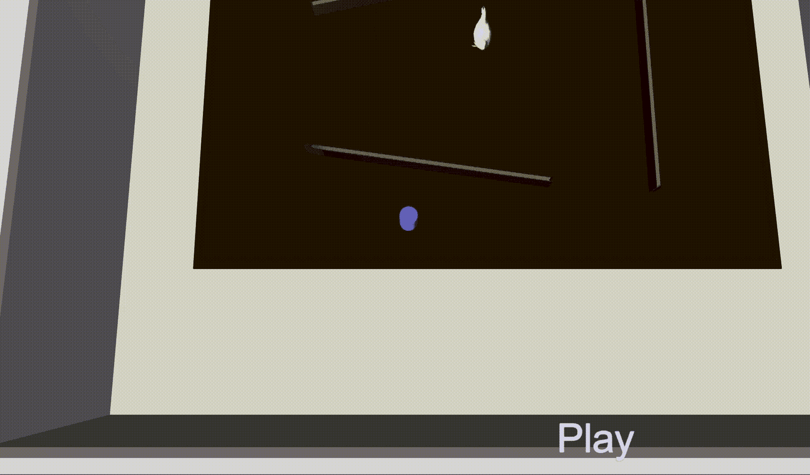
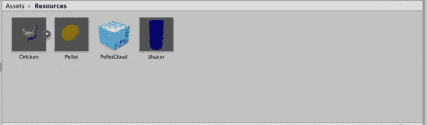
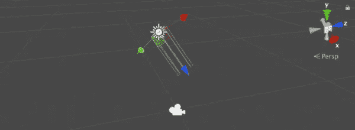

# 为什么鸡…

> 原文：<https://medium.com/coinmonks/why-did-the-chicken-9dae30281ec5?source=collection_archive---------7----------------------->

思考一个人需要为 *Magic Leap* 发展学习什么。

我有时会被我的 web 开发同行问及如何构建一个 *Magic Leap* 应用程序。由于 *C#* 与现代的 *JavaScript* 有很多共同之处，我建议人们从学习 *Unity* (和 *C#* )开始。

**注意**:无论多么诱人，都要避免使用 *UnityScript* ，这是一种基于 *JavaScript 的更老的[弃用的](https://blogs.unity3d.com/2017/08/11/unityscripts-long-ride-off-into-the-sunset/)语言。*

刚学了 *Unity* 然后通过两门课神奇的飞跃发展(两者在不同方面都很优秀):

*   *Udemy* 课程 [*学习 Unity 3D 适合绝对初学者*](https://www.udemy.com/learnunity3d/learn/v4/overview) (无费用)
*   *复数视线*课程 [*团结基础*](https://www.pluralsight.com/) (已付费)

我发现了一些与 Magic Leap 开发相关和无关的内容。通过例子，我们探索这种相关性。

这个例子包括一只动画小鸡(虚拟的)，它能够绕过桌子上的障碍物(真实的)到达掉落的食物球(虚拟的)。蓝色的摇动器(虚拟的)可以根据用户头部的位置在桌子周围移动。使用“确定”手势(右手)投掷颗粒。

最终解决方案可从[下载](https://github.com/larkintuckerllc/Navigation)；但是需要运行几个第三方包(见下文)。

***Unity 游戏开发管道
Unity 项目管理***

一个需要基本的*团结*技能。这相当于熟悉核心的 Unity 概念，并避开开发环境。

对于 *Magic Leap* 开发，从一开始就需要能够导入包。他们要求进口 *Magic Leap Unity 包；*通过*Magic Leap package manager*软件提供。

此示例还使用了以下包:

*   [*用于运行时导航网格构建的高级 API 组件*](https://github.com/Unity-Technologies/NavMeshComponents) (免费):这个由 *Unity* 提供的包支持运行时导航网格构建
*   [*动物套装豪华*](https://assetstore.unity.com/packages/3d/characters/animals/animal-pack-deluxe-99702) (付费):可在*统一资产商店*购买的套装，内含高品质动画动物；在这个例子中专门使用了鸡肉

**团结场景建筑**

虽然人们需要场景构建的基础知识(材质、碰撞器、刚体和预设)，但在开发一个 *Magic Leap* 应用程序时，还是有一些基本的区别。特别是复杂的地形并不十分相关。

> 少即是多
> 在场景中添加太多元素会削弱虚拟内容在现实世界中的力量和存在。更少的物体和更简单的几何图形会让人感觉更真实、更立体、更神奇。它还避免了硬件紧张，在 FOV 内工作更容易。
> 作为一个简单的演示，尝试将一个大而繁忙的场景渲染到房间中，然后将其与一个简单的白色立方体进行比较。

*魔幻飞跃—* [*美术&动画*](https://creator.magicleap.com/learn/guides/bp-for-art-and-animation)

这个例子只包括四个可见的游戏对象:

**照明**

灯光的复杂性与*神奇飞跃*的发展无关。

> 因为虚拟内容将在各种照明条件下显示在现实世界中，所以保持您的照明方案相对通用。

*—魔幻飞跃—* [*美术&动画*](https://creator.magicleap.com/learn/guides/bp-for-art-and-animation)

这个例子使用了 *Magic Leap* 模板中提供的单个*方向灯*游戏对象。

**粒子**

粒子系统与 Magic Leap 应用程序相关。

> 利用粒子系统。添加小的、面向相机的平面非常有效，只要它们小且远。
> 网格粒子可以创造巨大的体积效果，建立一个有深度的场景。

*—魔幻飞跃—* [*美术&动画*](https://creator.magicleap.com/learn/guides/bp-for-art-and-animation)

然而，粒子系统的结构却异常复杂。在本例中，我们使用了默认设置，并进行了一些小的调整。

**导航**

作为 *Unity，*截至 2017 年，支持 [*运行时 NavMesh 构建的高级 API 组件*](https://github.com/Unity-Technologies/NavMeshComponents) *，*导航与 *Magic Leap* 开发相关。如前所述，这种导航解决方案需要下载一个(免费)包。这在官方的 Unity 教程中也有详细的记载。

在这个例子中，我们使用 *Magic Leap 的网格划分*功能，在 [*网格划分介绍—Unity Edition*](https://creator.magicleap.com/learn/tutorials/introduction-to-meshing-unity-r-edition)*中描述，来构建一个脱离物理世界的网格。然后，我们使用 Unity 的 NavMesh 功能来识别它的可行走区域(蓝色高亮)。*

**

*特别是，*导航网格表面*有一个方法，*构建导航网格*，用于在运行时构建(又名烘焙)导航网格，如本例中的 [*网格父对象. cs*](https://github.com/larkintuckerllc/Navigation/blob/master/Assets/SampleScene/MeshParent.cs) 脚本所使用的。*

***脚本***

*虽然这两个 *Unity* 教程都没有深入介绍脚本，但在 *Magic Leap* 开发中是有必要的，因为大多数 *Magic Leap* 功能都是作为*c#*API 公开的。*

*这个例子使用了两个*魔法飞跃*特征，脚本 [*中的*](https://github.com/larkintuckerllc/Navigation/blob/master/Assets/SampleScene/KeyPoseHandler.cs) *[*手部姿态*](https://creator.magicleap.com/learn/guides/gestures-in-unity)keyposehandler . cs*和脚本 [*中的*](https://github.com/larkintuckerllc/Navigation/blob/master/Assets/SampleScene/MLSpatialMapper2.cs) *[*啮合*](https://creator.magicleap.com/learn/guides/meshing-in-unity)mlspatialmapper 2 . cs*。*

*此外，当编写更复杂的应用程序时，人们会希望探索更健壮的状态管理策略。我发现[*Unity event manager*](/@johntucker_48673/discovering-unity-eventmanager-a040285d0690)模式特别简单有效。*

***动画***

*如果不能使用动画，一个人将无法在 *Unity* (或 *Magic Leap* )开发中走得很远；即使可能没有必要自己创建它们。*

*这个例子使用了两个动画， *chicken_idle* 和 *chicken_walk* ，在 *Animal Pack Deluxe* 包中提供。简单的实现包括一个*鸡*控制器，其转换取决于参数 *IsWalking* 。*

**

*控制器的 *IsWalking* 参数由 [*Chicken.cs*](https://github.com/larkintuckerllc/Navigation/blob/master/Assets/SampleScene/Chicken.cs) 脚本管理。*

***音频***

> *在空间计算中，声音具有一种近乎神奇的能力，可以使现实中的虚拟物体接地，扩大用户的感知范围，并为物体提供细节，否则这些细节在传统媒体中不会得到开发。*

*— *魔法飞跃—* [*音频*](https://creator.magicleap.com/learn/guides/bp-for-audio)*

*在这个例子中，我们只是给鸡添加了一些咯咯的声音。*

***用户界面***

*在 *Unity* 的背景下， *UI* 功能主要使用户能够显示固定在屏幕上的内容。与 *Magic Lea* p 开发的挑战，但是，没有屏幕本身。文章 [*与头部锁定内容 Unity Edition*](https://creator.magicleap.com/learn/tutorials/interacting-with-head-locked-content-unity-r-version) 交互，提供了一种利用 *Unity UI* 系统提供类似功能的方法。*

*此示例使用此方法在屏幕的右下角显示应用程序的模式；具体详见另一篇: [*我的第一个“真正的”Magic Leap 项目:Part 6*](/coinmonks/my-first-real-magic-leap-project-part-6-7efd62b7a6e5) 。*

**

***总结***

*希望这对你有帮助。*

> *[直接在您的收件箱中获得最佳软件交易](https://coincodecap.com/?utm_source=coinmonks)*

**