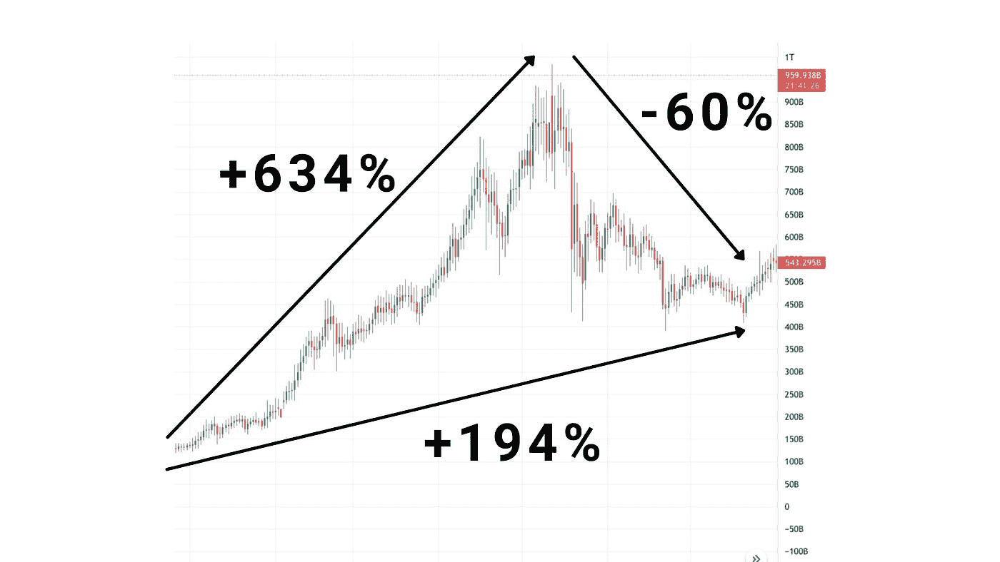
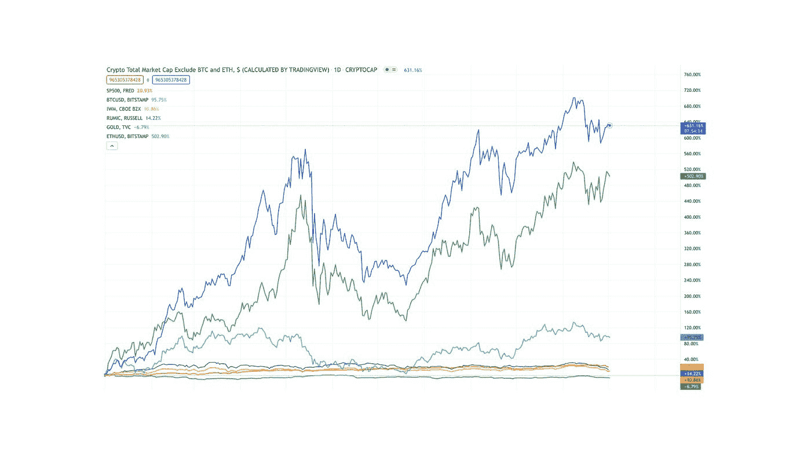
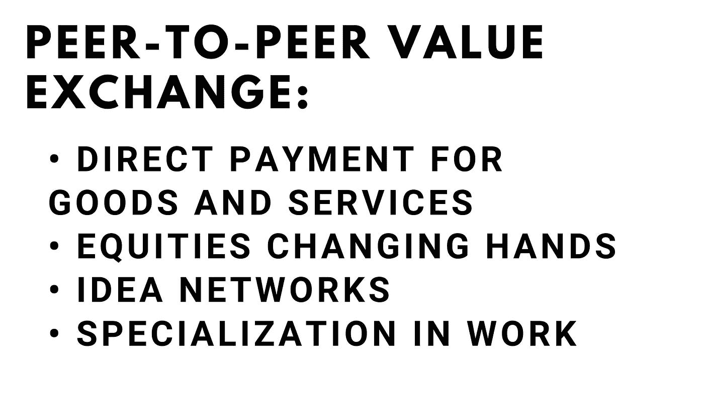
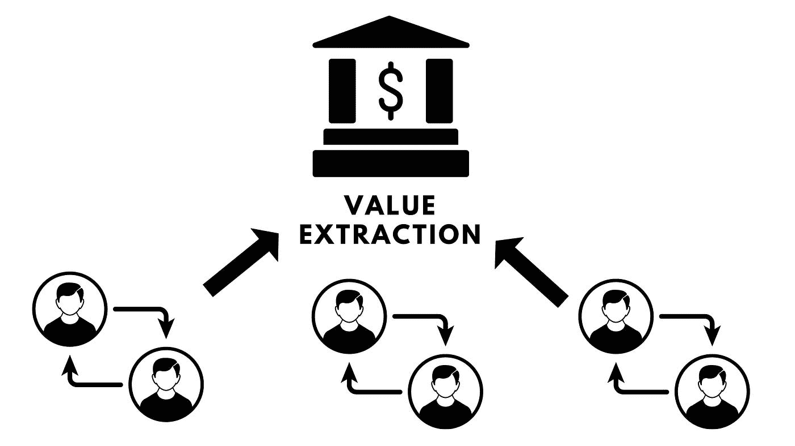
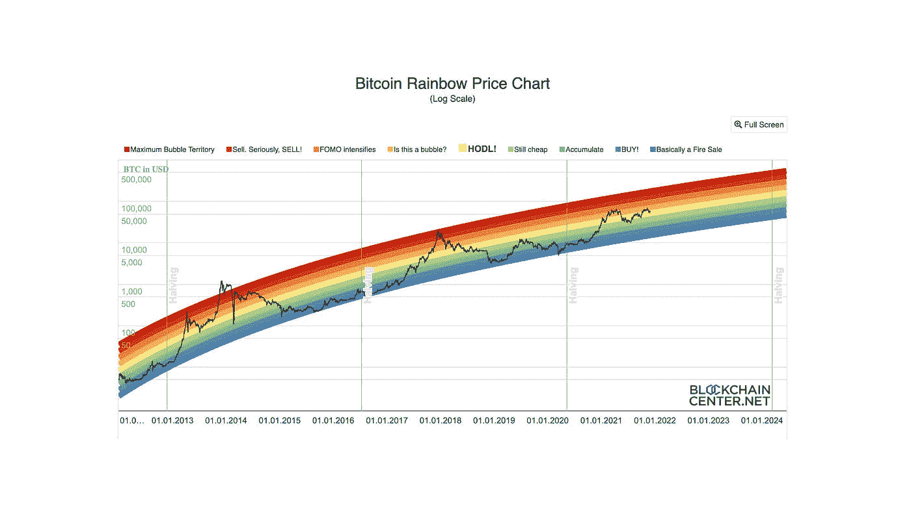

# 为什么 Altcoins 胜过一切？

> 原文：<https://medium.com/coinmonks/why-do-altcoins-outperform-everything-f414d70b9c8e?source=collection_archive---------3----------------------->

## 我只把一小部分内容放在媒体上。如果你想获得所有加密实用主义新闻更新、投资公告和 altcoin 报告的全部信息，请在此免费注册简讯。

在一个历史上被认为是非常高风险/非常高回报的资产类别中，替代硬币更胜一筹。我们经常听说一些小盘股替代币的回报是 1000 倍，其他人在一个月内回报 100 倍，感觉几乎每个 cryptobro 都有一个 5 倍回报的故事。

尽管波动性可能会变得相当糟糕，但事实是这些资产一直呈上升趋势。为了更全面地了解替代硬币，我喜欢查看除比特币和以太坊之外的前 125 种密码的索引(你可以在 TradingView 上找到 Total3)。

从 2021 年 1 月 1 日到 5 月 12 日的局部峰值，这些 altcoins 的总市值集体攀升 634%，舒服的 7 倍。但今年夏天，情况变得很糟糕，下跌了 64%——这意味着如果你将 1000 美元按比例分散投资于所有这些资产，你的投资组合将下降到只有 350 美元。哎哟。

但是，如果你在 1 月 1 日投入同样的 1000 美元，你的过山车之旅会更加疯狂:涨到 7000 美元，然后回落到 3000 美元左右。因此，即使市场大幅回调，你仍然上涨了 3 倍。

这种模式重复出现:尽管低价竞标经历了频繁、剧烈的调整，但随着时间的推移，低价竞标的总市值会增加，这意味着尽管存在波动性，但指数式投资仍会上升(而且速度比传统金融指数快得多)。

所有这些都引出了一个问题:为什么小盘股的表现几乎超过了所有主要的可投资资产类别？看一下 2021 年(你可以在左上角准确看到每条线代表什么资产/指数)。

Total3 以大约 40%的优势击败 Total2(不包括 BTC 的前 125 名加密资产)，同时以超过 500%的优势击败第三名 BTC。对我来说，他们持续成功的几率足以赌上我的职业生涯——这就是为什么我创办了 Crypto Pragmatist，这是一份致力于分析替代硬币的出版物。我认为这个行业之所以强大，有几个基本原因，所有这些都代表了市场的重大范式转变。

​

让我们开始吧。

​

**价值互联网:对等网络**

对等交换是我们世界中大多数价值传递的起点。如果我们深入了解财富是在哪里创造的，想法是在哪里产生的，企业获取的价值真正源自哪里，那么它主要来自于点对点交易。

这是构建其他一切的层。但在人类历史的大部分时间里，我们不得不使用中介——由于物流问题或玩家之间的信任问题，第三方帮助促进交易。而这些中介都是精挑细选的，通过从这些点对点的价值转移中榨取利润来赚钱。

​

但是如果真正创造价值的人拥有交换手段呢？或者更好的是，如果创造价值的人拥有网络，而网络本身是分布式的、去中心化的、点对点的，会怎么样？

由于 P2P 网络，所有曾经被中介机构吸收的价值现在都变得分散了。比特币是基本的价值单位，以太坊是网络的基础层，但比特币呢？替代硬币和它们所代表的协议现在是代表这些价值转移网络的基础设施的共有中介。

人们通常认为加密货币的基本价值是由于其分散的结构，或者没有中央银行参与供应的事实。我认为替代硬币的基本价值在于消除中介，并通过点对点网络重新获得这种价值。

**杠杆**

大多数人从金融角度考虑杠杆:借入资本并用它放大回报(或放大损失)的能力。3x ETF 就是一个例子；借钱投资也是一种杠杆形式。

加密协议以多种方式访问这一资本。风险资本家购买所有权股份，协议利用由贷款人、股东和所有者锁定的价值，贷款协议也可以放大资本。

但 altcoins 不只是利用资本杠杆，还利用代码和人力资本放大回报。想想一个 DAO(数字自治组织),它使用不变的区块链的力量，允许参与者投票并指导内部的人力资本:这是一种管理杠杆的新方法。

代码是将这些协议区分开来的最后一种杠杆形式，代表着几乎无限的杠杆作用。一旦协议被部署到区块链上，复制就真的没有成本了。基于加密货币的协议没有像工厂那样的边际成本；它可以协调 100 万美元或 1000 亿美元的经济活动，而不增加协议创建者和所有者的成本。这种(免费的)代码杠杆允许这些协议以指数速度扩展。

**国际市场敞口**

加密货币不仅打开了一个新行业的大门，也打开了一个新投资者群体的大门。许多美国投资者不太明白在海外购买美国股票有多困难，但障碍很多，而且每年都在增加。

外国投资者必须通过重重关卡，而外国交易所需要额外的身份证明要求，并应对复杂的监管和税收规则，才能投资于最简单的股票，这些规则因国家而异。

Crypto 释放了国际市场上这笔以前未使用的资金。至少在理论上，可投资资本是同等美国股票的两倍，估值也是两倍。

​

**对非 KYC 市场的风险敞口**

但是，国际投资者并不是唯一欣赏加密技术的玩家——关注隐私的投资者也在蜂拥而至。《了解你的客户(KYC)法》要求传统的金融交易所保存用户的详细记录，出于各种原因，这对于许多市场参与者来说是不可取的。

一些政策制定者将通胀视为对现金持有的货币的隐性税收——对他们来说，这是一种正外部性，也是对无法投资实物现金的黑市参与者产生负面影响的一种方式。但是，基本上不属于 KYC 的加密市场允许这些沉默的参与者在没有政府干预的情况下投资。

据估计，这种“黑市现金”价值约两万亿美元，约占全球 GDP 的 3%，或者巧合的是，与加密市场的总市值大致相当。不管是好是坏，这些玩家现在有了投资的地方，这导致了投资者和资本的涌入。

许多人认为这是有问题的，而另一些担心全球监控国家崛起的人则认为这是一项普遍权利。不管是哪种方式，它都有助于提高加密领域的资产估值。

 **炒作和泡沫效应**

Dogecoin，Shiba Inu，Safemoon，甚至比特币和以太坊都会经历繁荣和萧条的时期。这是市场不成熟的标志，也是市场对其中包含的资产的基本价值没有明确把握的标志。迷因变成硬币，反之亦然，硬币变成迷因。

假装 Dogecoin 这样的东西背后有真正的效用或现金价值是愚蠢的，就像加密货币革命在我们身边发生时把头埋在沙子里是愚蠢的。任何象征性估价的一部分都是对社区的估价，宣传，是的，甚至是协议中的迷因。

然而，加密的另一个内在部分是我们已经习惯的繁荣和萧条的市场周期。虽然不可能真正确定这些周期的时间，但有些人试图使用彩虹图这样的工具来尝试。见下文:

我知道这张图看起来有点歪，但我保证这是一种视错觉。

无论如何，重要的是要明白，即使市场趋势向上，也有不可否认的相对低估和高估的时期。随着资产价值的长期趋势上升，剧烈的泡沫形成并破裂。

 **这对你有什么帮助？**

如果你来自一个传统的金融背景，标准普尔 500 交易所交易基金允许你每年以相对稳定的 10%增长你的财富，很容易误解这些可笑的回报来自哪里，认为加密是一个泡沫，或者更糟糕的是，把加密视为一个骗局。如果这听起来像是真的，也许是真的，对吗？

然而，一旦投资者接受了这方面的教育，并理解了替代硬币可以解决的范式转变和无限市场，那么就很容易理解为什么会有这些不对称的回报。易变性和风险无处不在，但加密，特别是代表协议和加密基础设施的替代硬币，仍然是本世纪我们看到的最大机会。

这怎么能让你成为更好的投资者呢？嗯，在评估协议时，请考虑特定替代方案的机制和价值主张如何挖掘这些价值创造类别。或许它能为你提供一个框架，让你选择赢家，避免输家。深入理解这个框架甚至可能帮助您发现下一个 100 倍的机会。

祝你好运。

[**点击这里**](https://cryptopragmatist.com/sign-up-medium/) **每周从 Crypto Pragmatist 获取内容，绝对免费。**

> 加入 Coinmonks [电报频道](https://t.me/coincodecap)和 [Youtube 频道](https://www.youtube.com/c/coinmonks/videos)了解加密交易和投资

## 另外，阅读

*   [币安期货交易](https://blog.coincodecap.com/binance-futures-trading)|[3 comas vs Mudrex vs eToro](https://blog.coincodecap.com/mudrex-3commas-etoro)
*   [在印度利用加密套利赚取被动收入](https://blog.coincodecap.com/crypto-arbitrage-in-india)
*   [德国最佳加密交易所](https://blog.coincodecap.com/crypto-exchanges-in-germany) | [WazirX P2P](https://blog.coincodecap.com/wazirx-p2p)
*   [如何购买 Monero](https://blog.coincodecap.com/buy-monero) | [IDEX 评论](https://blog.coincodecap.com/idex-review) | [BitKan 交易机器人](https://blog.coincodecap.com/bitkan-trading-bot)
*   [如何在 Bitbns 上购买柴犬(SHIB)币？](https://blog.coincodecap.com/buy-shiba-bitbns) | [币安](https://blog.coincodecap.com/binance-in-india)
*   [币安 vs 比特邮票](https://blog.coincodecap.com/binance-vs-bitstamp) | [比特熊猫 vs 比特币基地 vs Coinsbit](https://blog.coincodecap.com/bitpanda-coinbase-coinsbit)
*   [如何购买 Ripple (XRP)](https://blog.coincodecap.com/buy-ripple-india) | [非洲最好的加密交易所](https://blog.coincodecap.com/crypto-exchange-africa)
*   [非洲最佳加密交易所](https://blog.coincodecap.com/crypto-exchange-africa) | [Hoo 交易所评论](https://blog.coincodecap.com/hoo-exchange-review)
*   [eToro vs robin hood](https://blog.coincodecap.com/etoro-robinhood)|[MoonXBT vs by bit vs Bityard](https://blog.coincodecap.com/bybit-bityard-moonxbt)
*   [Stormgain 回顾](https://blog.coincodecap.com/stormgain-review) | [Bexplus 回顾](https://blog.coincodecap.com/bexplus-review) | [币安 vs Bittrex](https://blog.coincodecap.com/binance-vs-bittrex)
*   [Bookmap 评论](https://blog.coincodecap.com/bookmap-review-2021-best-trading-software) | [美国 5 大最佳加密交易所](https://blog.coincodecap.com/crypto-exchange-usa)
*   [如何在 FTX 交易所交易期货](https://blog.coincodecap.com/ftx-futures-trading) | [OKEx vs 币安](https://blog.coincodecap.com/okex-vs-binance)
*   [如何在势不可挡的域名上购买域名？](https://blog.coincodecap.com/buy-domain-on-unstoppable-domains)
*   [印度的秘密税](https://blog.coincodecap.com/crypto-tax-india) | [altFINS 审查](https://blog.coincodecap.com/altfins-review) | [Prokey 审查](/coinmonks/prokey-review-26611173c13c)