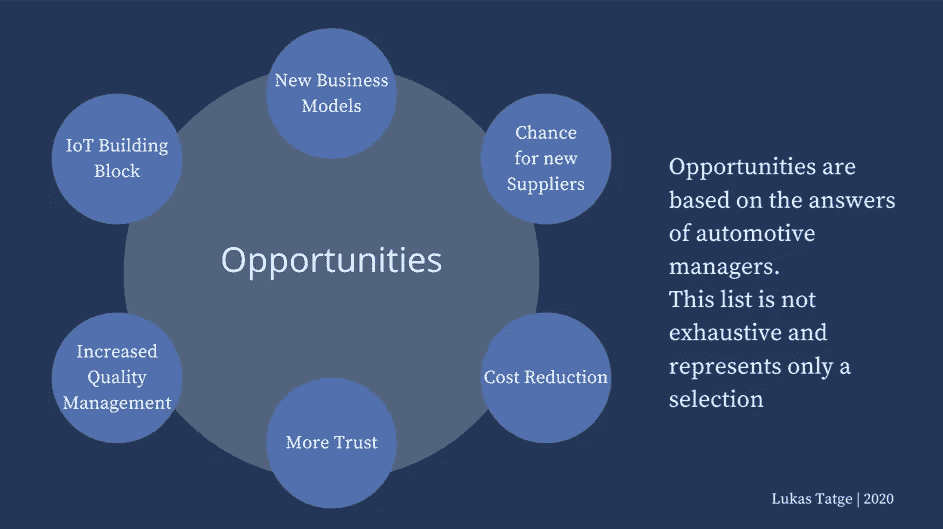
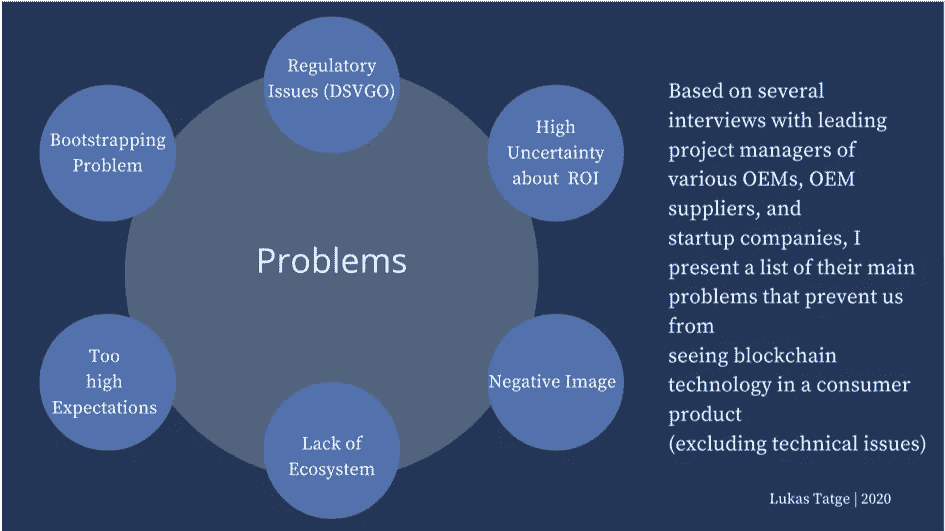

# 区块链在德国汽车行业的实际应用问题分析

> 原文：<https://medium.com/coinmonks/why-do-we-still-only-talk-about-blockchain-but-have-no-actual-product-or-service-analysis-of-e55b735d9d80?source=collection_archive---------3----------------------->

自 2017 年比特币的极端炒作以来，大多数人都听说过这种被称为区块链的新技术。这是一项极具争议的技术；一些人说它将解决世界范围内的童工问题，而另一些人则认为它是一个过分膨胀的时髦词，没有现实生活的价值。

为了一个学术项目，我(当然是通过 Zoom)与德国汽车行业的几位主要经理(例如 OEM、OEM 供应商、移动创业公司)坐在一起，与他们谈论汽车行业区块链的现状。

对我来说，有趣的是**为什么我们仍然没有汽车中的区块链服务或应用**，尽管汽车公司已经谈论它四年了，并且在这些概念验证上的工作甚至更长。唯一的活项目是跟踪钴生产的供应链，但是尽管这个小项目，我们没有来自这些公司的面向客户的区块链产品。需要解决的**实际问题和挑战**有哪些？

在本文中，你将看到无法从区块链教科书中学到的实际问题，因为这些问题与这些跨国公司的组织结构和激励机制密切相关。此外，我还向您展示了这些公司目前是如何解决这些问题的。

在整篇文章中，我不能提及任何名字，项目或公司，因为国家保密协议。

## **机遇:**

在我向您展示这些汽车公司的实际问题之前，我想简要概述一下他们认为这项技术未来最大的机遇是什么。这个列表并不详尽，仅代表我选择的一部分。

Perceived opportunities of blockchain in the automotive industry

## **1。新的商业模式**

当一个新项目在一个绿地上开始时，区块链发挥了它的全部力量。一些模型是可能的，它们在可伸缩性、自由度和信任级别方面是独一无二的。这些是新的、有前途的、面向未来的项目。然而，它们总是从很小的规模开始，不管它们在未来会以怎样的指数增长。它们开始总是扁平的，需要时间才能达到相应的尺寸。

## **2。新供应商的机会**

当区块链是一个许多不同方交互的新业务，并且有大量的合同和依赖关系时，它就会展现出它的附加值。如今，作为一家原始设备制造商，你已经有了始终如一的供应商。添加新的是复杂的，因为信任不存在，或者过程不存在。使用区块链技术，与供应商的协调可以更加灵活和动态，供应商可以更多地获得不同的 OEM 产品。

## **3。降低成本**

大多数汽车经理相信这项技术将会节省一些成本。如今，流程和供应链有时过长且不透明，尤其是在跨境交易和运营中。目前有太多的手工文书工作。因此，区块链可以大力支持供应链的数字化。

## **4。更多信任**

柴油危机部分动摇了全球消费者对德国汽车行业的信心。区块链可能是恢复对软件更新失去信心的正确方式。我们的目标应该是能够在任何时候准确地证明汽车上运行的是哪个版本的软件。

## **5。提高质量管理**

另一个强有力的应用领域是质量管理。由于透明度增加，人们将确切知道哪个供应商在哪个车辆上安装了哪个螺钉。每个零件都有特定的规格(生产中总会有细微的偏差)。在这里，您可以组合组件，使负规格偏差由其他正规格偏差补偿，从而提高整体产品质量。

## **6。物联网构建模块**

汽车公司也在非常努力地将物联网和区块链结合起来。数据是有价值的，如果他们向某人提供数据，他们就应该为此付费。汽车的不同服务和汽车之间肯定会有这种小额支付。

## **真实实际问题:**

如果你阅读关于区块链技术问题的文章，你会发现几乎总是只有一些关于技术问题和局限性的讨论。这些都很重要，但是很多实际问题从外面很难察觉。安全问题、可伸缩性或与现有 IT 环境的集成等技术问题在许多其他文章中都有解释，但不是本次分析的重点。

根据对各种原始设备制造商、原始设备制造商供应商和创业公司的主要项目经理的几次采访，我列出了他们的主要问题，这些问题阻止我们在消费产品中看到区块链技术。

Perceived problems of blockchain in the automotive industry

## **监管问题(DSVGO)**

几乎所有专家对区块链产品的主要问题一直是，目前在法律和监管方面存在很大的不确定性。由于没有具体的法律和重要的法院判决，目前尚不清楚区块链是否符合《残疾歧视条例》的所有要求。同样不清楚的是，如果出现问题或区块链应用不当，谁应负责任。

即使一些 POC 运行良好，它们也会被法律部门完全阻止，因为区块链对它们来说仍然存在风险和问题。

***解决方案*** :汽车行业必须继续为这项特殊技术做一些游说工作。德国政府的区块链战略是第一步，但在某种程度上，法律确定性必须进一步提高。

## **2。投资回报率的高度不确定性**

虽然汽车公司的区块链项目主要是由着迷于可能性的 IT 员工推动的，但业务部门通常会有一定的阻力，因为在早期阶段无法保证一定的回报。尤其是在新冠肺炎如此困难的时期，这种相当长期的项目很难证明是合理的。

***解决方案*** :投资回报的不确定性在现阶段无法降低。因此，高层管理支持这类项目是非常重要的。在我谈过的几乎所有公司中，董事会中有人支持这些项目，因此尽管投资回报不确定，还是为这些项目提供了资金。

## **3。负像**

另一个不容忽视的问题是，由于数字货币和欺诈性 ico 的问题，整个区块链行业的形象非常负面。因此，大公司的沟通策略发生了变化，尤其是在这一领域。使用这种技术的项目不再像过去那样公开宣布。比如传播更多的转移到了一些场景网站上。这种技术的不良形象可能最终导致客户不愿意使用这种类型的新服务和产品。

***解决方案*** :必须进一步加强沟通，教育媒体和最终用户。必须进一步努力，明确区分该领域的技术欺诈者和个人欺诈者。

## **4。缺乏生态系统**

所有公司经理都认为，只有当公司之间存在协作，并且几乎整个生态系统都使用相同的技术时，分散式解决方案才有意义。今天的情况并非如此，许多公司试图构建他们的区块链解决方案，但却未能让其他公司参与进来。如果这种情况继续下去，任何解决方案都不会被广泛采用，这意味着它不会带来预期的好处。

***解决方案*** :移动开放区块链倡议(MOBI)被发现恰恰解决了这个问题。MOBI 的主要目标是创建被广泛接受的区块链行业标准。几乎所有相关的德国汽车公司都是该组织的成员，他们拥有车辆识别、供应链和充电基础设施工作组。所有这些区域定义了数据在接口中的传输方式。这允许公司的不同区块链解决方案一起工作和交换数据，并且筒仓问题被解决。

## **5。过高的期望**

在某些情况下，对区块链技术的期望过高且不切实际。人们常说，区块链供应链将有助于结束童工现象，因为所有实物商品都是完全可追溯的。然而，最大的问题是数据的初始输入。如果一开始就不能保证数据录入正确，那么剩下的过程就没用了。区块链只是一种技术，并不能单独解决所有这些问题。特别是非洲和南美洲的供应商没有数字化的供应链，只要情况不是这样，区块链就无法建立完全的信任。

***解决方案*** :首先，欠发达国家必须加大供应链的数字化。此外，区块链供应链中的实物商品还有许多其他问题需要解决。或许应该先对非实物商品实施。

## **6。自举问题**

对于拥有知名品牌的大公司来说，在大多数情况下，快速跟随者比先行者更好。这是因为你可以从先发经验中学到很多东西，然后以更好的质量和更低的价格提供服务或产品。如果每个人都这样想，没有人愿意拿出第一个产品和客户一起测试实际使用情况。这个问题被称为自举问题。

***解决方法*** :这个问题有两种解决方法。首先，你可以简单地等待，直到像特斯拉、谷歌或亚马逊这样更具颠覆性思维的公司为其客户提供这项服务。其次，您可以与其他大公司达成某种相互保证，即如果一家公司提供服务，其他公司也将加入这种方式，并提供相同或略有不同的解决方案。

## **7。与创业公司合作的问题**

对于大量的区块链项目，大型汽车公司与专业初创公司联手开发新的用例。这些组合对双方来说往往是双赢的局面，因为公司受益于速度和敏捷的工作方式，初创公司受益于公司的既定品牌和客户群。这种协作也可能导致问题，因为安全性、测试和发布周期方面的需求可能非常不同。此外，初创企业内部经常会发生变化，汽车行业的一些联合项目也因内部初创企业冲突而失败。

***解决方案*** :要让这样的产品成功，必须进一步发展相互理解，必须掌握早期整合和重要独立之间的细线。在我们看到德国汽车上的第一个启动服务之前，未来双方仍有很多需要学习的地方。

## **结论:**

The future looks, in general, promising

尽管存在上述所有问题，但该领域的所有汽车经理都非常乐观，认为区块链技术将会到来，而且无法阻止，因为好处太多了。我们在汽车上看到基于客户的区块链服务只是时间问题。时间将取决于在这一领域是否有一个大胆的先驱，以及是否有大胆的监管调整。特别是最后一点将决定德国汽车工业是否会承担先锋角色。然而，该行业已做好充分准备，并已成为 MOBI 的领导者。我对这一领域的新发展感到非常兴奋，并期待着第一次应用。

## 另外，阅读

*   最好的[密码交易机器人](/coinmonks/crypto-trading-bot-c2ffce8acb2a)
*   [Deribit 审查](/coinmonks/deribit-review-options-fees-apis-and-testnet-2ca16c4bbdb2) |选项、费用、API 和 Testnet
*   [FTX 密码交易所评论](/coinmonks/ftx-crypto-exchange-review-53664ac1198f)
*   最好的比特币[硬件钱包](/coinmonks/the-best-cryptocurrency-hardware-wallets-of-2020-e28b1c124069?source=friends_link&sk=324dd9ff8556ab578d71e7ad7658ad7c)
*   [密码本交易平台](/coinmonks/top-10-crypto-copy-trading-platforms-for-beginners-d0c37c7d698c)
*   最好的[加密税务软件](/coinmonks/best-crypto-tax-tool-for-my-money-72d4b430816b)
*   [最佳加密交易平台](/coinmonks/the-best-crypto-trading-platforms-in-2020-the-definitive-guide-updated-c72f8b874555)
*   最佳加密贷款平台
*   [莱杰 vs 特雷佐](/coinmonks/ledger-vs-trezor-best-hardware-wallet-to-secure-cryptocurrency-22c7a3fd391e)
*   [Bitsgap 评论](/coinmonks/bitsgap-review-a-crypto-trading-bot-that-makes-easy-money-a5d88a336df2)——一个轻松赚钱的加密交易机器人
*   [Quadency Review](/coinmonks/quadency-review-a-crypto-trading-automation-platform-3068eaa374e1) -专为专业人士打造的加密交易机器人
*   [3commas Review](https://blog.coincodecap.com/3commas-review-an-excellent-crypto-trading-bot) |一款优秀的密码交易机器人
*   [PrimeXBT 审查](/coinmonks/primexbt-review-88e0815be858) |杠杆交易、费用和交易
*   Bitmex 的[保证金交易指南](/coinmonks/the-idiots-guide-to-margin-trading-on-bitmex-dbbd7742c6fc?source=friends_link&sk=7bfa99d2a181142510c8442c8ddb0786)
*   [eToro 评论](/coinmonks/etoro-review-78807ddeb33c) |交易股票、密码、交易所交易基金、差价合约和商品
*   [Bitmex 高级保证金交易指南](/coinmonks/bitmex-advanced-margin-trading-guide-2270c195ce25?source=friends_link&sk=1d986cca731f5084b9a2db4a4bc4a7ad)
*   [开发人员的最佳加密 API](/coinmonks/best-crypto-apis-for-developers-5efe3a597a9f)
*   [加密套利](/coinmonks/crypto-arbitrage-guide-how-to-make-money-as-a-beginner-62bfe5c868f6)指南:新手如何赚钱
*   顶级[比特币节点](https://blog.coincodecap.com/bitcoin-node-solutions)提供商
*   最佳[加密制图工具](/coinmonks/what-are-the-best-charting-platforms-for-cryptocurrency-trading-85aade584d80)
*   了解比特币的[最佳书籍有哪些？](/coinmonks/what-are-the-best-books-to-learn-bitcoin-409aeb9aff4b)

> [直接在您的收件箱中获得最佳软件交易](https://coincodecap.com?utm_source=coinmonks)

