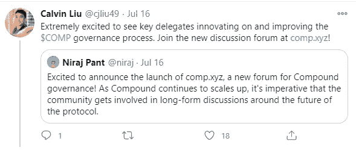
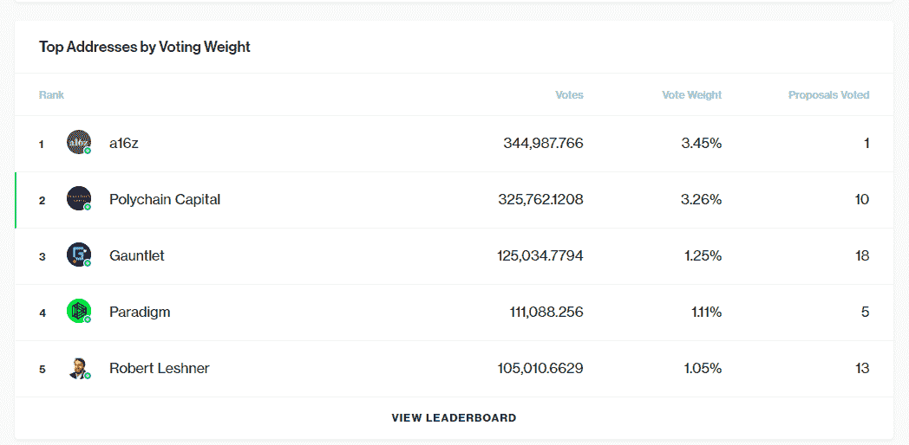
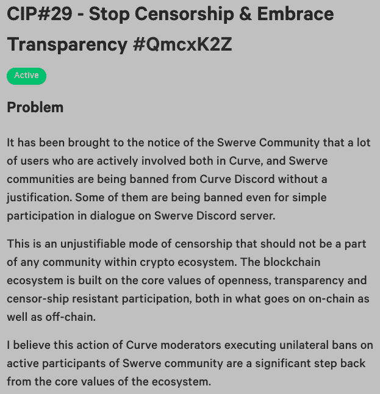
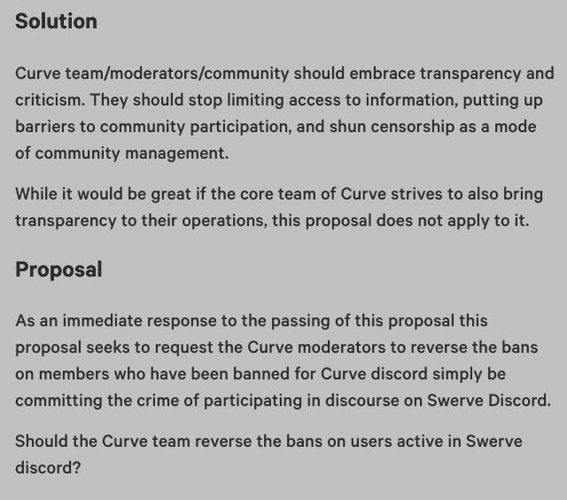
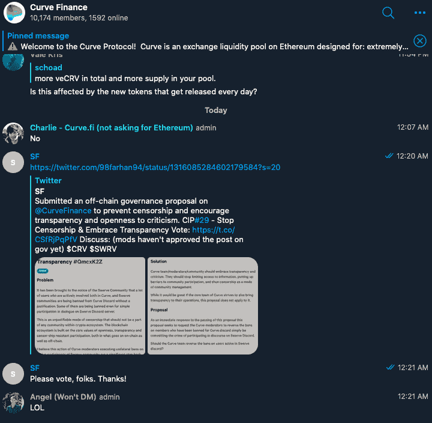
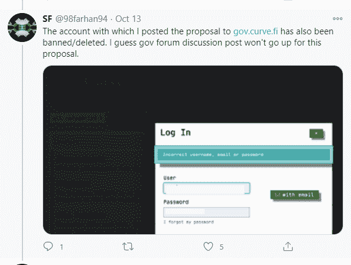
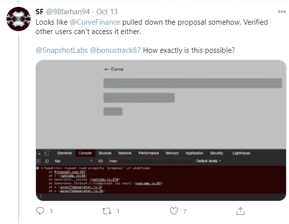
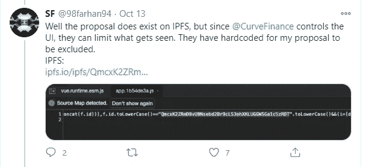

# 为什么我们容忍 DeFi 中的审查？

> 原文：<https://medium.com/coinmonks/why-do-we-tolerate-censorship-in-defi-5582aaa33cd?source=collection_archive---------3----------------------->

[https://www.comparitech.com/blog/vpn-privacy/guide-to-online-censorship/](https://www.comparitech.com/blog/vpn-privacy/guide-to-online-censorship/)

# 我们真的相信抵制审查和分权吗？

我们是以太坊社区的一部分，因为我们相信一个更加分散和抵制审查的世界。我们厌倦了看到传统世界中普遍存在的利益冲突劫持叙事，从通过利用社交媒体公司对选举施加外部影响，到禁止基于政治派别的账户。

Crypto 应该是一场拥护抵制审查和去中心化的运动。

那么，为什么我们对治理论坛的集中化和对不同意见的审查感到满意呢？

[DeFi](https://blog.coincodecap.com/the-ultimate-guide-to-defi-decentralized-finance) 团队声称他们是分散的，并把自己伪装成给社区而不是特殊利益的力量。为什么一次又一次，我们看到相反的事情发生？

# 项目运行治理论坛的利益冲突

目前，[话语](https://www.discourse.org/)已经成为与 DeFi 相关的治理讨论的首选平台。Compound、Curve、Uniswap 和几乎所有其他主要的 DeFi 项目都有论坛，供社区成员讨论他们的协议所面临的最重要的问题。

但是到底什么是话语呢？

Discourse 是一个由传统硅谷投资公司支持的论坛管理服务。一些话语的支持者，如 SV 天使投资人，也是 DeFi 项目的主要投资者，如 Uniswap。

这些论坛的运营者支付[订阅费](https://www.discourse.org/)给 Discourse 以换取论坛托管。作为收费的交换，运营商对他们的话语拥有完全的控制权，**包括调节和禁止特权。**

在 [DeFi](https://blog.coincodecap.com/the-ultimate-guide-to-defi-decentralized-finance) 中，大多数时候，**项目团队本身就是这些讨论论坛的运营者，这意味着他们拥有完全的节制，并禁止对发生的辩论进行控制。**

**一些 DeFi 项目**，比如大院，**都有风险投资人投资他们公司的股权经营他们的** [**话语论坛**](https://www.comp.xyz/) **。**

下面，你会看到一条来自 [Niraj Pant](https://www.linkedin.com/in/nirajpant) 的推文，他是 Polychain Capital 的普通合伙人。

[https://twitter.com/cjliu49/status/1283849367791656961?s=20](https://twitter.com/cjliu49/status/1283849367791656961?s=20)

Calvin Liu 是 Compound 的战略负责人，而 Polychain 是 Compound 最大的投资者之一，因此，由于早期投资，是 Compound 治理过程中最大的代表之一。事实上，Polychain 拥有任何个人或实体中第二多的投票权，包括 Robert Leshner 本人。他们也是复合治理过程中非常积极的参与者，已经对 10 个提案进行了投票。

[https://compound.finance/governance](https://compound.finance/governance)

对于 Compound，我的问题如下:**为什么我们要接纳控制中央治理论坛的最大代表之一，而关于 Compound governance 的讨论主要发生在这个论坛上？**

对于 DeFi 的其余部分，为什么项目团队自己控制治理论坛？

**在这两种情况下，我认为与整个群体存在明显的利益冲突**。当团队控制治理论坛时，他们可以审查社区成员的观点，这些社区成员可能希望将治理引向与创始团队不同的方向。

类似地，当最大的代表之一控制主要的治理讨论论坛时，这难道不是利益冲突吗？如果出现有争议的问题，代表会不会通过调节治理论坛上的讨论来影响投票结果，从而实现自身利益的最大化？

# 审查实际发生的例子

当然，可能会有一些人批评这种观点，说这些 DeFi 团队和他们的投资者永远不会把审查作为解决方案。然而，审查的例子已经出现。我说的不是在 Discord、Twitter 和 Telegram 上的持续封锁和禁止，而是从治理论坛和信号工具本身实际删除社区成员/他们的帖子。

我想告诉你 SF 的故事，他向 [Curve 的快照](https://snapshot.page/#/curve)和 [Curve 的话语治理论坛](https://gov.curve.fi/)提交了一份关于我们今天讨论的确切主题:审查的离线治理建议。

科幻小说创作了一个名为“停止审查&拥抱透明”的提案。以下是 SF 在提案中写的内容:

[https://twitter.com/98farhan94/status/1316085284602179584?s=20](https://twitter.com/98farhan94/status/1316085284602179584?s=20)

[https://twitter.com/98farhan94/status/1316085284602179584?s=20](https://twitter.com/98farhan94/status/1316085284602179584?s=20)

除了在 Curve Discourse Governance 论坛和 Curve 的快照页面上发布提案之外，我们的朋友 SF 还在 Curve 的 Telegram 组中分享了该提案:

[https://twitter.com/98farhan94/status/1316085284602179584?s=20](https://twitter.com/98farhan94/status/1316085284602179584?s=20)

曲线团队以压倒性的缓和力量回应。 **SF 看到自己在 Curve 上的论坛账号被删:**

[https://twitter.com/98farhan94/status/1316085284602179584?s=20](https://twitter.com/98farhan94/status/1316085284602179584?s=20)

【Curve 不仅禁止 SF 参与他们的治理论坛讨论，还从快照中删除了他的提议:

[https://twitter.com/98farhan94/status/1316085284602179584?s=20](https://twitter.com/98farhan94/status/1316085284602179584?s=20)

虽然该提案在技术上仍然存在于 IPFS 后端，但 Curve Finance 能够从 UI 中删除该提案，因为他们控制了快照页面的前端。

[https://twitter.com/98farhan94/status/1316100576782950400](https://twitter.com/98farhan94/status/1316100576782950400)

**Curve 完全控制在快照界面上可以看到哪些投票和提案。**

显然，审查确实存在。这些项目团队不仅控制了治理论坛，还控制了人们表达情感的投票媒介，这是集权的一个典型例子。

# 未来会怎样

如果我们继续让项目团队和他们的投资者控制治理论坛和主要的治理信号媒介，随着风险的不断增加，我们只能期待这些平台在未来受到更多的审查和集中。

我们需要有不受项目团队及其投资者控制的治理论坛和信号解决方案。**这种控制与国家控制的媒体没有什么不同，正是我们加入 crypto 时试图摆脱的那种类型。**

# 我们的解决方案

虽然我们决不是说我们有一个解决这个问题的方案，**我们确实相信** [**以太**](https://theether.io/) **是由项目团队自己或他们的投资代表控制的现有治理论坛的一个极好的替代方案。**

我们不隶属于任何项目团队，也没有外部投资者。我们打算把编辑和审核的权力移交给我们的社区，基于他们获得的 XP 数量，从而成为第一个真正去中心化和社区驱动的论坛应用。

我们没有利益冲突，只关心在加密治理流程中增加社区代理，并削弱想要最大化自身利益的中央机构/团队的权力，而不管该利益是否与整个社区一致。

在以太网上，社区成员可以讨论 DeFi 项目的治理变化，并表明他们“支持”和“反对”什么。在这个过程中，社区成员赢得了被称为 XP 的声誉，这可以用来在以太坊的子行业中展示他们的专业知识，如 DeFi。

如果还有其他人认为治理论坛和社会信号不应该被项目团队和他们的投资代表所控制，我们很乐意与他们交谈。我们正在建立一个真正透明的、分散的、社区优先的解决方案

有一天，这些被认为是分散的和抵制审查的项目的管理过程将不再由少数财阀控制，而是由社区控制。

## 另外，阅读

*   最好的[密码交易机器人](/coinmonks/crypto-trading-bot-c2ffce8acb2a)
*   [密码本交易平台](/coinmonks/top-10-crypto-copy-trading-platforms-for-beginners-d0c37c7d698c)
*   最好的[加密税务软件](/coinmonks/best-crypto-tax-tool-for-my-money-72d4b430816b)
*   [最佳加密交易平台](/coinmonks/the-best-crypto-trading-platforms-in-2020-the-definitive-guide-updated-c72f8b874555)
*   最佳[密码借贷平台](/coinmonks/top-5-crypto-lending-platforms-in-2020-that-you-need-to-know-a1b675cec3fa)
*   [最佳区块链分析工具](https://bitquery.io/blog/best-blockchain-analysis-tools-and-software)
*   [加密套利](/coinmonks/crypto-arbitrage-guide-how-to-make-money-as-a-beginner-62bfe5c868f6)指南:新手如何赚钱
*   最佳[加密制图工具](/coinmonks/what-are-the-best-charting-platforms-for-cryptocurrency-trading-85aade584d80)
*   [莱杰 vs 特雷佐](/coinmonks/ledger-vs-trezor-best-hardware-wallet-to-secure-cryptocurrency-22c7a3fd391e)
*   了解比特币的[最佳书籍有哪些？](/coinmonks/what-are-the-best-books-to-learn-bitcoin-409aeb9aff4b)
*   [3 商业评论](/coinmonks/3commas-review-an-excellent-crypto-trading-bot-2020-1313a58bec92)
*   [AAX 交易所评论](/coinmonks/aax-exchange-review-2021-67c5ea09330c) |推荐代码、交易费用、利弊
*   [Deribit 审查](/coinmonks/deribit-review-options-fees-apis-and-testnet-2ca16c4bbdb2) |选项、费用、API 和 Testnet
*   [FTX 密码交易所评论](/coinmonks/ftx-crypto-exchange-review-53664ac1198f)
*   [n 零审核](/coinmonks/ngrave-zero-review-c465cf8307fc)
*   [Bybit 交换审查](/coinmonks/bybit-exchange-review-dbd570019b71)
*   [3Commas vs Cryptohopper](/coinmonks/cryptohopper-vs-3commas-vs-shrimpy-a2c16095b8fe)
*   最好的比特币[硬件钱包](/coinmonks/the-best-cryptocurrency-hardware-wallets-of-2020-e28b1c124069?source=friends_link&sk=324dd9ff8556ab578d71e7ad7658ad7c)
*   最佳 [monero 钱包](https://blog.coincodecap.com/best-monero-wallets)
*   [莱杰 nano s vs x](https://blog.coincodecap.com/ledger-nano-s-vs-x)
*   [bits gap vs 3 commas vs quad ency](https://blog.coincodecap.com/bitsgap-3commas-quadency)
*   [莱杰纳米 S vs 特雷佐 one vs 特雷佐 T vs 莱杰纳米 X](https://blog.coincodecap.com/ledger-nano-s-vs-trezor-one-ledger-nano-x-trezor-t)
*   [block fi vs Celsius](/coinmonks/blockfi-vs-celsius-vs-hodlnaut-8a1cc8c26630)vs Hodlnaut
*   Bitsgap 评论——一个轻松赚钱的加密交易机器人
*   为专业人士设计的加密交易机器人
*   [PrimeXBT 审查](/coinmonks/primexbt-review-88e0815be858) |杠杆交易、费用和交易
*   [埃利帕尔泰坦评论](/coinmonks/ellipal-titan-review-85e9071dd029)
*   [SecuX Stone 评论](https://blog.coincodecap.com/secux-stone-hardware-wallet-review)
*   [BlockFi 评论](/coinmonks/blockfi-review-53096053c097) |赚取高达 8.6%的加密利息