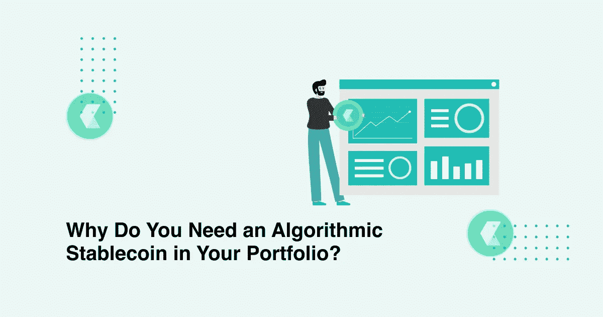

# 为什么你需要在你的投资组合中保留一个算法稳定的硬币？

> 原文：<https://medium.com/coinmonks/why-do-you-need-to-keep-an-algorithmic-stablecoin-in-your-portfolio-9165cc9f02d8?source=collection_archive---------5----------------------->

CLAIM is an algorithmic stablecoin

# 什么是算法稳定币？

即使你仍然是一个加密货币爱好者，还没有开始在市场上交易，你一定听说过术语 stablecoin。Stablecoins 是一种特定类别的加密货币，它与更稳定的资产挂钩，以最大限度地降低波动性。一般来说，这些稳定的资产是法定货币，如美元、欧元或英镑。

在很短的时间内，stablecoins 已经在密码市场获得了很大的发展。在撰写本文时，它们的总市值超过了 1100 亿美元，而交易量已经超过了 400 亿美元。

在这样的市场环境中，当稳定的密码数量和增长都很可观时，一种新产品或密码范式就进入了市场。它们被称为算法稳定点。这些产品也受到了极大的关注，许多市场专家都推荐将它们纳入交易者的加密投资组合。

要决定你是否应该在你的投资组合中包含这种货币，你必须对什么是算法稳定货币有一个清晰的概念。在这里，我们解决这个问题。

与稳定硬币一样，算法稳定硬币也是与法定货币挂钩的代币。通常，这种法定货币是美元。这种特殊类别的稳定债券的独特之处在于，它们根据硬编码到以太坊智能合约中的预定稳定措施对市场事件做出反应。这一特征有助于增加去中心化，因为它为一种智能、快速、反应灵敏的全球货币创造了空间，这种货币不在单一机构的权限之内。此外，它不仅可以作为分散金融世界的交换媒介，也可以作为整个世界的交换媒介。

# 它们是如何工作的，它们的优势是什么？

算法稳定币有两大功能类别。第一类，也是较早的一类，是“改基”硬币。这些 rebase 硬币包括像安普尔福思或 AMPL。重基础硬币通过将波动性从价格转移到市值来保持稳定。例如，如果 AMPL 的交易价格高于 1.05 美元或低于 0.95 美元，它会销毁代币，并向持有者发行新的代币，确保价格回到 1 美元。实际上，在这个模型中发生的是，不是价格随着需求的变化而变化，而是市场资本在波动。价格保持稳定。

另一类算法 stablecoins 遵循多令牌模型。让我们以 Basis Cash 为例来理解这个模型，Basis Cash 是一种遵循多令牌模型的算法稳定币。

基差现金有三种代币:基差现金(BAC)、基差股票(BAS)和基差债券(BAB)。在这三种货币中，基础货币是一种稳定的货币，保持与 1 美元挂钩。基差债券可以按面值赎回基差现金。现在，如果 BAC 的价格低于 1 美元，用户可以以折扣价购买 BAC，并将其兑换为 BAB。基差股的持有人受益于新 BAC 的发行，因为基差股与协议的价值密切相关。

算法稳定的优点是多方面的。由于没有监管机构来监督供需平衡，他们给 DeFi 世界带来了真正的分散化。

代码的存在使其具有高度的可伸缩性，而有形资产需求的缺失避免了用户端出错的可能性。

这些用代码编程的硬币是公开可审计的，这使它们变得可信和透明。

# 为什么它们完美地补充了投资组合？

有多种短期、中期和长期的理由说明为什么你的投资组合中应该有一个算法稳定币。从短期来看，它可以实现加密货币投资组合多元化的目的，而从中长期来看，它可以作为分散化银行的储备抵押品和央行货币的替代品，以适应股票，从而扩大其好处。

算法稳定的硬币是非稀释性的，这意味着即使你拥有的硬币数量每天都在变化，你对网络的所有权百分比也保持不变。rebase 模型硬币的独特优势使其能够与比特币的价格模式脱钩，从而降低系统风险的范围。除此之外，加密货币的相关性非常强。算法稳定点也有助于解决供应不稳定问题。他们不容易受到市场突然冲击的影响。

# 为什么它应该被确切地要求？

CLAIM

如果你现在正在考虑用哪种算法稳定币, [CLAIM](https://claim.xyz/#/) 可能是你的完美选择。[债权金融](https://claim.xyz/#/)让用户可以质押资产，产生稳定的 cUSD 币用于资金循环。本质上，它是一种算法稳定币。尽管广泛采用的 DeFi stablecoins 模型已经针对质押资产进行了铸币，但索赔并不完全依赖于铸币资产的当前价值。它使用资产的预期未来回报作为可信的抵押品。这样，稳定币的资产利用效率提高了。

而且在[债权协议](https://claim.xyz/#/)中，用户可以将自己的资产存入进行资金分配，产生投资收益。由于这些资产中的 ROI 也作为 Claim 的信用体系的支持值，所以您可以从资产的预期回报形成的信用杠杆中受益。

索赔协议是非常安全的工作。不仅所有操作都通过智能合同执行，资金还通过多重签名设计、池分离、代理合同等保护，隔离用户的资产和平台保险对冲资金。

你将会得到很多代币，包括渡渡鸟、呼和煎饼交换。

> 加入 [Coinmonks 电报频道](https://t.me/coincodecap)，了解加密交易和投资

**亦读**

 [## 加密交易机器人——最佳免费加密交易机器人

### 2021 年币安、比特币基地、库币和其他密码交易所的最佳密码交易机器人。四进制，位间隙…

medium.com](/coinmonks/crypto-trading-bot-c2ffce8acb2a)  [## 最佳 6 个加密交易信号电报通道

### 这是乏味的找到正确的加密交易信号提供商。因此，在本文中，我们将讨论最好的…

medium.com](/coinmonks/best-crypto-signals-telegram-5785cdbc4b2b)  [## BlockFi 评论 2021:利弊和利率

### 今天，我们提出了一个全面的 BlockFi 评论，这是一个成立于 2017 年的加密贷款平台，拥有其…

blog.coincodecap.com](https://blog.coincodecap.com/blockfi-review)  [## 加密税务软件——五大最佳比特币税务计算器[2021]

### 不管你是刚接触加密还是已经在这个领域呆了一段时间，你都需要交税。

medium.com](/coinmonks/best-crypto-tax-tool-for-my-money-72d4b430816b)  [## Pionex 评论 2021 |免费加密交易机器人和交易所

### Pionex 是为交易自动化提供工具的后起之秀。Pionex 上提供了 9 个加密交易机器人…

medium.com](/coinmonks/pionex-review-exchange-with-crypto-trading-bot-1e459d0191ea)