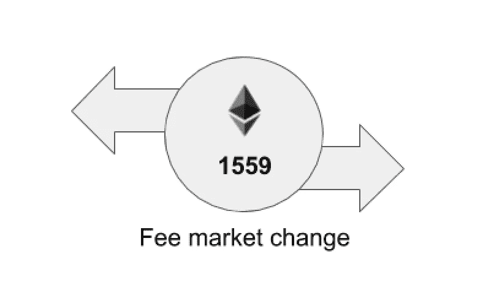

# 为什么 EIP-1559 很重要

> 原文：<https://medium.com/coinmonks/why-eip-1559-is-important-5c24d592eace?source=collection_archive---------4----------------------->

Courtesy: EIP-1559 Community Fund / Gitcoin Grants

EIP-1559 于 2021 年 8 月 5 日正式上线，作为伦敦硬福克音乐节的一部分，在一片喧嚣声中，所有的担心都没有发生；连锁分裂，价格暴跌(ETH 实际上涨了 4%)，或者由于矿工没有分叉以太坊和集成 EIP-1559 作为分叉的一部分而导致的世界计算机末日(lol)。EIP-1559 改变了以太网收费市场的运作方式；它引入了一种新的**基本费用**，这种费用被烧掉而不是支付给矿工，用户现在可以指定交易的最高费用和优先费用，而不是天然气价格。

按照公式，根据 EIP-1559，交易费使用以下等式计算:

**交易费用=基本费用+最低费用(最大费用-基本费用，优先费用)**

*   basefeed:可以通过一个新的 JSON RPC 调用 eth_feeHistory 获取一个基于网络拥塞和最新值(对于块空间)浮动的费用
*   优先权费(也称为小费，矿工的小费):引诱大宗商品生产商参与交易的费用
*   **maxFee** :用户愿意支付的最高网费。

EIP-1559 并不是凭空出现的，它的设计和实施是为了解决以太坊网络中的一些重大问题。但在此之前，让我们从头开始:**什么是 EIP-1559？**

[EIP-1559](https://eips.ethereum.org/EIPS/eip-1559) (以太坊改进提案 1559)由 Vitalik Buterin 于 2019 年提出，描述了以太坊收费模式的变化。它被定义为一种交易定价机制，包括*固定的每块网络费用，该费用被消耗并动态地扩展/收缩块大小以处理短暂的拥塞*。

要完全理解以上内容，我们必须先看看以太坊的收费模式在 EIP-1559 年之前是什么样的；一种简单的拍卖机制，也称为**首价拍卖**。在这种一级价格拍卖模式中，希望自己的交易被矿商收购的用户，必须为自己的交易出价，才能被纳入区块。这是通过提交他们愿意为特定交易支付的天然气价格来完成的。通过按照最高天然气价格对交易进行排序，并首先包括利润最大的交易，矿商受到激励，选择将交易纳入区块。油价较低的用户将不得不等待很长时间，才能将其交易纳入一个区块。这通常会导致用户为他们的交易支付过多的费用。这样效率很低，对用户体验也不理想。

EIP-1559 前来救援，目标如下:

*   **提高交易费用的可预测性:**在 EIP-1559 年之前，以太坊的交易费用是由市场决定的，即天然气价格/费用决定了一家矿商将一笔交易纳入区块的速度。过去，在 ICOs、网络升级或 NFT 热潮期间，网络活动频繁，网络用户和钱包很难预测汽油费。这要么导致超额支付以被包括在块中，要么导致支付不足并等待很长时间以将交易包括在块中，无论哪种方式都不是理想的。EIP-1559 用固定价格销售取代了汽油费。现在，提交交易的人将不必猜测需要多少汽油，因为将有一个明确的“基本费用”被纳入下一个区块，并向矿工支付小费。对于希望区分事务优先级的用户或应用程序，他们可以添加更多的提示来激励挖掘者区分事务的优先级。基本费用将被“烧掉”，意思是销毁，而小费归矿工。像 MetaMask 这样的钱包也利用这一点来进行更好的估计，并且不必太依赖外部 oracles，因为基本费用是由协议本身管理的。

然而，在由于高网络活动(例如 NFT 下降)而出现需求高峰的情况下，系统还会返回到 tip 的第一价格拍卖，但是，因为，很明显高峰何时结束，价格会更快回落，这可能是在接下来的几个街区内(可能是几分钟的事情)。这个想法是让基于批量需求的费用对用户来说更加透明。

*   **减少交易确认中的延迟:**在 EIP-1559 之前，交易延迟是因为区块总是满的；充满了自上一个街区以来支付最高的交易。要将一项交易纳入该区块，它必须支付更高的天然气费。如果它不支付更高的天然气费，因此不会立即被纳入区块，很难估计它何时会被纳入。后 EIP-1559，块可以是 200%满的，即无论为块设置的气体限制是什么，具有两倍气体限制的块将是有效的。例如，如果区块的气体限制设置为 10m 气体，则最大为 20m 气体的区块将有效。这意味着在大多数情况下，数据块会有额外的 100%的容量，仍然可以用事务来填充。因此，只要发送的交易费用高于 baseFee，并且包含 miner tip (priorityFee)，它就会被包含在下一批块中。maxFee 和 baseFee + tip 之间的差额将返还给交易发送方(与 1559 年前的 EIP 不同)。
*   **在网络活动和网络供应之间建立正反馈循环** **:** EIP-1559 允许通过将每个区块的最大天然气限额从 1250 万天然气更改为 2500 万天然气来增加网络容量，这是区块大小的两倍。随着基础费和网络容量的增加，EIP-1559 可以具有以下逻辑，当网络利用率超过 50%时，基础费递增，当网络利用率低于 50%时，基础费递减。这意味着网络旨在通过根据网络利用率调整费用来实现 50%容量的平衡。
*   **制造通缩压力:**在 EIP-1559 下，每笔交易都要烧掉基础费。基本费用随着对块空间的需求而上升和下降。在对地块空间的持续高需求期间，基础费用上升，并对 ETH 的供应造成通缩压力。烧钱在网络用户和 ETH 供应商之间创造了一个有趣的反馈循环。更多的网络活动意味着更多的 ETH 燃烧，意味着更少的 ETH 可供矿工在市场上出售，使得现有的 ETH 更有价值。烧钱基本上是奖励网络用户，让他们的 ETH 更稀缺，从而更有价值，而不是多付钱给矿工。

与 EIP-1559 降低天然气费用的流行误解相反，EIP-1559 真正做的是使天然气价格更加透明，而不是降低价格，通过平滑费用飙升和限制超额支付交易的数量来优化收费模式。降低天然气费用的主要方式仍然是 ETH 2.0 和第 2 层扩展解决方案，我相信我们都迫不及待了。

要更深入地阅读，请查看 Tim Beiko 的这个资源，每篇好文章都指向它。*眨眼*。

此外，非常感谢蒂姆·贝科对这篇文章的及时投入和编辑。

[https://eips.ethereum.org/EIPS/eip-1559](https://eips.ethereum.org/EIPS/eip-1559)

[https://www.youtube.com/watch?v=MGemhK9t44Q](https://www.youtube.com/watch?v=MGemhK9t44Q)

[https://consensys . net/blog/quorum/what-is-EIP-1559-how-will-it-change-ether eum/](https://consensys.net/blog/quorum/what-is-eip-1559-how-will-it-change-ethereum/)

[https://hackmd.io/@timbeiko/1559-resources](https://hackmd.io/@timbeiko/1559-resources)

[https://blog . in fura . io/London-fork/# ourinfrastructureisready](https://blog.infura.io/london-fork/#ourinfrastructureisready)

> 加入 Coinmonks [电报频道](https://t.me/coincodecap)和 [Youtube 频道](https://www.youtube.com/c/coinmonks/videos)了解加密交易和投资

## 也阅读

 [## 最佳加密交易所| 2021 年十大加密货币交易所

### ICON _ PLACEHOLDEREstimated 预计阅读时间:28 分钟加密货币交易所的加密交易需要知识…

blog.coincodecap.com](https://blog.coincodecap.com/crypto-exchange)  [## 2021 年 10 大最佳加密贷款平台| CoinCodeCap

### 当谈到加密货币贷款时，大量因素等同于良好的收入状况。此外，借款的一部分…

blog.coincodecap.com](https://blog.coincodecap.com/crypto-lending)  [## 2021 年最佳免费加密交易机器人

### 2021 年币安、比特币基地、库币和其他密码交易所的最佳密码交易机器人。四进制，位间隙…

medium.com](/coinmonks/crypto-trading-bot-c2ffce8acb2a)  [## 最佳 4 个加密交易信号电报通道

### 这是乏味的找到正确的加密交易信号提供商。因此，在本文中，我们将讨论最好的…

medium.com](/coinmonks/best-crypto-signals-telegram-5785cdbc4b2b)  [## BlockFi 评论 2021:利弊和利率| CoinCodeCap

### 今天，我们提出了一个全面的 BlockFi 评论，这是一个成立于 2017 年的加密贷款平台，拥有其…

blog.coincodecap.com](https://blog.coincodecap.com/blockfi-review)  [## 如何在印度购买比特币？2021 年购买比特币的 7 款最佳应用[手机版]

### 如何使用移动应用程序购买比特币印度

medium.com](/coinmonks/buy-bitcoin-in-india-feb50ddfef94)  [## 加密税务软件——五大最佳比特币税务计算器[2021]

### 不管你是刚接触加密还是已经在这个领域呆了一段时间，你都需要交税。

medium.com](/coinmonks/best-crypto-tax-tool-for-my-money-72d4b430816b)  [## 存储比特币的最佳加密硬件钱包[2021] | CoinCodeCap

### 保管您的数字资产很容易，但找到正确的存储方式却是一项繁琐的任务。在线钱包有一个风险…

blog.coincodecap.com](https://blog.coincodecap.com/best-hardware-wallet-bitcoin)