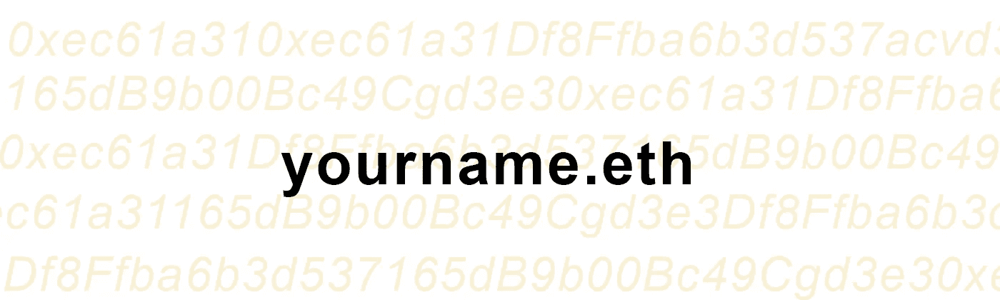
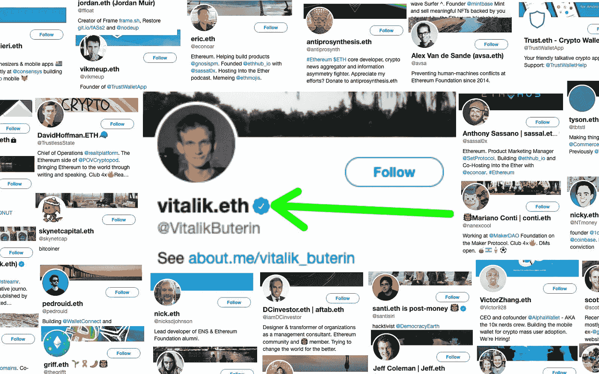
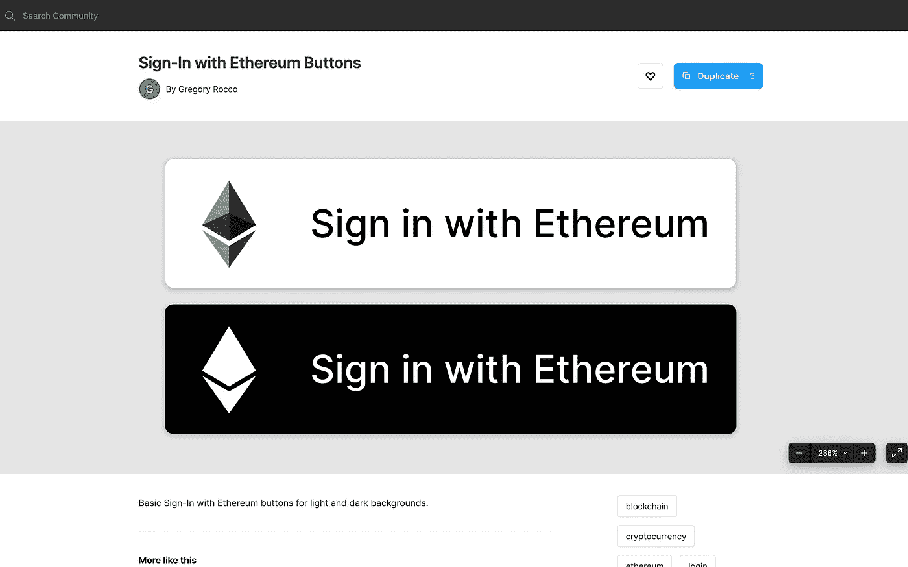
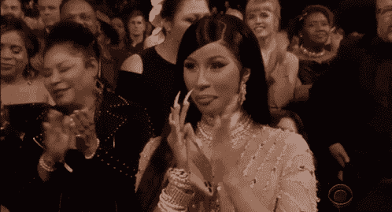

# 为什么。ETH 名称？

> 原文：<https://medium.com/coinmonks/why-eth-names-badeb7ac9fae?source=collection_archive---------6----------------------->

## web 3 的一个真正入口是如何简化加密的可访问性的。

上个月，ENS 的早期用户仅仅因为购买了一个. eth 域名，就被空投了价值高达 5 位数美元的 ENS 治理令牌。它确实让许多错过这个机会的人感兴趣了。对于密码领域的大多数人来说；十一月是十二月。这是 ENS 真正成为焦点的一个月。虽然 ENS 的名字自 2017 年以来就已经存在，但大多数人直到[空投新闻](https://www.google.com/amp/s/cointelegraph.com/news/early-ethereum-name-service-ens-adopters-rewarded-with-a-hefty-five-figure-airdrop/amp)之后才听说过它，甚至更多的人仍然被蒙在鼓里。

在这篇文章中，我将深入研究 ENS 的名称以及它们所代表的未来。

## **ENS 是什么？**

以太坊名称服务(ENS)是一个分散式 web 的命名协议。它存在于但不限于以太坊区块链。将机器数据转化为人类友好的名称变得很难阅读甚至记忆。

## **什么是以太坊名称？**

用 [ENS 公司本身的话说](https://ens.domains/)；你可以把它想象成拥有你的 web3 用户名以及你所有加密钱包和分散网站的名称。

就是这样。你一定在 Twitter 上你最喜欢的密码影响者的个人资料中见过这个名字。

Image source: [Brantley.eth](/the-ethereum-name-service/why-vitalik-and-everyone-else-has-eth-in-their-twitter-profiles-and-you-should-too-f5e62731c4d1)

如果我告诉你 vitalik.eth 上面是他的以太坊钱包地址，他就不必每次想在这个钱包里接收付款时都要手忙脚乱地拿手机复制粘贴了。或者更令人兴奋的是，这个名字可以出现在他的其他钱包上，甚至来自其他区块链。

## 欢迎光临。eth 不再有又长又不友好的钱包地址

想想你的传统网站域名。它们有助于将您的网站 IP 地址转换成人类可读的格式。你的 IP 地址看起来像这样“192.158.1.38 ”,每次你向潜在的访问者推销你的网站时，你肯定想不起来。这是你的。com，。组织，。英国 DNS 名称进来-人类友好。以 medium.com 为例，而不是以前漫长的 192.158.1.38

这几乎是同一个问题被一个. eth 名字解决了。

> **你愿意告诉别人你的钱包地址是 0 xec 61 a 31 df 8 ffba 6b 3d 537165 db 9 b 00 BC 49 cgd 3 e 3 还是你的地址是 Brantley.eth**

我打赌你选择了后者。任何人都更容易记住这一点。这会减轻很多压力，尤其是在接受加密支付的时候。

## **超越以太坊钱包的 ENS。**

ENS 目前支持多达 110 个顶级区块链，而不仅仅是运行它的以太坊区块链。让区块链在 ENS 上得到支持只需要让区块链包含在 ENS 地址编码库中。所以我们的朋友布兰特利可以用同样的方法得到 100 美元。eth 名称。该名称允许链接您的多个钱包地址。

## **更进一步；DNS 名称空间集成**

这允许大多数 DNS 域名所有者将其 DNS 域名加入 ENS。以 budweiser.com 域名为例。我们可以把我们 budweiser.com 的名字输入 ENS，然后用 budweiser.com 来接收 sol，ftm e.t.c 的付款

## **。ETH 名称；您的 Web 3 用户名/档案**

想象一下，从 Twitter 到 LinkedIn、IG 甚至 medium，你的所有社交平台都有一个预设的用户名和头像，而不必每次都注册。ENS 在大多数你喜欢的分散平台上都是这样做的。你可以跨多个服务存储你的用户名、头像和其他个人资料。

在未来，我们可能只是登录以太坊，而不是谷歌。

Image source: [Brantley.eth](https://twitter.com/BrantlyMillegan/status/1466511035389648902?t=t7-ZqI7gI-WQ6Of-8ezHjw&s=19%C2%A0)

## **隐私问题**🔐

一般来说，在区块链，隐私一直是一个令人担忧的领域，因为任何人都可以用你的钱包地址扫描它，并查看你之前用那个钱包进行的所有交易。

ENS names 则更进了一步，因为所有不同的地址都与一个名字相关联。有了这个名字，任何人都可以看到你所有的钱包，以及你之前的所有交易。因此，在用您的更新您的个人资料图片之前。eth 名称。并不是说当你分享你的钱包地址时，他们不能做同样的事情。在公开之前，要确定你愿意分享多少。

Budweiser displaying beer.eth Image source: [Budweiser](https://www.google.com/url?sa=t&source=web&rct=j&url=https://twitter.com/budweiserusa%3Flang%3Den&ved=2ahUKEwi0hrLpzcn0AhWyxoUKHfX9ChQQjjh6BAgFEAE&usg=AOvVaw1Q1H-I3N7D5Jib4NpF0uEU)

## **最终想法**

尽管采用 ENS 名称在已经有加密倾向的人群中更为普遍。ENS 和 crypto 通常仍处于早期阶段，ENS 仍然是最广泛集成的区块链命名标准。

随着最近的 [DNS 名称空间集成](/the-ethereum-name-service/full-dns-namespace-integration-to-ens-now-on-mainnet-9d37270807d3)，支持该项目的稳定团队以及最近将监管权移交给其机构群体。我确信我们将会看到更多的创新措施来推动主流的采用，同时也对抗它的一些隐私弊端。同样值得注意的是，有[计划集成在以太坊区块链之外传输和存储记录的功能。](/the-ethereum-name-service/a-general-purpose-bridge-for-ethereum-layer-2s-e28810ec1d88)

> 再一次认为这是你的传统。域名在 90 年代末的 DNS 协议上。我们已经尽可能早了。

**延伸阅读**

[如何通过](/coinmonks/how-to-register-an-ens-name-for-your-wallet-address-190767641dae) [Teju Adeyinka](https://medium.com/u/840467137bce?source=post_page-----badeb7ac9fae--------------------------------) 为您的钱包地址获得一个 ens 名称。

如果你想把你的传统域名导入到 ENS. [这里的](/the-ethereum-name-service/step-by-step-guide-to-importing-a-dns-domain-name-to-ens-d2d15feb03e8)是由 [brantly.eth](https://medium.com/u/6b11550a602f?source=post_page-----badeb7ac9fae--------------------------------) 提供的一步一步的指导。

还有。eth 名称可以作为 NFT 进行交易。我在 NFTs [上写了这里](/coinmonks/what-the-heck-are-nfts-dfd14e57200f)。

**你觉得这篇文章有用吗？拍手，评论，分享给朋友。**👏

[Gif source](https://tenor.com/view/cardi-b-clapping-applause-congratulations-congrats-gif-19739650)

> 加入 Coinmonks [电报频道](https://t.me/coincodecap)和 [Youtube 频道](https://www.youtube.com/c/coinmonks/videos)了解加密交易和投资

## 另外，阅读

*   [分散交易所](https://blog.coincodecap.com/what-are-decentralized-exchanges) | [比特 FIP](https://blog.coincodecap.com/bitbns-fip) | [Pionex 评论](https://blog.coincodecap.com/pionex-review-exchange-with-crypto-trading-bot)
*   [用信用卡购买密码的 10 个最佳地点](https://blog.coincodecap.com/buy-crypto-with-credit-card)
*   [OKEx 回顾](/coinmonks/okex-review-6b369304110f) | [Kucoin 交易机器人](/coinmonks/kucoin-trading-bot-automate-your-trades-8cf0ca2138e0) | [期货交易机器人](/coinmonks/futures-trading-bots-5a282ccee3f5)
*   [AscendEx Staking](https://blog.coincodecap.com/ascendex-staking)|[Bot Ocean Review](https://blog.coincodecap.com/bot-ocean-review)|[最佳比特币钱包](https://blog.coincodecap.com/bitcoin-wallets-india)
*   [霍比评论](https://blog.coincodecap.com/huobi-review) | [OKEx 保证金交易](https://blog.coincodecap.com/okex-margin-trading) | [期货交易](https://blog.coincodecap.com/futures-trading)
*   [Godex.io 审核](/coinmonks/godex-io-review-7366086519fb) | [邀请审核](/coinmonks/invity-review-70f3030c0502) | [BitForex 审核](https://blog.coincodecap.com/bitforex-review)
*   [Crypto.com 费用](/coinmonks/binance-fees-8588ec17965) | [僵尸加密审查](/coinmonks/botcrypto-review-2021-build-your-own-trading-bot-coincodecap-6b8332d736c7) | [替代品](https://blog.coincodecap.com/crypto-com-alternatives)
*   [有哪些交易信号？](https://blog.coincodecap.com/trading-signal) | [Bitstamp vs 比特币基地](https://blog.coincodecap.com/bitstamp-coinbase) | [买索拉纳](https://blog.coincodecap.com/buy-solana)
*   [ProfitFarmers 回顾](https://blog.coincodecap.com/profitfarmers-review) | [如何使用 Cornix Trading Bot](https://blog.coincodecap.com/cornix-trading-bot)
*   [MXC 交易所评论](/coinmonks/mxc-exchange-review-3af0ec1cba8c) | [Pionex vs 币安](https://blog.coincodecap.com/pionex-vs-binance) | [Pionex 套利机器人](https://blog.coincodecap.com/pionex-arbitrage-bot)
*   [我的加密副本交易经历](/coinmonks/my-experience-with-crypto-copy-trading-d6feb2ce3ac5) | [比特币基地评论](/coinmonks/coinbase-review-6ef4e0f56064)