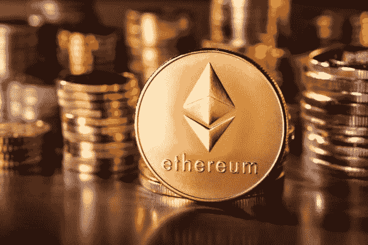
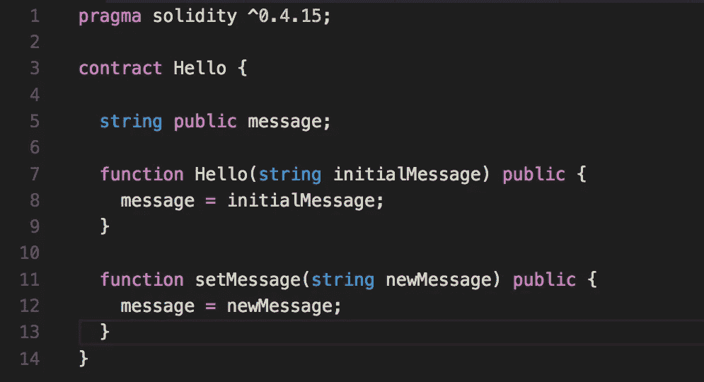

# 为什么以太坊是技术上最大的颠覆之一(在我看来)

> 原文：<https://medium.com/coinmonks/why-ethereum-is-one-of-the-greatest-disruptions-in-technology-in-my-opinion-9c25e31ab4bf?source=collection_archive---------9----------------------->

Photo from iStock

智能合同、去中心化应用(dapps)、去中心化金融(Defi)、NFTs 等等。这些术语都是以太坊引入的。但它是如何开始的，为什么以太坊可能是最伟大的技术颠覆，让我们看看！

# 介绍

以太坊最初是由俄裔加拿大程序员 Vitalik Buterin 构思的。布特林认为，区块链技术不仅可以应用于货币，还可以将股票、房地产和现实世界的资产附加到区块链上。

Vitalik Buterin, co-founder of Ethereum at techcrunch conference

他还提出了一种图灵完全编程语言，这种语言可以支持更健壮的区块链用例，后来被称为 Solidity。不过以太坊是在 2013 年 12 月由 Vitalik Buterin、Anthony Di Iorio、Charles Hoskinson、Mihai Alisie & Amir Chetrit(初始 5 人)正式创立的。2014 年初，Joseph Lubin、Gavin Wood 和 Jeffrey Wilcke 作为创始人加入。

# 比特币的问题是

尽管比特币是一项伟大的发明，但仍存在许多问题:

1.  比特币将区块链技术的可用性仅限于金钱和货币。以太坊提议利用区块链技术不仅用于维护分散支付网络，还用于存储计算机代码，这些代码可用于支持防篡改的分散金融合同和应用。
2.  比特币不仅仅是为应用开发而生的。比特币是作为一种国家货币的替代品而诞生的，因此渴望成为一种交易媒介和价值储存的 T2，以太坊旨在成为一个平台，通过自己的货币促进不可改变的程序化合约和应用。

# Dapps 与传统应用

Dapps 不受任何中央用户控制，而是在区块链上运行。正因为如此，它们不容易被关闭。大多数 dapps 都有内在的激励机制

# DeFi vs 传统金融

以太坊带来了 Defi。传统金融有中介，容易被操纵。由于 defi 的分散性质，它很难操作。从自动做市商(AMM)到快速贷款，Defi 已经变得非常创新！

# NFTs

这就是以太坊的疯狂之处。NFT(不可替换的代币)只是存储在区块链上的数字艺术。想想比特币。1 个比特币与另一个比特币的价值相同，但对于 NFTs 来说就不是这样了。在以太坊区块链上，NFT 被描绘成 ERC-721 代币，而不是 ERC-20。价值数百万美元的 NFT 已经在受欢迎的 NFT 市场上出售，如 OpenSea、Cryptopunks 和 Rarible。最贵的 NFT 以 5.3 亿美元的高价卖出[。太疯狂了。！](https://www.cnet.com/news/this-cryptopunk-nft-just-sold-for-530-million-kind-of/#:~:text=CryptoPunk%20%239998%2C%20part%20of%20a,for%20%24530%20million%20on%20Thursday.&text=It's%20the%20most%20expensive%20NFT,ethereum%20%2D%2D%20about%20%24532%20million.)

# 智能合同

智能合约是以太坊的核心。可以将智能合约看作是写入区块链的“如果-那么”代码。智能合约控制以太坊上的一切，包括 Dapps、Defi 和 NFTs。

# 结论

以太坊自称是世界上第一台去中心化的全球计算机。以太坊上发生的大量创新只是对以太坊将成为 web 3.0 的一个好玩家的一瞥。虽然我个人是 Polkadot 的超级粉丝，但以太坊本质上提供了去中心化的价值互联网和更广泛的 Web 3.0 的基础。

*免责声明:本网站提供的信息不构成投资建议、财务建议、交易建议或任何其他类型的建议，您不应将本网站的任何内容视为投资建议、财务建议、交易建议或任何其他类型的建议。加密货币不受监管，风险很大。在做出任何投资决定之前，一定要做好自己的尽职调查，并咨询你的财务顾问。*