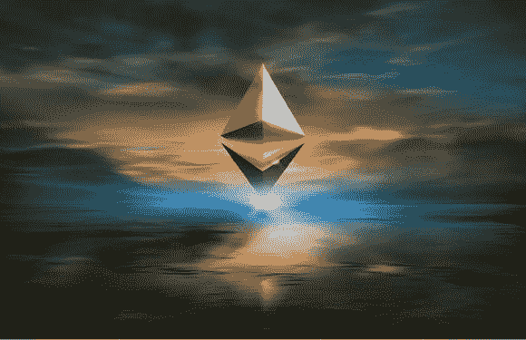

# 为什么以太坊将有可能在 2022 年超过比特币

> 原文：<https://medium.com/coinmonks/why-ethereum-will-likely-outperform-bitcoin-in-2022-81fb2b0e1d73?source=collection_archive---------9----------------------->

## Cryptos

## 以太坊可以凭借其新的利益证明系统胜过比特币

[Photo by Zoltan Tasi on Unsplash](https://unsplash.com/photos/uNXmhzcQjxg)

**比特币** (BTC)今年迄今已上涨 76%，[根据](https://www.google.com/finance/quote/BTC-USD?hl=en&window=YTD) *谷歌金融，*截至 12 月 27 日，比特币价格为 51757 美元。但是**以太坊** (ETH)同期上涨 461.6%，[基于*谷歌金融*](https://www.google.com/finance/quote/ETH-USD?hl=en&window=YTD) 。