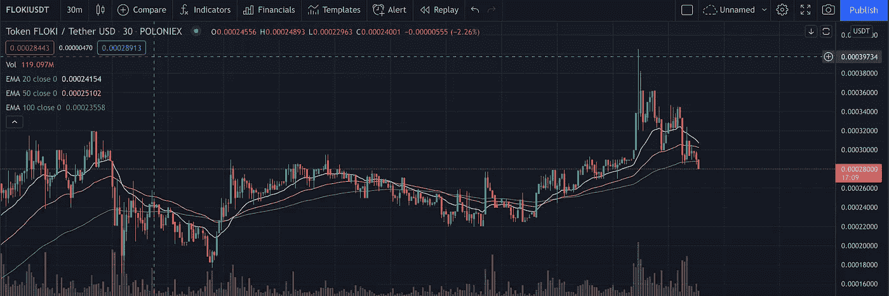
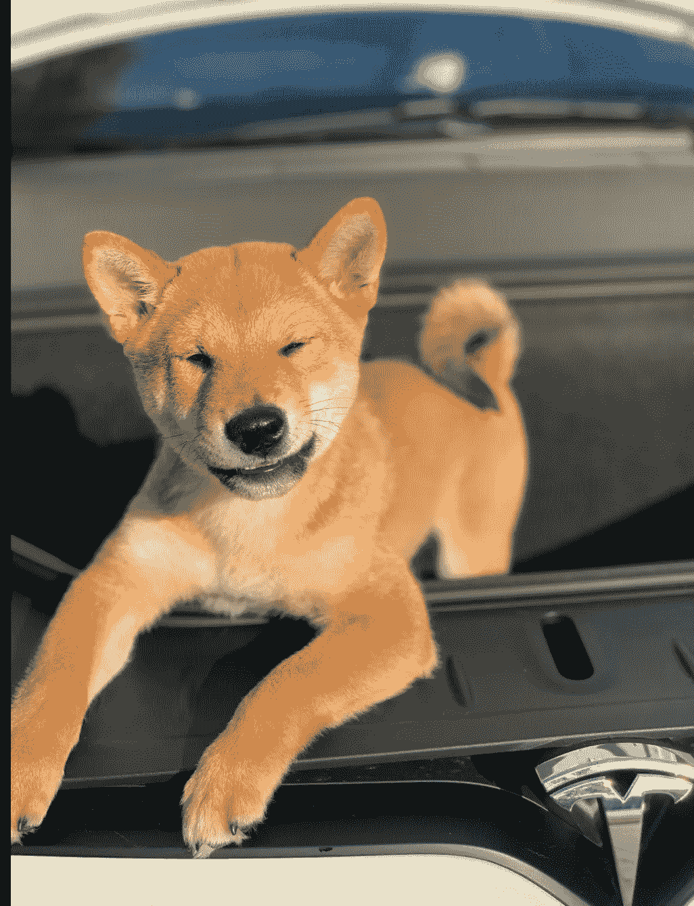
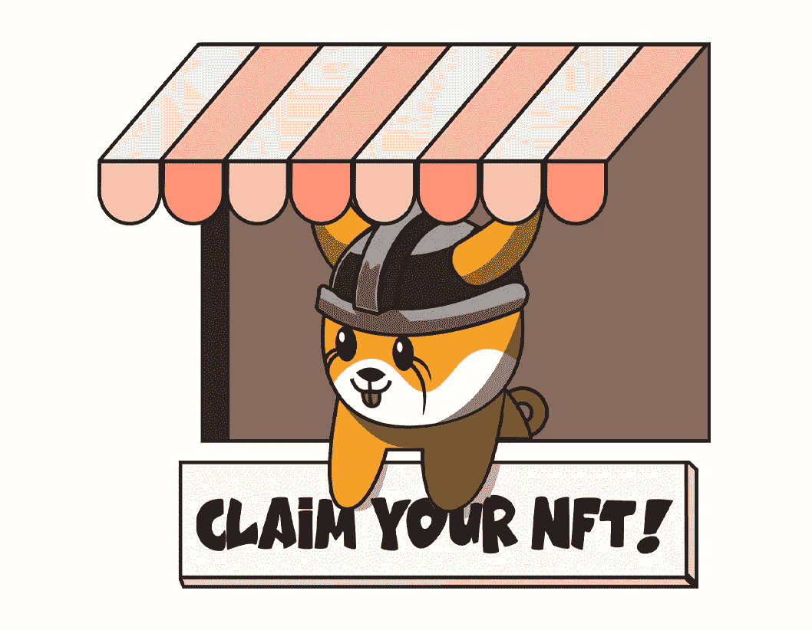
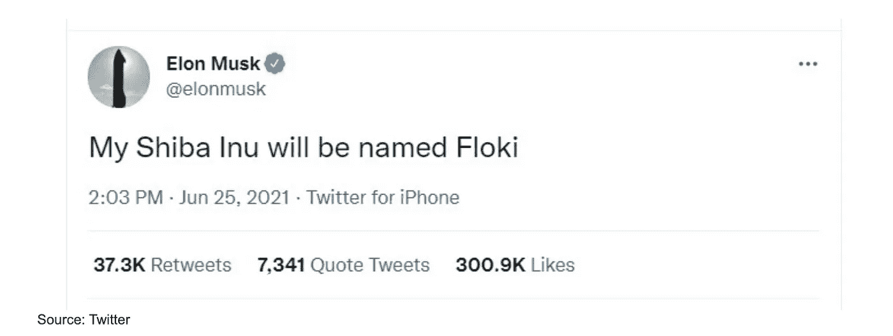
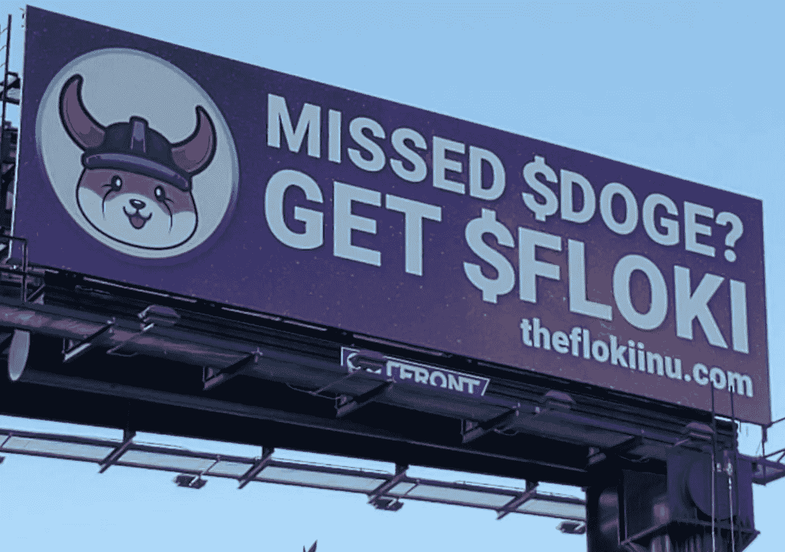

# 为什么 FLOKI 是一项百万美元的投资

> 原文：<https://medium.com/coinmonks/why-floki-is-a-million-dollar-investment-118eaf3323a1?source=collection_archive---------13----------------------->

我在加密领域已经呆了几年，密切关注着从 SHIB 到多吉的这些迷因硬币，我可以完全有信心地说，弗洛基会超越他们。

弗洛基是进入加密领域的第三代狗币迷因。在撰写本文时，FLOKI 的市值徘徊在 0.000028-30 英镑之间，约为 30 亿英镑。当我说第三代时，这意味着 DOGE 第一个迷因币出来时基本上没有什么效用。然后是建立在以太坊网络上的 SHIB，基本上允许它访问并用于智能合约。弗洛基是在以太坊网络上创建的，拥有 SHIB 所有的优点，但还有另外三个关键元素。

第一，它是由人民为人民创造的，这意味着前 3 名钱包拥有的硬币不超过总硬币的 14%。这很重要，因为正如我们今天所看到的，SHIB 在 1 wallet 的一笔大买卖中损失了 50%,他在 SHIB 拥有 30 亿美元，现在正在出售。这意味着没有大“鲸鱼”可以导致市场崩溃。

第二，弗洛基有一个游戏元宇宙，它将成为游戏行业的下一条大道，你可以通过玩它来赚钱/加密。想象一下玩堡垒之夜赚钱吧！这与 NFTs、虚拟化身和虚拟现实有关。

第三，如果说我们从这种迷因硬币热潮中学到了什么，那就是以某种方式与埃隆·马斯克和他的 Twitter 联系在一起将推动几乎所有事物的价值。弗洛基是马斯克先生新得到的小狗的名字。因此，每当他在推特上发布关于他的小狗的消息时，这枚硬币就会自动获得免费宣传。你可以把它记为 100%的回报！

现在进入 [FLOKI](https://theflokiinu.com/) 就像在 2012 年称特斯拉为我们时代的下一个大公司。我个人认为这枚硬币绝对不会消失或失效。哦，除此之外，他们还在从迪拜到美国的世界各地开展硬鼻子营销活动…

> 加入 Coinmonks [电报频道](https://t.me/coincodecap)和 [Youtube 频道](https://www.youtube.com/c/coinmonks/videos)了解加密交易和投资

## 另外，阅读

*   [AscendEx 保证金交易](https://blog.coincodecap.com/ascendex-margin-trading) | [Bitfinex 赌注](https://blog.coincodecap.com/bitfinex-staking)
*   [AscendEx Staking](https://blog.coincodecap.com/ascendex-staking)|[Bot Ocean Review](https://blog.coincodecap.com/bot-ocean-review)|[最佳比特币钱包](https://blog.coincodecap.com/bitcoin-wallets-india)
*   [Bitget 回顾](https://blog.coincodecap.com/bitget-review)|[Gemini vs block fi](https://blog.coincodecap.com/gemini-vs-blockfi)|[OKEx 期货交易](https://blog.coincodecap.com/okex-futures-trading)
*   [美国最佳加密交易机器人](https://blog.coincodecap.com/crypto-trading-bots-in-the-us) | [不断回顾](https://blog.coincodecap.com/changelly-review)
*   [在印度利用加密套利赚取被动收入](https://blog.coincodecap.com/crypto-arbitrage-in-india)
*   [霍比评论](https://blog.coincodecap.com/huobi-review) | [OKEx 保证金交易](https://blog.coincodecap.com/okex-margin-trading) | [期货交易](https://blog.coincodecap.com/futures-trading)
*   [麻雀交换评论](https://blog.coincodecap.com/sparrow-exchange-review) | [纳什交换评论](https://blog.coincodecap.com/nash-exchange-review)
*   最好的[加密税务软件](/coinmonks/best-crypto-tax-tool-for-my-money-72d4b430816b) | [硬币追踪评论](/coinmonks/cointracking-review-a-reliable-cryptocurrency-tax-software-5114e3eb5737)
*   [Stackedinvest 评论](https://blog.coincodecap.com/stackedinvest-review) | [北海巨妖评论](/coinmonks/kraken-review-6165fc1056ac) | [bitFlyer 评论](https://blog.coincodecap.com/bitflyer-review)
*   最佳[密码借贷平台](/coinmonks/top-5-crypto-lending-platforms-in-2020-that-you-need-to-know-a1b675cec3fa) | [杠杆令牌](/coinmonks/leveraged-token-3f5257808b22)
*   最佳[加密制图工具](/coinmonks/what-are-the-best-charting-platforms-for-cryptocurrency-trading-85aade584d80) | [最佳加密交易所](/coinmonks/crypto-exchange-dd2f9d6f3769)
*   [比特币基地僵尸程序](/coinmonks/coinbase-bots-ac6359e897f3) | [AscendEX 审查](/coinmonks/ascendex-review-53e829cf75fa) | [OKEx 交易僵尸程序](/coinmonks/okex-trading-bots-234920f61e60)
*   [如何在印度购买比特币？](/coinmonks/buy-bitcoin-in-india-feb50ddfef94) | [WazirX 审查](/coinmonks/wazirx-review-5c811b074f5b)
*   [CryptoHopper 替代品](/coinmonks/cryptohopper-alternatives-d67287b16d27) | [HitBTC 审查](/coinmonks/hitbtc-review-c5143c5d53c2)
*   [折叠 App 审核](https://blog.coincodecap.com/fold-app-review) | [Kucoin 交易机器人](/coinmonks/kucoin-trading-bot-automate-your-trades-8cf0ca2138e0) | [Probit 审核](https://blog.coincodecap.com/probit-review)
*   [如何匿名购买比特币](https://blog.coincodecap.com/buy-bitcoin-anonymously) | [比特币现金钱包](https://blog.coincodecap.com/bitcoin-cash-wallets)
*   [币安 vs FTX](https://blog.coincodecap.com/binance-vs-ftx) | [最佳(SOL)索拉纳钱包](https://blog.coincodecap.com/solana-wallets)