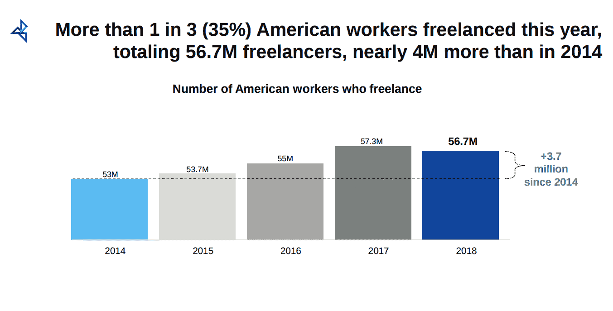
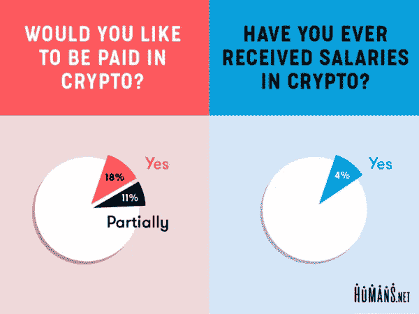

# 为什么自由职业者应该开始接受加密？

> 原文：<https://medium.com/coinmonks/why-freelancers-should-start-accepting-crypto-f2f56d69507f?source=collection_archive---------7----------------------->

## 节省您的资金，并从世界任何地方获得报酬

自由职业者正在稳步增长，Upwork 2018 报告显示，约 67%的自由职业者正在网上寻找自由职业者的工作，主要媒介是自由职业者市场。到 2020 年，自由职业者将占劳动力的 43%。

这些自由职业者在菲亚特在线获得报酬，但菲亚特有一些固有的问题。

*   支付费用
*   不支持即时汇款(国际)
*   不合理的汇率
*   支付安全

PayPal 的美国自由职业者洞察报告在选择自由职业者接受客户付款的方式时，安全性(44%)和速度(38%)是最重要的两个标准。

## 加密支付在这方面有什么帮助？

加密支付可以真正影响这个市场，因为加密有几个基本属性。

*   全球无国界支付
*   即时支付和结算
*   可忽略不计的支付费用
*   没有汇率问题

就像国际支付一样，你的钱从一家银行跳到另一家银行，需要几天才能到达你的账户，汇率由银行决定(大多数时候你不会满意)。

Crypto 通过客户和自由职业者之间的直接交易来解决这个问题。现在你不用支付高额的支付费用。这是非常有力量的。

**例子**——如果你每年挣 1 万美元，并支付 5%的费用，那么每年的费用就是 500 美元。那在任何情况下都没有意义。

Human.net 调查显示 30%的自由职业者已经收到加密支付。

我已经创建了[***Cryptofi***](https://cryptofi.co)为了同样的目的，你可以创建美元，加元或其他法定货币的发票，并接受他们的加密。你只需要添加你的钱包地址，你就可以开始了。🚀

我们不持有您的密钥或资金，您可以添加您的钱包/交换地址，以便您可以随时转换您的加密。

你还在等什么？[今天创建您的第一张发票，并通过 crypto 获得付款](/coinmonks/create-a-bitcoin-invoice-in-3-simple-steps-a0ec5091ce8c)。可以在这里看[视频教程。](https://www.youtube.com/watch?v=xGLZ2eo7xiA)

如果你想给我们任何反馈，请加入我们的[电报](https://t.me/joinchat/FyuZEQ7M7YucH1FY3cVa0A)频道。

> [在您的收件箱中直接获得最佳软件交易](https://coincodecap.com/?utm_source=coinmonks)

