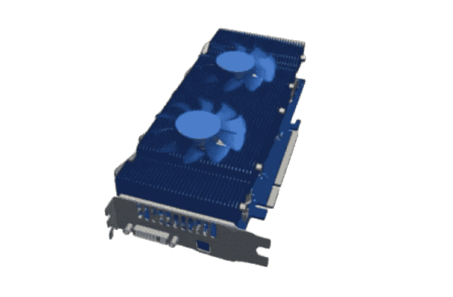

# 为什么 GPU 挖矿要带着 Grin 卷土重来！

> 原文：<https://medium.com/coinmonks/why-gpu-mining-is-making-a-comeback-with-grin-e91424d3b541?source=collection_archive---------1----------------------->

如果你问一位 PC 游戏爱好者，在 2017 年和 2018 年的大部分时间里购买显卡是什么感觉，你可能会感到紧张不安，就好像你迫使他们重新经历了一次深刻的创伤事件。随着加密货币在那个时期的价值飙升，GPU 挖掘也越来越受欢迎。

然而，随着某些加密货币的价值下降，ASIC 挖掘开始占据主导地位，在 GPU 上进行挖掘很快变得难以负担。简而言之，在硬件和电力方面的投资没有得到足够的回报，不值得投资。就这样，GPU 挖矿的时代结束了，一去不复返。或者是吗？

逆来顺受

虽然比特币和以太坊可能是最著名的加密货币，但市场上实际上有 2534 种不同的货币。然而，尽管市场上有如此多的货币，但最近的讨论集中在所谓的“隐私币”上，这种货币专注于安全和匿名交易，旨在解决现有加密货币的一些弱点。特别是一枚隐私硬币，引起了很多兴奋，也可能标志着 GPU 挖掘的复兴；这枚硬币叫做格林。

Grin 真是个巫师！

Grin 是 MimbleWimble 的一种实现，MimbleWimble 是一种区块链协议，由一位名叫“Tom Elvis Jedusor”的匿名密码学家在 2016 年首次提出。这个名字，连同 MimbleWimble 和 Grin 本身都是对哈利波特的半隐晦的引用。

MimbleWimble 是一个默认隐私的区块链，设计为可扩展的，Grin 实现解决了现有货币的一些关键问题。例如，Grin 没有地址这一事实意味着交易无法追踪或追溯到个人。你可能认为其他货币也是如此，比如比特币。尽管比特币地址是匿名的，但区块链和每一笔交易都是公开的。这意味着个人可能与某些交易相关联，例如，在一家在线零售商处购买的商品，该零售商将您的个人信息存储为 cookie。一旦你的钱包与你的身份联系起来，你的整个交易历史都可以被追踪。

在有人受伤之前都是可替换的游戏

隐私是“可替代性”中的一个关键因素，可替代性是指确保同类物品的价值是相同的。例如，一枚 1 英镑的硬币与世界上其他 1 英镑的硬币价值相同，但一颗钻石可能与另一颗相同质量的钻石价值完全不同，这取决于许多质量因素。比特币可能与个人相关联，或许还可能与犯罪活动相关联，这一事实意味着，在未来，有交易历史的比特币可能会比没有交易历史的比特币价值更低。

Grin 还通过删除大部分过去的交易信息，大幅缩小了区块链的规模，这意味着与其他硬币相比，只有一小部分数据被存储。这有助于确保交易不会变得难以处理，例如，这是比特币面临的问题。

Grin 也是由社区驱动的，并且专注于分散式开发。正如 Grin 开发者“Yeastplume”在声明 **1** 中所说:“我们不受利润或公司利益的驱动……我们是开源的，由社区驱动的设计。”

这一切听起来完全是无稽之谈

与其他加密货币一样，交易通过挖掘过程得到验证并添加到区块链中。对于 Grin 来说，这涉及到解决一个被称为布谷鸟循环(Cuckoo Cycle)的受内存限制的图论工作证明算法，矿工的努力会得到货币奖励。

Grin 实际上将推出两种工作验证算法——一种称为 Cuckatoo 的主要算法，它是 ASIC 友好的(AF ),另一种算法是 ASIC 耐受的(AR ),称为 Cuckaroo，可以被 CPU 和 GPU 挖掘。

对于 GPU 矿工来说，好消息是，至少在最初，90%的奖励将用于挖掘 AR Cuckaroo 算法。这是为了减缓 ASIC 矿商的增长，鼓励分散的矿业市场。AR Cuckaroo 算法将每六个月分叉一次，以挫败 ASIC 的统治(AF Cuckatoo 算法不会分叉)，但回报每月减少 3.75%，直到两年后基本上为零回报。在这一点上，一系列 ASIC 矿商应该可以提供竞争并维持分散开采。

镭龙的崛起

然而，尽管 GPU 挖掘最终会减少，但先行者有一个巨大的机会来利用早期挖掘的高回报。只要你有合适的硬件。例如，这就是 Grin 与比特币的不同之处，因为比特币的工作证明算法是基于 SHA-256 的，这需要巨大的处理能力，而 Grin 算法是受内存限制的。事实上，GPU 友好的 Cuckaroo 算法可能需要超过 5.5GB 的视频内存，而 ASIC 友好的(AF) Cuckatoo 算法至少需要 11GB 的内存。当然，额外的内存会使处理 Cuckaroo 和 Cuckatoo 的速度更快。

虽然大多数中高端 GPU 至少有 8GB 的内存，但很少有人超过 12GB，使用 Grin Mean AF Cuckatoo 算法的 2020 变体将需要 16GB 来挖掘。一个具有 16GB 帧缓冲区的 GPU 可以在两年多的时间里挖掘 GPU 友好和 ASIC 友好的算法，而其他人在第一年后仅限于 GPU 友好的 Cockaroo。在 ASIC 矿商上市之前，在 GPU 上挖掘后者，意味着竞争更少，赢得块奖励的概率更高。但是没有这样的 GPU 存在，至少在一个负担得起的价格——或者有吗？

印钞机

Innosilicon Technology 由于发布了其**G32–1800、**G32–500 和 G32-mini，看起来具有巨大的先发优势。卡和器件现可从以下网站订购:

 [## Innosilicon G32-1800 研磨硬币采矿机

### 型号 G32-1800 来自 inno silicon mining 2 algorithms(cuckatoo 31、Cuckatoo32 ),最大哈希速率为 328GPS，适用于

btcinshop.com](https://btcinshop.com/product/innosilicon-g32-1800/)  [## Innosilicon G32-500 研磨硬币采矿机

### 型号 G32-500 来自 inno silicon mining 2 algorithms(cuckatoo 31、Cuckatoo32 ),最大散列值为 100GPS，适用于

btcinshop.com](https://btcinshop.com/product/innosilicon-g32-500/)  [## inno silicon G32-迷你研磨硬币采矿机

### 型号 G32-Mini 来自 inno silicon mining 2 algorithms(cuckatoo 31、Cuckatoo32 ),最大哈希值为 21.5GPS，适用于

btcinshop.com](https://btcinshop.com/product/innosilicon-g32-mini/) 

在过去的几年里，GPU 上的采矿一直是一场过山车，但随着隐私币的兴起和对 Grin 的巨大兴趣，2019 年将再次成为 GPU 矿工盈利的一年，前提是你快速移动并利用最好的可用硬件。

你是个矿工，哈利…

格林多次提到 J K .罗琳的哈利波特小说。这些引用的含义如下…

**格林** 以对角巷的古灵阁巫师银行命名，对角巷是巫师世界最安全的地方，暗示了格林硬币安全、私密的本质。

吉德罗·洛哈特在密室中第一次说出的结舌咒的名字。它还暗示了 Grin 的隐私元素，这是基于 MimbleWimble 默认隐私区块链协议的。

> [直接在您的收件箱中获得最佳软件交易](https://coincodecap.com/?utm_source=coinmonks)

