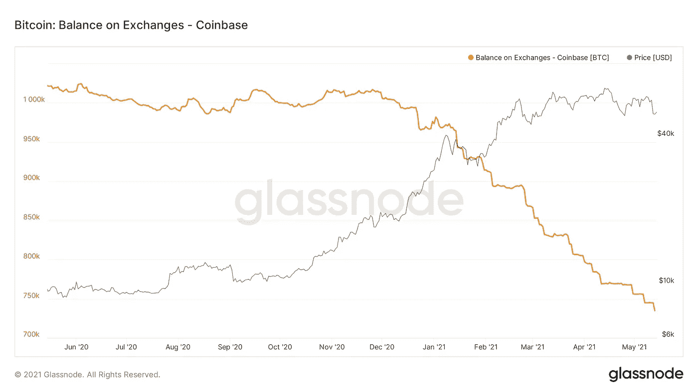
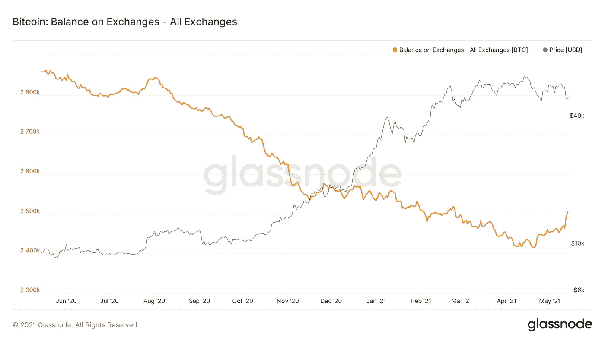
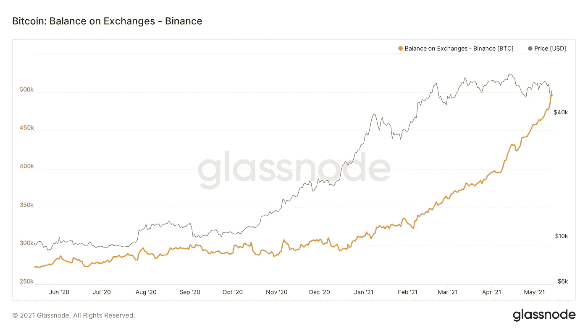
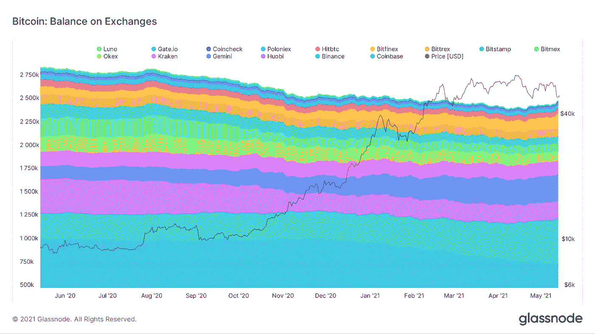

# 为什么比特币的价格最近一直不涨？

> 原文：<https://medium.com/coinmonks/why-hasnt-bitcoin-s-price-been-going-up-lately-e171e71dc9b1?source=collection_archive---------0----------------------->

## 对市场现状的简要展望

“为什么比特币的价格不涨？”，这是我最近在 Twitter 上读到比较多的一个问题。特别是在鲸豚预警的推特回复中，显示大量资金从交易所流出。埃隆·马斯克(Elon Musk)宣布特斯拉不再接受比特币支付的消息，加上 5 月 13 日 T2·币安(Steve jobs)在美国接受调查的消息，在过去的几天里，比特币的价格一度跌至 48k 美元以下。虽然比特币可能会调整得更低，特别是如果未来几天/几周将有更多 FUD 问世的话，但普遍的情绪一直是看涨的，在撰写本文时，比特币的价格已经在一定程度上恢复到 5 万美元以上。[例如，根据 Glassnode 的数据，长期持有者回到积累模式已经有一段时间了。](https://twitter.com/glassnode/status/1392872271723773959?s=20)总的来说，我认为这种调整是健康的。这导致硬币从实力较弱的手中被分发到那些有过不卖历史的手中。因此，在下一轮上涨中，有更少的硬币可能被卖出，这将抑制下一轮上涨。

比特币基地是最近最值得关注的交易所。这是大型投资者通常积累其[比特币](https://blog.coincodecap.com/a-candid-explanation-of-bitcoin)的交易所，无论是 gray、Micro Strategy、特斯拉还是其他不知名的大型投资者。虽然比特币基地比特币余额下降的速度有所放缓，但余额仍在下降(见图 1)。从 4 月 11 日到 4 月 29 日，在继续大幅下降之前，余额或多或少一直在横盘整理。虽然下降幅度不如年初那么大，但余额仍在下降。那么，为什么比特币的价格没有上涨呢？

Graph 1: Bitcoin balance on Coinbase

从现货交易所持有的比特币余额的整体趋势来看，情况略有变化(见图表 2)。从四月的第二周开始，余额停止下降，甚至上升(特别是在最后几天)。

Graph 2: Bitcoin balance on spot exchanges; Source: Glassnode

这种差异来自哪里？这种差异似乎主要是由流入币安的资本造成的。自 2020 年 12 月中旬以来，币安的比特币余额大幅增加(见图 3)(进一步参考，见附录图 5 中的外汇余额(堆叠))。

Graph 3: Bitcoin balance on Binance; Source: Glassnode

币安是以另类硬币投机闻名的交易所之一，也是主要由散户投资者使用的交易所。我对这些强劲的资金流入解释如下:散户投资者将他们的比特币存入币安，用来投机替代比特币，希望获得更大的收益。比特币的主导地位从年初的 70%下降到近 41%，也支持了这一点。因此，看起来零售正在将资金从比特币转移到其他硬币，从而压低了比特币的价格。这表明，目前零售控制着比特币的价格，并阻止其突破 6 万美元(当然，忽略了埃隆·马斯克最近的影响)。

根据稳定币供给比例，相对于比特币市值(比特币市值/ Stablecoin 市值)，市场上的稳定币更多。有大量资金在加密市场流动，目前似乎主要集中在替代硬币上。一旦这种情况发生，这里有大量的火力可以潜在地流入比特币。

Graph 4: Stable Coin Supply Ratio; Source: Glassnode

在我看来，有两种情况会让比特币再次突破 6 万美元大关。首先，如果这些钱中的一部分现在是备用币，而稳定币又流回了比特币。第二种也是更有可能的情况似乎是，我们再次看到更大投资者的更大规模流入，和/或一家大公司/实体宣布持有大量比特币。

后一种情况会更加乐观。除了可能引发挤兑的大投资者流入之外，一旦比特币再次爆发，新的 ATHs 出现，散户资金可能会开始从替代币回流到比特币，稳定币中的部分资金将流入比特币。

然而，如前所述，如果出现更多负面消息，比特币的价格可能会在短期内下跌。

更多定期更新请在推特上关注我: [@JanWues](https://twitter.com/JanWues)

披露:上述文章引用了一种观点，仅供参考。它无意成为投资建议。

**附录**

Graph 5: Exchange Balance (Stacked); Source: Glassnode