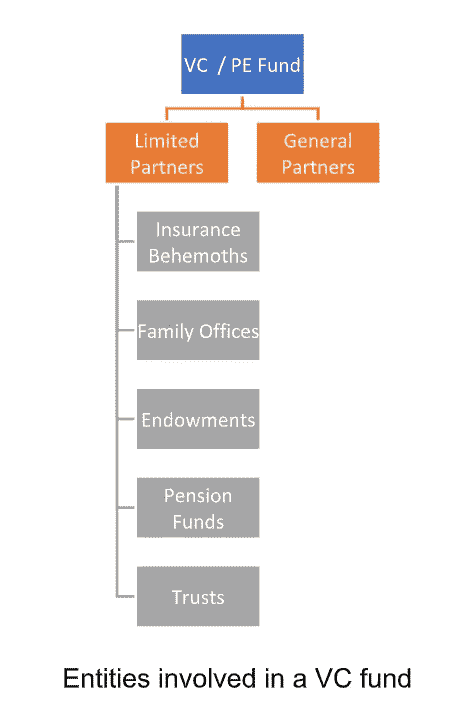
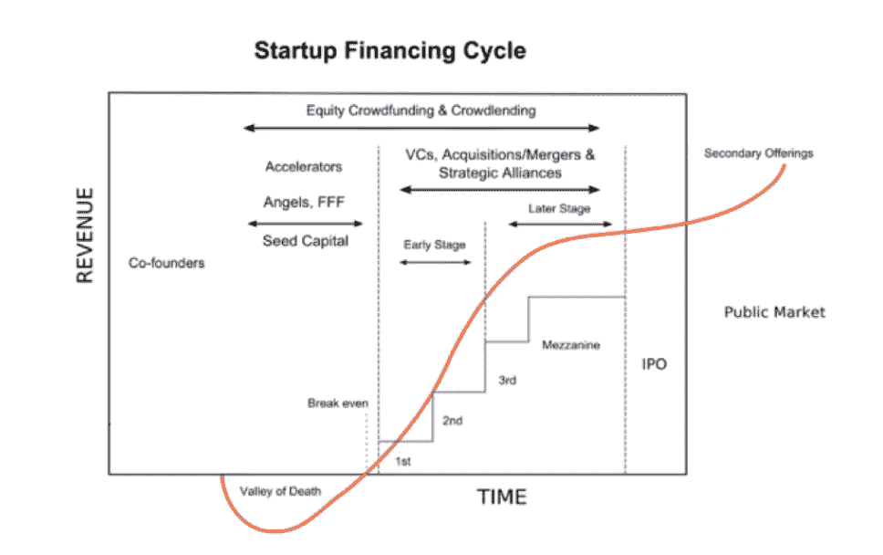
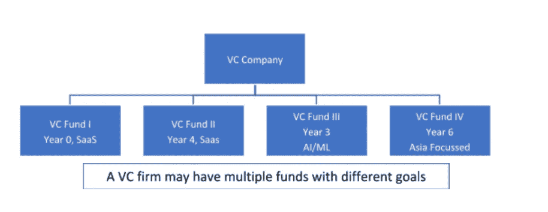
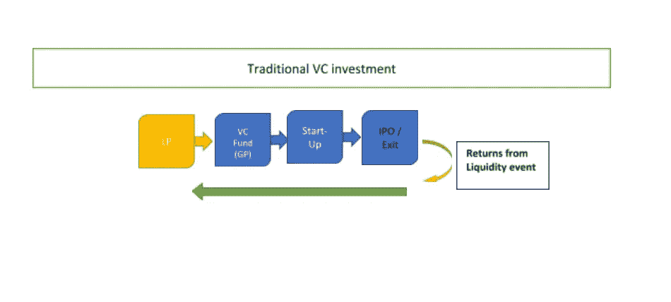
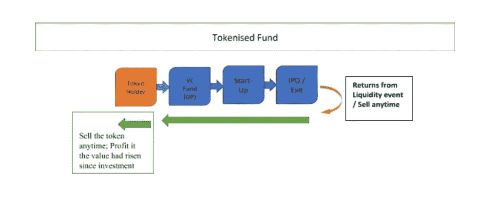

# 为什么&如何令牌化基金？

> 原文：<https://medium.com/coinmonks/why-how-to-tokenise-a-fund-9f7369947747?source=collection_archive---------3----------------------->

image taken from google images: [https://www.google.com/search?q=tokenomics&source=lnms&tbm=isch&sa=X&ved=0ahUKEwjF256RkoveAhUPy1kKHWzZDXkQ_AUIDigB&biw=1164&bih=505#imgrc=Wl4UFj6U3ZqsRM](https://www.google.com/search?q=tokenomics&source=lnms&tbm=isch&sa=X&ved=0ahUKEwjF256RkoveAhUPy1kKHWzZDXkQ_AUIDigB&biw=1164&bih=505#imgrc=Wl4UFj6U3ZqsRM):

先说风投如何融资

# 第一部分

传统的风险投资是一道有趣的风景。有早期基金、晚期基金、专注于特定技术的基金、基金中的基金、超大型基金、老式基金(#OLD MONEY)、&相当新的基金。毕马威发表了一份关于风险投资的[有趣全球分析](https://home.kpmg.com/xx/en/home/insights/2018/07/venture-pulse-q2-18-global-analysis-of-venture-funding.html)

对于风险投资基金经理来说，筹集资金首先是一个竞争环境

*来源:文件:创业融资 Cycle.png—*[*https://en.wikipedia.org*](https://commons.wikimedia.org/wiki/File:Startup_Financing_Cycle.png)

有限合伙人出资，而普通合伙人则根据既定的投资策略将资金池投资于多家公司。

这些被投资的公司统称为风险投资基金的投资组合

被投资公司有望在一段时间内(通常为 5-7 年)表现良好，并通过追加投资的方式实现投资资本的增值。通过退出实现后的增值回报作为基金的收益分配返还给有限合伙人

采购、投资分析、尽职调查和投资组合管理的工作极具挑战性，需要综合运用软技能、技术知识、产品意识、耐心、对行业网络效应的预见以及金融技巧。有限合伙人以年度管理费[(通常约为管理资金的 2%)支付普通合伙人这些挑战的费用](https://en.wikipedia.org/wiki/Management_fee)

如果在流动性事件中实现了投资回报(成功退出公司)，则向普通合伙人支付约 20%的承诺基金业绩净值(套利)的利润分配。

如果一家科技初创公司的创始人正在寻找资金，这与风险投资家为他们的公司筹集资金的情况没有什么不同。相似之处仅限于此，因为科技公司的创始人只有一次在该公司成功/失败的机会。另一方面，基金经理(VC)在多家公司之间配置基金，承担一定的风险。这就产生了高风险的分布效应&利用了这样一个事实:从数学上讲，投资组合中至少有一家公司表现出色的概率，可能会抵消掉其他公司的失败

**全球定位系统面临的挑战&有限合伙人(该列表将在即将发布的博客中详细讨论)**

1.实现回报的时间跨度过长。一家公司回报*一些升值的时间跨度(如果有的话)大约是 5-7 年。这就引出了下一个挑战*

2.有限合伙人流动性低。有限合伙人在筹集资金时会被普通合伙人告知，他们的投资在第 7 年之前不可能产生任何回报。一项条款有时会限制有限合伙人向其他方交易/出售其投资。因此，LP 可能要等到第五年才能看到退出的希望

3.非常高的不确定性/具有挑战性的投资回报率:大多数初创企业都失败了！许多研究表明，超过 95%的初创企业都失败了。当一家初创企业在投资后失败时，资金的投资回报率为零，投资时间的投资回报率为负

4.信息不对称:存在于 LP-GP 关系以及 VC-投资组合公司关系中

5.降低高风险的投资组合效应:有限合伙人和风险资本家都建立投资组合来分散风险。但在这两种情况下，投资组合或多或少都缺乏流动性

6.筹集另一笔资金:如果有限合伙人还没有返还任何现金，更不用说利润了，他们怎么会信任普通合伙人呢？这对大多数风险投资公司来说是一个严重的问题。

根据 [Crunchbase](https://news.crunchbase.com/news/the-q3-2018-global-vc-report-new-records-hit-amid-seismic-shift-in-the-industry/) 的深度调查，

> 谈到投资私营公司，把钱投到风险企业往往是最容易的部分。在整个过程中，最棘手的是把钱拿出来——希望比开始时更多。
> 
> *通过合并或收购的方式“退出”是初创公司投资者能够清算其长期持有股票头寸的最常见方式之一。*

# **第二部分**

# **代币&代币化基金:它们是什么&它们有什么好处**

令牌是可编程的。底层资产可以使用区块链链接到令牌。它们是代码行，可以根据在编码时预先编程的逻辑触发器自动执行以交付结果。

业务逻辑可以预先编程到代码本身中。因此，令牌可以被编程为:

1.放在钱包里一段时间(最短承诺时间)

2.仅在二级市场上出售给已通过固定的 [KYC 程序](https://en.wikipedia.org/wiki/Know_your_customer)(可设定为遵循 KYC/反洗钱/CTF 法律)的实体

3.仅出售给合格投资者(在某些司法管辖区)

4.包括基金结束时商定的 LP-GP 管理条款的治理

令牌化基金可以被视为风险投资基金的股权众筹。

代币销售筹集资本，以换取风险投资基金的股权或代币基金工具的收入分配承诺。这些代币被称为股权代币或证券代币。集资代币销售被称为证券代币发行。

如果代币销售在基金通常运营的同一管辖区进行，法律监督的管理和应用仍然保持不变。

基金仍需遵守通常与该司法管辖区基金运作相关的任何报告、审计、通知和备案手续。

代币销售的作用是用更多的机构投资者/合格投资者取代少数机构投资者。

注意:在某些情况下，象征性基金可能投资于寻求投资的象征性公司。在这种情况下，这些投资的流动性要高得多，因为它们的投资组合本身就是可交易的。

# **代币如何解决挑战/提供新优势**

**(a)为有限合伙人提供流动性:**

由于有限合伙人最多只能在 12 个月内交易/出售他们的代币，在代币化基金中，他们在二级市场清算头寸时获得了更大的自由。这有利于有限合伙人将资本配置到他们认为合适的地方。获得的自由将增加有限合伙人投资于他们原本不会投资的基金的可能性。这将导致企业家迅速获得资金的级联效应，因为风险投资者自己可以更容易地筹集资金。

**(b)解决校准问题:**

基金结束时的延期是有限合伙人和普通合伙人之间常见的不一致。一个普通合伙人可能想等一个投资组合公司慢慢表现好&可能会要求延长约定的 10 年基金寿命。通常，展期为 1 年或 2 年，以便逐步减少投资组合头寸。它们通常预先写在基金协议中

然而，有限合伙人可能不得不同意这样的延期，即使他们不愿意。

面对令牌化基金的类似情况，有限合伙人可以选择在二级市场出售他们的令牌/头寸

**代币可全球交易**

根据设计，代币可以很容易地在加密交易所进行全球交易。是的，在传统世界中存在 LP 职位的二级市场。然而，这是非常缺乏流动性的，可能是一个非常缓慢的过程。根据令牌化基金设计，如果合适，有限合伙人可以退出并多次重新进入基金。在传统的风险投资环境中，清算头寸的有限合伙人只能在基金的本土辖区内进行。这些限制不适用于代币，因为代币可以在全球范围内交易。

**(d)有限合伙人越来越了解风险。代币是一种快速反馈的方式**

代币为风险偏好增强的有限合伙人直接投资早期初创企业提供了一个便捷的途径。

**(e)缩短反馈回路&增加全球定位系统的内部回报率**

令牌化环境中的流动性可能为风险投资公司的普通合伙人提供更短的反馈回路。那些在更短的反馈周期内实现更好的 IRR 的普通合伙人将更有能力募集新基金。这消除了传统风险投资模式中反馈周期长、无法募集新基金的问题。

**(f)回避优先回报障碍问题(PRH)**

这是 LP-GP 关系中一个有争议的问题。大多数普通合伙人的 20%套利不考虑货币的时间价值——普通合伙人的套利完全基于基金的现金对现金回报。一个首选的回报障碍(PRH)改变了有限合伙人的优势。

6%的 PRH 仅仅意味着有限合伙人必须在普通合伙人赚取任何利差之前优先获得投资资本的 6%年增值。这是在传统的非流动性体系中产生的问题。

然而，在令牌化的环境中，很少有限合伙人会保持足够长的投资时间，使资金的时间价值变得显著。这是标记化环境中棘手主题的侧滑

*注意:是的，风险投资基金可以上市，但这非常昂贵，而且是一个充满摩擦的过程*

**结束语:**

令牌化为摆脱传统金融中普通合伙人和有限合伙人的僵化地位提供了机会。它允许有限合伙人和普通合伙人合作规划投资工作。GPs 和 LPs 之间的动态变化也会影响到初创企业的生态系统。更容易获得资本将导致更多的企业家追逐他们的梦想。

作者: [Suraz Kottakki](https://www.linkedin.com/in/suraz)

*最后说一句关于* [*创世纪区块控股*](http://www.genbvc.com) *:*

[***创世纪区块控股***](http://www.genbvc.com) *是一家***风险投资公司、* *crypto* *quant 对冲基金，以及* *矿业* *公司专注于投资区块链生态系统内的项目。我们专注于将资本、网络和专业知识的力量带给前沿技术团队，以解决世界上最大的问题**

**在任何情况下，本网站上的任何材料都不应被视为出售或购买任何单个公司或投资基金的权益、代币或硬币的要约。任何此类要约或邀约将仅通过与特定基金或个人相关的保密私人要约备忘录单独进行，除其他要求外，这些基金或个人符合美国联邦或其他国际证券法规定的特定资格，并且通常在金融事务方面经验丰富，因此他们有能力评估潜在投资的价值和风险**

*如果你觉得这是有帮助的，请为我们鼓掌，分享给你的朋友，并随时在 genbvc.com 给我们发短信。查看我们的电报频道[这里>并关注我们的博客](https://t.me/genesisblockholdings)[这里>](/@genblockfund)*

> *[直接在您的收件箱中获得最佳软件交易](https://coincodecap.com/?utm_source=coinmonks)*

**