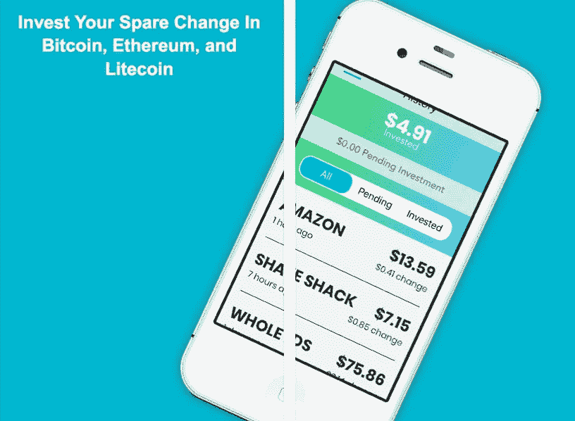
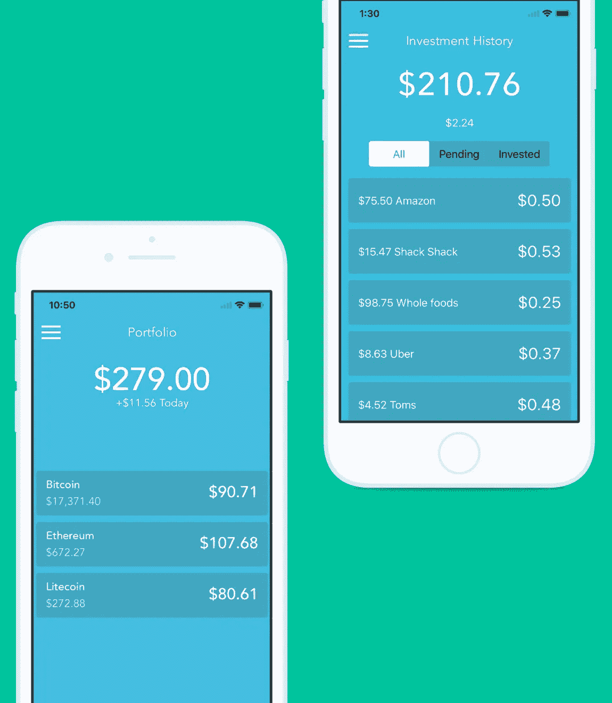
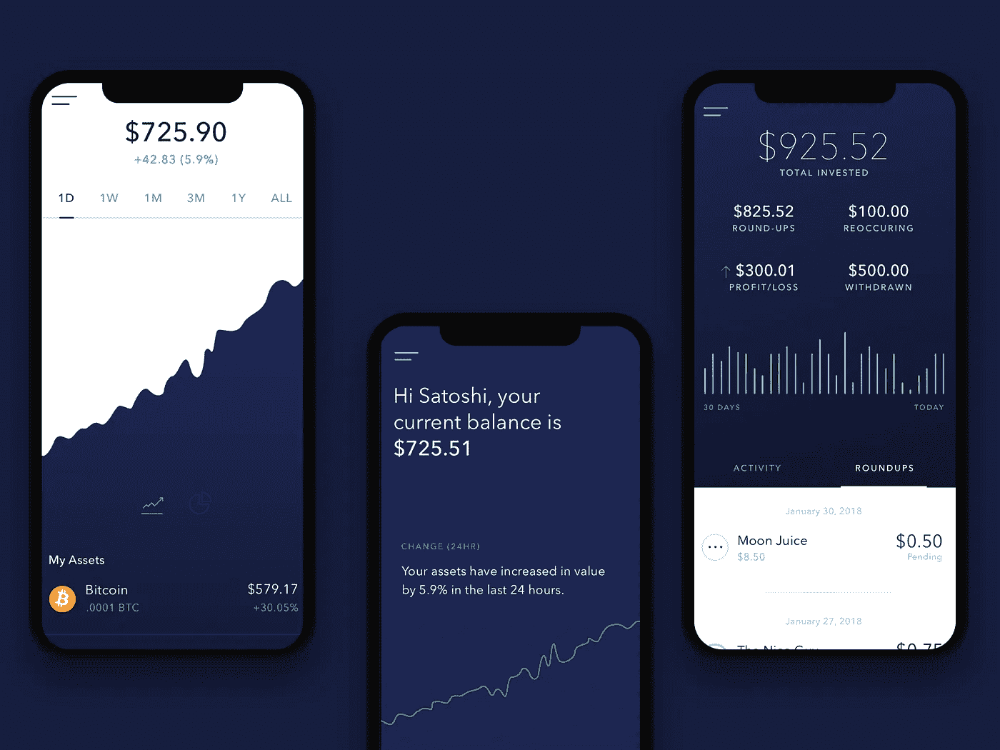

# 为什么我要求从产品搜索的趋势列表中删除

> 原文：<https://medium.com/coinmonks/why-i-asked-to-be-removed-from-product-hunts-trending-list-70b4bbe9d1a2?source=collection_archive---------5----------------------->

一切都是从大学的一个晚上开始的。当我在我最喜欢的投资应用上查看余额时，我注意到我的比特币基地投资组合远远超过了我的橡子和罗宾汉账户。

我一直很欣赏 Acorns 为其用户提供的不干涉方法，但我渴望一个风险更高的投资组合选项，让我能够将多余的零钱投入比特币。那时我偶然发现了割草机。io .他们正好有我要找的东西。只有一个小问题…该公司最近被收购，备用零钱加密功能被删除。

人们真的很沮丧；许多人要求更换。这正是我需要的激发面包屑创作的市场验证。

我立即打电话给软件工程师兼朋友扎克，询问他对 Acorns for crypto 应用的看法。“这是一张金奖券，”他说。

扎克立即提出帮助创建 MVP。三个月后，我们做好了发布的准备，并开始寻找产品。我们的帖子一跃成为当天的最佳产品——进一步证实了我们可能会有重大发现。

MVP 1

尽管令人兴奋，但我们很快意识到，金融科技不容小觑。在我们发布之前，Crumbs 需要的不仅仅是一个功能性的 MVP。所以我给 Product Hunt 的一位管理员发了封电子邮件，要求将我们的帖子从趋势列表中删除。如果我想做好这件事，我需要找到一个技术联合创始人，筹集资金，获得银行和加密连接，聘请律师，从头开始重建应用程序。

幸运的是，对加密的狂热和我们产品搜索帖子的势头足以说服一些天使投资者在我身上冒险。由于扎克想专注于自己的创业，我立即雇佣了一些承包商。

然后我被介绍给卡森，一个刚从加州大学圣巴巴拉分校计算机科学专业毕业的学生。我雇佣他做前端工作，结果发现他也是一个非常有才华的后端工程师。我打了个全栈满座！卡森仅用五天时间就为我们的 iOS 应用构建了一个工作前端。他是个怪物。卡森现在是我的技术联合创始人，他目前正在为我们重新设计的应用程序开发一些非常棒的功能。

我们更新了我们的 UX/用户界面，给了产品搜索另一个机会。这一次我们击中了[的第三号产品](https://www.producthunt.com/posts/crumbs-2)。一切都很顺利…直到我们的支付处理供应商给了我们两周的时间来更换支付供应商。那枚鱼雷几乎击沉了我们的战舰。

MVP 2

我立即联系了我们的投资者兼顾问马歇尔·海纳，他为我们提供了一些可能的选择。几个星期后，我们签署了一份合同，我们与一家金融机构的第一次合作关系建立了。缺点是——将他们的 API 与我们的系统集成需要一个多月的时间。

这让我们的用户处境艰难。他们可以随时提取资金，但无法将交易汇总到密码中。我们决定在过渡期保持透明。谢天谢地，我们的早期用户支持并欣赏我们的诚实。

因为我们已经从头开始重建我们的代码库，这是实现早期用户普遍要求的功能和反馈的理想时机:定制的投资组合，更多的资产，一个 android 应用程序，等等。新应用程序目前正在内部测试，我们正在解决最后一分钟的错误。

Crumbs v1.0

到目前为止已经很顺利了。我们在酒吧打过几次架，但每次都振作起来了。无数宝贵的经验教训后，我们渴望正式推出面包屑给我们专门的早期采用者和等待者！

如果你正在读这篇文章，谢谢你。感谢所有下载了 Crumbs 早期版本的人。没有你们，我们不会有这个机会，我们承诺在前进的道路上提供令人惊奇和愉快的用户体验。

如有任何问题或意见，欢迎发邮件或发推特给我:Patrick @ crumbsapp . io & @ Patrick mro _

如欲提前获取面包屑，请访问我们的[网站](https://crumbsapp.io/)。