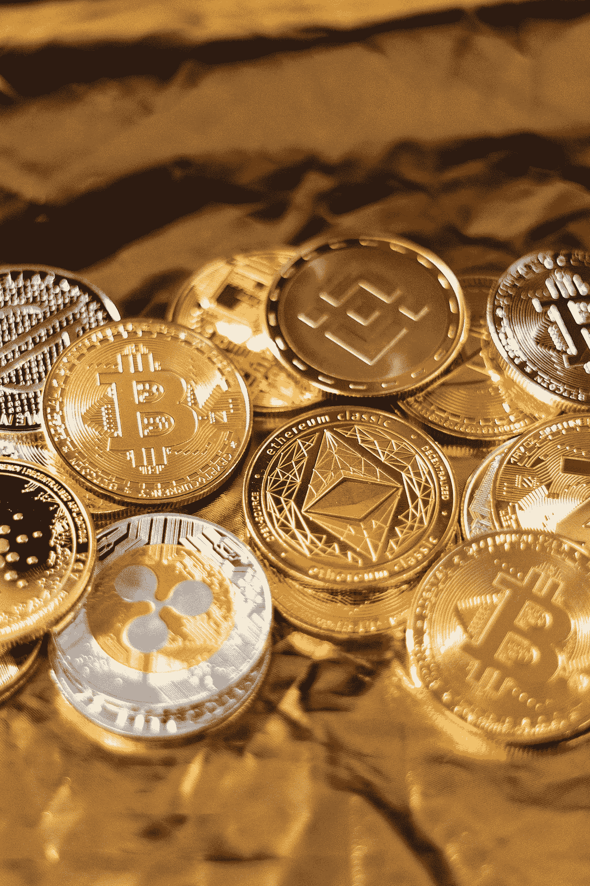

# 为什么我选择投资时只关注排名前 25 位的加密资产

> 原文：<https://medium.com/coinmonks/why-i-watch-only-the-top-25-crypto-assets-when-choosing-to-invest-4f98c1a04f7f?source=collection_archive---------6----------------------->

## 风险/回报比率。

Photo by [Art Rachen](https://unsplash.com/@artrachen?utm_source=medium&utm_medium=referral) on [Unsplash](https://unsplash.com?utm_source=medium&utm_medium=referral)

如果我们看一下[的 CoinMarketCap](https://coinmarketcap.com/) ，我们可以很容易地看到在撰写本文时**有超过 10.000 个密码**。这些密码按市值降序排列。

大多数人已经把加密市场变成了赌博，选择了最新的，市值最低的加密…