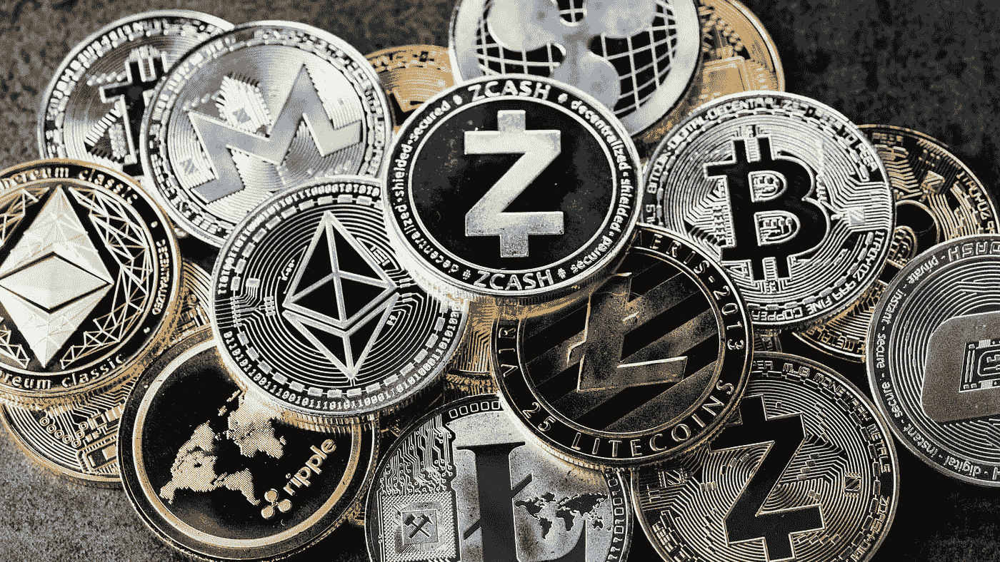
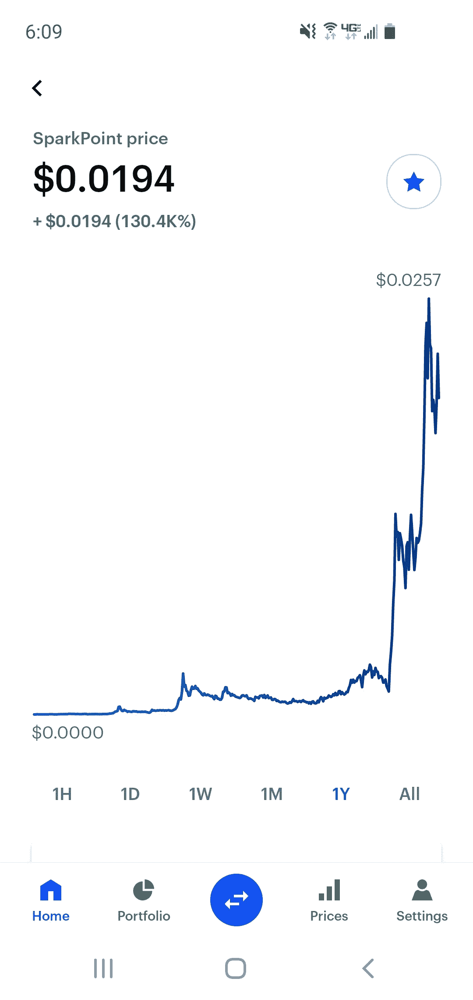

# 为什么我把一切都投入到加密货币中

> 原文：<https://medium.com/coinmonks/why-im-investing-everything-into-cryptocurrency-425d8fcc8994?source=collection_archive---------6----------------------->

Crypto is as varied as it is promising

这个世界上赚钱的方法不止一种。

大多数人专注于他们的事业，改善他们各自的手艺，直到他们的钱包变得与他们瘦弱的空闲时间成比例。不管是好是坏，那都不是我。现在，牺牲自己的时间和精力去做一份宜居的事业，并没有错。如果说有什么的话，那就是难能可贵，可敬。然而，标准的朝九晚五(或者对我父亲来说是 7 点到 6 点)基本上是我一直在努力实现的目标，原因有很多，我将会谈到。

# 我现在在哪里

我目前在快餐业工作，我发现这既刺激又有回报——只是不是在支付方式上。对于在这样一个快节奏的环境中付出的努力和时间，我觉得可笑的是，我不得不每周工作 60 个小时，仅仅是为了能够独立生活和有足够的食物。

从这里有几个选择。

## 进退两难

首先是成为一名经理，让自己屈从于有资格的消费者的脆弱念头，从一个管理职位换到另一个，直到我在稳定和沮丧之间找到一个折中点。

另一种是接受高等教育，支付数万元(或更多，无论如何都有学生债务)来获得一项有价值的书面行业技能，并可能在我花了 4 到 8 年努力实现的领域获得一个职位。没有什么是有保证的，我不能忍受为一个没有成就感的朝九晚五的职业获得改变人生的债务的想法。

就个人而言，如果大学的花费和 70 年代一样多，我会喜欢这个主意，但现在肯定不是这样——可能永远也不会是。

对大多数人来说，这是被接受的，甚至被赞美为绝对最好的生活道路。对那些有这种想法的人来说，真诚地说，更多的力量属于你。仅仅因为它不适合我，并不意味着我会看不起那些过着这种生活方式的人。对我来说，感觉正确的是用我自己的方式发展我的才能，不需要政府或学生资助项目的帮助。

## 如果我要奋斗，我会决定如何奋斗

我尝试了很多事情，从 Twitch 上的流媒体和获得合作伙伴关系，到拥有 1 万名订户的 youtubbing，到为各种网站写文章，甚至编辑其他作家的文章。在我工作的时候，尝试所有这些不同的在家赚钱的方法是很有趣的。

这些冒险最终都没有让我的生活方式得到提升——尽管我仍然喜欢写作！综上所述，我坚信拥有平衡的生活。为了保持健康的生活方式，工作和闲暇时间应尽可能平等。

## 这都是关于平衡的

对于大多数劳动人民来说，这并不总是可能的；我父亲是这方面的一个典型例子。他每周工作 60 多个小时，几乎没有足够的时间吃晚饭和看一会儿电视就昏倒了。他是一个不可思议的供养者(我永远感激他)，但看到他的生活停滞不前让我很痛苦。

他和 10 年前差不多，他缺少属于自己的时间，这从根本上阻碍了他成长和学习新事物的能力。

看着这一切，我心里很难受，而且目前也无法解决这个问题——这是我尽我所能为他成长的一个原因。以便有一天我能很快让他像我现在这样成长。

# 事情发生时我在哪里

一路上(确切地说是 1 年前)，我偶然发现了加密货币；我玩了以太坊，玩了一些加密游戏(最终什么也没赚到)，还尝试过几次加密交易。最终，我以小赚一笔而告终，并宣布退出。

直到 6 个月后，我才发现我有资格从一项服务中获得一笔可观的加密货币礼物，我曾用这项服务将一枚加密硬币兑换成另一枚。

我的头脑被炸了，我被留在摇晃了几个小时。

当时，我不知道为什么我得到了价值 2000 美元的加密货币。我只知道我必须马上找出原因。这让我陷入了一个令人大开眼界的兔子洞，现在甚至没有一瓶大猩猩胶水能阻止我。

我所了解到的是，在我使用他们的交换平台时，这家特定的服务机构认为我有资格获得这笔钱。从那里，我把他们给我的一半装进了口袋，其余的放进了一些不同的加密货币硬币。

那是大约 4 个月前的事了，从那以后，我的收入几乎翻了三倍。一路走来，我犯了很多错误，由于费用和错误，我损失了很多，但我仍然不知道我不知道的东西——这也于事无补。有趣的事实:如果我拥有那笔交易最初赋予我的东西，我今天会有超过 13，000 美元——超过 6 倍的增长。

当时，我没有意识到他们给我的钱会增长得如此之快，与他们平台的发展和表现成正比。然而，我感谢一路上所有艰难的教训，因为我现在看到一个新的人生道路选择展现在我面前。

## 基于加密货币的金融自由

我可以花一整篇文章来解释加密货币到底是什么(我正打算这么做。)

我现在要传达的是，加密货币比股票更不稳定，但似乎也比个股更遵循模式化趋势。这当然是一种严重的过度简化，然而，一般的概念是比特币(市值方面领先的加密货币)决定了相当多的另一种替代加密货币的价格。

这条规则有很多例外，但是有了这些知识(和一些原则)，你可以在市场上涨时可靠地套现，在市场下跌时买入。缓慢但稳定地增加你整体投资组合的财富。

虽然我现在有 5000 到 6000 美元(取决于具体日期)，但如果我知道我现在知道的事情，我可能会有超过 13000 美元。展望未来，我现在有信心在 2022 年底之前增长到 100k，而不会再增加任何东西。这可以通过加密货币是什么以及它在金融、艺术、数字所有权、游戏和去中心化方面的发展来实现。

最后，在美国 1%的公司和小人物之间产生了一些距离。

# 我要去哪里

想象一下，发现一个新发布的加密硬币或令牌，对其背后的团队进行研究，研究硬币本身的功能，并与项目背后的社区团结起来。然后看着这个项目从每枚硬币 0.0003 美元涨到 0.03 美元，看着你最初的 100 美元投资变成改变人生的钱。

这种现象已经在多个加密项目中发生了数十次，现在正发生在我目前投资的一个令牌上。这是我如此兴奋地成为日益增长的数字金融转变的一部分的原因。

## 投资之外的加密潜力

抛开投资不谈，现在艺术家们的作品通过成为不可替代的代币，并被投放到 NFT 市场，可以获得数千甚至数百万的报酬。我们也开始看到游戏玩家因其天赋、运气或谜题技巧而获得加密货币奖励，这取决于游戏。我甚至听说过一些音乐艺术家将他们的歌曲和专辑作为 NFT 收藏品卖给一个幸运的——独一无二的买家。

想象一下，在多人游戏中，玩你最喜欢的射击游戏，每成功击杀一个人，你就能获得一小部分比特币。想象一下玩模拟人生，让你创造的每个人都有实际的货币价值，这取决于他们在管理游戏和事物加密方面的系统中的外表和才能。

我不是说这些特定的事情会明确发生，但随着我看到的一些正在研究的[密码](http://blog.coincodecap.com/tag/crypto)的出现，这很容易发生。有一天，你在电子游戏中获得的所有东西都可以根据稀有程度和特征有自己的货币价值，并且可以完全交易为你选择的货币或其他有价值的商品！

我不想再变老，但同时我也想快进几年，以达到我刚刚描述的状态。

## 真的越多越开心

人们在(某种程度上)降低风险的情况下赚到了改变生活的钱，数字艺术正在永远改变，游戏可能会有全新的意义，除非你在印度、中国或中东，否则没有多少人能扰乱即将发生的事情。加密空间发展得越快，获得的散户和机构投资者就越多，当权者就越不可能对其动手脚。

由于上面列出的原因，这就是为什么我 100%都进入加密领域。因此，我真的希望你也想办法加入我！感谢您的阅读。